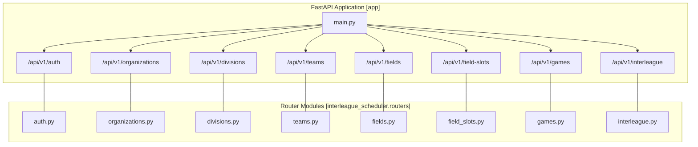
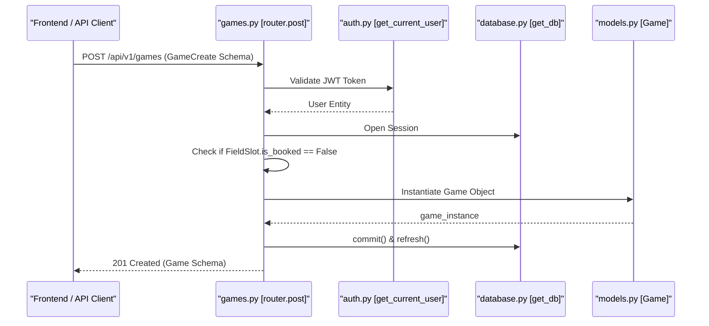

# Backend — API Routers

Relevant source files

The following files were used as context for generating this wiki page:

- [interleague_scheduler/main.py](interleague_scheduler/main.py)
- [interleague_scheduler/routers/__init__.py](interleague_scheduler/routers/__init__.py)

The Interleague Scheduler backend is built on **FastAPI**, with all functional endpoints organized into modular routers. These routers are registered under the `/api/v1` prefix in the main application entry point [interleague_scheduler/main.py:31-38](). This architecture ensures a clean separation of concerns, where each router handles a specific domain entity while sharing common patterns for database access, authentication, and request validation.

### Router Registration Overview

The application aggregates multiple specialized routers to form the complete API surface. The following diagram illustrates the relationship between the main FastAPI application instance and its constituent routers.

**API Router Hierarchy**

**Sources:** [interleague_scheduler/main.py:16-38]()

---

### Common Implementation Patterns

Across all API routers, several consistent patterns are employed to maintain data integrity and security:

*   **Dependency Injection**: Routers utilize FastAPI's dependency injection system to provide `Session` objects via `get_db` and to enforce security via `get_current_user`.
*   **Partial Updates (PATCH)**: Most entities support partial updates using the `PATCH` HTTP method, allowing clients to update specific fields without sending the entire resource representation.
*   **Referential Integrity**: Before deletion or modification, routers perform checks to ensure the action does not violate business rules (e.g., preventing the deletion of a `FieldSlot` that is currently assigned to a `Game`).
*   **Schema Validation**: Every endpoint uses Pydantic models for request body validation and response serialization, ensuring type safety between the API and the database layer.

---

### Router Groups

The API is divided into four primary functional groups, each detailed in its own sub-page.

#### 1. Organizations, Divisions, and Teams
This group manages the core organizational hierarchy. It handles the creation of `Organization` entities, which own `Division` objects, which in turn contain `Team` objects. These routers include complex filtering logic to allow users to navigate the hierarchy by region or parent ID.
*   **Key Routers**: `/organizations`, `/divisions`, `/teams`
*   **For details, see [Organizations, Divisions, and Teams API](#4.1)**

#### 2. Fields and Field Slots
This group manages physical infrastructure. `Field` objects represent venues (linked to an `Organization`), while `FieldSlot` objects represent specific time windows available for play. The API tracks the `is_booked` status to prevent double-booking.
*   **Key Routers**: `/fields`, `/field-slots`
*   **For details, see [Fields and Field Slots API](#4.2)**

#### 3. Games
The `/games` router is the central hub for scheduling. It manages the lifecycle of a match between two teams. It includes logic for synchronizing the `is_booked` status of `FieldSlot` entities and supports complex queries for game history and upcoming schedules.
*   **Key Routers**: `/games`
*   **For details, see [Games API](#4.3)**

#### 4. Interleague Play
This group handles coordination between different organizations. It allows administrators to mark `FieldSlot` entities as available for external play (`InterleagueSlot`) and allows teams to declare their availability for such games. It includes a specialized search endpoint for finding compatible opponents.
*   **Key Routers**: `/interleague`
*   **For details, see [Interleague API](#4.4)**

---

### Request Flow and Entity Association

The following diagram demonstrates how a request to create a `Game` interacts with various code entities across the routers.

**Game Creation Flow (Natural Language to Code Entities)**

**Sources:** [interleague_scheduler/main.py:37-37](), [interleague_scheduler/routers/games.py]() (inferred from standard router patterns)
