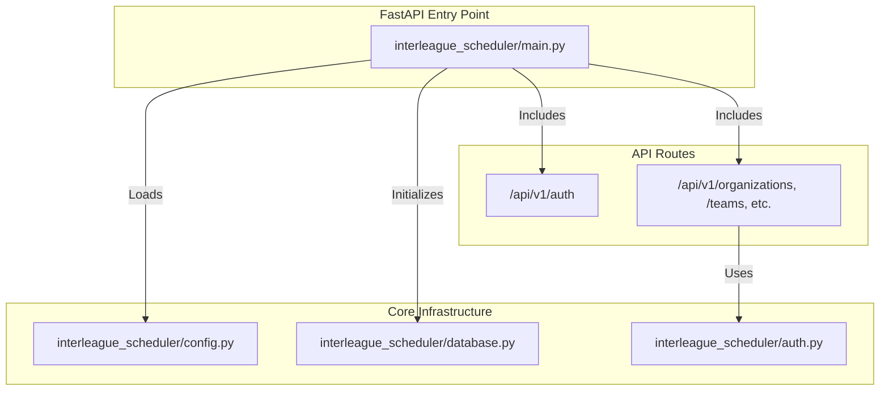
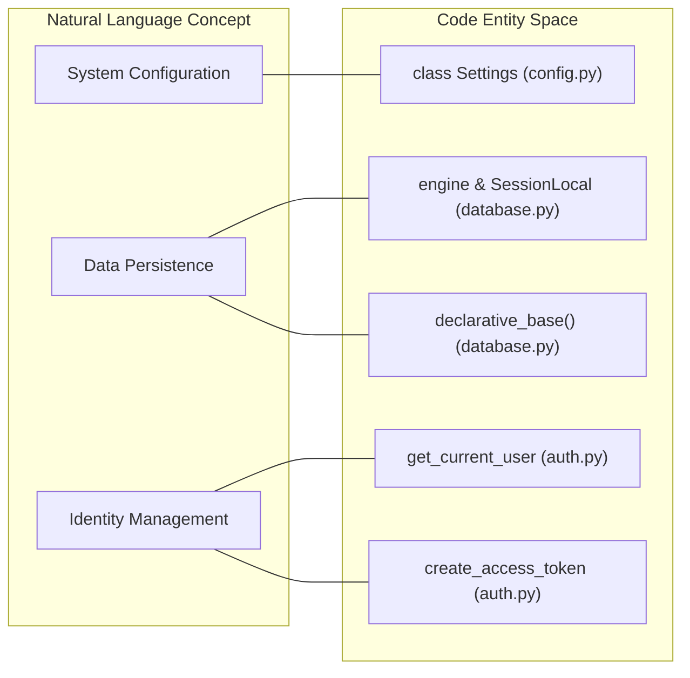

# Backend — Core Application

Relevant source files

The following files were used as context for generating this wiki page:

- [.github/workflows/ci.yml](.github/workflows/ci.yml)
- [interleague_scheduler/auth.py](interleague_scheduler/auth.py)
- [interleague_scheduler/config.py](interleague_scheduler/config.py)
- [interleague_scheduler/database.py](interleague_scheduler/database.py)
- [interleague_scheduler/main.py](interleague_scheduler/main.py)

The Interleague Scheduler backend is a Python-based REST API built with the **FastAPI** framework. It manages the lifecycle of sports organizations, scheduling logic, and interleague game discovery. The application follows a modular structure where configuration, database management, and security utilities provide a foundation for the domain-specific API routers.

### Application Entry Point

The `app` instance is initialized in `interleague_scheduler/main.py`, where it configures the API metadata and registers all functional routers under the `/api/v1` prefix [interleague_scheduler/main.py:29-38](). Upon startup, the application ensures that the database schema is synchronized with the SQLAlchemy models by calling `Base.metadata.create_all` [interleague_scheduler/main.py:27]().

#### Core Components Diagram
This diagram illustrates the relationship between the application entry point, its configuration, and the underlying infrastructure.

**Sources:** [interleague_scheduler/main.py:1-44](), [interleague_scheduler/config.py:1-21](), [interleague_scheduler/database.py:1-23]()

---

### Configuration and Database

The application uses `pydantic-settings` to manage environment-based configuration with an `ILS_` prefix [interleague_scheduler/config.py:17](). The database layer is powered by **SQLAlchemy**, supporting both local development via SQLite and production-ready relational databases through the `DATABASE_URL` setting [interleague_scheduler/config.py:5]().

The database connection is managed via:
*   **Engine & Session:** A `SessionLocal` factory bound to the SQLAlchemy `engine` [interleague_scheduler/database.py:8-12]().
*   **Dependency Injection:** The `get_db` generator provides a scoped database session to API endpoints, ensuring connections are closed after each request [interleague_scheduler/database.py:17-22]().

For details on configurable parameters and session management, see [Configuration and Database](#2.1).

**Sources:** [interleague_scheduler/config.py:4-20](), [interleague_scheduler/database.py:8-22]()

---

### Authentication and Security

Security is implemented using **JWT (JSON Web Tokens)** and **OAuth2**. The backend provides utilities for hashing passwords via `passlib` (bcrypt) and generating secure tokens [interleague_scheduler/auth.py:13-31](). 

Key security features include:
*   **Token Verification:** `decode_access_token` validates JWT signatures and expiration [interleague_scheduler/auth.py:34-41]().
*   **Identity Injection:** The `get_current_user` dependency is used across protected routes to retrieve the authenticated `User` object from the database [interleague_scheduler/auth.py:44-66]().
*   **OAuth2 Integration:** Support for Google OAuth2 flow for external authentication [interleague_scheduler/config.py:13-15]().

For details on the authentication flow and user management, see [Authentication and Security](#2.2).

**Sources:** [interleague_scheduler/auth.py:13-66](), [interleague_scheduler/config.py:9-15]()

---

### Code Entity Mapping
The following diagram maps high-level system responsibilities to the specific code entities that implement them.

**Sources:** [interleague_scheduler/config.py:4-20](), [interleague_scheduler/database.py:8-14](), [interleague_scheduler/auth.py:25-66]()
