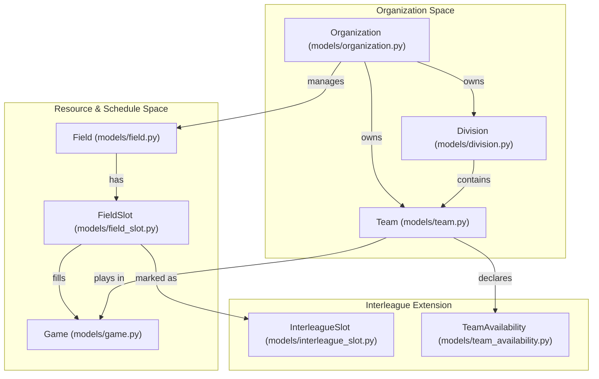
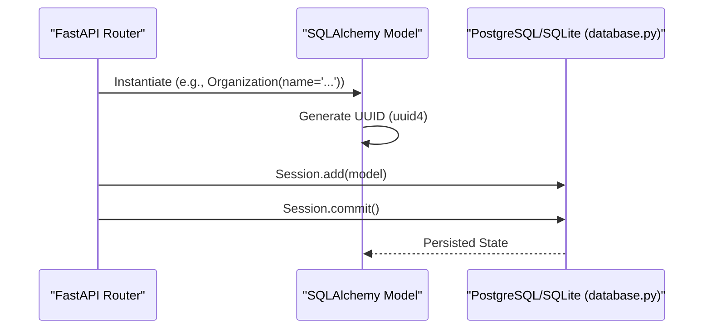

# Backend — Data Models

Relevant source files

The following files were used as context for generating this wiki page:

- [interleague_scheduler/models/__init__.py](interleague_scheduler/models/__init__.py)
- [interleague_scheduler/models/division.py](interleague_scheduler/models/division.py)
- [interleague_scheduler/models/field.py](interleague_scheduler/models/field.py)
- [interleague_scheduler/models/organization.py](interleague_scheduler/models/organization.py)

This section provides a high-level overview of the SQLAlchemy ORM models that define the Interleague Scheduler domain schema. The system uses a hierarchical data model to manage sports organizations, their internal structures, physical resources, and the scheduling of games between teams.

The models are centrally exported in `interleague_scheduler/models/__init__.py` [1-21]().

## Entity Hierarchy Overview

The data schema is structured around a central `Organization` entity. Most other entities are children of an organization, either directly or through a nested hierarchy. This structure ensures that data ownership and multi-tenancy are maintained via foreign key constraints and SQLAlchemy relationships.

### Logical Entity Relationships

The following diagram illustrates how the core code entities relate to one another within the system.

**Diagram: System Entity Relationship Map**

**Sources:** [interleague_scheduler/models/organization.py:20-24](), [interleague_scheduler/models/division.py:21-22](), [interleague_scheduler/models/field.py:20-21](), [interleague_scheduler/models/__init__.py:1-9]()

---

## Model Groups

The domain is split into three primary functional groups, each handled by specific child pages.

### Organization, Division, and Team Models
The `Organization` class [interleague_scheduler/models/organization.py:9-24]() serves as the root container. It maintains contact information and regional metadata. `Division` [interleague_scheduler/models/division.py:9-23]() acts as a categorizer for `Team` [interleague_scheduler/models/team.py:7-24]() entities based on age group or skill level.

*   **Key Relationships:** An `Organization` has a one-to-many relationship with `Division`, `Team`, and `Field`.
*   **Cascade Rules:** Deleting an `Organization` triggers a cascade delete for all associated divisions, teams, and fields.

For details, see [Organization, Division, and Team Models](#3.1).

### Field, FieldSlot, and Game Models
Physical resources are represented by the `Field` model [interleague_scheduler/models/field.py:9-22](). Availability is managed through `FieldSlot` [interleague_scheduler/models/field_slot.py:11-35](), which represents a specific window of time at a field. A `Game` [interleague_scheduler/models/game.py:18-48]() consumes a `FieldSlot` and links two `Team` entities.

*   **Booking Logic:** `FieldSlot` includes an `is_booked` boolean to prevent double-booking.
*   **Game Types:** Games are categorized via `GameType` (LEAGUE, INTERLEAGUE, TOURNAMENT, SCRIMMAGE).

For details, see [Field, FieldSlot, and Game Models](#3.2).

### InterleagueSlot and TeamAvailability Models
The interleague system extends the standard scheduling model. An `InterleagueSlot` [interleague_scheduler/models/interleague_slot.py:10-23]() is a one-to-one extension of a `FieldSlot`, flagging it as available for external teams. `TeamAvailability` [interleague_scheduler/models/team_availability.py:10-26]() allows teams to declare their intent to play on specific dates.

*   **Searchability:** These models enable the "Find Teams" functionality by matching available slots with declared team availability across different organizations.

For details, see [InterleagueSlot and TeamAvailability Models](#3.3).

---

## Code-to-Database Mapping

The backend utilizes SQLAlchemy's `Base` class to map Python objects to database tables. Every model uses a UUID-based primary key for consistent identification across the distributed system.

**Diagram: Data Persistence Flow**

**Sources:** [interleague_scheduler/models/organization.py:12](), [interleague_scheduler/database.py:6]()
