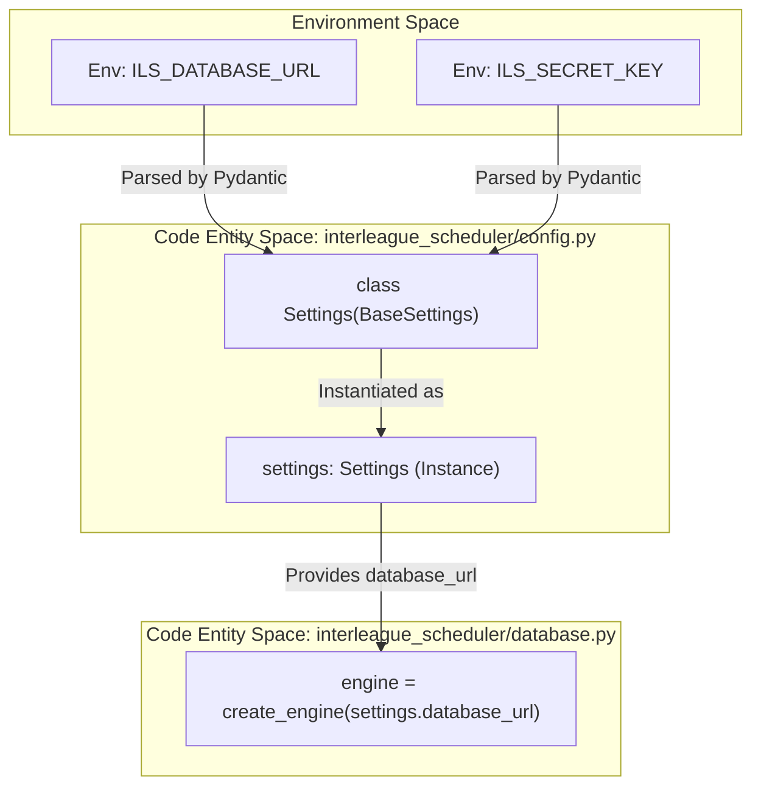
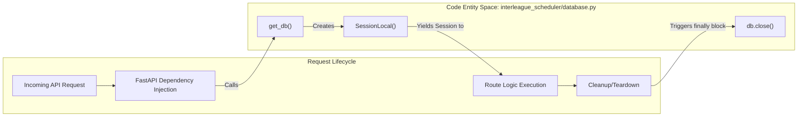

# Configuration and Database

Relevant source files

The following files were used as context for generating this wiki page:

- [interleague_scheduler/config.py](interleague_scheduler/config.py)
- [interleague_scheduler/database.py](interleague_scheduler/database.py)

This section describes the centralized configuration management and the database connectivity layer of the Interleague Scheduler backend. The application utilizes `pydantic-settings` for environment-driven configuration and SQLAlchemy for Object-Relational Mapping (ORM) and session management.

## Application Configuration

The application configuration is managed by the `Settings` class in [interleague_scheduler/config.py:4-17](). This class inherits from `pydantic_settings.BaseSettings`, which allows it to automatically parse environment variables.

### Environment Variable Prefix
All configuration parameters can be overridden using environment variables prefixed with `ILS_` [interleague_scheduler/config.py:17-17](). For example, to set the `database_url`, one would export `ILS_DATABASE_URL`.

### Configurable Parameters

The following table details the available settings and their default values:

| Parameter | Type | Default Value | Description |
| :--- | :--- | :--- | :--- |
| `database_url` | `str` | `"sqlite:///./interleague_scheduler.db"` | Connection string for the database. |
| `app_title` | `str` | `"Interleague Scheduler API"` | Title used in FastAPI documentation. |
| `app_version` | `str` | `"0.1.0"` | Current version of the API. |
| `secret_key` | `str` | `"change-me-in-production"` | Key used for signing JWT tokens. |
| `access_token_expire_minutes` | `int` | `60` | Duration before a JWT expires. |
| `algorithm` | `str` | `"HS256"` | Hashing algorithm for JWT. |
| `google_client_id` | `str` | `""` | Client ID for Google OAuth2 integration. |
| `google_client_secret` | `str` | `""` | Client Secret for Google OAuth2 integration. |
| `google_redirect_uri` | `str` | `".../auth/google/callback"` | Authorized redirect URI for Google OAuth. |

**Sources:** [interleague_scheduler/config.py:4-20]()

## Database Connection and Session Management

The database layer is initialized in [interleague_scheduler/database.py](). It establishes the connection to the data store and provides the mechanisms for transactional sessions used by the API routers.

### SQLAlchemy Setup
1.  **Engine Creation**: The `engine` is created using the `database_url` from settings [interleague_scheduler/database.py:8-11](). If SQLite is used, `check_same_thread` is disabled to allow FastAPI's asynchronous requests to share the connection safely.
2.  **Session Factory**: `SessionLocal` is a `sessionmaker` configured to disable `autocommit` and `autoflush` by default, ensuring explicit transaction control [interleague_scheduler/database.py:12-12]().
3.  **Declarative Base**: The `Base` class serves as the foundation for all ORM models defined in the application [interleague_scheduler/database.py:14-14]().

### The `get_db` Dependency
To manage the lifecycle of database connections, the application uses a generator function called `get_db`. This function is typically injected into FastAPI endpoints using `Depends(get_db)`.

- **Flow**: It instantiates a `SessionLocal`, yields it to the calling route, and ensures the session is closed in a `finally` block once the request is completed [interleague_scheduler/database.py:17-22]().

**Sources:** [interleague_scheduler/database.py:1-23]()

## Data Flow and Entity Mapping

The following diagrams illustrate how configuration values flow into the system and how the code entities interact to provide database access to the rest of the application.

### Configuration Injection Logic
This diagram shows the relationship between environment variables, the `Settings` class, and the resulting `settings` object used by the engine.

**Sources:** [interleague_scheduler/config.py:4-20](), [interleague_scheduler/database.py:8-11]()

### Database Session Lifecycle
This diagram maps the "Natural Language" concept of a request-scoped database connection to the specific code entities in the `database.py` module.

**Sources:** [interleague_scheduler/database.py:12-22]()
