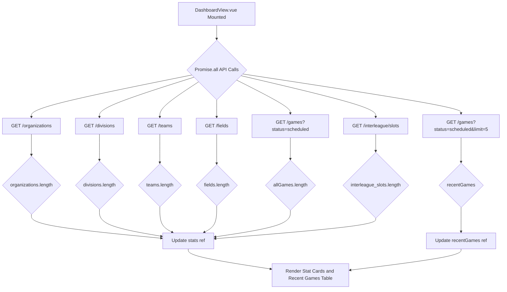

# 5.2. Dashboard and Entity Management Views

<details>
<summary>Relevant source files</summary>

The following files were used as context for generating this wiki page:

- [frontend/src/stores/auth.ts](frontend/src/stores/auth.ts)
- [frontend/src/views/DashboardView.vue](frontend/src/views/DashboardView.vue)
- [frontend/src/views/divisions/DivisionList.vue](frontend/src/views/divisions/DivisionList.vue)
- [frontend/src/views/field-slots/FieldSlotList.vue](frontend/src/views/field-slots/FieldSlotList.vue)
- [frontend/src/views/fields/FieldList.vue](frontend/src/views/fields/FieldList.vue)
- [frontend/src/views/games/GameList.vue](frontend/src/views/games/GameList.vue)
- [frontend/src/views/organizations/OrganizationDetail.vue](frontend/src/views/organizations/OrganizationDetail.vue)
- [frontend/src/views/organizations/OrganizationList.vue](frontend/src/views/organizations/OrganizationList.vue)
- [frontend/src/views/teams/TeamList.vue](frontend/src/views/teams/TeamList.vue)
- [interleague_scheduler/routers/auth.py](interleague_scheduler/routers/auth.py)

</details>


This page details the frontend components responsible for displaying the application dashboard and managing core entities (Organizations, Divisions, Teams, Fields, Field Slots, and Games). It covers the implementation of `DashboardView.vue` for presenting key statistics and recent activities, and the common patterns used across the various list views for CRUD operations, including data fetching, form handling, and dialogs.

## Dashboard View

The `DashboardView.vue` component provides an at-a-glance overview of the system's current state. It displays several key metrics as "stat cards" and a list of recent scheduled games.

### Implementation Details

The dashboard leverages Vue 3's Composition API with `setup` script syntax.

- **State Management**: Reactive variables `stats` [frontend/src/views/DashboardView.vue:14-21]() and `recentGames` [frontend/src/views/DashboardView.vue:22]() are used to store fetched data. A `loading` flag [frontend/src/views/DashboardView.vue:23]() manages the display of loading indicators.
- **Stat Cards**: The `statCards` array [frontend/src/views/DashboardView.vue:25-32]() defines the configuration for each metric card, including its key, title, icon, and color.
- **Concurrent Data Fetching**: Upon component mount, the `onMounted` hook [frontend/src/views/DashboardView.vue:34-59]() initiates multiple API calls concurrently using `Promise.all` [frontend/src/views/DashboardView.vue:36](). This fetches data for organizations, divisions, teams, fields, all scheduled games, recent scheduled games (limited to 5), and interleague slots.
    - The counts for `organizations`, `divisions`, `teams`, `fields`, and `interleague_slots` are derived directly from the length of the respective API responses [frontend/src/views/DashboardView.vue:46-51]().
    - `upcoming_games` count is taken from the `allGames` response [frontend/src/views/DashboardView.vue:50]().
    - `recentGames` are populated from a separate API call with a `limit=5` parameter [frontend/src/views/DashboardView.vue:42, 53]().
- **Game Type Color Coding**: In the "Recent Scheduled Games" table, game types are visually distinguished using `v-chip` components. Interleague games are colored purple, while intraleague games are blue [frontend/src/views/DashboardView.vue:102-104]().

### Dashboard Data Flow


Sources:
- [frontend/src/views/DashboardView.vue:1-116]()

## Entity Management Views

The application provides dedicated list views for managing Organizations, Divisions, Teams, Fields, Field Slots, and Games. These views follow a consistent pattern for displaying data, performing CRUD operations, and interacting with the backend API.

### Common Patterns

Each entity management view (e.g., `OrganizationList.vue`, `DivisionList.vue`, `TeamList.vue`, `FieldList.vue`, `FieldSlotList.vue`, `GameList.vue`) shares the following structural and functional patterns:

1.  **Data Table (`v-data-table`)**: All entities are displayed in a Vuetify `v-data-table` component.
    *   `headers`: An array defining the columns of the table, including `title` and `key` for data mapping [frontend/src/views/organizations/OrganizationList.vue:21-25]().
    *   `items`: A reactive array (`ref`) holding the list of entities fetched from the API [frontend/src/views/organizations/OrganizationList.vue:12]().
    *   `loading`: A boolean `ref` to indicate data loading status, used to show a loading spinner in the table [frontend/src/views/organizations/OrganizationList.vue:14]().
    *   `item.actions` slot: Provides buttons for "Edit" (`mdi-pencil`) and "Delete" (`mdi-delete`) operations for each row [frontend/src/views/organizations/OrganizationList.vue:99-103](). Some views, like Organizations, also include a "View Details" (`mdi-eye`) button [frontend/src/views/organizations/OrganizationList.vue:103](). Games also include a "Cancel Game" (`mdi-cancel`) button [frontend/src/views/games/GameList.vue:144-151]().

2.  **Data Fetching (`load` function)**:
    *   Each view has an asynchronous `load` function responsible for fetching the list of entities from the backend API using the `api` client [frontend/src/views/organizations/OrganizationList.vue:27-35]().
    *   Many views also fetch related entities (e.g., Divisions fetch Organizations, Teams fetch Divisions and Organizations) to populate dropdowns in their forms. These are often fetched concurrently using `Promise.all` for efficiency [frontend/src/views/divisions/DivisionList.vue:36-40]().
    *   The `onMounted` hook calls `load` to populate the table when the component is first rendered [frontend/src/views/organizations/OrganizationList.vue:80]().

3.  **Create/Edit Dialog (`v-dialog`)**:
    *   A `v-dialog` component is used for both creating new entities and editing existing ones [frontend/src/views/organizations/OrganizationList.vue:106-121]().
    *   `dialog`: A boolean `ref` to control the visibility of the dialog [frontend/src/views/organizations/OrganizationList.vue:15]().
    *   `editMode`: A boolean `ref` to distinguish between create and edit operations, affecting the dialog title and API call (`POST` vs. `PATCH`) [frontend/src/views/organizations/OrganizationList.vue:16]().
    *   `form`: A reactive object (`ref`) that binds to the input fields within the dialog, holding the data for the entity being created or edited [frontend/src/views/organizations/OrganizationList.vue:18]().
    *   `openCreate()`: Resets the `form` and sets `editMode` to `false` before opening the dialog [frontend/src/views/organizations/OrganizationList.vue:37-41]().
    *   `openEdit(item)`: Populates the `form` with the data of the selected item, sets `editMode` to `true`, and stores the `selectedId` [frontend/src/views/organizations/OrganizationList.vue:43-52]().
    *   `save()`: Sends a `POST` request (for create) or `PATCH` request (for edit) to the appropriate API endpoint with the `form` data. After a successful save, it closes the dialog and reloads the data [frontend/src/views/organizations/OrganizationList.vue:54-67]().

4.  **Delete Confirmation Dialog (`v-dialog`)**:
    *   A separate `v-dialog` is used to confirm deletion, preventing accidental data loss [frontend/src/views/organizations/OrganizationList.vue:122-133]().
    *   `deleteDialog`: A boolean `ref` to control its visibility [frontend/src/views/organizations/OrganizationList.vue:17]().
    *   `confirmDelete(id)`: Stores the ID of the item to be deleted and opens the confirmation dialog [frontend/src/views/organizations/OrganizationList.vue:69-72]().
    *   `deleteItem()`: Sends a `DELETE` request to the API, then closes the dialog and reloads the data [frontend/src/views/organizations/OrganizationList.vue:74-77]().

5.  **API Client**: All views use the `api` client [frontend/src/api/client]() for making HTTP requests to the backend.

### Specific View Implementations

#### Organizations (`OrganizationList.vue`)

-   **Purpose**: Manage top-level organizations.
-   **Fields**: `name`, `region`, `contact_email` [frontend/src/views/organizations/OrganizationList.vue:18]().
-   **Actions**: Create, Edit, Delete, and View Details. The "View Details" button navigates to `OrganizationDetail.vue` [frontend/src/views/organizations/OrganizationList.vue:103]().
-   **Detail View (`OrganizationDetail.vue`)**: Displays an organization's details along with lists of its associated divisions, teams, and fields. It fetches all related data concurrently using `Promise.all` [frontend/src/views/organizations/OrganizationDetail.vue:22-31]().

#### Divisions (`DivisionList.vue`)

-   **Purpose**: Manage divisions within organizations.
-   **Fields**: `name`, `age_group`, `organization_id` [frontend/src/views/divisions/DivisionList.vue:24]().
-   **Dependencies**: Requires a list of existing organizations to associate a division with [frontend/src/views/divisions/DivisionList.vue:39]().

#### Teams (`TeamList.vue`)

-   **Purpose**: Manage teams within divisions and organizations.
-   **Fields**: `name`, `coach_name`, `coach_email`, `division_id`, `organization_id` [frontend/src/views/teams/TeamList.vue:27-29]().
-   **Dependencies**: Requires lists of existing divisions and organizations [frontend/src/views/teams/TeamList.vue:44-46]().

#### Fields (`FieldList.vue`)

-   **Purpose**: Manage physical fields/venues.
-   **Fields**: `name`, `address`, `organization_id` [frontend/src/views/fields/FieldList.vue:21]().
-   **Dependencies**: Requires a list of existing organizations [frontend/src/views/fields/FieldList.vue:35]().

#### Field Slots (`FieldSlotList.vue`)

-   **Purpose**: Manage available time slots for fields.
-   **Fields**: `field_id`, `date`, `start_time`, `end_time` [frontend/src/views/field-slots/FieldSlotList.vue:23-24]().
-   **Dependencies**: Requires a list of existing fields [frontend/src/views/field-slots/FieldSlotList.vue:41]().
-   **Status Indicator**: Displays `is_booked` status with color-coded chips (red for booked, green for available) [frontend/src/views/field-slots/FieldSlotList.vue:110-112]().

#### Games (`GameList.vue`)

-   **Purpose**: Schedule and manage games.
-   **Fields**: `home_team_id`, `away_team_id`, `field_slot_id`, `game_type` [frontend/src/views/games/GameList.vue:31-33]().
-   **Dependencies**: Requires lists of teams and field slots. The `availableSlots` computed property filters out already booked field slots for selection [frontend/src/views/games/GameList.vue:64-66]().
-   **Game Actions**:
    *   **Schedule Game**: Creates a new game, which also marks the selected field slot as booked on the backend.
    *   **Cancel Game**: Changes the game's status to 'cancelled' and frees up the associated field slot. A confirmation dialog is used [frontend/src/views/games/GameList.vue:86-95]().
    *   **Delete Game**: Permanently removes the game.
-   **Status and Type Indicators**: Uses `v-chip` components to visually represent `game_type` (purple for interleague, blue for intraleague) [frontend/src/views/games/GameList.vue:133-135]() and `status` (green for scheduled, red for cancelled, blue for completed) [frontend/src/views/games/GameList.vue:108-112, 137-139]().

### CRUD Operation Flow

```mermaid
graph TD
    A[User Action: Create/Edit/Delete] --> B{Open Dialog}
    B -- Create --> C1[openCreate()]
    B -- Edit --> C2[openEdit(item)]
    B -- Delete --> C3[confirmDelete(id)]

    C1 --> D1[Reset form, set editMode=false, dialog=true]
    C2 --> D2[Populate form, set editMode=true, selectedId=item.id, dialog=true]
    C3 --> D3[Set selectedId=id, deleteDialog=true]

    D1 & D2 --> E{Dialog Form Submission}
    E -- Save --> F[save()]
    D3 --> G{Delete Confirmation}
    G -- Confirm Delete --> H[deleteItem()]
    G -- Cancel --> I[deleteDialog=false]

    F --> J{Check editMode}
    J -- true (Edit) --> K[api.patch('/entity/:id', payload)]
    J -- false (Create) --> L[api.post('/entity', payload)]

    K & L --> M[dialog=false, load()]
    H --> N[api.delete('/entity/:id')]
    N --> O[deleteDialog=false, load()]

    M & O --> P[Update v-data-table]
```
Sources:
- [frontend/src/views/organizations/OrganizationList.vue:1-134]()
- [frontend/src/views/divisions/DivisionList.vue:1-145]()
- [frontend/src/views/teams/TeamList.vue:1-169]()
- [frontend/src/views/fields/FieldList.vue:1-142]()
- [frontend/src/views/field-slots/FieldSlotList.vue:1-156]()
- [frontend/src/views/games/GameList.vue:1-229]()
- [frontend/src/views/organizations/OrganizationDetail.vue:1-89]()
