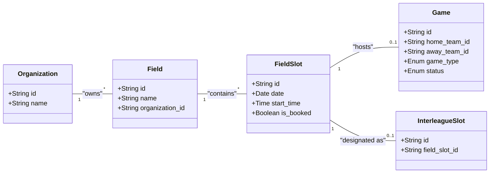
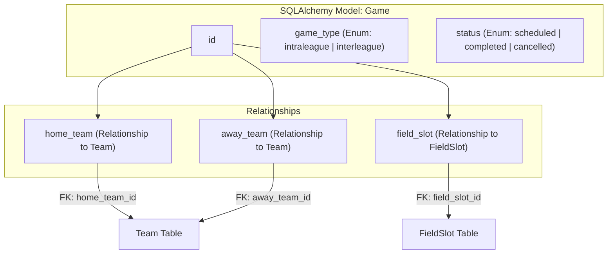

# Field, FieldSlot, and Game Models

Relevant source files

The following files were used as context for generating this wiki page:

- [interleague_scheduler/models/field_slot.py](interleague_scheduler/models/field_slot.py)
- [interleague_scheduler/models/game.py](interleague_scheduler/models/game.py)
- [interleague_scheduler/schemas/field.py](interleague_scheduler/schemas/field.py)
- [interleague_scheduler/schemas/field_slot.py](interleague_scheduler/schemas/field_slot.py)
- [interleague_scheduler/schemas/game.py](interleague_scheduler/schemas/game.py)

This page documents the SQLAlchemy ORM models responsible for managing physical locations, temporal availability, and the resulting athletic contests within the Interleague Scheduler. These models form the core of the scheduling engine, bridging the gap between organizational structure and actual game execution.

### Entity Relationship Overview

The relationship between these entities is hierarchical: an `Organization` owns multiple `Fields`, each `Field` provides several `FieldSlots` (windows of time), and each `FieldSlot` can be associated with a `Game`.

**Model Relationship Diagram**

**Sources:** [interleague_scheduler/models/field_slot.py:19-23](), [interleague_scheduler/models/game.py:30-32]()

---

## Field Model

The `Field` model represents a physical venue where games take place. It is owned by a specific `Organization`.

### Implementation Details
The model includes standard descriptive fields and maintains a relationship back to its parent organization and forward to its available time slots.

| Column | Type | Description |
| :--- | :--- | :--- |
| `id` | `String(36)` | Primary Key (UUID) |
| `organization_id` | `String(36)` | Foreign Key to `organizations.id` |
| `name` | `String` | Name of the field/complex |
| `address` | `String` | Physical address (optional) |
| `description` | `Text` | Additional notes or directions |

**Relationships:**
*   **organization**: Links to the `Organization` that owns the field.
*   **time_slots**: A one-to-many relationship with `FieldSlot` entities [interleague_scheduler/models/field_slot.py:19]().

**Sources:** [interleague_scheduler/schemas/field.py:4-25]()

---

## FieldSlot Model

The `FieldSlot` model defines a specific window of time at a `Field`. It is the atomic unit of scheduling.

### Implementation Details
A `FieldSlot` tracks its temporal boundaries and its booking status. It serves as a junction between the physical `Field` and the logical `Game`.

| Column | Type | Description |
| :--- | :--- | :--- |
| `id` | `String(36)` | Primary Key (UUID) [interleague_scheduler/models/field_slot.py:12]() |
| `field_id` | `String(36)` | Foreign Key to `fields.id` (CASCADE on delete) [interleague_scheduler/models/field_slot.py:13]() |
| `date` | `Date` | The calendar date of the slot [interleague_scheduler/models/field_slot.py:14]() |
| `start_time` | `Time` | Beginning of the slot [interleague_scheduler/models/field_slot.py:15]() |
| `end_time` | `Time` | End of the slot [interleague_scheduler/models/field_slot.py:16]() |
| `is_booked` | `Boolean` | Flag indicating if a game is assigned (Default: `False`) [interleague_scheduler/models/field_slot.py:17]() |

### Relationships and Cascades
*   **field**: Reference to the parent `Field` [interleague_scheduler/models/field_slot.py:19]().
*   **games**: One-to-many relationship with `Game`. Uses `cascade="all, delete-orphan"` to ensure that if a slot is removed, associated game records are cleaned up [interleague_scheduler/models/field_slot.py:20]().
*   **interleague_slot**: A one-to-one relationship with `InterleagueSlot`. This allows a slot to be "flagged" for interleague play without cluttering the base model [interleague_scheduler/models/field_slot.py:21-23]().

**Sources:** [interleague_scheduler/models/field_slot.py:9-23]()

---

## Game Model

The `Game` model represents a scheduled match between two teams. It captures the participants, the location (via `FieldSlot`), and the current status of the event.

### Implementation Details
The `Game` model utilizes SQLAlchemy `Enum` types to enforce valid game types and statuses.

| Column | Type | Description |
| :--- | :--- | :--- |
| `id` | `String(36)` | Primary Key (UUID) [interleague_scheduler/models/game.py:12]() |
| `home_team_id` | `String(36)` | FK to `teams.id`. Represents the host team [interleague_scheduler/models/game.py:13]() |
| `away_team_id` | `String(36)` | FK to `teams.id`. Represents the visiting team [interleague_scheduler/models/game.py:14]() |
| `field_slot_id` | `String(36)` | FK to `field_slots.id` [interleague_scheduler/models/game.py:15-17]() |
| `game_type` | `Enum` | `intraleague` or `interleague` [interleague_scheduler/models/game.py:18-22]() |
| `status` | `Enum` | `scheduled`, `completed`, or `cancelled` [interleague_scheduler/models/game.py:23-27]() |
| `notes` | `Text` | Optional notes (e.g., score, weather delay info) [interleague_scheduler/models/game.py:28]() |

### Multi-Team Relationships
Because a `Game` references the `Team` model twice (once for home, once for away), the relationships require explicit `foreign_keys` definitions to resolve ambiguity.

**Code to Model Mapping: Game Logic**

**Sources:** [interleague_scheduler/models/game.py:9-32](), [interleague_scheduler/schemas/game.py:7-52]()

---

## Data Flow: Booking a Slot

When a game is created via the API, the system orchestrates the relationship between the `Game` and the `FieldSlot`.

1.  **Validation**: The `GameCreate` schema validates that `home_team_id`, `away_team_id`, and `field_slot_id` are provided [interleague_scheduler/schemas/game.py:7-13]().
2.  **Assignment**: The `Game` record is created with a reference to the `field_slot_id` [interleague_scheduler/models/game.py:15-17]().
3.  **State Change**: The application logic (typically in the router) updates the `is_booked` attribute of the `FieldSlot` to `True` [interleague_scheduler/models/field_slot.py:17]().
4.  **Retrieval**: When fetching games, the `GameRead` schema can include nested `GameTeamInfo` and `GameFieldSlotInfo` to provide a complete view of the event [interleague_scheduler/schemas/game.py:39-51]().

**Sources:** [interleague_scheduler/models/game.py:1-32](), [interleague_scheduler/schemas/game.py:1-52](), [interleague_scheduler/models/field_slot.py:1-24]()
