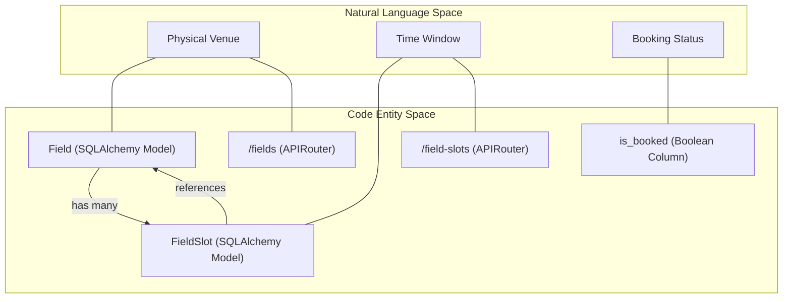
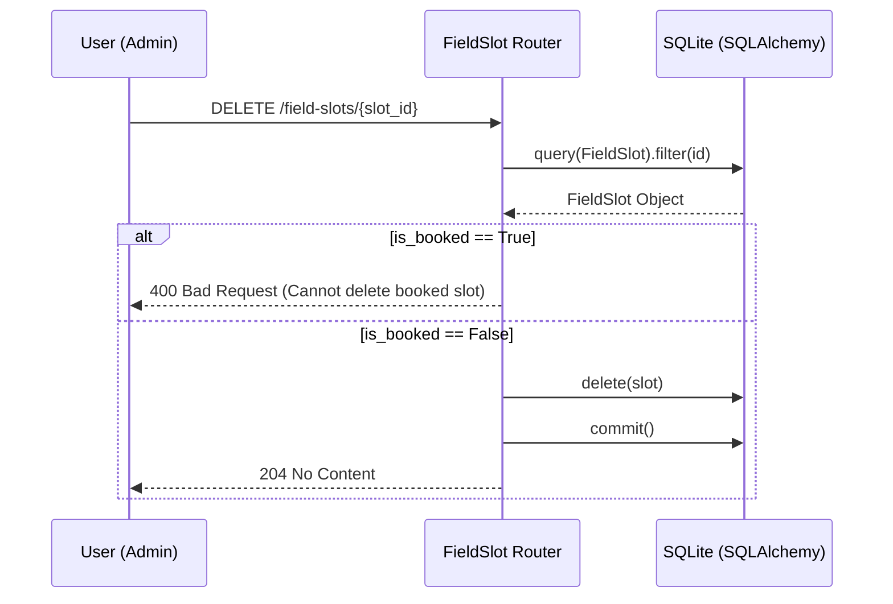

# Fields and Field Slots API

Relevant source files

The following files were used as context for generating this wiki page:

- [interleague_scheduler/routers/field_slots.py](interleague_scheduler/routers/field_slots.py)
- [interleague_scheduler/routers/fields.py](interleague_scheduler/routers/fields.py)

The Fields and Field Slots API provides the endpoints necessary for managing physical venues and their available time windows. These resources are foundational to the scheduling system, as every `Game` requires a booked `FieldSlot` associated with a specific `Field`.

## Overview

The API is split into two primary routers:
1.  **`/fields`**: Manages the physical locations (venues) owned by an `Organization`.
2.  **`/field-slots`**: Manages specific date and time blocks available for play at a given field.

### Entity Relationships

A `Field` belongs to an `Organization`. A `Field` can have many `FieldSlot` entries. A `FieldSlot` may be associated with exactly one `Game`.

### Data Flow and Code Entities

The following diagram maps the natural language concepts of field management to the specific classes and functions implemented in the backend.

**Diagram: Field Management Mapping**

**Sources:**
- `interleague_scheduler/routers/fields.py:13-13`
- `interleague_scheduler/routers/field_slots.py:13-13`
- `interleague_scheduler/models/field.py`
- `interleague_scheduler/models/field_slot.py`

---

## Fields API (`/fields`)

The `/fields` router handles the CRUD operations for physical venues.

### Creation and Validation
When creating a field via `POST /fields/`, the system validates that the `organization_id` provided in the `FieldCreate` payload exists in the database [interleague_scheduler/routers/fields.py:22-24]().

### Listing and Filtering
The `list_fields` function allows for paginated retrieval and optional filtering by `organization_id` [interleague_scheduler/routers/fields.py:33-42]().

### Deletion Constraints
The system enforces strict referential integrity. A `Field` cannot be deleted if any of its `FieldSlot` entries are currently associated with a `Game`. The `delete_field` function performs a join between `FieldSlot` and `Game` to verify this condition before proceeding [interleague_scheduler/routers/fields.py:79-89]().

**Sources:**
- `interleague_scheduler/routers/fields.py:16-29`
- `interleague_scheduler/routers/fields.py:32-42`
- `interleague_scheduler/routers/fields.py:70-91`

---

## Field Slots API (`/field-slots`)

The `/field-slots` router manages the availability of fields.

### Slot Constraints
During creation (`POST /field-slots/`) and updates (`PATCH /field-slots/{slot_id}`), the API ensures that the `start_time` is strictly before the `end_time` [interleague_scheduler/routers/field_slots.py:25-26](), [interleague_scheduler/routers/field_slots.py:77-78]().

### Search and Filtering
The `list_field_slots` endpoint supports extensive filtering to help schedulers find available times:
- `field_id`: Slots for a specific venue.
- `date`: Slots on a specific calendar day.
- `is_booked`: Filter for available (False) or occupied (True) slots.
- `organization_id`: Slots belonging to any field owned by a specific organization [interleague_scheduler/routers/field_slots.py:35-53]().

### Booking Logic
A `FieldSlot` contains an `is_booked` boolean flag. This flag is typically updated by the `Games` API when a game is scheduled or cancelled, but the `delete_field_slot` endpoint explicitly prevents the removal of any slot where `is_booked` is True [interleague_scheduler/routers/field_slots.py:95-96]().

**Sources:**
- `interleague_scheduler/routers/field_slots.py:16-31`
- `interleague_scheduler/routers/field_slots.py:34-53`
- `interleague_scheduler/routers/field_slots.py:86-98`

---

## Technical Implementation

### Request Handling and Security
Both routers utilize FastAPI dependencies for database session management (`get_db`) and authentication (`get_current_user`). Write operations (POST, PATCH, DELETE) require a valid JWT token [interleague_scheduler/routers/fields.py:20](), [interleague_scheduler/routers/field_slots.py:20]().

**Diagram: Slot Deletion Workflow**

### Key Functions

| Function | Route | Logic |
| :--- | :--- | :--- |
| `create_field` | `POST /fields/` | Verifies `Organization` existence before insert. |
| `delete_field` | `DELETE /fields/{id}` | Checks `Game` associations via `FieldSlot` join. |
| `list_field_slots` | `GET /field-slots/` | Joins `Field` table if `organization_id` filter is used. |
| `update_field_slot` | `PATCH /field-slots/{id}` | Validates temporal logic (`start < end`) on partial updates. |

**Sources:**
- `interleague_scheduler/routers/fields.py:17-29`
- `interleague_scheduler/routers/fields.py:71-91`
- `interleague_scheduler/routers/field_slots.py:35-53`
- `interleague_scheduler/routers/field_slots.py:65-83`
