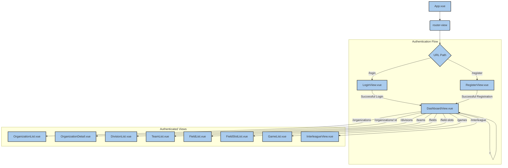
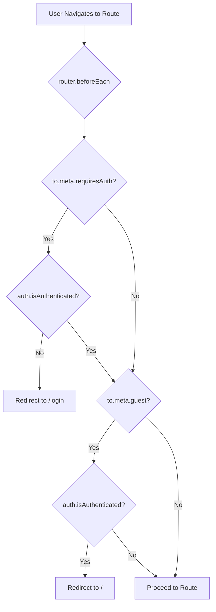

# Frontend Application

Relevant source files

The following files were used as context for generating this wiki page:

- [frontend/package.json](frontend/package.json)
- [frontend/src/App.vue](frontend/src/App.vue)
- [frontend/src/main.ts](frontend/src/main.ts)
- [frontend/src/router/index.ts](frontend/src/router/index.ts)
- [frontend/tsconfig.json](frontend/tsconfig.json)
- [frontend/vite.config.ts](frontend/vite.config.ts)

This page provides a high-level overview of the Interleague Scheduler's frontend application, built with Vue 3 and Vuetify. It covers the project's structure, build tooling, TypeScript configuration, the centralized API client, and the router's authentication guards. Detailed explanations of specific features and components are delegated to child pages.

## Project Structure and Build Tooling

The frontend application resides in the `frontend/` directory and is structured as a standard Vue 3 project. It leverages Vite as its build tool, providing a fast development experience and optimized production builds [frontend/package.json:7-8](). TypeScript is used throughout the codebase for type safety and improved developer experience [frontend/package.json:23]().

The core dependencies include:
- **Vue 3**: The progressive JavaScript framework for building user interfaces [frontend/package.json:15]().
- **Vuetify 3**: A Vue UI Library that provides a comprehensive set of Material Design components [frontend/package.json:17]().
- **Pinia**: The official state management library for Vue, used for managing application state like authentication [frontend/package.json:14]().
- **Vue Router**: The official router for Vue.js, handling navigation and routing within the single-page application [frontend/package.json:16]().
- **Axios**: A promise-based HTTP client for making API requests [frontend/package.json:13]().

During development, Vite's dev server is configured to proxy API requests from `/api` to the backend running on `http://localhost:8000` [frontend/vite.config.ts:7-12](). This simplifies API interaction by avoiding CORS issues during development.

Sources:
- [frontend/package.json]()
- [frontend/vite.config.ts]()

## TypeScript Configuration

The frontend project is configured to use TypeScript, enhancing code quality and maintainability. The main TypeScript configuration file, `tsconfig.json`, references `tsconfig.app.json` for application-specific settings and `tsconfig.node.json` for Node.js environment settings [frontend/tsconfig.json:1-6](). This setup ensures proper type checking for both client-side code and build scripts.

Sources:
- [frontend/tsconfig.json]()

## Centralized API Client and Authentication Store

All communication with the backend API is handled through a centralized Axios-based API client. This client is responsible for setting the base URL to `/api/v1`, injecting the Bearer token into authenticated requests, and globally handling 401 Unauthorized responses.

Authentication state, including user information and the authentication token, is managed by the `useAuthStore` Pinia store. This store provides methods for user login, registration, and an initialization routine (`auth.init()`) that checks for a Google OAuth token in the URL upon application load [frontend/src/main.ts:38]().

For a detailed explanation of the API client, the `useAuthStore`, and the frontend-backend OAuth handshake flow, see [API Client and Authentication Store](#5.1).

Sources:
- [frontend/src/main.ts:38]()

## Router and Authentication Guards

The application's navigation is managed by Vue Router. The `router/index.ts` file defines all routes and implements global navigation guards [frontend/src/router/index.ts:78-87]().

### Router Configuration

The `createRouter` function initializes the router with `createWebHistory` for clean URLs and defines an array of routes [frontend/src/router/index.ts:73-76](). Each route specifies a `path`, `name`, `component` (using lazy loading for better performance), and `meta` fields for authentication requirements.

**Router Flow**
Sources:
- [frontend/src/router/index.ts:4-70]()

### Authentication Guards

A global `beforeEach` navigation guard is implemented to protect routes based on authentication status [frontend/src/router/index.ts:78-87]().
- If a route has `meta: { requiresAuth: true }` and the user is not authenticated, they are redirected to `/login` [frontend/src/router/index.ts:80-81]().
- If a route has `meta: { guest: true }` (e.g., login or register pages) and the user is already authenticated, they are redirected to the dashboard (`/`) [frontend/src/router/index.ts:82-83]().
- Otherwise, navigation proceeds normally [frontend/src/router/index.ts:84-86]().

**Router Authentication Guard Logic**
Sources:
- [frontend/src/router/index.ts:78-87]()
- [frontend/src/stores/auth.ts]()

## Application Layout

The main application layout is defined in `App.vue`. It conditionally renders a `v-navigation-drawer` and `v-app-bar` if the user is authenticated [frontend/src/App.vue:29, 48](). The navigation drawer contains links to various management views, dynamically generated from the `navItems` array [frontend/src/App.vue:10-19, 37-44](). The app bar displays the user's email and a logout button [frontend/src/App.vue:51-55](). The `router-view` component renders the content of the current route [frontend/src/App.vue:60]().

Sources:
- [frontend/src/App.vue]()

## Feature Views

The frontend provides several views for managing different entities and functionalities within the Interleague Scheduler.

### Dashboard and Entity Management Views

The `DashboardView` provides an overview of key statistics. Separate list views are available for managing Organizations, Divisions, Teams, Fields, Field Slots, and Games. These views typically feature data tables, dialogs for creating/editing entities, and interactions with the API.

For a detailed look at the dashboard and all CRUD list views, see [Dashboard and Entity Management Views](#5.2).

### Interleague Management View

The `InterleagueView.vue` component is a central hub for interleague game coordination. It features a tabbed interface for designating field slots, declaring team availability, and finding suitable teams for interleague games.

For an in-depth discussion of the Interleague Management View, including its data loading strategies and specific forms, see [Interleague Management View](#5.3).
