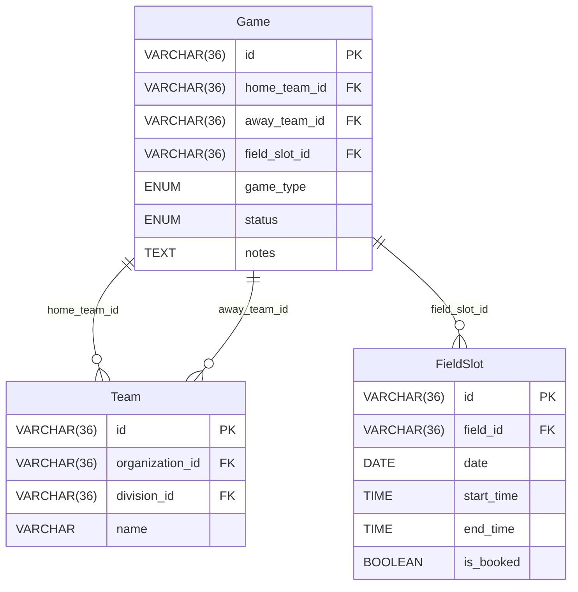
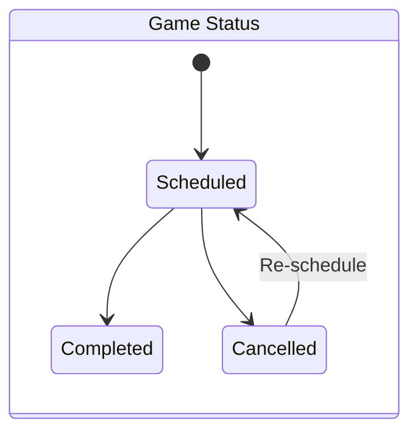

# Games API

<details>
<summary>Relevant source files</summary>

The following files were used as context for generating this wiki page:

- [interleague_scheduler/models/game.py](interleague_scheduler/models/game.py)
- [interleague_scheduler/routers/games.py](interleague_scheduler/routers/games.py)
- [interleague_scheduler/schemas/game.py](interleague_scheduler/schemas/game.py)

</details>


This page provides an in-depth look at the `/games` router, which manages the creation, retrieval, updating, and deletion of game entities within the Interleague Scheduler. It covers the process of game creation, including field slot booking, various filtering options for listing games, the use of SQLAlchemy's `aliased` function for handling home and away teams, the game status state machine, and the critical `is_booked` synchronization logic on associated `FieldSlot` entities.

## Game Model and Schemas

The `Game` model defines the structure of a game in the database, including foreign keys to `Team` (for home and away teams) and `FieldSlot`. It also specifies `game_type` and `status` using SQLAlchemy `Enum` types. Pydantic schemas (`GameCreate`, `GameUpdate`, `GameRead`) are used for data validation and serialization when interacting with the API.


Sources:
* [interleague_scheduler/models/game.py:9-32]()
* [interleague_scheduler/schemas/game.py:7-52]()

### Game Status State Machine

The `Game` model includes a `status` field, which is an `Enum` with possible values: `"scheduled"`, `"completed"`, and `"cancelled"`.
[interleague_scheduler/models/game.py:24-27]()

The API enforces a simple state machine for game statuses:
*   A game is initially created with `status="scheduled"`.
*   It can transition from `"scheduled"` to `"completed"` or `"cancelled"`.
*   A game can also transition from `"cancelled"` back to `"scheduled"`, but this requires careful handling of the associated `FieldSlot`'s `is_booked` status.


Sources:
* [interleague_scheduler/models/game.py:24-27]()
* [interleague_scheduler/routers/games.py:115-132]()

## API Endpoints

The `/games` router provides the following endpoints:

### Create Game (`POST /games/`)

This endpoint allows for the creation of a new game.
[interleague_scheduler/routers/games.py:18-45]()

**Request Body:** `GameCreate` schema
[interleague_scheduler/schemas/game.py:7-13]()

**Logic:**
1.  **Team Validation:** Checks if `home_team_id` and `away_team_id` exist and are different.
    [interleague_scheduler/routers/games.py:24-31]()
2.  **Field Slot Validation:** Checks if `field_slot_id` exists and if the `FieldSlot` is not already booked (`is_booked` is `False`).
    [interleague_scheduler/routers/games.py:33-37]()
3.  **Field Slot Booking:** If valid, the `is_booked` flag of the associated `FieldSlot` is set to `True`.
    [interleague_scheduler/routers/games.py:40]()
4.  **Game Creation:** The new `Game` object is added to the database.
    [interleague_scheduler/routers/games.py:39-42]()

### List Games (`GET /games/`)

This endpoint retrieves a list of games, supporting various filtering options.
[interleague_scheduler/routers/games.py:48-93]()

**Query Parameters:**
*   `organization_id` (str, optional): Filters games by either home or away team's organization.
*   `division_id` (str, optional): Filters games by either home or away team's division.
*   `date` (datetime.date, optional): Filters games by the date of their associated `FieldSlot`.
*   `game_type` (str, optional): Filters games by `game_type` (e.g., "intraleague", "interleague").
*   `status` (str, optional): Filters games by `status` (e.g., "scheduled", "completed", "cancelled").
*   `skip` (int, optional): Number of records to skip for pagination.
*   `limit` (int, optional): Maximum number of records to return.

**Implementation Details:**
*   **Aliased Teams:** SQLAlchemy's `aliased` function is used to join the `Team` table twice, once for the home team and once for the away team, allowing for distinct filtering on both.
    [interleague_scheduler/routers/games.py:59-60]()
*   **Joined Loading:** `joinedload` is used to eagerly load related `home_team`, `away_team`, and `field_slot` data to avoid N+1 query problems.
    [interleague_scheduler/routers/games.py:66-69]()
*   **`or_` Clause:** When filtering by `organization_id` or `division_id`, an `or_` clause is used to match games where *either* the home team *or* the away team belongs to the specified organization/division.
    [interleague_scheduler/routers/games.py:71-83]()

### Get Game (`GET /games/{game_id}`)

Retrieves a single game by its ID.
[interleague_scheduler/routers/games.py:96-101]()

**Logic:**
*   Uses the private helper function `_load_game` to fetch the game with joined relationships.
    [interleague_scheduler/routers/games.py:98]()

### Update Game (`PATCH /games/{game_id}`)

Allows partial updates to a game's attributes, primarily its `status` and `notes`.
[interleague_scheduler/routers/games.py:104-136]()

**Request Body:** `GameUpdate` schema
[interleague_scheduler/schemas/game.py:15-18]()

**`is_booked` Synchronization Logic:**
*   **Cancelling a Game:** If the `status` is updated to `"cancelled"` from any other status, the associated `FieldSlot`'s `is_booked` flag is set to `False`.
    [interleague_scheduler/routers/games.py:115-119]()
*   **Re-scheduling a Cancelled Game:** If a game's `status` is changed from `"cancelled"` to anything else (e.g., `"scheduled"`), the system attempts to re-book the `FieldSlot`. It first checks if the `FieldSlot` is already booked by another game. If it is, a `409 Conflict` error is raised. Otherwise, `is_booked` is set to `True`.
    [interleague_scheduler/routers/games.py:120-132]()

### Delete Game (`DELETE /games/{game_id}`)

Deletes a game by its ID.
[interleague_scheduler/routers/games.py:139-153]()

**`is_booked` Synchronization Logic:**
*   Before deleting the game, if the game's `status` is not `"cancelled"`, the associated `FieldSlot`'s `is_booked` flag is set to `False`. This ensures that the slot becomes available again.
    [interleague_scheduler/routers/games.py:149-150]()

## Internal Helper Functions

### `_load_game(db: Session, game_id: str) -> Game | None`

This private helper function is used internally by `get_game` and `create_game` to retrieve a `Game` object by its ID, ensuring that related `home_team`, `away_team`, and `field_slot` data are eagerly loaded using `joinedload`.
[interleague_scheduler/routers/games.py:155-165]()

```mermaid
flowchart TD
    subgraph "API Endpoints"
        A["POST /games/ (create_game)"] --> B{Validate Teams & FieldSlot};
        B -- "Teams valid, Slot available" --> C[Set FieldSlot.is_booked = True];
        C --> D[Create Game];
        D --> E["_load_game(game.id)"];

        F["GET /games/ (list_games)"] --> G[Build Query with Aliased Teams & Joined Loads];
        G --> H{Apply Filters (org_id, div_id, date, type, status)};
        H --> I[Return Filtered Games];

        J["GET /games/{game_id} (get_game)"] --> E;

        K["PATCH /games/{game_id} (update_game)"] --> L{Check Status Change};
        L -- "Status -> 'cancelled'" --> M[Set FieldSlot.is_booked = False];
        L -- "Status 'cancelled' -> 'scheduled'" --> N{Check FieldSlot.is_booked};
        N -- "FieldSlot available" --> O[Set FieldSlot.is_booked = True];
        N -- "FieldSlot booked" --> P[Raise 409 Conflict];
        M --> Q[Update Game Attributes];
        O --> Q;
        Q --> E;

        R["DELETE /games/{game_id} (delete_game)"] --> S{Game Status != 'cancelled'};
        S -- "True" --> T[Set FieldSlot.is_booked = False];
        T --> U[Delete Game];
        S -- "False" --> U;
    end

    subgraph "Helper Function"
        E["_load_game(db, game_id)"] --> V[Query Game with joinedload(home_team, away_team, field_slot)];
    end

    subgraph "Database Models"
        Team["Team Model"]
        FieldSlot["FieldSlot Model"]
        Game["Game Model"]
    end

    V --> Game;
    B --> Team;
    B --> FieldSlot;
    C --> FieldSlot;
    M --> FieldSlot;
    N --> FieldSlot;
    O --> FieldSlot;
    T --> FieldSlot;
    D --> Game;
    Q --> Game;
    U --> Game;
    G --> Team;
    G --> FieldSlot;
    G --> Game;
    H --> FieldSlot;
    H --> Team;
    H --> Game;
```
Sources:
* [interleague_scheduler/routers/games.py:18-165]()
* [interleague_scheduler/models/game.py:9-32]()
* [interleague_scheduler/schemas/game.py:7-52]()
