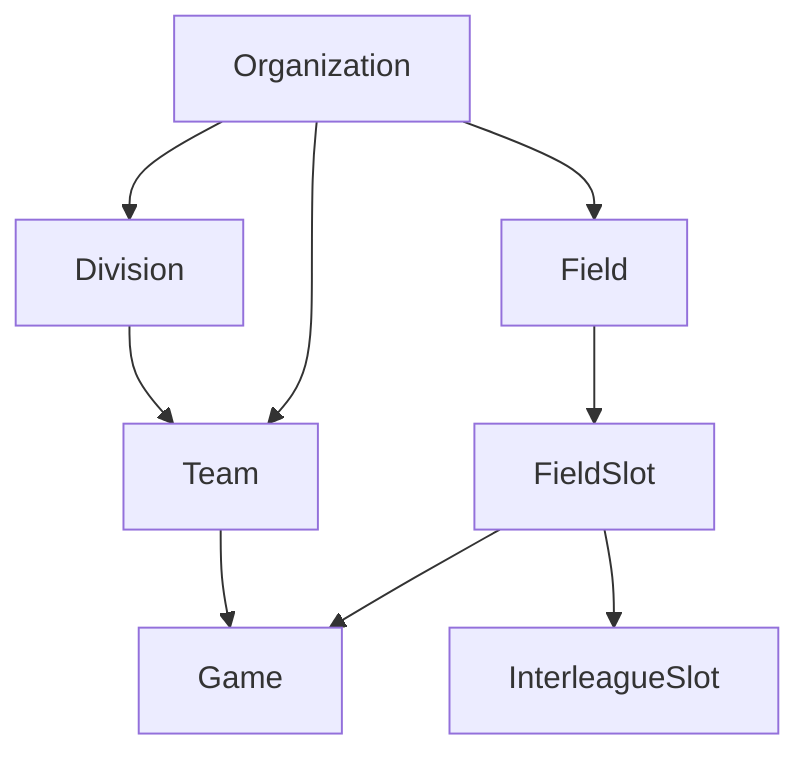
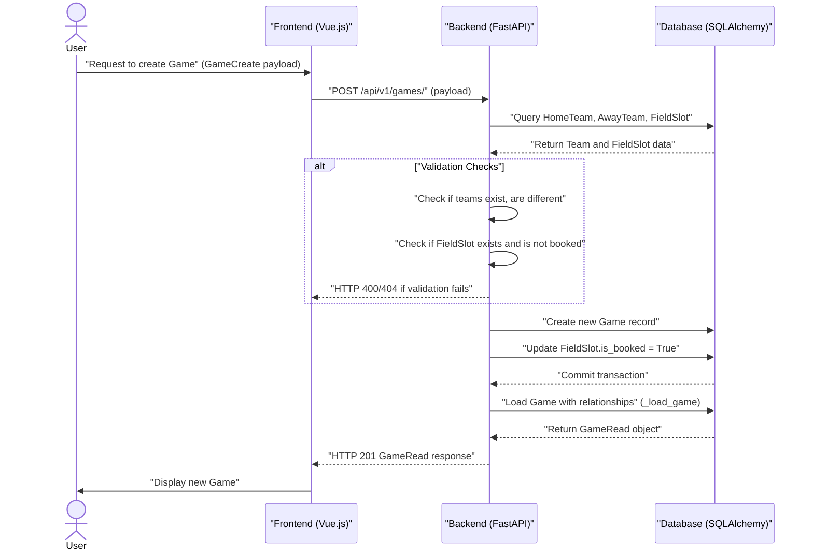
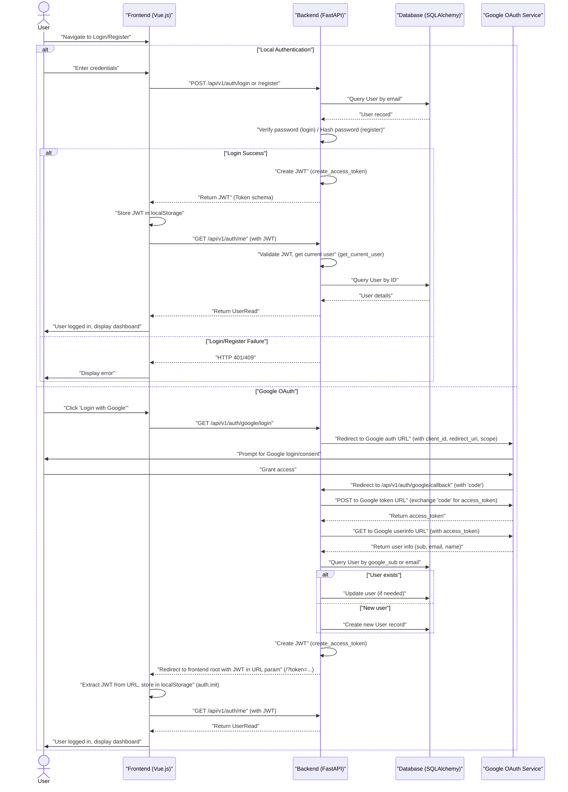

# Glossary

Relevant source files

The following files were used as context for generating this wiki page:

- [frontend/src/api/client.ts](frontend/src/api/client.ts)
- [frontend/src/stores/auth.ts](frontend/src/stores/auth.ts)
- [frontend/src/views/DashboardView.vue](frontend/src/views/DashboardView.vue)
- [interleague_scheduler/config.py](interleague_scheduler/config.py)
- [interleague_scheduler/models/field_slot.py](interleague_scheduler/models/field_slot.py)
- [interleague_scheduler/models/game.py](interleague_scheduler/models/game.py)
- [interleague_scheduler/routers/auth.py](interleague_scheduler/routers/auth.py)
- [interleague_scheduler/routers/games.py](interleague_scheduler/routers/games.py)
- [interleague_scheduler/routers/interleague.py](interleague_scheduler/routers/interleague.py)
- [pyproject.toml](pyproject.toml)

This page provides definitions for codebase-specific terms, domain concepts, abbreviations, and jargon used within the Interleague Scheduler project. It aims to clarify terminology for new engineers and provide pointers to relevant code implementations.

## Core Concepts

### Organization
A top-level entity representing a sports league or association. Organizations contain divisions, teams, and fields.
*   **Code Entity**: `interleague_scheduler.models.organization.Organization`
*   **API Endpoint**: `/api/v1/organizations`
*   **Frontend View**: `frontend/src/views/OrganizationListView.vue`

Sources:
*   [interleague_scheduler/routers/interleague.py:13-13]()

### Division
A subdivision within an `Organization`, typically representing a specific age group or skill level. Teams belong to divisions.
*   **Code Entity**: `interleague_scheduler.models.division.Division`
*   **API Endpoint**: `/api/v1/divisions`
*   **Frontend View**: `frontend/src/views/DivisionListView.vue`

Sources:
*   [interleague_scheduler/routers/interleague.py:8-8]()

### Team
A group of players belonging to a `Division` within an `Organization`. Teams can participate in games and declare availability for interleague play.
*   **Code Entity**: `interleague_scheduler.models.team.Team`
*   **API Endpoint**: `/api/v1/teams`
*   **Frontend View**: `frontend/src/views/TeamListView.vue`

Sources:
*   [interleague_scheduler/routers/interleague.py:14-14]()

### Field
A physical location where games can be played. Fields belong to an `Organization` and have associated `FieldSlot`s.
*   **Code Entity**: `interleague_scheduler.models.field.Field`
*   **API Endpoint**: `/api/v1/fields`
*   **Frontend View**: `frontend/src/views/FieldListView.vue`

Sources:
*   [interleague_scheduler/routers/interleague.py:9-9]()

### FieldSlot
A specific time window on a particular `Field` during which a game can be scheduled. Each `FieldSlot` has a `date`, `start_time`, `end_time`, and an `is_booked` flag.
*   **Code Entity**: `interleague_scheduler.models.field_slot.FieldSlot`
*   **API Endpoint**: `/api/v1/field-slots`
*   **Frontend View**: `frontend/src/views/FieldSlotListView.vue`

Sources:
*   [interleague_scheduler/models/field_slot.py:9-18]()
*   [interleague_scheduler/routers/interleague.py:10-10]()

### Game
A scheduled match between two `Team`s (`home_team` and `away_team`) at a specific `FieldSlot`. Games have a `game_type` (intraleague or interleague) and a `status` (scheduled, completed, cancelled).
*   **Code Entity**: `interleague_scheduler.models.game.Game`
*   **API Endpoint**: `/api/v1/games`
*   **Frontend View**: `frontend/src/views/GameListView.vue`

Sources:
*   [interleague_scheduler/models/game.py:9-28]()
*   [interleague_scheduler/routers/games.py:10-10]()

### InterleagueSlot
A special type of `FieldSlot` that has been designated for interleague play. It extends a `FieldSlot` and is associated with a `Division` that is offering the slot.
*   **Code Entity**: `interleague_scheduler.models.interleague_slot.InterleagueSlot`
*   **API Endpoint**: `/api/v1/interleague/slots`
*   **Frontend View**: `frontend/src/views/InterleagueView.vue` (under "Designate Slots" tab)

Sources:
*   [interleague_scheduler/models/field_slot.py:21-23]()
*   [interleague_scheduler/routers/interleague.py:11-11]()

### TeamAvailability
A declaration by a `Team` of a specific date and time range when they are available to play an interleague game. This helps other teams find potential opponents.
*   **Code Entity**: `interleague_scheduler.models.team_availability.TeamAvailability`
*   **API Endpoint**: `/api/v1/interleague/availability`
*   **Frontend View**: `frontend/src/views/InterleagueView.vue` (under "Declare Availability" tab)

Sources:
*   [interleague_scheduler/routers/interleague.py:15-15]()

## System Components

### FastAPI
The web framework used for building the backend API.
*   **Code Reference**: `pyproject.toml` [pyproject.toml:11-11]()

### SQLAlchemy
The Object Relational Mapper (ORM) used for interacting with the database. It maps Python objects (models) to database tables.
*   **Code Reference**: `pyproject.toml` [pyproject.toml:13-13]()
*   **Key Function**: `interleague_scheduler.database.get_db()` [interleague_scheduler/routers/auth.py:15-15]() provides a database session dependency.

### Pydantic
Used for data validation and settings management. Pydantic models define the structure and types of API request/response bodies and application settings.
*   **Code Reference**: `pyproject.toml` [pyproject.toml:14-14]()
*   **Key Class**: `interleague_scheduler.config.Settings` [interleague_scheduler/config.py:4-16]()

### JWT (JSON Web Token)
Used for authentication. After successful login, the backend issues a JWT to the client, which is then sent with subsequent requests to authenticate the user.
*   **Code Reference**: `pyproject.toml` [pyproject.toml:16-16]() (`python-jose[cryptography]`)
*   **Key Function**: `interleague_scheduler.auth.create_access_token()` [interleague_scheduler/routers/auth.py:9-9]()

### bcrypt
A password hashing function used to securely store user passwords.
*   **Code Reference**: `pyproject.toml` [pyproject.toml:17-18]() (`passlib[bcrypt]`, `bcrypt`)
*   **Key Function**: `interleague_scheduler.auth.hash_password()` [interleague_scheduler/routers/auth.py:11-11]() and `interleague_scheduler.auth.verify_password()` [interleague_scheduler/routers/auth.py:12-12]()

### Uvicorn
The ASGI server used to run the FastAPI application.
*   **Code Reference**: `pyproject.toml` [pyproject.toml:12-12]()

### Vue 3
The JavaScript framework used for building the frontend user interface.

### Vuetify
A Vue UI Library that provides pre-built components following Material Design guidelines, used for the frontend's visual styling.

### Pinia
The state management library used in the Vue frontend.
*   **Key Store**: `frontend/src/stores/auth.ts` [frontend/src/stores/auth.ts:13-59]() manages user authentication state.

### Axios
A promise-based HTTP client used in the frontend for making API requests to the backend.
*   **Key Instance**: `frontend/src/api/client.ts` [frontend/src/api/client.ts:3-6]()

## Authentication Flows

### Local Authentication
The standard username/password authentication flow.
*   **Registration Endpoint**: `POST /api/v1/auth/register` [interleague_scheduler/routers/auth.py:32-49]()
*   **Login Endpoint**: `POST /api/v1/auth/login` [interleague_scheduler/routers/auth.py:52-71]()

### Google OAuth2
Authentication using Google as an identity provider.
*   **Initiation Endpoint**: `GET /api/v1/auth/google/login` [interleague_scheduler/routers/auth.py:74-91]() redirects to Google.
*   **Callback Endpoint**: `GET /api/v1/auth/google/callback` [interleague_scheduler/routers/auth.py:94-163]() handles the redirect from Google and issues a JWT.
*   **Frontend Integration**: `frontend/src/stores/auth.ts` [frontend/src/stores/auth.ts:45-56]() handles the token from the URL.

## Data Flow and Relationships

### Entity Hierarchy
The core data model follows a hierarchical structure:
"Organization" -> "Division" -> "Team"
"Organization" -> "Field" -> "FieldSlot"
"FieldSlot" -> "Game" / "InterleagueSlot"

Title: "Entity Hierarchy Diagram"

Sources:
*   [interleague_scheduler/models/field_slot.py:13-13]()
*   [interleague_scheduler/models/game.py:13-13]()
*   [interleague_scheduler/routers/interleague.py:76-78]()

### Game Scheduling Flow
This diagram illustrates the process of creating a game, including the booking of a field slot.

Title: "Game Scheduling Data Flow"

Sources:
*   [interleague_scheduler/routers/games.py:18-46]()
*   [interleague_scheduler/routers/games.py:116-120]()
*   [interleague_scheduler/models/field_slot.py:17-17]()

### Authentication Flow
This diagram shows the general authentication process, including both local and Google OAuth.

Title: "Authentication Flow"

Sources:
*   [interleague_scheduler/routers/auth.py:32-71]()
*   [interleague_scheduler/routers/auth.py:74-163]()
*   [interleague_scheduler/auth.py:9-12]()
*   [frontend/src/stores/auth.ts:18-36]()
*   [frontend/src/stores/auth.ts:45-56]()
*   [frontend/src/api/client.ts:8-14]()

## Abbreviations and Jargon

*   **ILS**: Interleague Scheduler, the name of the application. Used as an environment variable prefix (`ILS_DATABASE_URL`).
    *   **Code Reference**: `interleague_scheduler/config.py` [interleague_scheduler/config.py:17-17]()
*   **ORM**: Object Relational Mapper. In this codebase, SQLAlchemy is the ORM.
*   **API**: Application Programming Interface. Refers to the backend's RESTful endpoints.
*   **CRUD**: Create, Read, Update, Delete. Refers to the basic operations performed on data entities via API endpoints.
*   **Dependency Injection**: A design pattern used in FastAPI where functions declare their dependencies (e.g., `db: Session = Depends(get_db)`), and FastAPI automatically provides them.
    *   **Code Example**: `db: Session = Depends(get_db)` [interleague_scheduler/routers/auth.py:33-33]()
*   **Pydantic-settings**: A library built on Pydantic for managing application settings, often loaded from environment variables.
    *   **Code Reference**: `pyproject.toml` [pyproject.toml:15-15]()
    *   **Key Class**: `interleague_scheduler.config.Settings` [interleague_scheduler/config.py:4-16]()
*   **`get_current_user`**: A FastAPI dependency function that extracts and validates the JWT from the request header, returning the authenticated `User` object.
    *   **Code Reference**: `interleague_scheduler.auth.get_current_user()` [interleague_scheduler/routers/auth.py:10-10]()
    *   **Usage Example**: `_current_user: User = Depends(get_current_user)` [interleague_scheduler/routers/games.py:23-23]()
*   **`is_booked`**: A boolean flag on a `FieldSlot` indicating whether it has been assigned to a `Game`.
    *   **Code Reference**: `interleague_scheduler.models.field_slot.FieldSlot.is_booked` [interleague_scheduler/models/field_slot.py:17-17]()
    *   **Usage Example**: `field_slot.is_booked = True` [interleague_scheduler/routers/games.py:40-40]() when creating a game.
*   **`aliased`**: A SQLAlchemy function used to create an alias for a model, typically when joining the same table multiple times in a query (e.g., for home and away teams).
    *   **Code Example**: `HomeTeam = aliased(Team)` [interleague_scheduler/routers/games.py:59-59]()
*   **`joinedload`**: A SQLAlchemy eager loading strategy that loads related objects in the same query as the primary object, avoiding N+1 query problems.
    *   **Code Example**: `joinedload(Game.home_team)` [interleague_scheduler/routers/games.py:66-66]()

Sources:
*   [interleague_scheduler/config.py:17-17]()
*   [interleague_scheduler/routers/auth.py:10-10]()
*   [interleague_scheduler/routers/auth.py:33-33]()
*   [interleague_scheduler/routers/games.py:23-23]()
*   [interleague_scheduler/routers/games.py:40-40]()
*   [interleague_scheduler/routers/games.py:59-59]()
*   [interleague_scheduler/routers/games.py:66-66]()
*   [interleague_scheduler/models/field_slot.py:17-17]()
*   [pyproject.toml:15-15]()
*   [interleague_scheduler/config.py:4-16]()
