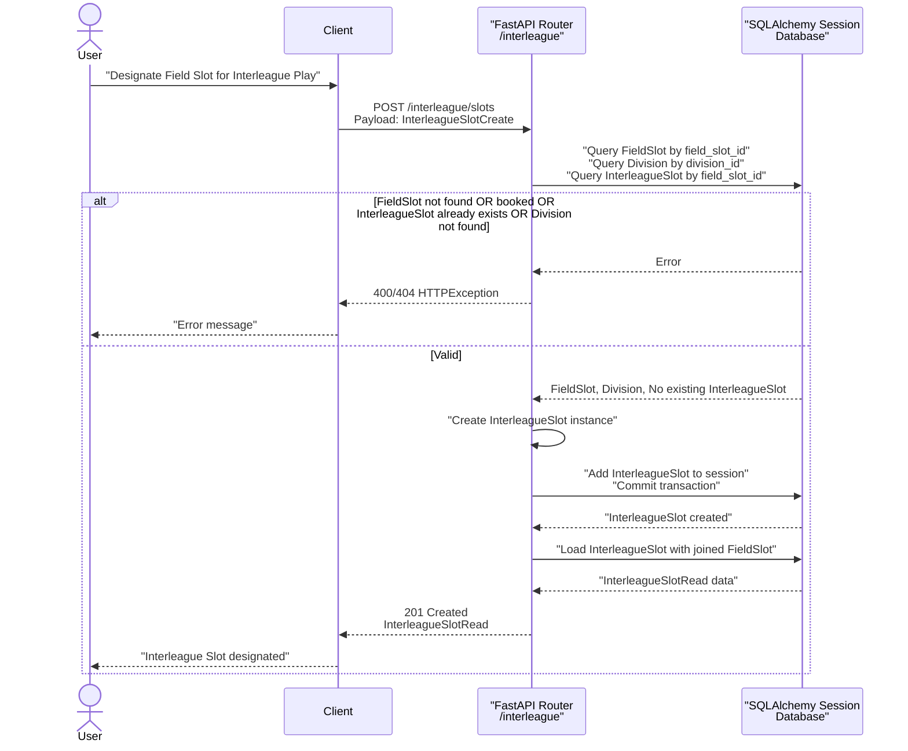
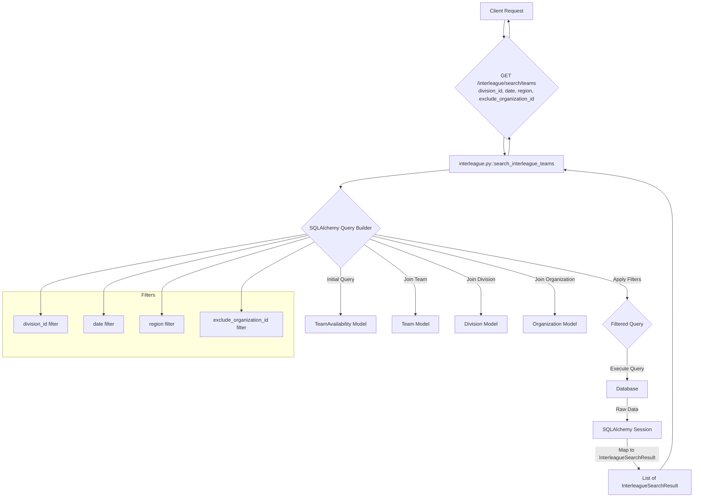

# Interleague API

Relevant source files

The following files were used as context for generating this wiki page:

- [interleague_scheduler/models/interleague_slot.py](interleague_scheduler/models/interleague_slot.py)
- [interleague_scheduler/models/team_availability.py](interleague_scheduler/models/team_availability.py)
- [interleague_scheduler/routers/interleague.py](interleague_scheduler/routers/interleague.py)
- [interleague_scheduler/schemas/interleague.py](interleague_scheduler/schemas/interleague.py)

The `/interleague` router [interleague_scheduler/routers/interleague.py:26-26]() provides endpoints for managing interleague play. This includes designating field slots for interleague games, allowing teams to declare their availability for interleague games, and a search endpoint for discovering available teams based on various criteria.

Sources:
[interleague_scheduler/routers/interleague.py:26-26]()

## Interleague Slots

Interleague slots are specific `FieldSlot` instances [interleague_scheduler/models/field_slot.py:10-24]() that have been designated for interleague play. This designation is managed by the `InterleagueSlot` model [interleague_scheduler/models/interleague_slot.py:9-24]().

### Create Interleague Slot

The `POST /interleague/slots` endpoint [interleague_scheduler/routers/interleague.py:31-58]() allows for the creation of a new `InterleagueSlot`.

**Request Body:** `InterleagueSlotCreate` [interleague_scheduler/schemas/interleague.py:8-11]()
- `field_slot_id`: The ID of the `FieldSlot` to designate.
- `division_id`: The ID of the `Division` that will host the interleague game.
- `notes`: Optional notes for the interleague slot.

**Validation:**
- The `field_slot_id` must correspond to an existing `FieldSlot` [interleague_scheduler/routers/interleague.py:37-39]().
- The designated `FieldSlot` must not already be booked (`is_booked` must be `False`) [interleague_scheduler/routers/interleague.py:40-42]().
- The `division_id` must correspond to an existing `Division` [interleague_scheduler/routers/interleague.py:43-45]().
- The `FieldSlot` must not already be designated as an `InterleagueSlot` [interleague_scheduler/routers/interleague.py:46-53]().

**Data Flow:**
1. A `POST` request is made to `/interleague/slots` with an `InterleagueSlotCreate` payload.
2. The `create_interleague_slot` function [interleague_scheduler/routers/interleague.py:31-58]() is invoked.
3. It performs validation checks against the `FieldSlot` and `Division` models.
4. A new `InterleagueSlot` object is created using the payload data [interleague_scheduler/routers/interleague.py:54-54]().
5. The new `InterleagueSlot` is added to the database [interleague_scheduler/routers/interleague.py:55-55]().
6. The `_load_interleague_slot` helper function [interleague_scheduler/routers/interleague.py:260-266]() is used to retrieve the newly created slot with its related `FieldSlot` data for the response.

#### Diagram: Create Interleague Slot

Sources:
[interleague_scheduler/models/field_slot.py:10-24]()
[interleague_scheduler/models/interleague_slot.py:9-24]()
[interleague_scheduler/routers/interleague.py:31-58]()
[interleague_scheduler/routers/interleague.py:37-39]()
[interleague_scheduler/routers/interleague.py:40-42]()
[interleague_scheduler/routers/interleague.py:43-45]()
[interleague_scheduler/routers/interleague.py:46-53]()
[interleague_scheduler/routers/interleague.py:54-54]()
[interleague_scheduler/routers/interleague.py:55-55]()
[interleague_scheduler/routers/interleague.py:260-266]()
[interleague_scheduler/schemas/interleague.py:8-11]()

### List Interleague Slots

The `GET /interleague/slots` endpoint [interleague_scheduler/routers/interleague.py:61-88]() retrieves a list of `InterleagueSlot` objects.

**Query Parameters:**
- `organization_id`: Filter by the organization owning the field slot.
- `division_id`: Filter by the division associated with the interleague slot.
- `date`: Filter by the date of the field slot.
- `available_only`: If `True`, only return slots that are not booked (`is_booked = False`).
- `skip`, `limit`: Pagination parameters.

**Implementation Details:**
The query uses `joinedload(InterleagueSlot.field_slot)` [interleague_scheduler/routers/interleague.py:71-71]() to efficiently fetch related `FieldSlot` data. Filters are applied conditionally based on the provided query parameters [interleague_scheduler/routers/interleague.py:72-87]().

Sources:
[interleague_scheduler/routers/interleague.py:61-88]()
[interleague_scheduler/routers/interleague.py:71-71]()
[interleague_scheduler/routers/interleague.py:72-87]()

### Get Interleague Slot by ID

The `GET /interleague/slots/{slot_id}` endpoint [interleague_scheduler/routers/interleague.py:91-96]() retrieves a single `InterleagueSlot` by its ID. It uses the `_load_interleague_slot` helper [interleague_scheduler/routers/interleague.py:93-93]() to fetch the slot with its associated `FieldSlot` data.

Sources:
[interleague_scheduler/routers/interleague.py:91-96]()
[interleague_scheduler/routers/interleague.py:93-93]()

### Update Interleague Slot

The `PATCH /interleague/slots/{slot_id}` endpoint [interleague_scheduler/routers/interleague.py:99-117]() allows for partial updates to an `InterleagueSlot`.

**Request Body:** `InterleagueSlotUpdate` [interleague_scheduler/schemas/interleague.py:14-16]()
- `division_id`: New division ID.
- `notes`: New notes.

**Validation:**
- If `division_id` is updated, it must correspond to an existing `Division` [interleague_scheduler/routers/interleague.py:111-113]().

Sources:
[interleague_scheduler/routers/interleague.py:99-117]()
[interleague_scheduler/routers/interleague.py:111-113]()
[interleague_scheduler/schemas/interleague.py:14-16]()

### Delete Interleague Slot

The `DELETE /interleague/slots/{slot_id}` endpoint [interleague_scheduler/routers/interleague.py:120-130]() removes an `InterleagueSlot` from the database.

Sources:
[interleague_scheduler/routers/interleague.py:120-130]()

## Team Availability

Teams can declare their availability for interleague games using the `TeamAvailability` model [interleague_scheduler/models/team_availability.py:9-21](). This allows other teams to discover them for potential matchups.

### Create Team Availability

The `POST /interleague/availability` endpoint [interleague_scheduler/routers/interleague.py:137-154]() allows a team to declare a new availability window.

**Request Body:** `TeamAvailabilityCreate` [interleague_scheduler/schemas/interleague.py:29-36]()
- `team_id`: The ID of the team declaring availability.
- `division_id`: The ID of the division the team belongs to.
- `date`: The date of availability.
- `start_time`: The start time of the availability window.
- `end_time`: The end time of the availability window.
- `notes`: Optional notes.

**Validation:**
- `team_id` must correspond to an existing `Team` [interleague_scheduler/routers/interleague.py:142-144]().
- `division_id` must correspond to an existing `Division` [interleague_scheduler/routers/interleague.py:145-147]().
- `start_time` must be before `end_time` [interleague_scheduler/routers/interleague.py:148-150]().

Sources:
[interleague_scheduler/models/team_availability.py:9-21]()
[interleague_scheduler/routers/interleague.py:137-154]()
[interleague_scheduler/routers/interleague.py:142-144]()
[interleague_scheduler/routers/interleague.py:145-147]()
[interleague_scheduler/routers/interleague.py:148-150]()
[interleague_scheduler/schemas/interleague.py:29-36]()

### List Team Availabilities

The `GET /interleague/availability` endpoint [interleague_scheduler/routers/interleague.py:157-177]() retrieves a list of `TeamAvailability` objects.

**Query Parameters:**
- `team_id`: Filter by a specific team.
- `organization_id`: Filter by the organization the team belongs to.
- `division_id`: Filter by the division the team belongs to.
- `date`: Filter by the date of availability.
- `skip`, `limit`: Pagination parameters.

Sources:
[interleague_scheduler/routers/interleague.py:157-177]()

### Get Team Availability by ID

The `GET /interleague/availability/{availability_id}` endpoint [interleague_scheduler/routers/interleague.py:180-185]() retrieves a single `TeamAvailability` by its ID.

Sources:
[interleague_scheduler/routers/interleague.py:180-185]()

### Update Team Availability

The `PATCH /interleague/availability/{availability_id}` endpoint [interleague_scheduler/routers/interleague.py:188-206]() allows for partial updates to a `TeamAvailability` record.

**Request Body:** `TeamAvailabilityUpdate` [interleague_scheduler/schemas/interleague.py:39-43]()
- `date`: New date.
- `start_time`: New start time.
- `end_time`: New end time.
- `notes`: New notes.

**Validation:**
- If `start_time` and `end_time` are both provided, `start_time` must be before `end_time` [interleague_scheduler/routers/interleague.py:198-200]().

Sources:
[interleague_scheduler/routers/interleague.py:188-206]()
[interleague_scheduler/routers/interleague.py:198-200]()
[interleague_scheduler/schemas/interleague.py:39-43]()

### Delete Team Availability

The `DELETE /interleague/availability/{availability_id}` endpoint [interleague_scheduler/routers/interleague.py:209-218]() removes a `TeamAvailability` record.

Sources:
[interleague_scheduler/routers/interleague.py:209-218]()

## Team Discovery Search

The `GET /interleague/search/teams` endpoint [interleague_scheduler/routers/interleague.py:221-257]() allows teams to discover other available teams for interleague play based on various filters.

**Query Parameters:**
- `division_id`: Filter by the division of the available team.
- `date`: Filter by the date of availability.
- `region`: Filter by the region of the available team's organization.
- `exclude_organization_id`: Exclude teams from a specific organization (typically the requesting team's organization).
- `skip`, `limit`: Pagination parameters.

**Implementation Details:**
This endpoint performs a complex query joining `TeamAvailability`, `Team`, `Division`, and `Organization` models [interleague_scheduler/routers/interleague.py:229-232](). It applies conditional filters for `division_id`, `date`, `region`, and `exclude_organization_id` [interleague_scheduler/routers/interleague.py:233-244](). The results are returned as a list of `InterleagueSearchResult` objects [interleague_scheduler/schemas/interleague.py:57-67](), which include details about the team, its organization, division, and the availability window.

#### Diagram: Team Discovery Search Data Flow

Sources:
[interleague_scheduler/routers/interleague.py:221-257]()
[interleague_scheduler/routers/interleague.py:229-232]()
[interleague_scheduler/routers/interleague.py:233-244]()
[interleague_scheduler/schemas/interleague.py:57-67]()
