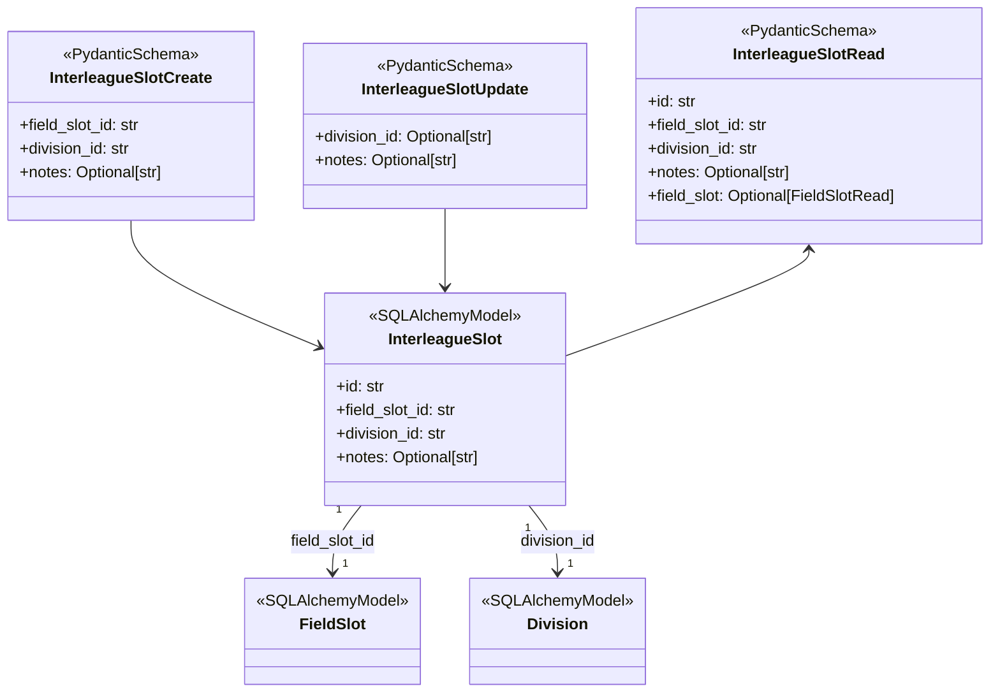
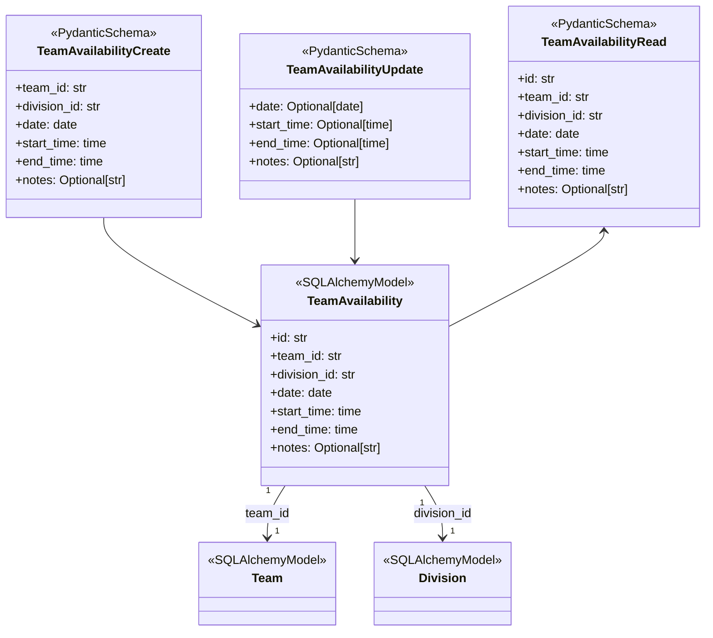

# 3.3 InterleagueSlot and TeamAvailability Models

Relevant source files

The following files were used as context for generating this wiki page:

- [interleague_scheduler/models/interleague_slot.py](interleague_scheduler/models/interleague_slot.py)
- [interleague_scheduler/models/team_availability.py](interleague_scheduler/models/team_availability.py)
- [interleague_scheduler/schemas/interleague.py](interleague_scheduler/schemas/interleague.py)

This section documents two specialized SQLAlchemy ORM models in the Interleague Scheduler backend: **InterleagueSlot** and **TeamAvailability**. These models support the interleague scheduling functionality by extending the base field slot concept and capturing team-declared availability windows for finding interleague game opportunities.

The models encapsulate the persistent data structures for interleague-designated time slots and team availability periods. Additionally, we describe the accompanying Pydantic schemas that define the API data interchange format and validation for CRUD operations on these models.

---

## InterleagueSlot Model

### Purpose and Domain Role

The `InterleagueSlot` model is a **one-to-one extension of the `FieldSlot` model** that designates certain field slots as available for interleague play. This enables the system to identify and manage time windows explicitly reserved for interleague games within a given division.

### Database Table and Columns

| Column        | Type       | Description                                                  |
|---------------|------------|--------------------------------------------------------------|
| `id`          | `String`   | Primary key, UUID string uniquely identifying the record.    |
| `field_slot_id`| `String`  | Foreign key to the `field_slots.id` column, one-to-one, non-nullable, unique. Links to the base slot that is designated for interleague. |
| `division_id` | `String`   | Foreign key to `divisions.id`, non-nullable. The division that this interleague slot belongs to. |
| `notes`       | `Text`     | Optional free-text field for any additional annotations.    |

### Relationships

- **field_slot**: SQLAlchemy relationship to the associated `FieldSlot` record with back-population (`FieldSlot.interleague_slot`).
- **division**: Relationship to the `Division` entity to associate the slot with its division context.

This structure ensures an interleague slot is always tightly coupled one-to-one with an existing field slot, enforcing data integrity through foreign key constraints and uniqueness on `field_slot_id`.

### Data Flow and Usage

- Interleague slots are created by designating an existing free `FieldSlot` as available for interleague competition.
- Each interleague slot belongs to a specific division, which facilitates filtering and matchmaking during interleague play scheduling.
- Optional notes may include relevant comments or constraints attached to this slot.

---

## TeamAvailability Model

### Purpose and Domain Role

The `TeamAvailability` model captures **periods of time declared by teams during which they seek interleague games**. These availability windows include date and time boundaries and are scoped to divisions.

### Database Table and Columns

| Column        | Type       | Description                                                  |
|---------------|------------|--------------------------------------------------------------|
| `id`          | `String`   | Primary key, UUID string uniquely identifying the record.    |
| `team_id`     | `String`   | Foreign key to `teams.id`, non-nullable.                      |
| `division_id` | `String`   | Foreign key to `divisions.id`, non-nullable.                  |
| `date`        | `Date`     | The date for which the availability applies.                  |
| `start_time`  | `Time`     | Beginning of the available time window on that date.          |
| `end_time`    | `Time`     | End of the available time window on that date.                |
| `notes`       | `Text`     | Optional descriptive notes or constraints provided by the team. |

### Relationships

- **team**: Relationship to the `Team` model with back-population (`Team.availabilities`), allowing convenient access to all declared availability windows per team.
- **division**: Relationship to the `Division` entity to ensure availability is scoped correctly within a division.

### Data Flow and Usage

- Teams use this model to self-declare when they are available for interleague matches.
- Availability records cover a single date and a time range, supporting precise matching of time windows.
- These availabilities are used during interleague team search and scheduling to find mutually compatible teams.

---

## Pydantic Schemas for API Validation and Serialization

The models are paired with Pydantic schema classes under `interleague_scheduler/schemas/interleague.py` to define the input and output data structure and validation for the API endpoints.

### InterleagueSlot Schemas

| Schema                  | Usage                            | Fields                                            |
|-------------------------|---------------------------------|--------------------------------------------------|
| `InterleagueSlotCreate` | POST /interleague/slots creation| `field_slot_id`, `division_id`, optional `notes`|
| `InterleagueSlotUpdate` | PATCH updates                   | optional `division_id`, optional `notes`         |
| `InterleagueSlotRead`   | GET responses                   | All fields including nested `field_slot` details |

The `InterleagueSlotRead` schema supports nested inclusion of the associated `FieldSlot` via the `field_slot: FieldSlotRead | None` attribute, facilitating rich frontend display.

### TeamAvailability Schemas

| Schema                  | Usage                            | Fields                                            |
|-------------------------|---------------------------------|--------------------------------------------------|
| `TeamAvailabilityCreate`| POST creation                   | `team_id`, `division_id`, `date`, `start_time`, `end_time`, optional `notes` |
| `TeamAvailabilityUpdate`| PATCH updates                  | optional `date`, `start_time`, `end_time`, optional `notes` |
| `TeamAvailabilityRead`  | GET responses                   | Full fields corresponding to the model           |

### Additional Search Result Schema

- `InterleagueSearchResult` provides the shape of team search results when querying for interleague availability matches, including team and organization info and availability window details.

---

## Class and Schema Code Entity Overview with Mermaid Diagrams

The diagrams below associate domain concepts ("Interleague Slot" and "Team Availability") with their corresponding code entities (ORM classes and Pydantic schemas), illustrating core relationships.

### InterleagueSlot Domain to Code Entities

### TeamAvailability Domain to Code Entities

---

## Summary Table of Model Attributes and Relationships

| Model            | Key Columns & Constraints                         | Relationships                  | Purpose                                     |
|------------------|--------------------------------------------------|-------------------------------|---------------------------------------------|
| InterleagueSlot  | `id`, `field_slot_id` (1:1 FK unique), `division_id`, `notes` | `field_slot`, `division`      | Marks a FieldSlot for interleague division-specific play |
| TeamAvailability | `id`, `team_id`, `division_id`, `date`, `start_time`, `end_time`, `notes` | `team`, `division`            | Declares team time windows for seeking interleague games |

---

## References and Source Files

- `InterleagueSlot` ORM model: [`interleague_scheduler/models/interleague_slot.py:9-25`]().
- `TeamAvailability` ORM model: [`interleague_scheduler/models/team_availability.py:9-23`]().
- Pydantic Schemas: [`interleague_scheduler/schemas/interleague.py:8-67`]().

These sources provide the definitive code implementation and schema definition for Interleague Slot designation and Team Availability declaration.

---

This detailed documentation explains the data design and API schema for managing interleague-specific scheduling slots and team availability, completing their integral role in the Interleague Scheduler backend domain model.
