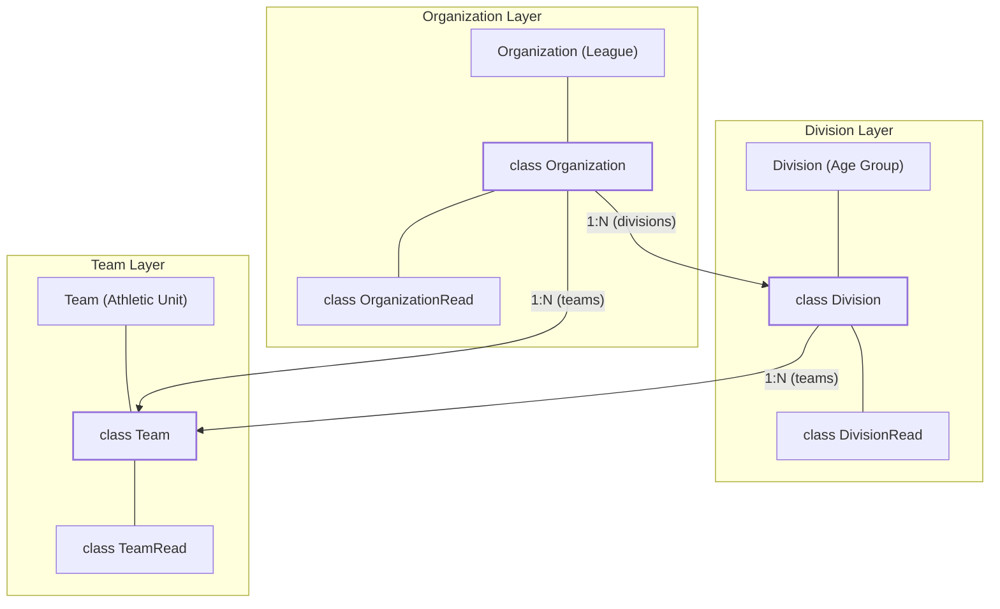
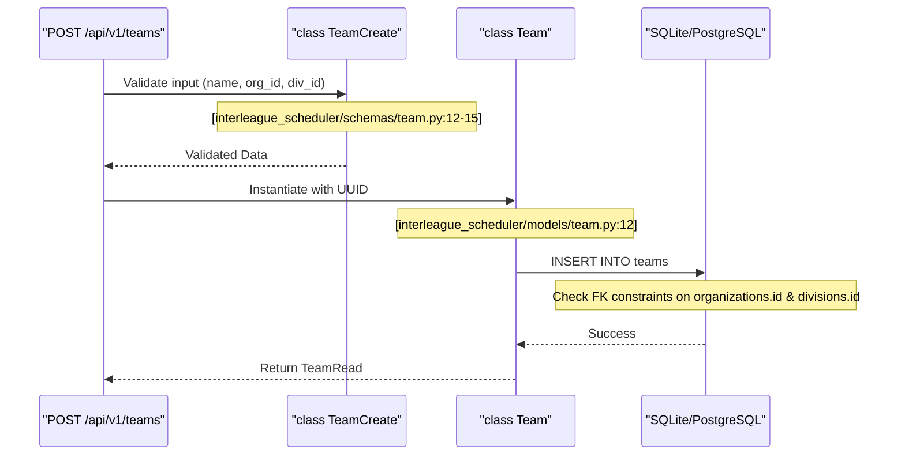

# Organization, Division, and Team Models

Relevant source files

The following files were used as context for generating this wiki page:

- [interleague_scheduler/models/division.py](interleague_scheduler/models/division.py)
- [interleague_scheduler/models/field.py](interleague_scheduler/models/field.py)
- [interleague_scheduler/models/organization.py](interleague_scheduler/models/organization.py)
- [interleague_scheduler/models/team.py](interleague_scheduler/models/team.py)
- [interleague_scheduler/schemas/division.py](interleague_scheduler/schemas/division.py)
- [interleague_scheduler/schemas/organization.py](interleague_scheduler/schemas/organization.py)
- [interleague_scheduler/schemas/team.py](interleague_scheduler/schemas/team.py)

This section documents the core SQLAlchemy models that define the organizational hierarchy of the Interleague Scheduler. The system follows a strict tree structure where an `Organization` acts as the root container for `Divisions`, `Teams`, and `Fields`.

## Hierarchy Overview

The organizational structure is designed to support multi-tenant data isolation and complex scheduling relationships. An `Organization` (e.g., a local Little League) manages multiple `Divisions` (e.g., "Majors", "Minors"), which in turn contain `Teams`.

### Organizational Entity Relationship
The following diagram illustrates the relationship between the core models and their Pydantic schema counterparts.

**Entity Mapping: Natural Language to Code Space**

Sources: [interleague_scheduler/models/organization.py:9-25](), [interleague_scheduler/models/division.py:9-23](), [interleague_scheduler/models/team.py:9-30](), [interleague_scheduler/schemas/organization.py:26-30](), [interleague_scheduler/schemas/division.py:22-27](), [interleague_scheduler/schemas/team.py:26-32]()

---

## Organization Model

The `Organization` class is the top-level entity. It stores contact information and regional data used for interleague discovery.

| Column | Type | Description |
| :--- | :--- | :--- |
| `id` | `String(36)` | Primary Key (UUID v4) [interleague_scheduler/models/organization.py:12]() |
| `name` | `String(255)` | Official name of the league/organization [interleague_scheduler/models/organization.py:13]() |
| `region` | `String(255)` | Geographic area for interleague matching [interleague_scheduler/models/organization.py:14]() |
| `contact_name` | `String(255)` | Primary administrator name [interleague_scheduler/models/organization.py:15]() |

### Relationships and Cascades
*   **`divisions`**: One-to-many relationship with `Division`. Uses `cascade="all, delete-orphan"`, meaning deleting an organization removes all its divisions [interleague_scheduler/models/organization.py:20-22]().
*   **`teams`**: One-to-many relationship with `Team`. Uses `cascade="all, delete-orphan"` [interleague_scheduler/models/organization.py:23]().
*   **`fields`**: One-to-many relationship with `Field`. Uses `cascade="all, delete-orphan"` [interleague_scheduler/models/organization.py:24]().

Sources: [interleague_scheduler/models/organization.py:9-25]()

---

## Division Model

The `Division` class categorizes teams within an organization, typically by age or skill level.

| Column | Type | Description |
| :--- | :--- | :--- |
| `id` | `String(36)` | Primary Key (UUID v4) [interleague_scheduler/models/division.py:12]() |
| `name` | `String(255)` | Name (e.g., "U12", "Varsity") [interleague_scheduler/models/division.py:13]() |
| `age_group` | `String(100)` | Target age range [interleague_scheduler/models/division.py:14]() |
| `organization_id` | `String(36)` | Foreign Key to `organizations.id` [interleague_scheduler/models/division.py:17-19]() |

### Constraints
The `organization_id` foreign key is configured with `ondelete="CASCADE"`, ensuring that database-level deletions propagate from the organization to the division [interleague_scheduler/models/division.py:18]().

Sources: [interleague_scheduler/models/division.py:9-23]()

---

## Team Model

The `Team` class represents the actual athletic units. It is uniquely tied to both an `Organization` and a `Division`.

| Column | Type | Description |
| :--- | :--- | :--- |
| `id` | `String(36)` | Primary Key (UUID v4) [interleague_scheduler/models/team.py:12]() |
| `name` | `String(255)` | Team name [interleague_scheduler/models/team.py:13]() |
| `organization_id` | `String(36)` | FK to `organizations.id` [interleague_scheduler/models/team.py:18-20]() |
| `division_id` | `String(36)` | FK to `divisions.id` [interleague_scheduler/models/team.py:21]() |

### Game and Availability Integration
The `Team` model serves as a hub for scheduling:
*   **`home_games` / `away_games`**: Relationships to the `Game` model using specific foreign keys `Game.home_team_id` and `Game.away_team_id` [interleague_scheduler/models/team.py:25-26]().
*   **`availabilities`**: Tracks `TeamAvailability` records for interleague slot matching [interleague_scheduler/models/team.py:27-29]().

Sources: [interleague_scheduler/models/team.py:9-30]()

---

## Data Flow and Persistence

The following diagram demonstrates how a request to create a `Team` flows through the system, interacting with the models and their relationships.

**Creation Flow: Team Entity**

### Cascade Delete Logic
The system enforces strict referential integrity. Because `Team` belongs to both an `Organization` and a `Division`, deleting either parent entity will trigger a cascade delete of the `Team` record [interleague_scheduler/models/team.py:19-21]().

Sources: [interleague_scheduler/models/team.py:1-30](), [interleague_scheduler/schemas/team.py:1-32]()
