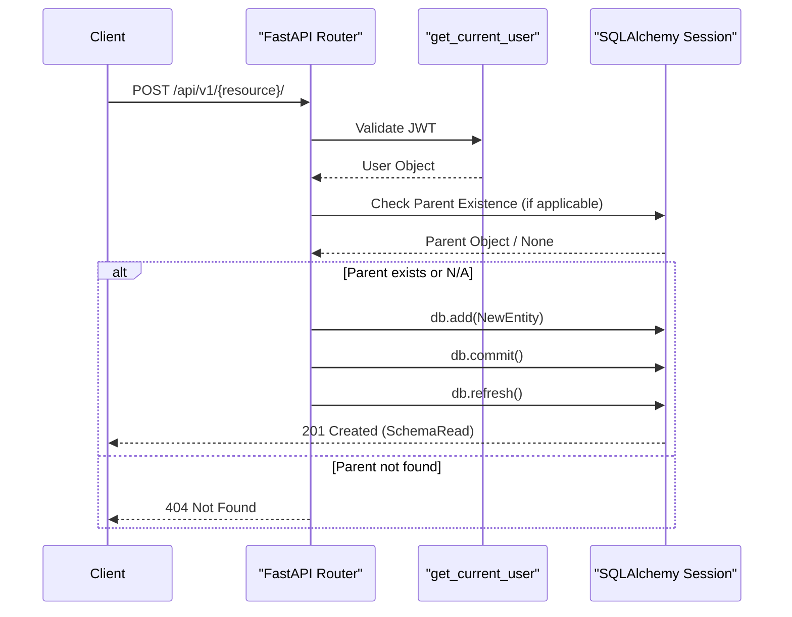
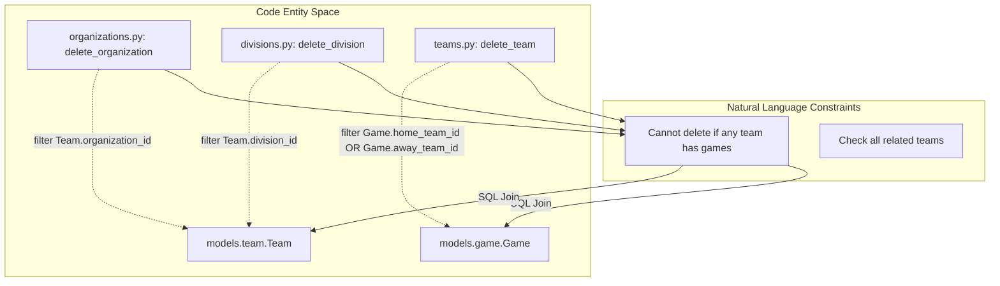

# Organizations, Divisions, and Teams API

Relevant source files

The following files were used as context for generating this wiki page:

- [interleague_scheduler/routers/divisions.py](interleague_scheduler/routers/divisions.py)
- [interleague_scheduler/routers/organizations.py](interleague_scheduler/routers/organizations.py)
- [interleague_scheduler/routers/teams.py](interleague_scheduler/routers/teams.py)

This page documents the REST API endpoints for managing the core organizational hierarchy of the Interleague Scheduler. These routers handle the lifecycle of `Organization`, `Division`, and `Team` entities, including complex referential integrity checks during deletion to ensure data consistency across the scheduling system.

## API Overview and Hierarchy

The API follows a strict hierarchical structure where Organizations own Divisions, and both Organizations and Divisions are linked to Teams. All write operations (POST, PATCH, DELETE) require a valid JWT token provided via the `get_current_user` dependency [interleague_scheduler/auth.py:28-48]().

### Data Flow: Entity Creation
The following diagram illustrates the flow from a request to the creation of a new organizational entity.

**Entity Creation Sequence**

**Sources:** [interleague_scheduler/routers/organizations.py:19-29](), [interleague_scheduler/routers/divisions.py:16-29](), [interleague_scheduler/routers/teams.py:16-32]()

---

## Organizations Router (`/organizations`)

The `Organization` is the top-level entity. It defines a `region` which is used for interleague discovery.

### Endpoints
| Method | Path | Description | Filters |
| :--- | :--- | :--- | :--- |
| `GET` | `/` | List all organizations | `region` (case-insensitive search) |
| `POST` | `/` | Create a new organization | N/A |
| `GET` | `/{id}` | Get specific organization | N/A |
| `PATCH` | `/{id}` | Update organization details | N/A |
| `DELETE` | `/{id}` | Remove an organization | N/A |

### Implementation Details
*   **Filtering:** The `list_organizations` function uses the `ilike` operator to perform partial matches on the `region` field [interleague_scheduler/routers/organizations.py:40-41]().
*   **Deletion Safety:** Before deleting, the system checks if any `Team` belonging to the organization is involved in a `Game`. If a game exists, it returns a `409 Conflict` [interleague_scheduler/routers/organizations.py:79-89]().

**Sources:** [interleague_scheduler/routers/organizations.py:1-92]()

---

## Divisions Router (`/divisions`)

Divisions categorize teams within an organization (e.g., "U10", "Varsity").

### Endpoints
| Method | Path | Description | Filters |
| :--- | :--- | :--- | :--- |
| `GET` | `/` | List all divisions | `organization_id` |
| `POST` | `/` | Create a division | N/A |
| `GET` | `/{id}` | Get specific division | N/A |
| `PATCH` | `/{id}` | Update division details | N/A |
| `DELETE` | `/{id}` | Remove a division | N/A |

### Implementation Details
*   **Parent Validation:** `create_division` verifies that the `organization_id` provided in the `DivisionCreate` payload exists in the database [interleague_scheduler/routers/divisions.py:22-24]().
*   **Deletion Safety:** The system performs a join query between `Game` and `Team` to ensure no teams within the target division have scheduled games [interleague_scheduler/routers/divisions.py:79-89]().

**Sources:** [interleague_scheduler/routers/divisions.py:1-92]()

---

## Teams Router (`/teams`)

Teams are the leaf nodes of the organizational structure and are the primary participants in games.

### Endpoints
| Method | Path | Description | Filters |
| :--- | :--- | :--- | :--- |
| `GET` | `/` | List all teams | `organization_id`, `division_id` |
| `POST` | `/` | Create a team | N/A |
| `GET` | `/{id}` | Get specific team | N/A |
| `PATCH` | `/{id}` | Update team (name, division) | N/A |
| `DELETE` | `/{id}` | Remove a team | N/A |

### Implementation Details
*   **Filtering:** `list_teams` allows simultaneous filtering by both `organization_id` and `division_id` [interleague_scheduler/routers/teams.py:44-47]().
*   **Integrity Checks:** `update_team` validates that the new `division_id` exists if it is being changed [interleague_scheduler/routers/teams.py:70-73]().
*   **Deletion Safety:** `delete_team` checks both `home_team_id` and `away_team_id` columns in the `Game` table for the specific `team_id` [interleague_scheduler/routers/teams.py:90-99]().

**Sources:** [interleague_scheduler/routers/teams.py:1-102]()

---

## Deletion Safety Logic

A critical feature across these routers is the prevention of "orphaned" games. The system enforces referential integrity at the application level before attempting database deletion.

**Deletion Constraint Mapping**

### Summary of Safety Checks
| Entity | Deletion Logic | Code Reference |
| :--- | :--- | :--- |
| **Organization** | Joins `Game` to `Team` where `Team.organization_id == id`. | [interleague_scheduler/routers/organizations.py:79-84]() |
| **Division** | Joins `Game` to `Team` where `Team.division_id == id`. | [interleague_scheduler/routers/divisions.py:79-84]() |
| **Team** | Filters `Game` where `home_team_id == id` OR `away_team_id == id`. | [interleague_scheduler/routers/teams.py:90-94]() |

**Sources:** [interleague_scheduler/routers/organizations.py:79-89](), [interleague_scheduler/routers/divisions.py:79-89](), [interleague_scheduler/routers/teams.py:90-99]()
