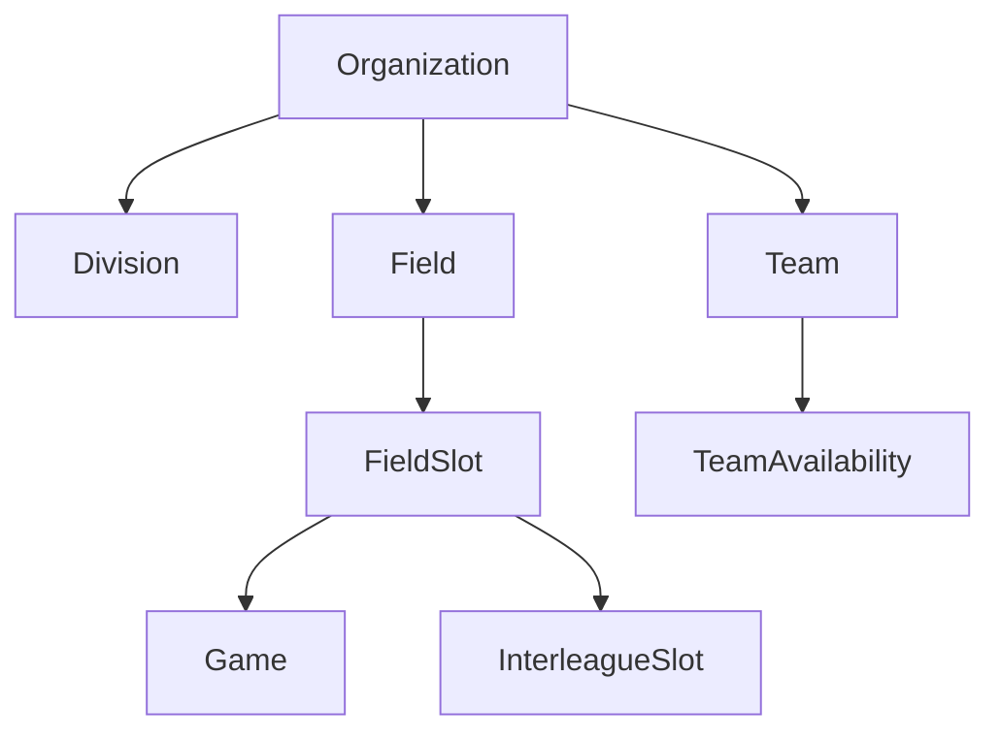
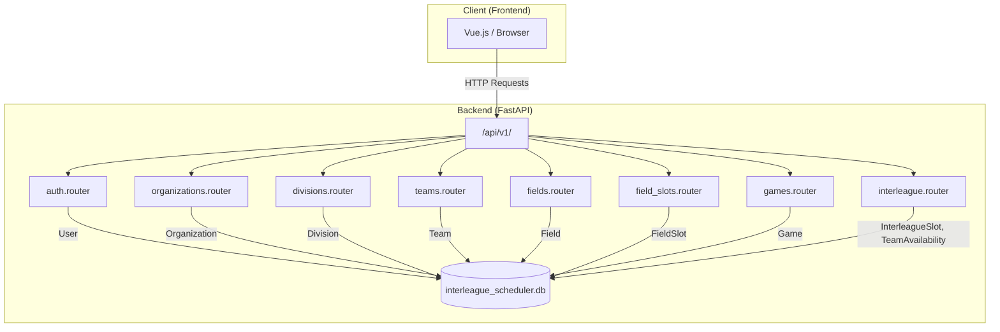

# Overview

Relevant source files

The following files were used as context for generating this wiki page:

- [README.md](README.md)
- [interleague_scheduler/__init__.py](interleague_scheduler/__init__.py)
- [interleague_scheduler/main.py](interleague_scheduler/main.py)
- [pyproject.toml](pyproject.toml)

The Interleague Scheduler is a web application designed to facilitate the coordination and scheduling of youth sports games, particularly focusing on interleague play between different organizations. It provides a robust backend API for managing organizations, divisions, teams, fields, and game schedules, along with features for designating interleague slots and managing team availability.

This page provides a high-level introduction to the system, its core functionalities, the technologies it employs, and how its various components fit together. For detailed setup instructions and in-depth architectural descriptions, please refer to the linked child pages.

## What it Does

The Interleague Scheduler addresses the complex task of managing sports leagues by offering features such as:
*   **Organization Management**: Create and manage youth sports organizations [README.md:7-7]().
*   **Division Management**: Define divisions of play (e.g., age groups, skill levels) [README.md:8-8]().
*   **Team Management**: Register teams within organizations and divisions [README.md:9-9]().
*   **Field Management**: Define athletic fields belonging to organizations [README.md:10-10]().
*   **Field Time-Slot Management**: Set available date/time windows for each field [README.md:11-11]().
*   **Game Scheduling**: Schedule intra-league games between teams on available field slots [README.md:12-12]().
*   **Interleague Slot Designation**: Mark field time slots as open for interleague play, specifying the target division [README.md:13-13]().
*   **Team Availability**: Teams can declare availability for interleague games at other locations [README.md:14-14]().
*   **Interleague Search**: Find available teams from other local organizations by division, date, and region [README.md:15-15]().

Sources: [README.md:7-15]()

## Technology Stack

The Interleague Scheduler is built with a modern Python-based backend and a JavaScript frontend.

### Backend
The backend is developed using Python 3.11+ [README.md:21]() and leverages the following key technologies:
*   **Framework**: FastAPI [README.md:21]() for building the API.
*   **ORM**: SQLAlchemy 2.x [README.md:21]() for database interactions.
*   **Database**: SQLite (default, swappable via environment variable `ILS_DATABASE_URL`) [README.md:21]().
*   **Validation**: Pydantic v2 [README.md:21]() for data validation and settings management.
*   **Server**: Uvicorn [README.md:21]() for serving the FastAPI application.
*   **Authentication**: `python-jose` for JWT handling and `passlib[bcrypt]` for password hashing [pyproject.toml:16-17]().

Sources: [pyproject.toml:10-20](), [README.md:21]()

### Frontend
While not explicitly detailed in the provided backend files, the project structure implies a frontend application that interacts with this API. Common choices for such a frontend would include Vue.js, React, or Angular.

Sources: [README.md:1-2]()

## Key Domain Concepts

The application revolves around several core entities that represent the real-world components of youth sports scheduling. These entities are modeled in the database and exposed through the API.

### Entity Hierarchy
The system organizes data in a hierarchical manner:

Title: Core Entity Relationships

*   **Organization**: The top-level entity, representing a sports organization.
*   **Division**: A subdivision within an Organization, typically defining age groups or skill levels.
*   **Team**: A specific team belonging to an Organization and participating in a Division.
*   **Field**: A physical location where games are played, owned by an Organization.
*   **FieldSlot**: A specific date and time window on a Field, which can be booked for a Game or designated as an InterleagueSlot.
*   **Game**: A scheduled match between two Teams, occupying a FieldSlot.
*   **InterleagueSlot**: A FieldSlot specifically designated for interleague play, allowing teams from other organizations to book it.
*   **TeamAvailability**: A declaration by a Team of when they are available to play interleague games.

Sources: [interleague_scheduler/main.py:6-14]()

## System Architecture

The Interleague Scheduler follows a client-server architecture, with a FastAPI backend providing a RESTful API and a separate frontend application consuming it.

### Backend Structure
The backend is a FastAPI application [interleague_scheduler/main.py:29]() that defines various API routes. It uses SQLAlchemy for ORM and database management [interleague_scheduler/main.py:4](). The application's entry point is `interleague_scheduler.main:app` [README.md:39]().

Title: High-Level System Architecture

All API endpoints are prefixed with `/api/v1` [interleague_scheduler/main.py:31-38](). The backend handles data persistence, business logic, and authentication.

Sources: [interleague_scheduler/main.py:29-38](), [README.md:55]()

### Frontend-Backend Interaction
The frontend application communicates with the backend API using standard HTTP requests. The backend exposes a comprehensive set of endpoints for managing all domain entities, as outlined in the API Overview section of the `README.md` [README.md:53-125]().

For details on setting up the development environment and running both the backend and frontend, see [Getting Started](#1.1). For a deeper dive into the backend's structure and components, refer to [Architecture Overview](#1.2).
