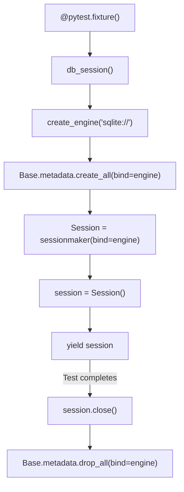
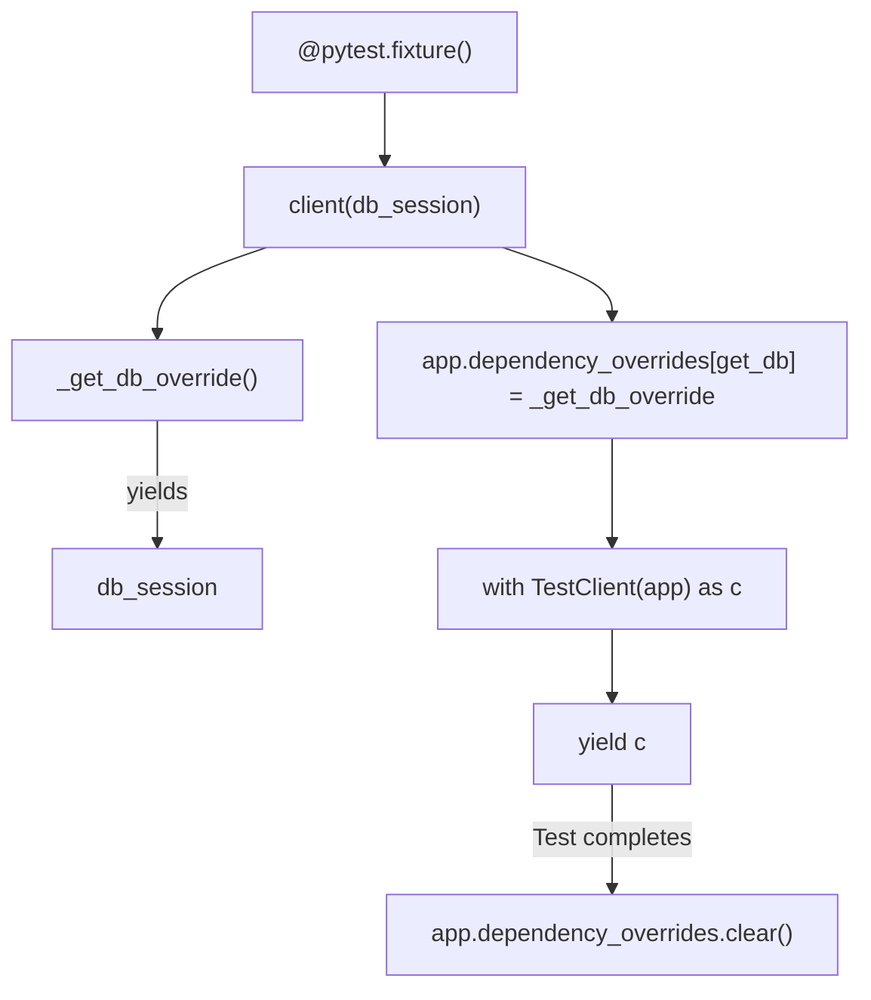
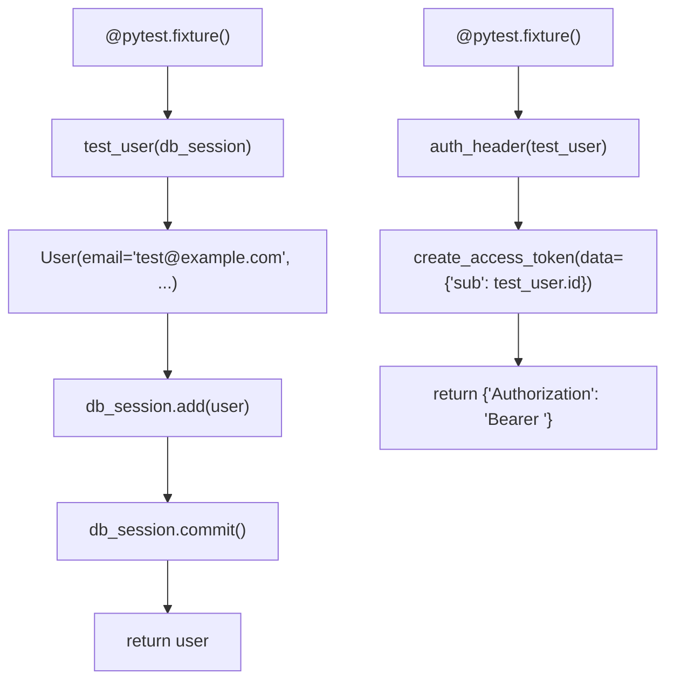
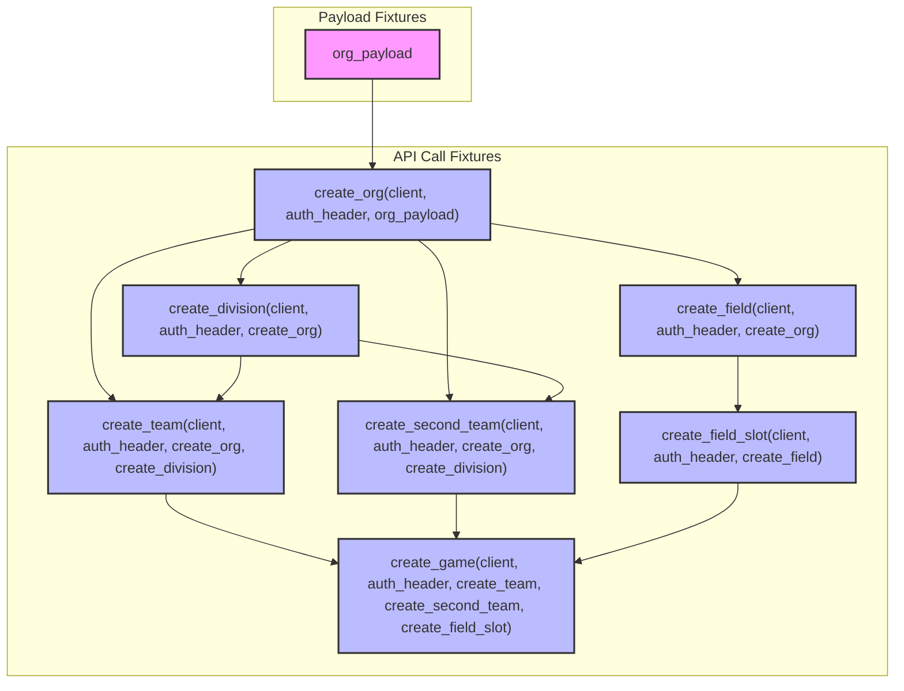

# 6.1. Test Fixtures and Configuration

Relevant source files

The following files were used as context for generating this wiki page:

- [interleague_scheduler/database.py](interleague_scheduler/database.py)
- [tests/conftest.py](tests/conftest.py)

This page details the testing infrastructure provided by `pytest` fixtures in `tests/conftest.py` [tests/conftest.py:1-153](). These fixtures establish a clean, isolated environment for each test, including an in-memory SQLite database, a `TestClient` for API interaction, and a chain of dependent fixtures that create common entities (organizations, divisions, teams, fields, field slots, and games) to simplify test setup.

## Database Session Fixture

The `db_session` fixture [tests/conftest.py:13-28]() is responsible for setting up and tearing down an in-memory SQLite database for each test. This ensures that tests are isolated and do not interfere with each other's data.

The fixture performs the following steps:
1.  **Engine Creation**: An `in-memory SQLite engine` is created using `create_engine("sqlite://", ...)`. The `connect_args={"check_same_thread": False}` is necessary for SQLite when used with multiple threads, and `poolclass=StaticPool` ensures that the same connection is used throughout the test session.
2.  **Schema Creation**: `Base.metadata.create_all(bind=engine)` creates all defined database tables based on the SQLAlchemy `Base` metadata.
3.  **Session Management**: A `sessionmaker` is used to create a `Session` instance. This session is yielded to the test function.
4.  **Cleanup**: In the `finally` block, `session.close()` releases the database connection, and `Base.metadata.drop_all(bind=engine)` removes all tables, ensuring a clean slate for the next test.

**Figure 1: `db_session` Fixture Flow**

Sources:
- `tests/conftest.py:13-28`
- `interleague_scheduler/database.py:14`

## TestClient and Dependency Overrides

The `client` fixture [tests/conftest.py:31-42]() provides a `FastAPI TestClient` instance, which allows making requests to the application directly without running a live server. Crucially, it overrides the application's `get_db` dependency to use the `db_session` fixture's in-memory database.

1.  **`_get_db_override`**: This inner function is defined to mimic the signature of the application's `get_db` dependency [interleague_scheduler/database.py:17-22](). It yields the `db_session` fixture, ensuring that all API calls made through the `TestClient` use the test-specific database.
2.  **Dependency Override**: `app.dependency_overrides[get_db] = _get_db_override` replaces the default `get_db` dependency with the test version.
3.  **`TestClient`**: A `TestClient(app)` is created and yielded.
4.  **Cleanup**: After the test, `app.dependency_overrides.clear()` restores the original dependencies.

**Figure 2: `client` Fixture and Dependency Override**

Sources:
- `tests/conftest.py:31-42`
- `interleague_scheduler/database.py:17-22`

## Authentication Fixtures

Two fixtures facilitate authenticated API requests:

*   **`test_user`**: This fixture [tests/conftest.py:45-55]() creates a `User` object directly in the `db_session`. It hashes a default password using `hash_password` [interleague_scheduler/auth.py:7]() and adds the user to the database. This user is then returned for use in other fixtures.
*   **`auth_header`**: This fixture [tests/conftest.py:58-61]() depends on `test_user`. It generates a JWT access token for the `test_user` using `create_access_token` [interleague_scheduler/auth.py:7]() and formats it into an `Authorization` header suitable for API requests.

**Figure 3: Authentication Fixtures**

Sources:
- `tests/conftest.py:45-55`
- `tests/conftest.py:58-61`
- `interleague_scheduler/auth.py:7`

## Entity Creation Fixtures

A chain of fixtures is provided to create common domain entities, simplifying the setup for tests that require pre-existing data. These fixtures make actual API calls using the `client` and `auth_header` fixtures, ensuring that the creation logic is tested as well.

*   **`org_payload`**: A simple dictionary fixture [tests/conftest.py:65-71]() providing the JSON payload for creating an organization.
*   **`create_org`**: Creates an organization by making a `POST` request to `/api/v1/organizations/` [tests/conftest.py:74-78](). It depends on `client`, `auth_header`, and `org_payload`.
*   **`create_division`**: Creates a division within the `create_org` [tests/conftest.py:81-90](). It depends on `client`, `auth_header`, and `create_org`.
*   **`create_team`**: Creates a team within the `create_org` and `create_division` [tests/conftest.py:93-102](). It depends on `client`, `auth_header`, `create_org`, and `create_division`.
*   **`create_second_team`**: Creates another team, useful for tests involving two teams (e.g., games) [tests/conftest.py:105-114]().
*   **`create_field`**: Creates a field associated with `create_org` [tests/conftest.py:117-126](). It depends on `client`, `auth_header`, and `create_org`.
*   **`create_field_slot`**: Creates a field slot for `create_field` [tests/conftest.py:129-139](). It depends on `client`, `auth_header`, and `create_field`.
*   **`create_game`**: Creates a game between `create_team` and `create_second_team` using `create_field_slot` [tests/conftest.py:142-151](). It depends on `client`, `auth_header`, `create_team`, `create_second_team`, and `create_field_slot`.

**Figure 4: Entity Creation Fixture Chain**

Sources:
- `tests/conftest.py:65-71`
- `tests/conftest.py:74-78`
- `tests/conftest.py:81-90`
- `tests/conftest.py:93-102`
- `tests/conftest.py:105-114`
- `tests/conftest.py:117-126`
- `tests/conftest.py:129-139`
- `tests/conftest.py:142-151`
