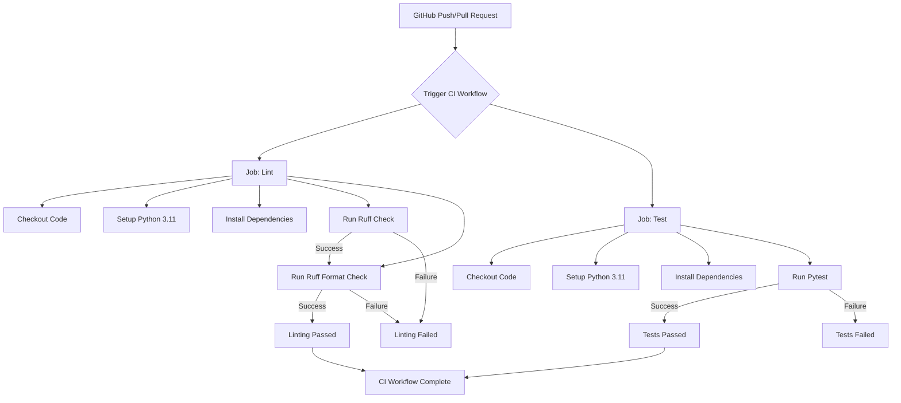

# Test Modules and CI Pipeline

Relevant source files

The following files were used as context for generating this wiki page:

- [.github/workflows/ci.yml](.github/workflows/ci.yml)
- [interleague_scheduler/auth.py](interleague_scheduler/auth.py)
- [tests/test_auth.py](tests/test_auth.py)
- [tests/test_divisions.py](tests/test_divisions.py)
- [tests/test_field_slots.py](tests/test_field_slots.py)
- [tests/test_fields.py](tests/test_fields.py)
- [tests/test_games.py](tests/test_games.py)
- [tests/test_health.py](tests/test_health.py)
- [tests/test_interleague.py](tests/test_interleague.py)
- [tests/test_organizations.py](tests/test_organizations.py)
- [tests/test_teams.py](tests/test_teams.py)

This page details the individual test modules within the Interleague Scheduler backend and describes the GitHub Actions Continuous Integration (CI) pipeline that automates testing and linting. The test suite uses `pytest` and `pytest-asyncio` to ensure the robustness and correctness of the API endpoints and business logic.

## Test Modules

The `tests/` directory contains several test modules, each focusing on a specific part of the API. These modules leverage a comprehensive set of fixtures defined in `conftest.py` to set up a consistent testing environment, including an in-memory SQLite database and authenticated client instances.

### `test_auth.py`

This module tests the authentication-related endpoints and utilities. It covers user registration, local login, and the `/auth/me` endpoint which retrieves the current authenticated user's details. It also includes tests for error conditions such as duplicate email registration, incorrect passwords, and invalid tokens.

Key functions tested:
*   `test_register(client)`: Verifies successful user registration [tests/test_auth.py:1-13]().
*   `test_register_duplicate_email(client, test_user)`: Checks for 409 conflict on duplicate email [tests/test_auth.py:15-21]().
*   `test_login(client, test_user)`: Asserts successful login and token generation [tests/test_auth.py:24-31]().
*   `test_me(client, test_user, auth_header)`: Confirms retrieval of current user details with a valid token [tests/test_auth.py:50-55]().

Sources:
*   [tests/test_auth.py:1-70]()
*   [interleague_scheduler/auth.py:1-67]()

### `test_organizations.py`

This module focuses on the CRUD operations for `Organization` entities. It tests the creation, listing, retrieval, updating, and deletion of organizations, including authorization checks and referential integrity constraints.

Key functions tested:
*   `test_create_organization(client, auth_header, org_payload)`: Verifies organization creation [tests/test_organizations.py:1-7]().
*   `test_list_organizations(client, create_org)`: Checks listing of organizations [tests/test_organizations.py:15-21]().
*   `test_get_organization(client, create_org)`: Tests retrieval of a single organization [tests/test_organizations.py:33-37]().
*   `test_update_organization(client, auth_header, create_org)`: Asserts successful update of an organization [tests/test_organizations.py:44-52]().
*   `test_delete_organization(client, auth_header, create_org)`: Confirms deletion of an organization [tests/test_organizations.py:62-68]().
*   `test_delete_organization_with_games(client, auth_header, create_game, create_org)`: Ensures deletion fails if an organization has associated games [tests/test_organizations.py:75-77]().

Sources:
*   [tests/test_organizations.py:1-78]()

### `test_divisions.py`

This module tests the API endpoints for `Division` entities, covering creation, listing, retrieval, updating, and deletion. It also verifies authorization and checks for cases where divisions cannot be deleted due to existing games.

Key functions tested:
*   `test_create_division(client, auth_header, create_org)`: Verifies division creation [tests/test_divisions.py:1-12]().
*   `test_list_divisions(client, create_division)`: Checks listing of divisions [tests/test_divisions.py:26-29]().
*   `test_get_division(client, create_division)`: Tests retrieval of a single division [tests/test_divisions.py:38-41]().
*   `test_update_division(client, auth_header, create_division)`: Asserts successful update of a division [tests/test_divisions.py:49-55]().
*   `test_delete_division(client, auth_header, create_division)`: Confirms deletion of a division [tests/test_divisions.py:59-61]().
*   `test_delete_division_with_games(client, auth_header, create_game, create_division)`: Ensures deletion fails if a division has associated games [tests/test_divisions.py:64-66]().

Sources:
*   [tests/test_divisions.py:1-67]()

### `test_teams.py`

This module contains tests for `Team` entities, including their creation, listing, retrieval, updating, and deletion. It validates relationships with `Organization` and `Division` and checks for deletion constraints when teams are part of existing games.

Key functions tested:
*   `test_create_team(client, auth_header, create_org, create_division)`: Verifies team creation [tests/test_teams.py:1-11]().
*   `test_list_teams(client, create_team)`: Checks listing of teams [tests/test_teams.py:43-46]().
*   `test_get_team(client, create_team)`: Tests retrieval of a single team [tests/test_teams.py:61-64]().
*   `test_update_team(client, auth_header, create_team)`: Asserts successful update of a team [tests/test_teams.py:72-78]().
*   `test_delete_team(client, auth_header, create_team)`: Confirms deletion of a team [tests/test_teams.py:91-93]().
*   `test_delete_team_with_games(client, auth_header, create_game, create_team)`: Ensures deletion fails if a team is associated with games [tests/test_teams.py:96-98]().

Sources:
*   [tests/test_teams.py:1-99]()

### `test_fields.py`

This module tests the API for `Field` entities, covering their creation, listing, retrieval, updating, and deletion. It includes checks for authorization, relationships with `Organization`, and constraints on deleting fields that have booked slots.

Key functions tested:
*   `test_create_field(client, auth_header, create_org)`: Verifies field creation [tests/test_fields.py:1-11]().
*   `test_list_fields(client, create_field)`: Checks listing of fields [tests/test_fields.py:25-28]().
*   `test_get_field(client, create_field)`: Tests retrieval of a single field [tests/test_fields.py:37-40]().
*   `test_update_field(client, auth_header, create_field)`: Asserts successful update of a field [tests/test_fields.py:48-54]().
*   `test_delete_field(client, auth_header, create_field)`: Confirms deletion of a field [tests/test_fields.py:58-60]().
*   `test_delete_field_with_booked_slots(client, auth_header, create_game, create_field)`: Ensures deletion fails if a field has booked slots [tests/test_fields.py:63-65]().

Sources:
*   [tests/test_fields.py:1-66]()

### `test_field_slots.py`

This module tests the API for `FieldSlot` entities, including their creation, listing, retrieval, updating, and deletion. It validates time constraints (start_time < end_time), authorization, and ensures that booked slots cannot be deleted.

Key functions tested:
*   `test_create_field_slot(client, auth_header, create_field)`: Verifies field slot creation [tests/test_field_slots.py:1-13]().
*   `test_create_field_slot_invalid_times(client, auth_header, create_field)`: Checks for 400 error on invalid time ranges [tests/test_field_slots.py:37-46]().
*   `test_list_field_slots(client, create_field_slot)`: Checks listing of field slots [tests/test_field_slots.py:49-52]().
*   `test_get_field_slot(client, create_field_slot)`: Tests retrieval of a single field slot [tests/test_field_slots.py:72-75]().
*   `test_update_field_slot(client, auth_header, create_field_slot)`: Asserts successful update of a field slot [tests/test_field_slots.py:82-88]().
*   `test_delete_field_slot(client, auth_header, create_field_slot)`: Confirms deletion of a field slot [tests/test_field_slots.py:100-102]().
*   `test_delete_booked_field_slot(client, auth_header, create_game, create_field_slot)`: Ensures deletion fails if a field slot is booked [tests/test_field_slots.py:105-107]().

Sources:
*   [tests/test_field_slots.py:1-108]()

### `test_games.py`

This module tests the API for `Game` entities, covering their creation, listing, retrieval, updating (e.g., status changes), and deletion. It includes complex logic for booking/unbooking `FieldSlot`s, preventing games with same teams, and handling slot availability.

Key functions tested:
*   `test_create_game(client, auth_header, create_team, create_second_team, create_field_slot)`: Verifies game creation and slot booking [tests/test_games.py:1-14]().
*   `test_create_game_same_teams(client, auth_header, create_team, create_field_slot)`: Checks for 400 error if home and away teams are the same [tests/test_games.py:26-34]().
*   `test_create_game_slot_already_booked(...)`: Ensures a game cannot be created on an already booked slot [tests/test_games.py:36-54]().
*   `test_list_games(client, create_game)`: Checks listing of games [tests/test_games.py:76-79]().
*   `test_get_game(client, create_game)`: Tests retrieval of a single game [tests/test_games.py:82-85]().
*   `test_update_game_cancel(client, auth_header, create_game, create_field_slot)`: Asserts game cancellation and unbooking of the field slot [tests/test_games.py:93-104]().
*   `test_update_game_reschedule_after_cancel(...)`: Tests rescheduling a cancelled game and re-booking the slot [tests/test_games.py:106-122]().
*   `test_delete_game(client, auth_header, create_game, create_field_slot)`: Confirms game deletion and unbooking of the field slot [tests/test_games.py:124-130]().

Sources:
*   [tests/test_games.py:1-135]()

### `test_interleague.py`

This module tests the API for interleague functionalities, including `InterleagueSlot` and `TeamAvailability` entities. It covers creation, listing, retrieval, updating, and deletion, with checks for authorization, duplicate entries, and slot booking status.

Key functions tested:
*   `test_create_interleague_slot(client, auth_header, create_field_slot, create_division)`: Verifies interleague slot creation [tests/test_interleague.py:1-10]().
*   `test_create_interleague_slot_duplicate(...)`: Checks for 400 error on duplicate interleague slot creation [tests/test_interleague.py:21-29]().
*   `test_create_interleague_slot_booked(...)`: Ensures an interleague slot cannot be created on a booked field slot [tests/test_interleague.py:31-39]().
*   `test_list_interleague_slots(...)`: Checks listing of interleague slots [tests/test_interleague.py:42-51]().
*   `test_create_team_availability(client, auth_header, create_team, create_division)`: Verifies team availability creation [tests/test_interleague.py:98-110]().
*   `test_create_team_availability_invalid_times(...)`: Checks for 400 error on invalid availability time ranges [tests/test_interleague.py:124-133]().
*   `test_list_team_availabilities(...)`: Checks listing of team availabilities [tests/test_interleague.py:136-147]().

Sources:
*   [tests/test_interleague.py:1-200]()

### `test_health.py`

This module contains a simple test for the health check endpoint, ensuring the application is running and responsive.

Key functions tested:
*   `test_health_check(client)`: Verifies the `/health` endpoint returns a 200 status and "ok" message [tests/test_health.py:1-4]().

Sources:
*   [tests/test_health.py:1-4]()

## CI Pipeline

The Interleague Scheduler uses GitHub Actions for its Continuous Integration (CI) pipeline. This pipeline is configured to run automatically on `push` and `pull_request` events targeting the `main` and `init-base` branches. The workflow consists of two main jobs: `lint` and `test`.

### CI Workflow Diagram

Title: "GitHub Actions CI Workflow"

Sources:
*   [.github/workflows/ci.yml:1-35]()

### Lint Job

The `lint` job is responsible for enforcing code style and quality using `ruff`.

*   **`runs-on: ubuntu-latest`**: Specifies that the job will run on an Ubuntu virtual machine [.github/workflows/ci.yml:11]().
*   **`actions/checkout@v4`**: Checks out the repository code [.github/workflows/ci.yml:13]().
*   **`actions/setup-python@v5`**: Sets up Python 3.11 environment [.github/workflows/ci.yml:14-16]().
*   **`pip install -e ".[dev]"`**: Installs project dependencies, including development-specific ones [.github/workflows/ci.yml:17-18]().
*   **`ruff check interleague_scheduler/ tests/`**: Runs `ruff` to check for linting errors in the application and test directories [.github/workflows/ci.yml:19-20]().
*   **`ruff format --check interleague_scheduler/ tests/`**: Runs `ruff` in check-only format mode to ensure code adheres to formatting standards [.github/workflows/ci.yml:21-22]().

Sources:
*   [.github/workflows/ci.yml:10-23]()

### Test Job

The `test` job executes the `pytest` test suite to verify the functionality of the backend.

*   **`runs-on: ubuntu-latest`**: Specifies that the job will run on an Ubuntu virtual machine [.github/workflows/ci.yml:25]().
*   **`actions/checkout@v4`**: Checks out the repository code [.github/workflows/ci.yml:27]().
*   **`actions/setup-python@v5`**: Sets up Python 3.11 environment [.github/workflows/ci.yml:28-30]().
*   **`pip install -e ".[dev]"`**: Installs project dependencies, including development-specific ones [.github/workflows/ci.yml:31-32]().
*   **`pytest tests/ -v --tb=short`**: Runs `pytest` on the `tests/` directory.
    *   `-v`: Enables verbose output.
    *   `--tb=short`: Sets the traceback style to short, making output more concise [.github/workflows/ci.yml:33-34]().

Sources:
*   [.github/workflows/ci.yml:24-35]()
