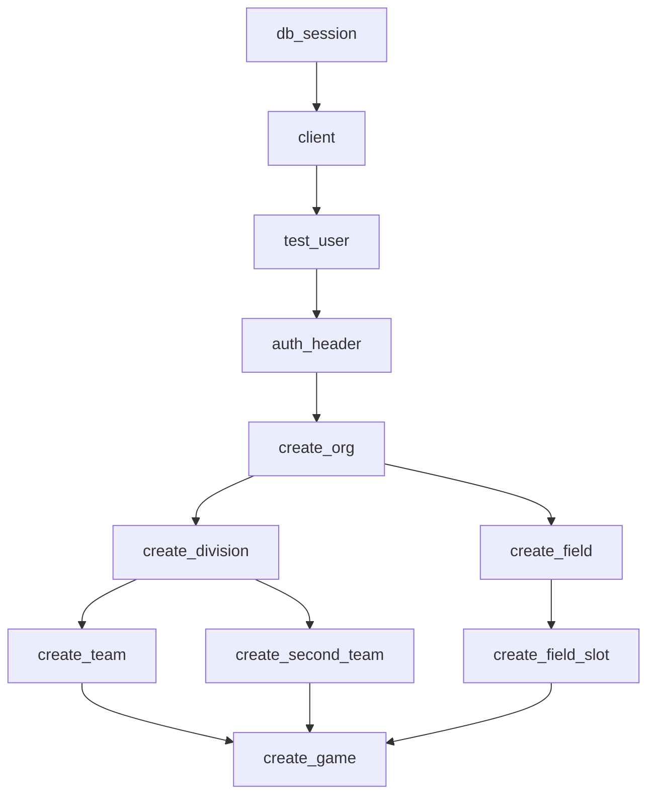
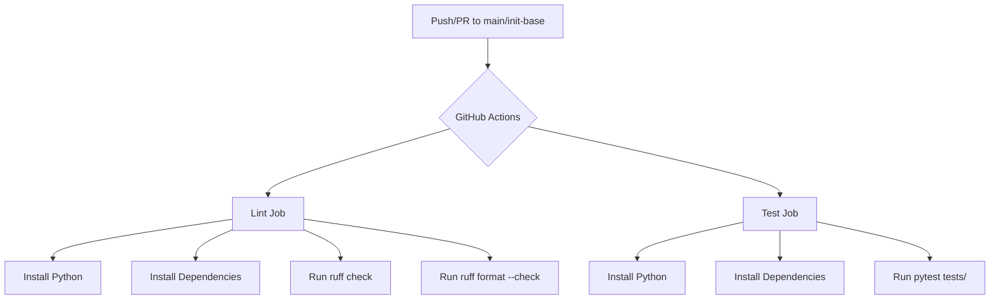

# Testing

Relevant source files

The following files were used as context for generating this wiki page:

- [.github/workflows/ci.yml](.github/workflows/ci.yml)
- [interleague_scheduler/auth.py](interleague_scheduler/auth.py)
- [tests/__init__.py](tests/__init__.py)
- [tests/conftest.py](tests/conftest.py)

This page provides a high-level overview of the Interleague Scheduler's test suite. The project utilizes `pytest` for its testing framework, enhanced with `pytest-asyncio` for asynchronous operations. A central `conftest.py` file defines a hierarchy of fixtures that streamline test setup, ranging from database sessions and authenticated clients to pre-populated entity data. The test suite aims for comprehensive coverage across all FastAPI API routers.

For detailed information on the test fixture hierarchy and configuration, refer to [Test Fixtures and Configuration](#6.1). For a breakdown of individual test modules and the Continuous Integration (CI) pipeline, see [Test Modules and CI Pipeline](#6.2).

Sources:
- [tests/conftest.py:1-153]()
- [.github/workflows/ci.yml:1-35]()

## Test Suite Overview

The testing strategy focuses on integration tests for the FastAPI backend, ensuring that API endpoints behave as expected, including authentication, data validation, and database interactions. The core components of the test suite are:

*   **`pytest`**: The primary testing framework.
*   **`pytest-asyncio`**: Enables testing of asynchronous FastAPI endpoints.
*   **`fastapi.testclient.TestClient`**: Used to make requests to the FastAPI application in tests without running a live server.
*   **`conftest.py`**: A central file for defining reusable test fixtures, which significantly reduces boilerplate code in individual test files.

The test suite is structured to mirror the application's API routers, with dedicated test modules for authentication, organizations, divisions, teams, fields, field slots, games, interleague features, and health checks.

### Test Fixture Hierarchy

The `conftest.py` file establishes a robust hierarchy of fixtures that build upon each other, providing a consistent and efficient way to set up test environments. This hierarchy ensures that tests can easily access a clean database, an authenticated client, and pre-existing data for various entities.

The foundational fixtures include:
1.  **`db_session`**: Provides an in-memory SQLite database session for each test, ensuring isolation and fast execution.
2.  **`client`**: Sets up a `TestClient` for the FastAPI application, overriding the `get_db` dependency to use the in-memory `db_session`.
3.  **`test_user`**: Creates a default authenticated user in the database.
4.  **`auth_header`**: Generates an authorization header for the `test_user`, allowing authenticated API calls.

Building on these, a series of entity-creation fixtures (`create_org`, `create_division`, `create_team`, `create_field`, `create_field_slot`, `create_game`) are provided. These fixtures make API calls to create specific entities, returning their JSON representations, which can then be used in subsequent tests.

For a detailed explanation of each fixture and its role, refer to [Test Fixtures and Configuration](#6.1).

Title: "Test Fixture Dependency Graph"

Sources:
- [tests/conftest.py:13-28]()
- [tests/conftest.py:31-41]()
- [tests/conftest.py:44-55]()
- [tests/conftest.py:58-61]()
- [tests/conftest.py:74-78]()
- [tests/conftest.py:82-90]()
- [tests/conftest.py:94-102]()
- [tests/conftest.py:106-114]()
- [tests/conftest.py:118-126]()
- [tests/conftest.py:130-139]()
- [tests/conftest.py:143-152]()

### Continuous Integration

The project integrates with GitHub Actions for Continuous Integration (CI). The CI pipeline is configured to run on every push and pull request to the `main` and `init-base` branches. It performs two main jobs: `lint` and `test`.

The `lint` job ensures code quality and style consistency by running `ruff check` and `ruff format --check` on the `interleague_scheduler/` and `tests/` directories.
The `test` job executes the entire `pytest` suite, ensuring that all tests pass before code is merged.

For more information on the CI pipeline and its configuration, see [Test Modules and CI Pipeline](#6.2).

Title: "CI Workflow"

Sources:
- [.github/workflows/ci.yml:1-35]()
