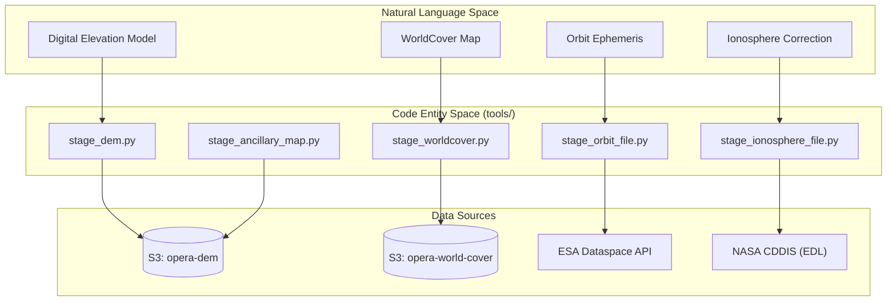
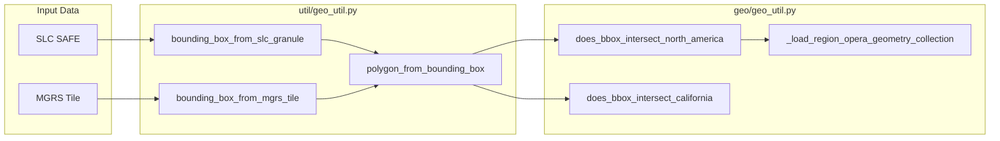

# Page: Ancillary Data Staging and Geospatial Utilities

# Ancillary Data Staging and Geospatial Utilities

Relevant source files

The following files were used as context for generating this wiki page:

- [geo/geo_util.py](geo/geo_util.py)
- [tests/unit/opera_chimera/test_precondition_functions.py](tests/unit/opera_chimera/test_precondition_functions.py)
- [tests/unit/tools/test_stage_ionosphere_file.py](tests/unit/tools/test_stage_ionosphere_file.py)
- [tests/unit/tools/test_stage_orbit_file.py](tests/unit/tools/test_stage_orbit_file.py)
- [tools/dataspace_s1_download.py](tools/dataspace_s1_download.py)
- [tools/stage_ancillary_map.py](tools/stage_ancillary_map.py)
- [tools/stage_dem.py](tools/stage_dem.py)
- [tools/stage_ionosphere_file.py](tools/stage_ionosphere_file.py)
- [tools/stage_orbit_file.py](tools/stage_orbit_file.py)
- [tools/stage_worldcover.py](tools/stage_worldcover.py)
- [util/aws_util.py](util/aws_util.py)
- [util/backoff_util.py](util/backoff_util.py)
- [util/dataspace_util.py](util/dataspace_util.py)
- [util/edl_util.py](util/edl_util.py)
- [util/geo_util.py](util/geo_util.py)

This section provides an overview of the specialized tools and utility modules used by the OPERA SDS PCM to discover, download, and prepare ancillary data. Ancillary data includes Digital Elevation Models (DEMs), land cover maps (WorldCover), satellite orbit ephemeris, and ionospheric correction files. Additionally, this section covers the geospatial utility layer used for spatial filtering and Region of Interest (ROI) validation.

## Overview of Ancillary Data Staging

Ancillary data staging is a critical pre-processing step for most OPERA Science Data Products. These tools are typically invoked by the `OperaPreConditionFunctions` within the Chimera pipeline [opera_chimera/precondition_functions.py:21-21]() to ensure that the correct environmental data is available locally before a PGE container is executed.

The staging tools generally follow a pattern of:
1.  **Spatial/Temporal Resolution**: Determining the required coverage based on an input granule's metadata (e.g., an SLC SAFE file or an MGRS tile code).
2.  **Remote Retrieval**: Interfacing with S3 (for DEMs and WorldCover) or external APIs like ESA Dataspace (for Orbits) and NASA CDDIS (for Ionosphere).
3.  **Local Preparation**: Cropping large global datasets into localized GeoTIFFs and assembling GDAL Virtual Raster Tiles (VRTs) for PGE consumption.

### System Components and Code Entities

The following diagram maps the logical ancillary data types to their respective staging implementations and external sources.

**Ancillary Data Staging Mapping**

Sources: [tools/stage_dem.py:23-24](), [tools/stage_worldcover.py:21-22](), [tools/stage_orbit_file.py:25-31](), [tools/stage_ionosphere_file.py:27-27]().

## Key Staging Tools

### DEM and Land Cover Staging
Tools like `stage_dem.py` and `stage_worldcover.py` extract sub-regions from global datasets stored in S3. They use `gdal.Translate` to crop data based on a calculated bounding box [tools/stage_dem.py:162-165]().
*   **DEM Staging**: Uses the `opera-dem` bucket to create a `dem.vrt` [tools/stage_dem.py:23-35]().
*   **WorldCover Staging**: Accesses the `opera-world-cover` bucket, supporting specific versions and years (e.g., v100, 2020) [tools/stage_worldcover.py:21-29]().
*   **Ancillary Map Staging**: A generic utility (`stage_ancillary_map.py`) for staging other raster layers like HAND (Height Above Nearest Drainage) [tools/stage_ancillary_map.py:3-4]().

For implementation details on VRT assembly and S3 interfacing, see [DEM, WorldCover, and Ancillary Map Staging](#5.1).

### Orbit and Ionosphere Retrieval
These tools interact with external providers to find files matching the exact sensing time of input SAR data.
*   **Orbit Files**: `stage_orbit_file.py` queries the ESA Dataspace for Precise (POEORB) or Restituted (RESORB) orbits [tools/stage_orbit_file.py:33-39](). It uses a `DataspaceSession` for authenticated OData queries [util/dataspace_util.py:38-42]().
*   **Ionosphere Files**: `stage_ionosphere_file.py` retrieves IONEX files from NASA CDDIS, supporting JPL, ESA, and COD providers [tools/stage_ionosphere_file.py:38-42]().

## Geospatial Utilities and Filtering

The `geo/` and `util/geo_util.py` modules provide the spatial logic required to filter incoming data and define processing boundaries. This layer is used by data subscribers to decide if a discovered granule should be ingested based on its intersection with defined regions like North America or California.

**Geospatial Logic Flow**

Sources: [util/geo_util.py:34-34](), [util/geo_util.py:117-118](), [geo/geo_util.py:19-19](), [geo/geo_util.py:70-70]().

### Core Capabilities
*   **Bounding Box Calculation**: Functions to derive spatial footprints from Sentinel-1 SAFE manifests [util/geo_util.py:34-45]() or MGRS tile codes [util/geo_util.py:156-165]().
*   **Region Intersection**: High-level functions like `does_bbox_intersect_north_america` use cached GeoJSON definitions to perform spatial joins via `osgeo.ogr` [geo/geo_util.py:19-30]().
*   **Antimeridian Handling**: Logic to "unwrap" coordinates and split polygons when data crosses the +/- 180° longitude line [util/geo_util.py:63-68]().

For details on the GeoJSON definitions and spatial filtering implementation, see [Geospatial Utilities and AOI GeoJSON Data](#5.2).

## Related Child Pages
*   [DEM, WorldCover, and Ancillary Map Staging](#5.1): Deep dive into the raster staging scripts, S3 connectivity, and GDAL VRT generation.
*   [Geospatial Utilities and AOI GeoJSON Data](#5.2): Detailed reference for the `geo/` module, ROI definitions, and spatial intersection logic.

---
**Sources:**
*   [tools/stage_dem.py:1-60]()
*   [tools/stage_worldcover.py:1-66]()
*   [tools/stage_orbit_file.py:1-130]()
*   [tools/stage_ionosphere_file.py:1-99]()
*   [util/geo_util.py:1-155]()
*   [geo/geo_util.py:1-80]()
*   [util/dataspace_util.py:1-42]()
