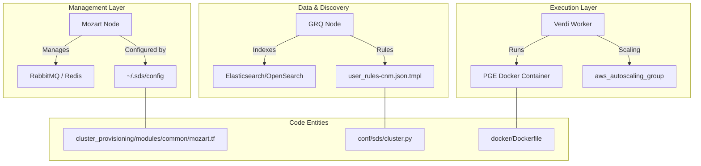
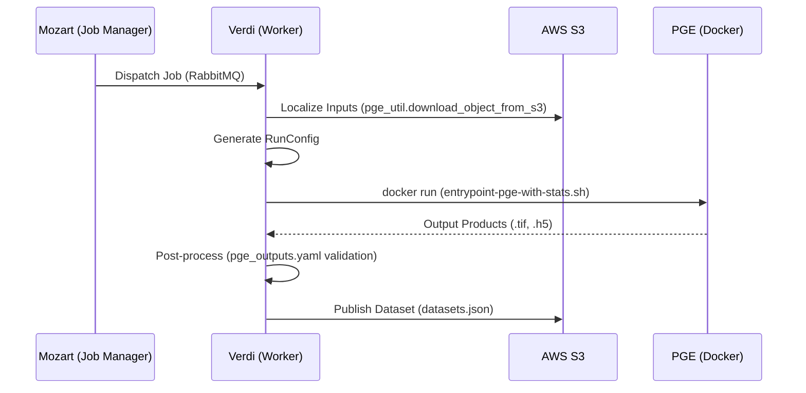

# Page: Architecture and Key Concepts

# Architecture and Key Concepts

Relevant source files

The following files were used as context for generating this wiki page:

- [.gitignore](.gitignore)
- [cluster_provisioning/dev/outputs.tf](cluster_provisioning/dev/outputs.tf)
- [cluster_provisioning/modules/common/grq_factotum_metrics.tf](cluster_provisioning/modules/common/grq_factotum_metrics.tf)
- [cluster_provisioning/modules/common/mozart.tf](cluster_provisioning/modules/common/mozart.tf)
- [cluster_provisioning/modules/common/outputs.tf](cluster_provisioning/modules/common/outputs.tf)
- [conf/pge_outputs.yaml](conf/pge_outputs.yaml)
- [conf/sds/cluster.py](conf/sds/cluster.py)
- [conf/sds/files/datasets.json](conf/sds/files/datasets.json)
- [conf/sds/files/datasets.json.tmpl.asg](conf/sds/files/datasets.json.tmpl.asg)
- [conf/sds/files/metrics/cron/cron_for_duplicate](conf/sds/files/metrics/cron/cron_for_duplicate)
- [conf/sds/files/metrics/cron/cron_without_duplicate](conf/sds/files/metrics/cron/cron_without_duplicate)
- [conf/sds/files/metrics/cron/install_cmr_audit.sh](conf/sds/files/metrics/cron/install_cmr_audit.sh)
- [conf/sds/files/metrics/cron/install_duplicates_audit.sh](conf/sds/files/metrics/cron/install_duplicates_audit.sh)
- [conf/sds/files/metrics/cron/run_cmr_audit.sh](conf/sds/files/metrics/cron/run_cmr_audit.sh)
- [conf/sds/files/metrics/cron/run_duplicates_audit.sh](conf/sds/files/metrics/cron/run_duplicates_audit.sh)
- [conf/sds/rules/user_rules-cnm.json.tmpl](conf/sds/rules/user_rules-cnm.json.tmpl)
- [conf/settings.yaml](conf/settings.yaml)
- [docker/Dockerfile](docker/Dockerfile)
- [opera_chimera/configs/pge_configs/PGE_L3_DSWx_NI.yaml](opera_chimera/configs/pge_configs/PGE_L3_DSWx_NI.yaml)
- [opera_chimera/wf_xml/L3_DSWx_NI.sf.xml](opera_chimera/wf_xml/L3_DSWx_NI.sf.xml)
- [setup.py](setup.py)
- [tests/unit/util/test_pge_util.py](tests/unit/util/test_pge_util.py)
- [tools/__init__.py](tools/__init__.py)
- [util/pge_util.py](util/pge_util.py)

The OPERA Science Data System (SDS) Process Control Mirror (PCM) is built upon the Hybrid Science Data System (HySDS) framework. It provides a scalable, cloud-native orchestration layer for processing Earth observation data into Science Data System (SDS) products.

## System Architecture

The architecture consists of specialized EC2 nodes, each serving a distinct role in the data lifecycle. These nodes are provisioned using Terraform [cluster_provisioning/modules/common/mozart.tf:18-25]() and configured via Fabric/sdscli [conf/sds/cluster.py:112-115]().

### HySDS Nodes

| Node Name | Core Responsibility | Key Code Entities / Configurations |
| :--- | :--- | :--- |
| **Mozart** | Orchestration and Job Management. Hosts the RabbitMQ task queue and Redis. | `aws_instance.mozart` [cluster_provisioning/modules/common/mozart.tf:18](), `~/.sds/config` [cluster_provisioning/modules/common/mozart.tf:169]() |
| **GRQ** | Geo-Region Query. Manages the metadata catalog and geospatial discovery. | `aws_instance.grq` [cluster_provisioning/modules/common/grq_factotum_metrics.tf:191](), `GRQ_ES_ENGINE` [conf/settings.yaml:7]() |
| **Metrics** | System monitoring, accountability reporting, and auditing. | `aws_instance.metrics` [cluster_provisioning/modules/common/grq_factotum_metrics.tf:5](), `Observation_Accountability_Report` [conf/sds/files/datasets.json:76]() |
| **Factotum** | User interface and external API gateway. | `aws_instance.factotum` [cluster_provisioning/modules/common/grq_factotum_metrics.tf:267]() |
| **Verdi** | Worker nodes that execute the actual PGE (Product Generation Executable) code. | `aws_autoscaling_group.autoscaling_group` [cluster_provisioning/modules/common/mozart.tf:19](), `docker-compose.yml.verdi` [conf/sds/cluster.py:163]() |

### System Entity Mapping
The following diagram bridges the high-level system components to the specific Terraform resources and configuration files used in the codebase.

**Diagram: System Node to Code Entity Mapping**

**Sources:** [cluster_provisioning/modules/common/mozart.tf:18-185](), [conf/sds/cluster.py:112-178](), [conf/sds/rules/user_rules-cnm.json.tmpl:1-15](), [docker/Dockerfile:1-75]()

---

## Chimera Pipeline Pattern

The PCM utilizes the **Chimera** pipeline pattern to wrap Science PGEs. This pattern standardizes how data is localized, how the PGE is invoked, and how metadata is extracted.

### Processing Lifecycle
1.  **Precondition**: Checks if all necessary input granules and ancillary data (DEMs, etc.) are available in the catalog [conf/settings.yaml:70-74]().
2.  **Localization**: Downloads required files from S3 to the Verdi worker's local scratch space [util/pge_util.py:177-195]().
3.  **Execution**: Invokes the PGE inside a Docker container using a generated `RunConfig` [docker/Dockerfile:71]().
4.  **Post-processing**: Validates outputs against `pge_outputs.yaml` [conf/pge_outputs.yaml:1-20](), harvests metadata, and registers the new dataset in the GRQ [conf/sds/files/datasets.json:1-10]().

### PGE Integration
PGEs are integrated via `hysds-io` and `job-spec` definitions. The system supports multiple product types, including:
*   **CSLC-S1**: Co-registered Single Look Complex [conf/pge_outputs.yaml:23]().
*   **RTC-S1**: Radiometric Terrain Corrected [conf/pge_outputs.yaml:63]().
*   **DSWx-HLS/S1**: Dynamic Surface Water Extent [conf/pge_outputs.yaml:105]().
*   **DIST-S1**: Disturbance Alert [conf/settings.yaml:44]().

**Diagram: PGE Execution Flow**

**Sources:** [util/pge_util.py:177-200](), [conf/pge_outputs.yaml:23-71](), [conf/sds/files/datasets.json:100-110](), [docker/Dockerfile:71-71]()

---

## Core Concepts & Terminology

### Venue
A `VENUE` represents a specific deployment instance (e.g., `dev`, `int`, `ops`). It determines bucket naming conventions and collection versions [conf/settings.yaml:1-5]().

### Dataset vs. Product
*   **Dataset**: A HySDS-specific logical grouping of files (data, metadata, browse) defined in `datasets.json` [conf/sds/files/datasets.json:1-10]().
*   **Product**: The physical files generated by a PGE (e.g., a GeoTIFF or HDF5 file) [util/pge_util.py:28-48]().

### Catalog (Elasticsearch/OpenSearch)
The SDS uses Elasticsearch (or OpenSearch) to store metadata for every discovered and processed granule.
*   **GRQ Index**: Stores spatial and temporal metadata for product discovery [conf/settings.yaml:7]().
*   **Accountability Index**: Tracks the lineage of which inputs produced which outputs [conf/sds/files/datasets.json:76-79]().

### SciFlo Workflows
SciFlo is the workflow engine used to chain multiple HySDS jobs together. These are defined in XML files (e.g., `L3_DSWx_NI.sf.xml`) which specify the sequence of PGE executions and data dependencies.

### CNM (Cloud Notification Mechanism)
The SDS delivers products to NASA DAACs (Distributed Active Archive Centers) using CNM. Delivery is triggered by `user_rules-cnm.json.tmpl`, which monitors the GRQ for new datasets and submits a `send_notify_msg` job [conf/sds/rules/user_rules-cnm.json.tmpl:1-15]().

**Sources:** [conf/settings.yaml:1-15](), [conf/sds/files/datasets.json:1-10](), [conf/sds/rules/user_rules-cnm.json.tmpl:1-30](), [util/pge_util.py:28-52]()
