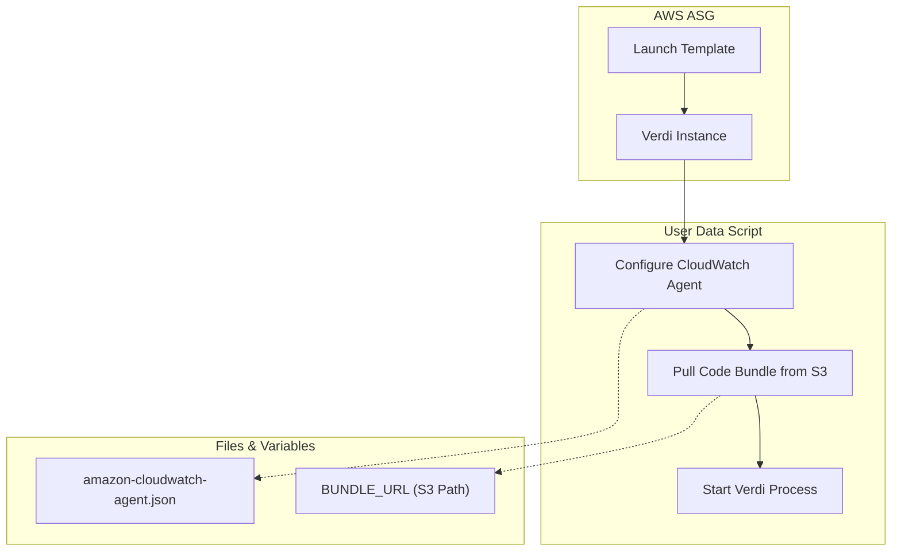
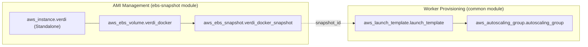

# Page: Auto-Scaling Groups, Worker Queues, and CloudWatch

# Auto-Scaling Groups, Worker Queues, and CloudWatch

Relevant source files

The following files were used as context for generating this wiki page:

- [cluster_provisioning/ebs-snapshot/docker-compose.yml.verdi.standalone](cluster_provisioning/ebs-snapshot/docker-compose.yml.verdi.standalone)
- [cluster_provisioning/ebs-snapshot/main.tf](cluster_provisioning/ebs-snapshot/main.tf)
- [cluster_provisioning/int_pst_ops_devcommon_override.tf](cluster_provisioning/int_pst_ops_devcommon_override.tf)
- [cluster_provisioning/modules/common/asg.tf](cluster_provisioning/modules/common/asg.tf)
- [cluster_provisioning/modules/common/autoscaling_groups.tf](cluster_provisioning/modules/common/autoscaling_groups.tf)
- [cluster_provisioning/modules/common/cloudwatch.tf](cluster_provisioning/modules/common/cloudwatch.tf)
- [cluster_provisioning/modules/common/launch_template_user_data.sh.tmpl](cluster_provisioning/modules/common/launch_template_user_data.sh.tmpl)
- [cluster_provisioning/modules/common/launch_template_user_data_disp_s1.sh.tmpl](cluster_provisioning/modules/common/launch_template_user_data_disp_s1.sh.tmpl)
- [cluster_provisioning/modules/common/query_timers.tf](cluster_provisioning/modules/common/query_timers.tf)
- [data_subscriber/cslc/cslc_query.sh](data_subscriber/cslc/cslc_query.sh)
- [data_subscriber/ionosphere_download.sh](data_subscriber/ionosphere_download.sh)
- [data_subscriber/submit_pending_jobs.sh](data_subscriber/submit_pending_jobs.sh)
- [docker/hysds-io.json.rtc_for_dist_download](docker/hysds-io.json.rtc_for_dist_download)
- [docker/hysds-io.json.rtc_for_dist_query](docker/hysds-io.json.rtc_for_dist_query)
- [docker/job-spec.json.rtc_for_dist_download](docker/job-spec.json.rtc_for_dist_download)
- [docker/job-spec.json.rtc_for_dist_query](docker/job-spec.json.rtc_for_dist_query)

This section details the infrastructure and configuration governing the **Verdi** worker nodes. It covers how the system utilizes AWS Auto Scaling Groups (ASG) to handle variable job loads, the mapping of job queues to specific instance types, and the mechanisms for log aggregation and metric-based scaling via CloudWatch.

## Auto-Scaling Group Configuration

The OPERA SDS uses AWS Auto Scaling Groups to manage Verdi worker nodes dynamically. Each job queue defined in the system is associated with its own ASG and Launch Template.

### ASG and Launch Template Mapping
The `aws_launch_template` and `aws_autoscaling_group` resources are provisioned using a `for_each` loop over the `var.queues` map [cluster_provisioning/modules/common/asg.tf:19-21](), [cluster_provisioning/modules/common/asg.tf:70-72](). This allows for fine-grained control over the resources allocated to different types of processing tasks (e.g., high-memory instances for DISP-S1 vs. standard instances for data querying).

Key ASG features include:
*   **Mixed Instances Policy**: Supports a combination of On-Demand and Spot instances to optimize costs. The `spot_allocation_strategy` is set to `price-capacity-optimized` [cluster_provisioning/modules/common/asg.tf:126-132]().
*   **Instance Overrides**: The system can specify multiple instance types for a single queue to increase availability in different AWS Availability Zones [cluster_provisioning/modules/common/asg.tf:140-145]().
*   **Health Checks**: Uses standard EC2 health checks with a 300-second grace period to allow for Verdi node initialization [cluster_provisioning/modules/common/asg.tf:78-79]().

### Launch Template User Data
The `user_data` script in the launch template is responsible for initializing the node, configuring the CloudWatch agent, and pulling necessary code bundles from S3 [cluster_provisioning/modules/common/asg.tf:25-34]().

**Diagram: Verdi Node Initialization Flow**

Sources: [cluster_provisioning/modules/common/launch_template_user_data.sh.tmpl:3-45](), [cluster_provisioning/modules/common/asg.tf:25-34]()

## Worker Queues and Instance Types

The system partitions work into specialized queues. Each queue is defined with specific hardware requirements in the Terraform variables.

| Queue Name Example | Purpose | Typical Instance Types |
| :--- | :--- | :--- |
| `opera-job_worker-hls_data_query` | Metadata querying of CMR | t3.medium |
| `opera-job_worker-slc_data_download` | Downloading large SLC granules | m5.large |
| `opera-job_worker-disp_s1_pge` | Heavy processing for DISP-S1 | r5.2xlarge |

Queues are often recommended within the `job-spec.json` for specific job types. For example, the RTC for DIST query job recommends the `opera-job_worker-rtc_for_dist_data_query` queue [docker/job-spec.json.rtc_for_dist_query:11]().

Sources: [cluster_provisioning/modules/common/query_timers.tf:18-25](), [docker/job-spec.json.rtc_for_dist_query:11]()

## CloudWatch Metrics and Scaling Policies

Scaling is driven by custom CloudWatch metrics emitted by the HySDS Mozart node.

### Target Tracking Scaling
The `aws_autoscaling_policy` uses a `TargetTrackingScaling` policy type [cluster_provisioning/modules/common/asg.tf:157-160](). It monitors metrics in the `HySDS` namespace, specifically:
*   **JobsWaitingPerInstance**: The number of queued jobs divided by the number of healthy instances.
*   **JobsPerInstance**: Total jobs (running + queued) per instance [cluster_provisioning/modules/common/asg.tf:175-177]().

The default `target_value` is typically `1.0`, meaning the ASG will scale out to ensure there is at least one instance per job in the queue [cluster_provisioning/modules/common/asg.tf:181](). Scale-in is often disabled (`disable_scale_in = true`) to prevent premature termination of nodes during complex processing [cluster_provisioning/modules/common/asg.tf:182]().

### Log Aggregation
The CloudWatch agent on each Verdi node collects three primary log types:
1.  **Agent Logs**: `/opt/aws/amazon-cloudwatch-agent/logs/amazon-cloudwatch-agent.log` [cluster_provisioning/modules/common/launch_template_user_data.sh.tmpl:22-23]().
2.  **Job Execution Logs**: `/data/work/jobs/**/run_job.log` (captured via glob patterns) [cluster_provisioning/modules/common/launch_template_user_data.sh.tmpl:27-28]().
3.  **Verdi Daemon Logs**: `/home/ops/verdi/log/${each_key}.log` [cluster_provisioning/modules/common/launch_template_user_data.sh.tmpl:33-34]().

Sources: [cluster_provisioning/modules/common/asg.tf:157-183](), [cluster_provisioning/modules/common/launch_template_user_data.sh.tmpl:12-43]()

## EBS Snapshot and AMI Management

To ensure fast boot times for worker nodes, OPERA SDS uses a pre-baked EBS snapshot containing the Docker images for Verdi and the PGEs.

### Snapshot Creation Process
The `cluster_provisioning/ebs-snapshot` module automates the creation of these snapshots:
1.  **Launch Standalone Verdi**: A temporary EC2 instance is launched [cluster_provisioning/ebs-snapshot/main.tf:49-55]().
2.  **Provision Docker Images**: A `remote-exec` provisioner logs into the instance, pulls the required Verdi, Logstash, and Registry images, and pulls the specific PGE images (e.g., `opera_pge-dswx_hls`) from Artifactory [cluster_provisioning/ebs-snapshot/main.tf:132-154]().
3.  **Create Snapshot**: Once the images are loaded and the Docker daemon is stopped, an `aws_ebs_snapshot` is created from the volume [cluster_provisioning/ebs-snapshot/main.tf:178-181]().

### AMI Integration
The Launch Template for the ASG then references this `snapshot_id` to attach a pre-populated data volume to `/dev/sdf` on every new worker node [cluster_provisioning/modules/common/asg.tf:46-52]().

**Diagram: EBS Snapshot and ASG Relationship**

Sources: [cluster_provisioning/ebs-snapshot/main.tf:95-102](), [cluster_provisioning/ebs-snapshot/main.tf:178-194](), [cluster_provisioning/modules/common/asg.tf:46-52]()
