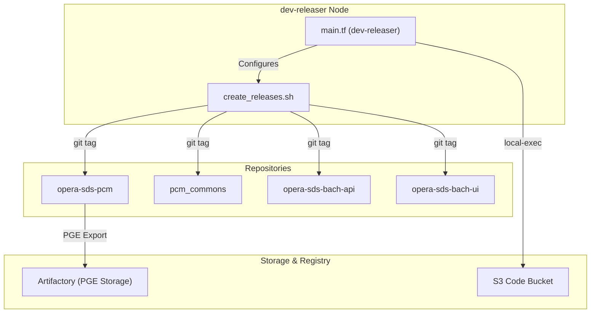
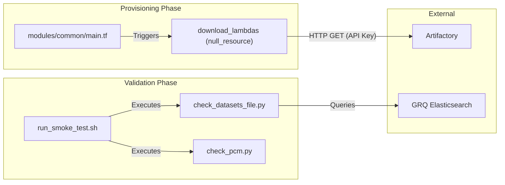

# Page: CI/CD Environments: dev-e2e, dev-releaser, and Smoke Tests

# CI/CD Environments: dev-e2e, dev-releaser, and Smoke Tests

Relevant source files

The following files were used as context for generating this wiki page:

- [cluster_provisioning/dev-common/destroy-dev-common.sh](cluster_provisioning/dev-common/destroy-dev-common.sh)
- [cluster_provisioning/dev-e2e/check_pcm.py](cluster_provisioning/dev-e2e/check_pcm.py)
- [cluster_provisioning/dev-e2e/main.tf](cluster_provisioning/dev-e2e/main.tf)
- [cluster_provisioning/dev-int/main.tf](cluster_provisioning/dev-int/main.tf)
- [cluster_provisioning/dev-int/variables.tf](cluster_provisioning/dev-int/variables.tf)
- [cluster_provisioning/dev-releaser/create_releases.sh](cluster_provisioning/dev-releaser/create_releases.sh)
- [cluster_provisioning/dev-releaser/main.tf](cluster_provisioning/dev-releaser/main.tf)
- [cluster_provisioning/dev/main.tf](cluster_provisioning/dev/main.tf)
- [cluster_provisioning/int/int-fwd/destroy-int-fwd.sh](cluster_provisioning/int/int-fwd/destroy-int-fwd.sh)
- [cluster_provisioning/int/int-pop1/destroy-int-pop1.sh](cluster_provisioning/int/int-pop1/destroy-int-pop1.sh)
- [cluster_provisioning/modules/common/main.tf](cluster_provisioning/modules/common/main.tf)
- [cluster_provisioning/ops/ops-fwd/destroy-ops-fwd.sh](cluster_provisioning/ops/ops-fwd/destroy-ops-fwd.sh)
- [cluster_provisioning/ops/ops-pop1/destroy-ops-pop1.sh](cluster_provisioning/ops/ops-pop1/destroy-ops-pop1.sh)
- [cluster_provisioning/pst/destroy-pst.sh](cluster_provisioning/pst/destroy-pst.sh)
- [cluster_provisioning/purge_aws_resources.sh](cluster_provisioning/purge_aws_resources.sh)
- [cluster_provisioning/run_smoke_test-pge.sh](cluster_provisioning/run_smoke_test-pge.sh)
- [cluster_provisioning/run_smoke_test.sh](cluster_provisioning/run_smoke_test.sh)

This page describes the specialized provisioning environments and automated validation procedures used in the OPERA SDS PCM for end-to-end testing and release management. These environments leverage Terraform and shell automation to create reproducible clusters for high-fidelity testing and artifact packaging.

## Overview of Specialized Environments

The OPERA SDS uses distinct Terraform configurations to provision clusters tailored for specific stages of the software development lifecycle. These environments are built upon the `cluster_provisioning/modules/common` module [cluster_provisioning/modules/common/main.tf:1-2]() and are configured via environment-specific `main.tf` and `variables.tf` files.

| Environment | Purpose | Key Feature |
| :--- | :--- | :--- |
| **dev-e2e** | High-fidelity end-to-end testing of the entire processing chain. | Supports automated `run_smoke_test.sh` execution. |
| **dev-releaser** | Automated creation of official software releases and tags. | Executes `create_releases.sh` to tag and package PCM components. |
| **dev-int** | Integration environment for testing cross-component compatibility. | Mirror of production-like settings in a development context. |

Sources: [cluster_provisioning/dev-e2e/main.tf:1-112](), [cluster_provisioning/dev-releaser/main.tf:1-101](), [cluster_provisioning/dev-int/main.tf:1-109]()

## 1. dev-e2e: End-to-End Testing Environment

The `dev-e2e` environment is designed to validate the system from data discovery to product delivery. It is provisioned using the `cluster_provisioning/dev-e2e/` configuration, which inherits all standard HySDS nodes (Mozart, GRQ, Metrics, Factotum) from the common module [cluster_provisioning/dev-e2e/main.tf:33-36]().

### Smoke Test Execution
The primary validation mechanism in this environment is the `run_smoke_test.sh` script. This script automates the following steps:
1.  **ASG Priming**: Sets the minimum and desired capacity for specific worker queues (e.g., `opera-job_worker-rcv_cnm_notify`) to ensure instances are immediately available [cluster_provisioning/run_smoke_test.sh:46-47]().
2.  **Dataset Ingestion**: Ingests a baseline Area of Interest (AOI) dataset (Sacramento Valley) into the system using `ingest_dataset.py` [cluster_provisioning/run_smoke_test.sh:50]().
3.  **Rule Import**: Imports trigger rules for Mozart and GRQ to enable automated workflow orchestration [cluster_provisioning/run_smoke_test.sh:56-59]().

### PGE Simulation vs. Real Execution
The `dev-e2e` environment can toggle between `PGE_SIMULATION_MODE` (where PGEs are mocked) and real execution. When testing real PGEs, `run_smoke_test-pge.sh` is used to:
*   Import PGE containers from Artifactory into the local HySDS package repository [cluster_provisioning/run_smoke_test-pge.sh:36-40]().
*   Load the `opera-pcm` container into the cluster's Docker registry via Fabric [cluster_provisioning/run_smoke_test-pge.sh:62]().
*   Disable simulation mode in `settings.yaml` [cluster_provisioning/run_smoke_test-pge.sh:73]().

Sources: [cluster_provisioning/run_smoke_test.sh:1-86](), [cluster_provisioning/run_smoke_test-pge.sh:1-75]()

## 2. dev-releaser: Release Packaging

The `dev-releaser` environment automates the synchronization and tagging of the various repositories that constitute the OPERA SDS PCM.

### Release Creation Logic
The `create_releases.sh` script is the core of this environment. It handles:
*   **Version Coordination**: Ensures that `pcm`, `pcm_commons`, `bach-api`, and `bach-ui` are tagged with consistent version numbers [cluster_provisioning/dev-releaser/create_releases.sh:134-139]().
*   **Git Authentication**: Uses OAuth tokens (`GIT_OAUTH_TOKEN` and `PUB_GIT_OAUTH_TOKEN`) to authenticate across internal JPL and public GitHub repositories [cluster_provisioning/dev-releaser/create_releases.sh:98-105]().
*   **Conflict Management**: Includes a `--delete-on-conflict` flag to re-create tags if a release needs to be re-run [cluster_provisioning/dev-releaser/create_releases.sh:151-154]().

### Code Entity Mapping: Release Workflow
The following diagram illustrates how the `dev-releaser` environment interacts with the codebase to produce artifacts.

**Diagram: Release Packaging Data Flow**

Sources: [cluster_provisioning/dev-releaser/main.tf:1-120](), [cluster_provisioning/dev-releaser/create_releases.sh:1-240]()

## 3. Validation and Health Checks

Validation is performed using specialized scripts that check the internal state of the HySDS cluster and its integration with external services.

### check_pcm.py and check_datasets_file.py
*   **Dataset Validation**: `check_datasets_file.py` verifies that the expected number of datasets have been ingested into the GRQ (Global Resource Query) index [cluster_provisioning/run_smoke_test-pge.sh:120-129]().
*   **Catalog Verification**: `check_catalog.py` is used to validate the presence of specific metadata catalogs, such as the `cop_catalog` [cluster_provisioning/run_smoke_test-pge.sh:126]().

### Artifactory Integration
The system relies on Artifactory for storing both Lambda packages and PGE Docker images. The common module uses `curl` with the `X-JFrog-Art-Api` header to retrieve these artifacts during provisioning [cluster_provisioning/modules/common/main.tf:94-110]().

**Diagram: Artifact Retrieval and Validation**

Sources: [cluster_provisioning/modules/common/main.tf:92-111](), [cluster_provisioning/run_smoke_test-pge.sh:120-130](), [cluster_provisioning/run_smoke_test.sh:1-50]()

## 4. Environment Cleanup

To manage costs and resource hygiene, cleanup scripts are provided for each environment. These scripts perform the following actions:
1.  **Terraform Destroy**: Removes EC2 instances, ASGs, and networking components [cluster_provisioning/int/int-fwd/destroy-int-fwd.sh:2]().
2.  **Log Group Deletion**: Removes CloudWatch log groups for both Lambdas and system logs [cluster_provisioning/int/int-fwd/destroy-int-fwd.sh:3-4]().
3.  **Launch Template Removal**: Deletes EC2 launch templates created during provisioning [cluster_provisioning/int/int-fwd/destroy-int-fwd.sh:5]().
4.  **S3 Purge**: Optionally clears specific S3 paths, such as compressed CSLC files in the LTS (Long Term Storage) bucket [cluster_provisioning/int/int-fwd/destroy-int-fwd.sh:8]().

Sources: [cluster_provisioning/int/int-fwd/destroy-int-fwd.sh:1-8](), [cluster_provisioning/pst/destroy-pst.sh:1-9]()
