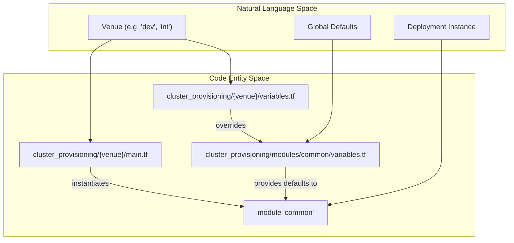
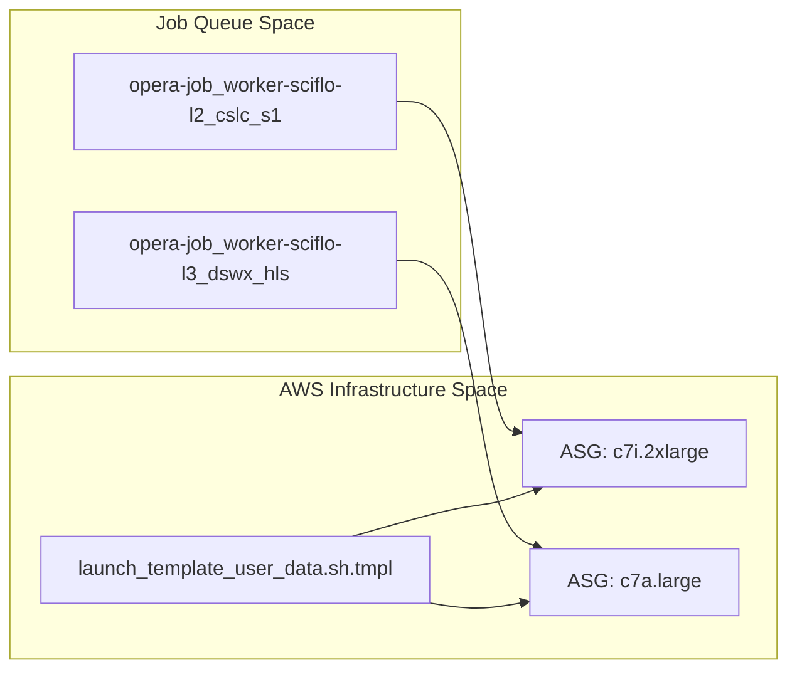

# Page: Cluster Provisioning and Infrastructure

# Cluster Provisioning and Infrastructure

Relevant source files

The following files were used as context for generating this wiki page:

- [cluster_provisioning/dev-e2e/main.tf](cluster_provisioning/dev-e2e/main.tf)
- [cluster_provisioning/dev-e2e/variables.tf](cluster_provisioning/dev-e2e/variables.tf)
- [cluster_provisioning/dev-int/main.tf](cluster_provisioning/dev-int/main.tf)
- [cluster_provisioning/dev-int/override.tf](cluster_provisioning/dev-int/override.tf)
- [cluster_provisioning/dev-releaser/main.tf](cluster_provisioning/dev-releaser/main.tf)
- [cluster_provisioning/dev-releaser/variables.tf](cluster_provisioning/dev-releaser/variables.tf)
- [cluster_provisioning/dev/main.tf](cluster_provisioning/dev/main.tf)
- [cluster_provisioning/dev/variables.tf](cluster_provisioning/dev/variables.tf)
- [cluster_provisioning/ebs-snapshot/variables.tf](cluster_provisioning/ebs-snapshot/variables.tf)
- [cluster_provisioning/int/variables.tf](cluster_provisioning/int/variables.tf)
- [cluster_provisioning/modules/common/main.tf](cluster_provisioning/modules/common/main.tf)
- [cluster_provisioning/modules/common/variables.tf](cluster_provisioning/modules/common/variables.tf)

This section provides a high-level overview of the Infrastructure-as-Code (IaC) layer used to deploy and manage OPERA SDS clusters. The system leverages Terraform to orchestrate AWS resources, ensuring consistent deployments across various operational venues.

The provisioning logic is centralized in a "common" module, which is then instantiated by specific environment configurations (venues) such as `dev`, `int`, `ops`, and specialized CI/CD environments.

### The Venue Concept and Infrastructure Hierarchy

The OPERA SDS uses the concept of a **Venue** to distinguish between different deployment instances (e.g., a developer's personal cluster vs. the project-wide integration cluster). Each venue is defined by a set of Terraform variables that override the defaults provided by the common module.

The infrastructure is organized into a hierarchical structure:
1.  **Common Module**: Defines the core resources (S3 buckets, Lambda functions, EC2 instances for HySDS nodes).
2.  **Venue Configurations**: Directories (like `cluster_provisioning/dev/` or `cluster_provisioning/int/`) that call the common module with specific parameters.
3.  **Overrides**: Files like `override.tf` or `variables.tf` within venue directories used to customize machine sizes, branch names, and feature flags.

#### Infrastructure Code Entity Mapping

The following diagram illustrates how the abstract concept of a "Venue" maps to specific Terraform files and modules within the codebase.

**Venue to Code Mapping**

Sources: [cluster_provisioning/modules/common/variables.tf:1-100](), [cluster_provisioning/dev/main.tf:7-113](), [cluster_provisioning/dev-int/override.tf:9-46]()

### Terraform Common Module and Venue Configurations

The `common` module is the engine of the SDS deployment. it handles the creation of essential S3 buckets for data (dataset, code, triage, etc.), the deployment of utility Lambda functions (such as the `harikiri` handler for instance termination), and the resolution of AMIs via SSM parameters.

For details, see [Terraform Common Module and Venue Configurations](#2.1).

Sources: [cluster_provisioning/modules/common/main.tf:1-112](), [cluster_provisioning/modules/common/variables.tf:223-256]()

### HySDS Node Provisioning: Mozart, GRQ, Metrics, Factotum

A standard OPERA SDS cluster consists of several specialized HySDS nodes. Terraform manages the EC2 instances and networking for:
*   **Mozart**: The job orchestration and SciFlo engine.
*   **GRQ (Global Resource Query)**: The metadata catalog (Elasticsearch/OpenSearch).
*   **Metrics**: System performance and job monitoring.
*   **Factotum**: Primary ingest and management node.

The provisioning process includes setting up `supervisord` configurations and generating the `~/.sds/config` file required for cluster communication.

For details, see [HySDS Node Provisioning: Mozart, GRQ, Metrics, Factotum](#2.2).

Sources: [cluster_provisioning/dev/variables.tf:160-209](), [cluster_provisioning/dev-int/override.tf:189-238]()

### Auto-Scaling Groups, Worker Queues, and CloudWatch

Processing power is provided by **Verdi** worker nodes, which are managed via AWS Auto-Scaling Groups (ASGs). The infrastructure maps specific HySDS job queues (e.g., `opera-job_worker-sciflo-l2_cslc_s1`) to EC2 instance types and scaling policies.

**Queue to Infrastructure Mapping**

For details, see [Auto-Scaling Groups, Worker Queues, and CloudWatch](#2.3).

Sources: [cluster_provisioning/modules/common/variables.tf:258-315](), [cluster_provisioning/ebs-snapshot/variables.tf:83-95]()

### CI/CD Environments: dev-e2e, dev-releaser, and Smoke Tests

The codebase includes specialized provisioning configurations for automated testing and release workflows:
*   **dev-e2e**: Used for full end-to-end integration testing, including PGE execution.
*   **dev-releaser**: Optimized for building and exporting PGE containers to Artifactory.
*   **ebs-snapshot**: Dedicated logic for creating the base AMIs used by Verdi workers.

These environments often include additional validation logic, such as `run_smoke_test` flags and `check_pcm.py` scripts to verify cluster health post-deployment.

For details, see [CI/CD Environments: dev-e2e, dev-releaser, and Smoke Tests](#2.4).

Sources: [cluster_provisioning/dev-e2e/main.tf:1-112](), [cluster_provisioning/dev-releaser/main.tf:1-101](), [cluster_provisioning/ebs-snapshot/variables.tf:1-50]()
