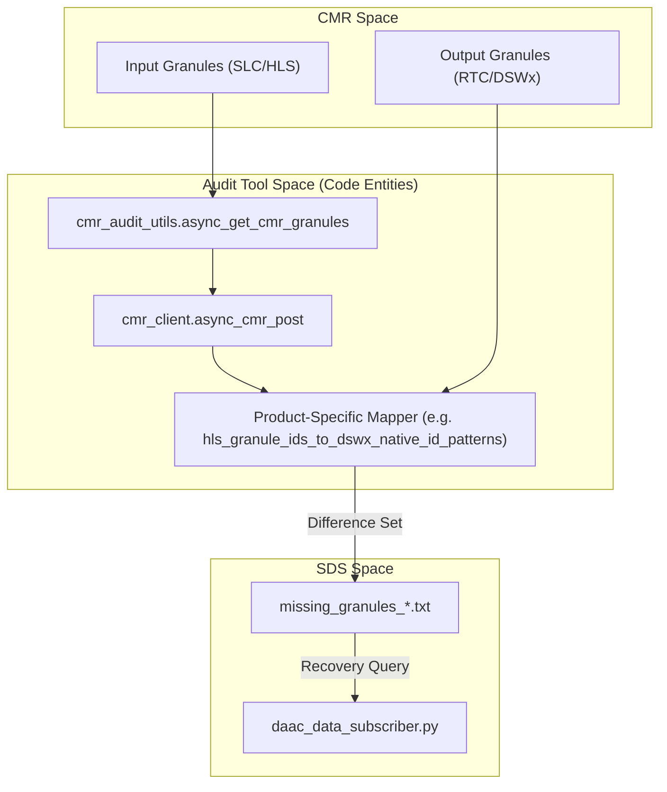
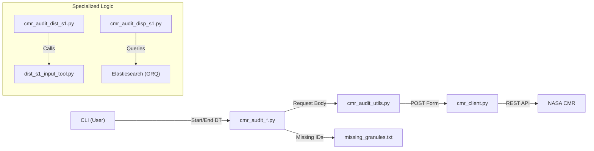

# Page: CMR Audit Tools

# CMR Audit Tools

Relevant source files

The following files were used as context for generating this wiki page:

- [docker/hysds-io.json.disp_static_query](docker/hysds-io.json.disp_static_query)
- [docker/job-spec.json.disp_static_query](docker/job-spec.json.disp_static_query)
- [geo/__init__.py](geo/__init__.py)
- [geo/california_opera.geojson](geo/california_opera.geojson)
- [geo/north_america_opera.geojson](geo/north_america_opera.geojson)
- [tools/dist_s1_input_tool.py](tools/dist_s1_input_tool.py)
- [tools/ops/README.md](tools/ops/README.md)
- [tools/ops/cmr_audit/README.md](tools/ops/cmr_audit/README.md)
- [tools/ops/cmr_audit/__init__.py](tools/ops/cmr_audit/__init__.py)
- [tools/ops/cmr_audit/cmr_audit_batch.py](tools/ops/cmr_audit/cmr_audit_batch.py)
- [tools/ops/cmr_audit/cmr_audit_disp_s1.py](tools/ops/cmr_audit/cmr_audit_disp_s1.py)
- [tools/ops/cmr_audit/cmr_audit_disp_s1_static.py](tools/ops/cmr_audit/cmr_audit_disp_s1_static.py)
- [tools/ops/cmr_audit/cmr_audit_dist_s1.py](tools/ops/cmr_audit/cmr_audit_dist_s1.py)
- [tools/ops/cmr_audit/cmr_audit_dswx_s1.py](tools/ops/cmr_audit/cmr_audit_dswx_s1.py)
- [tools/ops/cmr_audit/cmr_audit_hls.py](tools/ops/cmr_audit/cmr_audit_hls.py)
- [tools/ops/cmr_audit/cmr_audit_slc.py](tools/ops/cmr_audit/cmr_audit_slc.py)
- [tools/ops/cmr_audit/cmr_audit_tropo.py](tools/ops/cmr_audit/cmr_audit_tropo.py)
- [tools/ops/cmr_audit/cmr_audit_utils.py](tools/ops/cmr_audit/cmr_audit_utils.py)
- [tools/ops/cmr_audit/cmr_client.py](tools/ops/cmr_audit/cmr_client.py)
- [tools/ops/cnm_check.py](tools/ops/cnm_check.py)

The CMR Audit subsystem is a collection of operational tools located in `tools/ops/cmr_audit/` designed to reconcile the internal state of the OPERA SDS Process Control Mirror (PCM) with the NASA Common Metadata Repository (CMR). These tools identify discrepancies such as missing products (data that should have been processed but wasn't) or duplicate products published to the DAAC.

## System Overview

The audit system operates by querying CMR for both "input" granules (e.g., HLS, SLC) and "output" products (e.g., DSWx-HLS, CSLC, RTC). By applying product-specific mapping logic (such as MGRS tile IDs or burst IDs), the tools determine if every input granule has a corresponding output product in CMR.

### Core Components

| Component | File | Responsibility |
| :--- | :--- | :--- |
| **CMR Client** | `cmr_client.py` | Low-level `aiohttp` and `backoff` logic for robust, asynchronous CMR API interaction [tools/ops/cmr_audit/cmr_client.py:18-30](). |
| **Audit Utils** | `cmr_audit_utils.py` | Shared logic for temporal windowing, request body construction, and batching [tools/ops/cmr_audit/cmr_audit_utils.py:21-87](). |
| **HLS Auditor** | `cmr_audit_hls.py` | Reconciles `HLSL30`/`HLSS30` inputs with `OPERA_L3_DSWX-HLS_V1` outputs [tools/ops/cmr_audit/cmr_audit_hls.py:76-91](). |
| **SLC Auditor** | `cmr_audit_slc.py` | Reconciles Sentinel-1 SLC inputs with `CSLC-S1` and `RTC-S1` outputs [tools/ops/cmr_audit/cmr_audit_slc.py:85-108](). |
| **DIST-S1 Auditor** | `cmr_audit_dist_s1.py` | Maps RTC bursts to MGRS tiles to find missing DIST-S1 products [tools/ops/cmr_audit/cmr_audit_dist_s1.py:4-15](). |
| **DISP-S1 Auditor** | `cmr_audit_disp_s1.py` | Reconciles CSLC inputs with DISP-S1 products, supporting historical and forward modes [tools/ops/cmr_audit/cmr_audit_disp_s1.py:47-64](). |
| **Batch Runner** | `cmr_audit_batch.py` | Orchestrates long-running audits by splitting large time ranges into smaller intervals [tools/ops/cmr_audit/cmr_audit_batch.py:69-95](). |

**Sources:** [tools/ops/cmr_audit/cmr_client.py](), [tools/ops/cmr_audit/cmr_audit_utils.py](), [tools/ops/cmr_audit/cmr_audit_hls.py](), [tools/ops/cmr_audit/cmr_audit_slc.py](), [tools/ops/cmr_audit/cmr_audit_dist_s1.py](), [tools/ops/cmr_audit/cmr_audit_disp_s1.py]().

---

## Data Flow and Implementation

The audit tools follow a standard asynchronous pattern to handle the high volume of metadata in CMR.

### Audit Execution Pattern

1.  **Temporal Partitioning**: The requested time range is split into smaller chunks (e.g., 12-hour windows) to avoid CMR's payload limits [tools/ops/cmr_audit/cmr_audit_utils.py:35-68]().
2.  **Concurrent Querying**: `async_cmr_post` issues requests using an `asyncio.Semaphore` to limit concurrency while maximizing throughput [tools/ops/cmr_audit/cmr_client.py:33-53]().
3.  **Metadata Mapping**: Input granule IDs are parsed into patterns that match expected output Native IDs (e.g., HLS tile + timestamp -> DSWx Native ID) [tools/ops/cmr_audit/cmr_audit_hls.py:140-164]().
4.  **Reconciliation**: The set of expected output IDs is compared against the set of actual IDs found in CMR.
5.  **Reporting**: Missing granules are written to text files that can be fed back into the `daac_data_subscriber.py` for recovery [tools/ops/cmr_audit/README.md:37-47]().

### Reconciliation Logic Diagram
This diagram shows how the `CMRAudit` logic bridges the gap between CMR metadata and SDS operational recovery.

Title: CMR Audit Reconciliation Flow

**Sources:** [tools/ops/cmr_audit/cmr_audit_utils.py:21-87](), [tools/ops/cmr_audit/cmr_client.py:18-30](), [tools/ops/cmr_audit/cmr_audit_hls.py:140-164](), [tools/ops/cmr_audit/README.md:17-47]().

---

## Specialized Audit Tools

### DIST-S1 Audit & Validation
The `cmr_audit_dist_s1.py` tool is unique because it integrates with the `dist_s1_input_tool.py` for deep validation. 

*   **Logic**: It extracts metadata from `iso.xml` files (via S3 or HTTPS) to map RTC bursts to MGRS tiles using the DIST-S1 burst database [tools/ops/cmr_audit/cmr_audit_dist_s1.py:10-14]().
*   **Validation**: If `--run-input-validation` is passed, it invokes `dist_s1_input_tool.py` to check if the "missing" product actually has enough valid inputs to be processed [tools/ops/cmr_audit/cmr_audit_dist_s1.py:120-123]().

### DISP-S1 Audit
The DISP-S1 audit (`cmr_audit_disp_s1.py`) requires connection to the SDS Elasticsearch (GRQ) because DISP-S1 provenance is not fully captured in CMR [tools/ops/cmr_audit/README.md:57-59]().

*   **Historical Mode**: Audits specific frames over long periods, grouping by `k_cycle` [tools/ops/cmr_audit/cmr_audit_disp_s1.py:105-132]().
*   **Forward Mode**: Audits all frames over a small temporal window [tools/ops/cmr_audit/cmr_audit_disp_s1.py:90-94]().

### Audit Integration Diagram
This diagram maps system components to specific file entities and their interactions.

Title: Audit Subsystem Entity Mapping

**Sources:** [tools/ops/cmr_audit/cmr_audit_dist_s1.py:120-123](), [tools/ops/cmr_audit/cmr_audit_disp_s1.py:46-49](), [tools/ops/cmr_audit/cmr_client.py:109-110](), [tools/ops/cmr_audit/cmr_audit_utils.py:90-132]().

---

## Key Functions and Classes

### `cmr_client.py`
*   **`async_cmr_post(url, data, session, sem)`**: Handles asynchronous POST requests to CMR with automatic pagination (scrolling) using the `CMR-Search-After` header [tools/ops/cmr_audit/cmr_client.py:33-87]().
*   **`backoff.on_exception`**: Utilizes exponential backoff to handle intermittent 504 Gateway Timeouts from CMR [tools/ops/cmr_audit/cmr_client.py:102-108]().

### `cmr_audit_utils.py`
*   **`async_get_cmr_granules(...)`**: The primary entry point for retrieving metadata. It implements the `rrule` logic to iterate through days and hours to partition the search [tools/ops/cmr_audit/cmr_audit_utils.py:21-87]().
*   **`request_body_supplier(...)`**: Generates CMR-compliant query strings for different collections (HLSL30, SENTINEL-1_SLC, etc.), including spatial filters like `bounding_box=-180,-60,180,90` [tools/ops/cmr_audit/cmr_audit_utils.py:90-132]().

### `cmr_audit_dist_s1.py`
*   **`extract_iso_xml_url(product, use_s3)`**: Parses CMR `RelatedUrls` to find the ISO XML metadata file required for DIST-S1 burst mapping [tools/ops/cmr_audit/cmr_audit_dist_s1.py:153-194]().
*   **`_get_s3_object(bucket, key, ...)`**: Retrieves metadata files directly from S3 when running within the AWS environment for better performance [tools/ops/cmr_audit/cmr_audit_dist_s1.py:197-200]().

**Sources:** [tools/ops/cmr_audit/cmr_client.py](), [tools/ops/cmr_audit/cmr_audit_utils.py](), [tools/ops/cmr_audit/cmr_audit_dist_s1.py]().
