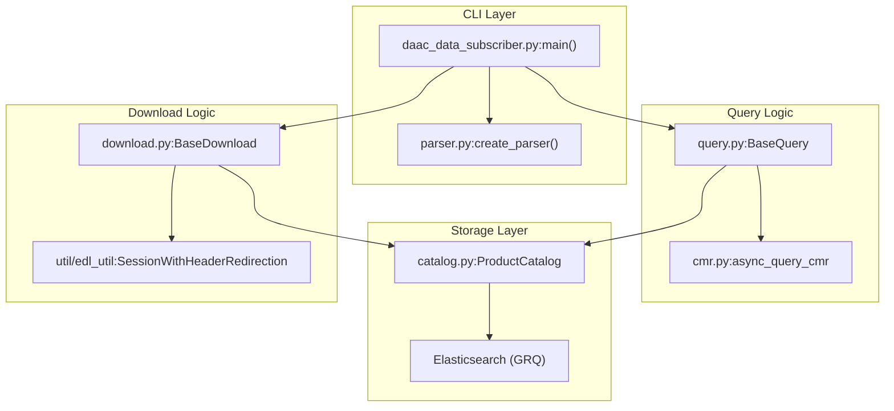
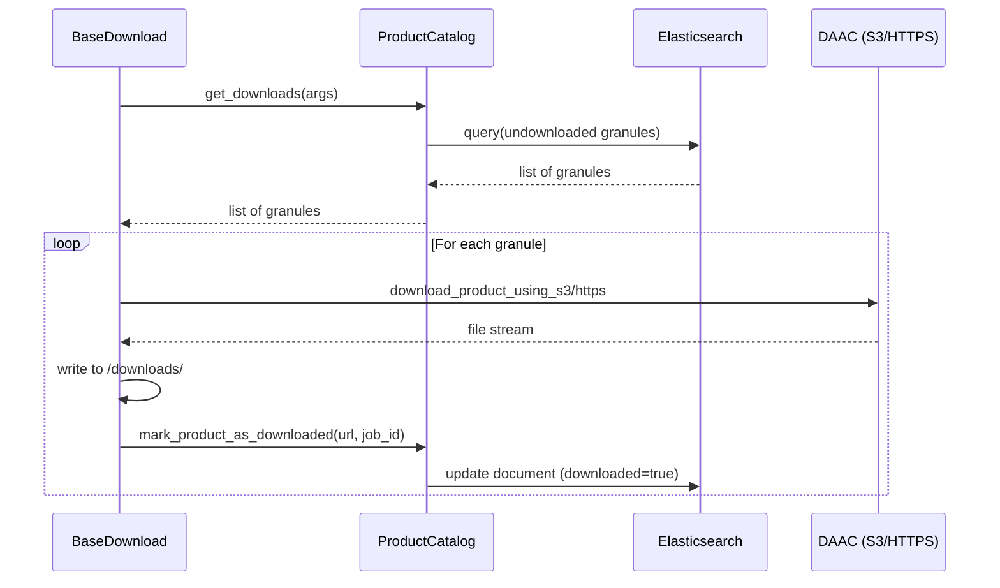

# Page: Core Subscriber Framework: CMR Client, Catalog, and Download Base

# Core Subscriber Framework: CMR Client, Catalog, and Download Base

Relevant source files

The following files were used as context for generating this wiki page:

- [conf/sds/rules/user_rules.json](conf/sds/rules/user_rules.json)
- [data_subscriber/__init__.py](data_subscriber/__init__.py)
- [data_subscriber/catalog.py](data_subscriber/catalog.py)
- [data_subscriber/cmr.py](data_subscriber/cmr.py)
- [data_subscriber/daac_data_subscriber.py](data_subscriber/daac_data_subscriber.py)
- [data_subscriber/download.py](data_subscriber/download.py)
- [data_subscriber/hls/hls_catalog.py](data_subscriber/hls/hls_catalog.py)
- [data_subscriber/parser.py](data_subscriber/parser.py)
- [data_subscriber/slc/slc_catalog.py](data_subscriber/slc/slc_catalog.py)
- [data_subscriber/survey.py](data_subscriber/survey.py)
- [docker/job-spec.json.slc_download_hist](docker/job-spec.json.slc_download_hist)
- [docker/job-spec.json.slcs1a_query_hist](docker/job-spec.json.slcs1a_query_hist)
- [docker/job-spec.json.slcs1b_query_hist](docker/job-spec.json.slcs1b_query_hist)
- [tests/data_subscriber/test_daac_data_subscriber.py](tests/data_subscriber/test_daac_data_subscriber.py)
- [tests/data_subscriber/test_query.py](tests/data_subscriber/test_query.py)

The Data Subscriber is a specialized subsystem within the OPERA SDS PCM responsible for discovering, tracking, and retrieving Earth observation data from NASA DAACs (Distributed Active Archive Centers). This page details the shared infrastructure used by all product-specific subscribers (HLS, SLC, RTC, CSLC, GCOV), including the CLI entry point, the Elasticsearch-backed product catalog, and the base classes for CMR interaction and data retrieval.

### Data Flow Overview

The framework operates in three primary modes:
1.  **Survey**: Scans CMR to generate statistics and histograms of product availability and latency [data_subscriber/daac_data_subscriber.py:69-70](), [data_subscriber/survey.py:31-37]().
2.  **Query**: Discovers new granules in CMR and indexes them into the SDS `ProductCatalog` [data_subscriber/daac_data_subscriber.py:72-73]().
3.  **Download**: Retrieves files for granules already indexed in the catalog and stages them for processing [data_subscriber/daac_data_subscriber.py:75-78]().

#### Framework Entity Relationship
The following diagram illustrates how the core classes interact to facilitate data discovery and ingestion.

**Subscriber Framework Class Interactions**

Sources: [data_subscriber/daac_data_subscriber.py:44-79](), [data_subscriber/catalog.py:18-27](), [data_subscriber/download.py:28-65](), [data_subscriber/cmr.py:173-181]()

---

### Command Line Interface (CLI)

The `daac_data_subscriber.py` script serves as the unified entry point. It uses a subparser-based architecture to handle different operational modes.

| Subparser | Purpose | Key Arguments |
| :--- | :--- | :--- |
| `survey` | Analyze CMR granule distribution. | `--step-hours`, `--out-csv` [data_subscriber/parser.py:80-88, 31-37]() |
| `query` | Discover granules and update ES index. | `--collection-shortname`, `--start-date`, `--bbox` [data_subscriber/parser.py:35-78]() |
| `download` | Retrieve files for indexed granules. | `--transfer-protocol`, `--batch-ids` [data_subscriber/parser.py:128-132]() |
| `full` | Sequential execution of Query then Download. | Combined arguments. [data_subscriber/daac_data_subscriber.py:72-79]() |

Sources: [data_subscriber/daac_data_subscriber.py:48-79](), [data_subscriber/parser.py:9-148]()

---

### Product Catalog (Elasticsearch)

The `ProductCatalog` is an abstract base class that manages the state of discovered and downloaded granules using Elasticsearch. Each product type (e.g., HLS, SLC) implements its own subclass to handle specific metadata fields.

#### Implementation Details
- **Index Naming**: Indices are typically named with a monthly suffix, e.g., `hls_catalog-2023.10` [data_subscriber/catalog.py:80]().
- **Existence Checks**: Before indexing, the system checks if a granule ID already exists to prevent duplicate processing [data_subscriber/catalog.py:43-60]().
- **State Tracking**: The catalog tracks `downloaded` status (boolean) and `download_job_id` to provide lineage between discovery and retrieval [data_subscriber/catalog.py:167-175, 138-140]().

| Class | Index Pattern | File Path |
| :--- | :--- | :--- |
| `HLSProductCatalog` | `hls_catalog*` | [data_subscriber/hls/hls_catalog.py:5-8]() |
| `SLCProductCatalog` | `slc_catalog*` | [data_subscriber/slc/slc_catalog.py:5-8]() |
| `RTCProductCatalog` | `rtc_catalog*` | [data_subscriber/rtc/rtc_catalog.py]() |

Sources: [data_subscriber/catalog.py:18-81](), [data_subscriber/hls/hls_catalog.py:5-34](), [data_subscriber/slc/slc_catalog.py:5-25]()

---

### CMR Interaction Patterns

The system interacts with NASA's Common Metadata Repository (CMR) via asynchronous UMM-JSON queries.

#### Authentication
Authentication is handled via Earthdata Login (EDL). The system retrieves credentials from `.netrc` and exchanges them for a bearer token [data_subscriber/cmr.py:121-127]().

#### Query Execution
- **`async_query_cmr`**: The primary function for issuing queries. It supports temporal ranges, bounding boxes, and provider-specific filters [data_subscriber/cmr.py:173-181]().
- **Temporal vs. Revision**: Queries can be filtered by the granule's actual data time (`temporal`) or the time the metadata was last updated in CMR (`revision_date`) [data_subscriber/catalog.py:82-85]().

Sources: [data_subscriber/cmr.py:121-181](), [data_subscriber/survey.py:17-28]()

---

### Download Framework

The `BaseDownload` class provides the infrastructure for physical data retrieval.

#### Retrieval Strategies
1.  **S3 Direct Access**: If the DAAC supports it and the SDS is running in the same AWS region, the system uses `boto3` with temporary DAAC credentials [data_subscriber/download.py:127-140]().
2.  **HTTPS**: Standard retrieval using `SessionWithHeaderRedirection` to handle EDL OAuth2 redirects [data_subscriber/download.py:55, 23]().

#### Data Flow: Catalog to Local Disk

Sources: [data_subscriber/download.py:42-65, 127-140](), [data_subscriber/catalog.py:167-191]()

#### Metadata Extraction
Post-download, the framework invokes the `extractor.extract` module to generate `.met.json` files for the downloaded granules. This is essential for subsequent ingestion into the HySDS GRQ [data_subscriber/download.py:107-125]().

Sources: [data_subscriber/download.py:107-125]()
