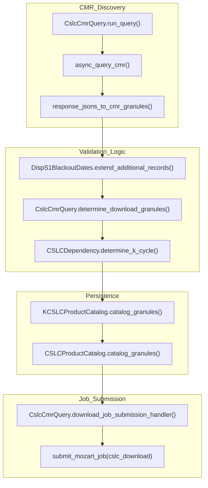

# Page: CSLC and DISP-S1 Data Subscriber

# CSLC and DISP-S1 Data Subscriber

Relevant source files

The following files were used as context for generating this wiki page:

- [data_subscriber/asf_cslc_download.py](data_subscriber/asf_cslc_download.py)
- [data_subscriber/cslc/cslc_blackout.py](data_subscriber/cslc/cslc_blackout.py)
- [data_subscriber/cslc/cslc_catalog.py](data_subscriber/cslc/cslc_catalog.py)
- [data_subscriber/cslc/cslc_dependency.py](data_subscriber/cslc/cslc_dependency.py)
- [data_subscriber/cslc/cslc_query.py](data_subscriber/cslc/cslc_query.py)
- [data_subscriber/cslc_utils.py](data_subscriber/cslc_utils.py)
- [data_subscriber/disp_static/__init__.py](data_subscriber/disp_static/__init__.py)
- [data_subscriber/disp_static/disp_static_query.py](data_subscriber/disp_static/disp_static_query.py)
- [data_subscriber/disp_static/disp_static_query.sh](data_subscriber/disp_static/disp_static_query.sh)
- [data_subscriber/query.py](data_subscriber/query.py)
- [docker/hysds-io.json.SCIFLO_L2_CSLC_S1](docker/hysds-io.json.SCIFLO_L2_CSLC_S1)
- [docker/hysds-io.json.SCIFLO_L2_RTC_S1](docker/hysds-io.json.SCIFLO_L2_RTC_S1)
- [docker/hysds-io.json.SCIFLO_L3_DSWx_NI](docker/hysds-io.json.SCIFLO_L3_DSWx_NI)
- [docker/hysds-io.json.cslc_download](docker/hysds-io.json.cslc_download)
- [docker/hysds-io.json.cslc_query](docker/hysds-io.json.cslc_query)
- [docker/hysds-io.json.cslc_query_frame_range](docker/hysds-io.json.cslc_query_frame_range)
- [docker/hysds-io.json.cslc_query_hist](docker/hysds-io.json.cslc_query_hist)
- [docker/hysds-io.json.rtc_query](docker/hysds-io.json.rtc_query)
- [docker/job-spec.json.SCIFLO_L2_CSLC_S1](docker/job-spec.json.SCIFLO_L2_CSLC_S1)
- [docker/job-spec.json.SCIFLO_L2_CSLC_S1_STATIC](docker/job-spec.json.SCIFLO_L2_CSLC_S1_STATIC)
- [docker/job-spec.json.SCIFLO_L2_CSLC_S1_STATIC_hist](docker/job-spec.json.SCIFLO_L2_CSLC_S1_STATIC_hist)
- [docker/job-spec.json.SCIFLO_L2_CSLC_S1_hist](docker/job-spec.json.SCIFLO_L2_CSLC_S1_hist)
- [docker/job-spec.json.SCIFLO_L2_RTC_S1](docker/job-spec.json.SCIFLO_L2_RTC_S1)
- [docker/job-spec.json.SCIFLO_L2_RTC_S1_STATIC](docker/job-spec.json.SCIFLO_L2_RTC_S1_STATIC)
- [docker/job-spec.json.SCIFLO_L3_DSWx_NI](docker/job-spec.json.SCIFLO_L3_DSWx_NI)
- [docker/job-spec.json.cslc_download](docker/job-spec.json.cslc_download)
- [docker/job-spec.json.cslc_download_hist](docker/job-spec.json.cslc_download_hist)
- [docker/job-spec.json.cslc_query](docker/job-spec.json.cslc_query)
- [docker/job-spec.json.cslc_query_frame_range](docker/job-spec.json.cslc_query_frame_range)
- [docker/job-spec.json.cslc_query_hist](docker/job-spec.json.cslc_query_hist)
- [docker/job-spec.json.rtc_query](docker/job-spec.json.rtc_query)
- [opera_chimera/configs/pge_configs/PGE_L3_DISP_S1_STATIC.yaml](opera_chimera/configs/pge_configs/PGE_L3_DISP_S1_STATIC.yaml)
- [tests/data_subscriber/empty_disp_s1_blackout.json](tests/data_subscriber/empty_disp_s1_blackout.json)
- [tests/data_subscriber/sample_disp_s1_blackout.json](tests/data_subscriber/sample_disp_s1_blackout.json)
- [tests/data_subscriber/test_cslc_query.py](tests/data_subscriber/test_cslc_query.py)
- [tests/data_subscriber/test_cslc_util.py](tests/data_subscriber/test_cslc_util.py)
- [tests/scenarios/cslc_query_fwd_blackout_empty_test.json](tests/scenarios/cslc_query_fwd_blackout_empty_test.json)
- [tests/scenarios/cslc_query_fwd_blackout_test.json](tests/scenarios/cslc_query_fwd_blackout_test.json)
- [tests/scenarios/cslc_query_fwd_k2_test.json](tests/scenarios/cslc_query_fwd_k2_test.json)
- [tests/scenarios/cslc_query_fwd_load_test.json](tests/scenarios/cslc_query_fwd_load_test.json)
- [tests/scenarios/cslc_query_hist_k2_test.json](tests/scenarios/cslc_query_hist_k2_test.json)
- [tests/scenarios/cslc_query_reproc_dates_frameid_k4_test.json](tests/scenarios/cslc_query_reproc_dates_frameid_k4_test.json)
- [tests/scenarios/cslc_query_reproc_dates_k2_test.json](tests/scenarios/cslc_query_reproc_dates_k2_test.json)
- [tests/scenarios/cslc_query_reproc_k4_test.json](tests/scenarios/cslc_query_reproc_k4_test.json)
- [tests/scenarios/cslc_query_retrigger.json](tests/scenarios/cslc_query_retrigger.json)
- [tests/scenarios/cslc_query_test.py](tests/scenarios/cslc_query_test.py)
- [tests/scenarios/sample_disp_s1_blackout_fwd.json](tests/scenarios/sample_disp_s1_blackout_fwd.json)
- [tests/tools/batch_proc.json](tests/tools/batch_proc.json)
- [tests/tools/test_consistent_db.json](tests/tools/test_consistent_db.json)
- [tests/tools/test_disp_s1_k_cycle_date_analyzer.py](tests/tools/test_disp_s1_k_cycle_date_analyzer.py)
- [tests/tools/test_run_disp_s1_historical_processing.py](tests/tools/test_run_disp_s1_historical_processing.py)
- [tools/disp_s1_burst_db_tool.py](tools/disp_s1_burst_db_tool.py)
- [tools/disp_s1_forward/monitor_cslc_job.sh](tools/disp_s1_forward/monitor_cslc_job.sh)
- [tools/disp_s1_forward/monitor_jobs.py](tools/disp_s1_forward/monitor_jobs.py)
- [tools/disp_s1_forward/monitor_l3_disp_s1_job.sh](tools/disp_s1_forward/monitor_l3_disp_s1_job.sh)
- [tools/disp_s1_forward/submit_forward_for_frames.sh](tools/disp_s1_forward/submit_forward_for_frames.sh)
- [tools/disp_s1_k_cycle_date_analyzer.py](tools/disp_s1_k_cycle_date_analyzer.py)
- [tools/run_disp_s1_historical_processing.py](tools/run_disp_s1_historical_processing.py)
- [tools/update_disp_s1_burst_db.py](tools/update_disp_s1_burst_db.py)
- [util/job_util.py](util/job_util.py)

The CSLC (Co-registered Single Look Complex) and DISP-S1 (Displacement) data subscriber is a specialized component of the OPERA SDS responsible for discovering and staging Sentinel-1 CSLC products to trigger the DISP-S1 interferometric pipeline. Unlike standard downloaders, this system implements complex temporal logic (k-satiety), frame-to-burst mapping, and dependency management for ionosphere and compressed CSLC products.

## Data Discovery and Query Logic

The CSLC query pipeline is managed by the `CslcCmrQuery` class [data_subscriber/cslc/cslc_query.py:28-31](). It extends the `BaseQuery` framework to handle the specific requirements of the DISP-S1 product suite, which requires a stack of historical acquisitions for displacement measurement.

### Frame and Burst Mapping
The system operates on "Frames," which are logical groupings of Sentinel-1 bursts. The mapping is maintained in a Consistent Burst ID Database, typically a JSON file localized from S3 [data_subscriber/cslc_utils.py:56-65]().
*   **Burst Database**: Maps frame IDs to sets of burst IDs and their historical sensing times [data_subscriber/cslc_utils.py:26-33]().
*   **Native ID Construction**: To query CMR efficiently, the subscriber builds `native_id` patterns using wildcards based on the bursts associated with a frame [data_subscriber/cslc_utils.py:16-17]().

### Processing Modes
The subscriber supports three primary operational modes [data_subscriber/cslc/cslc_query.py:60-71]():
1.  **Forward**: Processes new data as it arrives at the DAAC.
2.  **Historical**: Processes a defined range of dates for specific frames to build a baseline stack.
3.  **Reprocessing**: Re-runs specific granules or date ranges, often with different parameters.

### K-Satiety and M-Dependency Logic
The DISP-S1 PGE requires a specific number of historical acquisitions:
*   **k (Lookback)**: The number of previous acquisitions (cycles) needed for the current frame to satisfy the processing requirements [data_subscriber/cslc/cslc_query.py:72-76]().
*   **m (Compressed CSLCs)**: The number of previously generated compressed CSLC products required as input [data_subscriber/cslc/cslc_query.py:77-80]().

The `CSLCDependency` class manages the resolution of these dependencies by querying the internal `ProductCatalog` and `KCSLCProductCatalog` to ensure all required ancestors exist before triggering a download [data_subscriber/cslc/cslc_dependency.py:12-14]().

**Sources**: [data_subscriber/cslc/cslc_query.py](), [data_subscriber/cslc_utils.py](), [data_subscriber/query.py]()

---

## Data Flow and Entity Mapping

The following diagrams illustrate how natural language concepts (like "Frames" and "K-cycles") map to specific code entities and how data flows through the system.

### System Entity Mapping
This diagram bridges the gap between the physical data products and the code classes that manage them.

| System Concept | Code Entity | Role |
| :--- | :--- | :--- |
| **Consistent Burst DB** | `_HistBursts` | Stores the canonical list of bursts per frame [data_subscriber/cslc_utils.py:26-33]() |
| **CSLC Catalog** | `CSLCProductCatalog` | Elasticsearch index for primary CSLC granules [data_subscriber/asf_cslc_download.py:16]() |
| **K-Archive** | `KCSLCProductCatalog` | Index for historical granules used for k-satiety [data_subscriber/cslc/cslc_catalog.py:13]() |
| **Blackout Manager** | `DispS1BlackoutDates` | Filters out invalid sensing dates for specific frames [data_subscriber/cslc/cslc_blackout.py:9]() |

### CSLC Query and Trigger Flow
Title: CSLC Discovery and Job Submission

**Sources**: [data_subscriber/cslc/cslc_query.py:48-132](), [data_subscriber/query.py:48-145](), [data_subscriber/cslc/cslc_dependency.py:91]()

---

## Download and Dependency Retrieval

The `AsfDaacCslcDownload` class handles the retrieval of the primary CSLC granules and all associated ancillary data [data_subscriber/asf_cslc_download.py:34-43]().

### Ancillary Dependencies
For a DISP-S1 job to execute, the following must be staged:
1.  **Primary CSLCs**: The current batch of bursts for the frame [data_subscriber/asf_cslc_download.py:71-72]().
2.  **Historical CSLCs**: Up to `k` previous sets of bursts [data_subscriber/asf_cslc_download.py:108-109]().
3.  **Compressed CSLCs (CCSLCS)**: Up to `m` previous compressed products, queried from the `grq_1_l2_cslc_s1_compressed*` index [data_subscriber/asf_cslc_download.py:32]().
4.  **Static Layers**: CSLC and RTC static products for the frame [data_subscriber/asf_cslc_download.py:134-140]().
5.  **Ionosphere TEC**: Total Electron Content files retrieved via `ionosphere_download` [data_subscriber/asf_cslc_download.py:13]().

### Blackout Dates
The system accounts for "Blackout Dates" where Sentinel-1 data might be corrupted or missing for certain frames. The `DispS1BlackoutDates` class filters these out during query and download to prevent the pipeline from attempting to process invalid stacks [data_subscriber/cslc/cslc_blackout.py:29-41]().

**Sources**: [data_subscriber/asf_cslc_download.py](), [data_subscriber/cslc/cslc_blackout.py]()

---

## Historical Processing and Tools

### Historical Processing Pipeline
Historical processing is managed by `run_disp_s1_historical_processing.py`. It uses an Elasticsearch index `batch_proc` to track the state of long-running historical backfills [tools/run_disp_s1_historical_processing.py:24-25]().
*   **Frame States**: Tracks the last processed sensing datetime for every frame in the backfill [tools/run_disp_s1_historical_processing.py:51-52]().
*   **Wait Cycles**: Implements `wait_between_acq_cycles_mins` to throttle job submission [tools/run_disp_s1_historical_processing.py:57-58]().

### Burst DB Tool
The `disp_s1_burst_db_tool.py` is a CLI utility for inspecting the consistent burst database and validating it against CMR [tools/disp_s1_burst_db_tool.py:21-22]().
*   **Summary**: Lists frame numbers and burst counts [tools/disp_s1_burst_db_tool.py:37]().
*   **K-Cycle Calculation**: Computes the k-cycle index for a specific native ID or acquisition time [tools/disp_s1_burst_db_tool.py:41-45]().
*   **Validation**: Reconciles the JSON database with actual CMR availability to detect missing granules or unexpected cycles [tools/disp_s1_burst_db_tool.py:58-60]().

**Sources**: [tools/run_disp_s1_historical_processing.py](), [tools/disp_s1_burst_db_tool.py]()

---

## SCIFLO Job Triggering

Once all dependencies are resolved and files are staged (or S3 URLs are localized), the system submits a SciFlo job.

### Job Specification
The DISP-S1 processing is defined in `SCIFLO_L2_CSLC_S1` [docker/job-spec.json.SCIFLO_L2_CSLC_S1:1]().
*   **Queue**: `opera-job_worker-sciflo-l2_cslc_s1` [docker/job-spec.json.SCIFLO_L2_CSLC_S1:21]().
*   **Resources**: Requires 300GB of disk space for the large CSLC stacks [docker/job-spec.json.SCIFLO_L2_CSLC_S1:3]().
*   **Container**: Uses the `opera_pge/cslc_s1` image [docker/job-spec.json.SCIFLO_L2_CSLC_S1:13]().

### Static Layer Processing
A separate pipeline, `disp_static_query.py`, handles the discovery of `OPERA_L2_CSLC-S1-STATIC_V1` and `OPERA_L2_RTC-S1-STATIC_V1` products [data_subscriber/disp_static/disp_static_query.py:139](). These are required as ancillary inputs for the main DISP-S1 PGE to provide geometric corrections.

**Sources**: [docker/job-spec.json.SCIFLO_L2_CSLC_S1](), [data_subscriber/disp_static/disp_static_query.py]()
