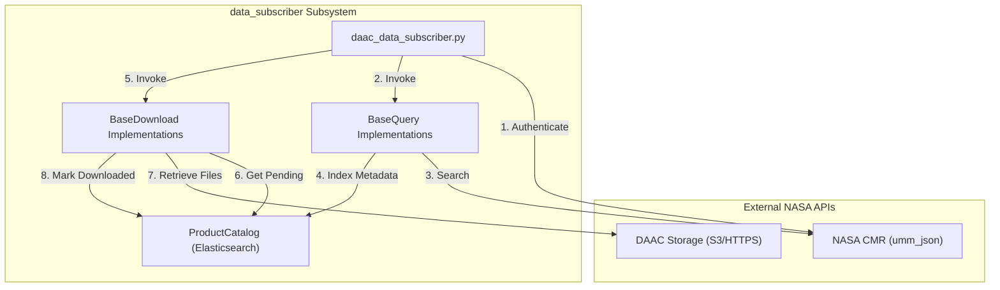

# Page: Data Subscriber: CMR Querying and DAAC Ingestion

# Data Subscriber: CMR Querying and DAAC Ingestion

Relevant source files

The following files were used as context for generating this wiki page:

- [data_subscriber/__init__.py](data_subscriber/__init__.py)
- [data_subscriber/catalog.py](data_subscriber/catalog.py)
- [data_subscriber/cmr.py](data_subscriber/cmr.py)
- [data_subscriber/daac_data_subscriber.py](data_subscriber/daac_data_subscriber.py)
- [data_subscriber/download.py](data_subscriber/download.py)
- [data_subscriber/parser.py](data_subscriber/parser.py)
- [data_subscriber/survey.py](data_subscriber/survey.py)
- [tests/data_subscriber/test_daac_data_subscriber.py](tests/data_subscriber/test_daac_data_subscriber.py)

The `data_subscriber` subsystem is the ingestion engine of the OPERA SDS. It is responsible for discovering, cataloging, and downloading Earth observation data from NASA's Common Metadata Repository (CMR) and Distributed Active Archive Centers (DAACs) such as LP DAAC and ASF. It supports a variety of sensor data including HLS, Sentinel-1 (SLC, RTC, CSLC), and NISAR (GCOV).

## Operational Modes

The subscriber operates in three primary modes, defined in the CLI entry point `daac_data_subscriber.py` [data_subscriber/daac_data_subscriber.py:69-79]().

| Mode | Function | Description |
| :--- | :--- | :--- |
| `survey` | `run_survey` | Performs high-concurrency CMR queries to analyze data availability and latency without downloading [data_subscriber/survey.py:31-70](). |
| `query` | `run_query` | Queries CMR for new granules, filters them based on project requirements, and indexes them into the `ProductCatalog` [data_subscriber/daac_data_subscriber.py:87-109](). |
| `download` | `run_download` | Retrieves pending granules from the catalog and performs physical file transfers via S3 or HTTPS [data_subscriber/daac_data_subscriber.py:110-135](). |
| `full` | Both | Executes both `query` and `download` sequentially in a single job [data_subscriber/daac_data_subscriber.py:72-78](). |

**Sources:** [data_subscriber/daac_data_subscriber.py:69-79](), [data_subscriber/survey.py:31-70]().

## Subsystem Architecture

The subscriber follows a factory pattern where the specific `CmrQuery`, `ProductCatalog`, and `DaacDownload` implementations are instantiated based on the `Collection` or `Provider` requested in the command line arguments [data_subscriber/daac_data_subscriber.py:87-161]().

### Component Interaction

The following diagram illustrates how the `daac_data_subscriber` coordinates between CMR, the local Elasticsearch catalog, and the DAAC storage.

**Data Subscriber Flow**

**Sources:** [data_subscriber/daac_data_subscriber.py:48-84](), [data_subscriber/download.py:42-65](), [data_subscriber/cmr.py:173-181]().

## Core Framework Entities

The system relies on several base classes to provide common functionality across different product types.

*   **`BaseQuery`**: Handles the logic for constructing CMR queries using temporal and spatial (BBOX) parameters [data_subscriber/cmr.py:129-171]().
*   **`BaseDownload`**: Manages the download lifecycle, including directory setup, credential management via Earthdata Login (EDL), and metadata extraction [data_subscriber/download.py:28-65]().
*   **`ProductCatalog`**: An abstract interface for an Elasticsearch-backed database that tracks the state of every discovered granule (e.g., `downloaded: True/False`) [data_subscriber/catalog.py:18-24]().

For details on the shared infrastructure, see [Core Subscriber Framework: CMR Client, Catalog, and Download Base](#3.1).

**Sources:** [data_subscriber/download.py:28-41](), [data_subscriber/catalog.py:18-28](), [data_subscriber/cmr.py:129-138]().

## Product-Specific Pipelines

While the framework provides the structure, each product type (HLS, SLC, RTC, CSLC, GCOV) has unique requirements for spatial filtering, grouping, and triggering downstream PGEs.

### HLS and SLC
Standard query and download pipelines for Harmonized Landsat Sentinel-2 and Sentinel-1 Single Look Complex data.
*   For details, see [HLS and SLC Data Subscribers](#3.2).

### RTC and DSWx-S1 Triggering
The RTC subscriber evaluates MGRS burst sets. Once a burst set meets coverage thresholds, it triggers the DSWx-S1 (Dynamic Surface Water Extent) PGE.
*   For details, see [RTC Data Subscriber and DSWx-S1 Triggering](#3.3).

### CSLC and DISP-S1
The CSLC subscriber manages complex dependencies for the Displacement (DISP-S1) product, including "k-satiety" logic to ensure a sufficient temporal baseline of products is available before processing.
*   For details, see [CSLC and DISP-S1 Data Subscriber](#3.4).

### GCOV and NISAR
Dedicated pipeline for NISAR Geocoded Covariance products, utilizing specific track/cycle/frame mapping.
*   For details, see [GCOV and NISAR Data Subscribers](#3.5).

## Class and File Mapping

The following table bridges the high-level product types to their specific implementation classes.

| Product Type | Query Class | Catalog Class | Download Class |
| :--- | :--- | :--- | :--- |
| **HLS** | `HlsCmrQuery` | `HLSProductCatalog` | `DaacDownloadLpdaac` |
| **SLC** | `SlcCmrQuery` | `SLCProductCatalog` | `AsfDaacSlcDownload` |
| **RTC** | `RtcCmrQuery` | `RTCProductCatalog` | `AsfDaacRtcDownload` |
| **CSLC** | `CslcCmrQuery` | `CSLCProductCatalog` | `AsfDaacCslcDownload` |
| **GCOV** | `NisarGcovCmrQuery` | `NisarGcovProductCatalog` | `AsfDaacGcovDownload` |

**Sources:** [data_subscriber/daac_data_subscriber.py:90-132](), [data_subscriber/daac_data_subscriber.py:143-159]().
