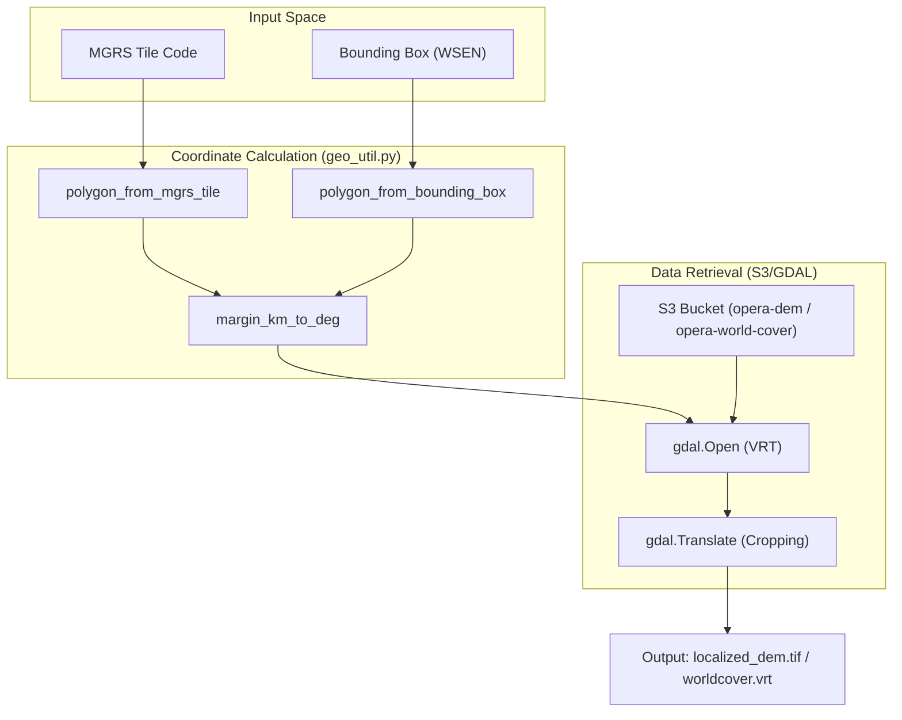
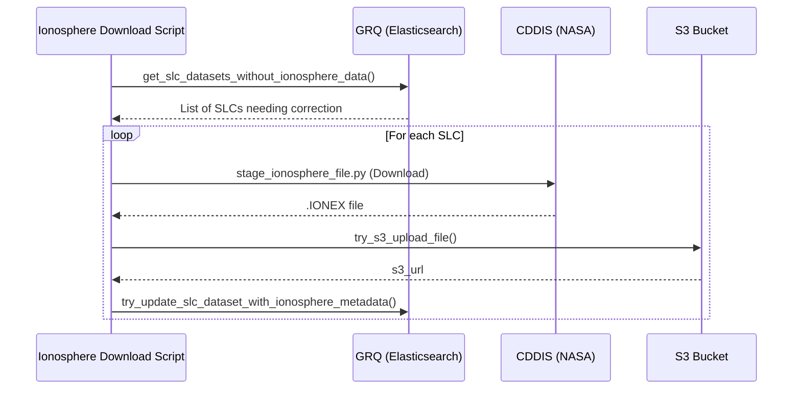

# Page: DEM, WorldCover, and Ancillary Map Staging

# DEM, WorldCover, and Ancillary Map Staging

Relevant source files

The following files were used as context for generating this wiki page:

- [data_subscriber/aws_token.py](data_subscriber/aws_token.py)
- [data_subscriber/ionosphere_download.py](data_subscriber/ionosphere_download.py)
- [geo/geo_util.py](geo/geo_util.py)
- [tests/unit/opera_chimera/test_precondition_functions.py](tests/unit/opera_chimera/test_precondition_functions.py)
- [tests/unit/tools/test_stage_ionosphere_file.py](tests/unit/tools/test_stage_ionosphere_file.py)
- [tests/unit/tools/test_stage_orbit_file.py](tests/unit/tools/test_stage_orbit_file.py)
- [tools/dataspace_s1_download.py](tools/dataspace_s1_download.py)
- [tools/ops/granule_revisions/detect_multiple_revisions.py](tools/ops/granule_revisions/detect_multiple_revisions.py)
- [tools/ops/pcm_audit/hls_audit.py](tools/ops/pcm_audit/hls_audit.py)
- [tools/ops/pcm_audit/slc_audit.py](tools/ops/pcm_audit/slc_audit.py)
- [tools/stage_ancillary_map.py](tools/stage_ancillary_map.py)
- [tools/stage_dem.py](tools/stage_dem.py)
- [tools/stage_ionosphere_file.py](tools/stage_ionosphere_file.py)
- [tools/stage_orbit_file.py](tools/stage_orbit_file.py)
- [tools/stage_worldcover.py](tools/stage_worldcover.py)
- [util/aws_util.py](util/aws_util.py)
- [util/backoff_util.py](util/backoff_util.py)
- [util/dataspace_util.py](util/dataspace_util.py)
- [util/edl_util.py](util/edl_util.py)
- [util/exec_util.py](util/exec_util.py)
- [util/geo_util.py](util/geo_util.py)
- [util/grq_client.py](util/grq_client.py)
- [util/sds_itertools.py](util/sds_itertools.py)

This section describes the suite of tools used to stage and prepare ancillary data required for PGE (Product Generation Executable) processing. These tools handle the discovery, spatial cropping, and temporal matching of Digital Elevation Models (DEM), land cover maps, orbit ephemeris files, and ionosphere correction data.

## Overview and Purpose

Ancillary data staging is a critical pre-processing step in the OPERA SDS pipeline. PGEs like DSWx (Dynamic Surface Water Extent) and CSLC (Co-registered Single Look Complex) require local subsets of global datasets. The staging tools interface with S3-managed buckets (for DEMs and WorldCover) and external providers like ESA's Dataspace or NASA's CDDIS (for orbits and ionosphere files).

Key responsibilities include:
*   **Spatial Subsetting**: Calculating bounding boxes from MGRS tiles or SLC footprints [tools/stage_dem.py:63-96]().
*   **VRT Assembly**: Creating GDAL Virtual Raster (VRT) files to represent mosaic views of global data [tools/stage_dem.py:162-174]().
*   **Temporal Matching**: Identifying the specific orbit or ionosphere file corresponding to a granule's sensing time [tools/stage_orbit_file.py:133-152]().

---

## Data Flow: Spatial Data Staging

The following diagram illustrates the flow from a request (defined by a Bounding Box or MGRS Tile) to the generation of a localized GeoTIFF/VRT for PGE consumption.

### Spatial Staging Logic

**Sources:** [tools/stage_dem.py:23-60](), [tools/stage_worldcover.py:21-66](), [util/geo_util.py:74-114]()

---

## DEM and WorldCover Staging

`stage_dem.py` and `stage_worldcover.py` follow a similar pattern for subsetting global datasets stored in S3.

### Bounding Box and Margin Logic
The system computes a spatial extent based on either an MGRS tile code or a provided bounding box [tools/stage_dem.py:63-96](). A configurable margin (default 5km) is added to ensure coverage for PGE interpolation and processing buffers [tools/stage_dem.py:53-53]().

### GDAL Translation and Snapping
To ensure the output subset aligns perfectly with the source grid, the tools implement coordinate snapping:
*   **Pixel Snapping**: Coordinates are snapped using the DEM pixel spacing (`xres`, `yres`) [tools/stage_dem.py:142-149]().
*   **Translation**: `gdal.Translate` is called with a `projWin` parameter to extract the specific window from the global VRT [tools/stage_dem.py:162-174]().
*   **Resilience**: The process is wrapped in `backoff` decorators to handle AWS S3 throttling or transient network issues [tools/stage_dem.py:99-99]().

| Feature | DEM Staging (`stage_dem.py`) | WorldCover Staging (`stage_worldcover.py`) |
| :--- | :--- | :--- |
| **Source Bucket** | `opera-dem` [tools/stage_dem.py:23]() | `opera-world-cover` [tools/stage_worldcover.py:21]() |
| **Default Output** | `dem.vrt` [tools/stage_dem.py:34]() | `worldcover.vrt` [tools/stage_worldcover.py:38]() |
| **Metadata** | Elevation (meters) | ESA Land Cover Classes (v100/2020) |

**Sources:** [tools/stage_dem.py:100-176](), [tools/stage_worldcover.py:106-169]()

---

## Orbit and Ionosphere File Staging

Unlike static maps, orbit and ionosphere files are highly dynamic and must be matched to the sensing time of the input SLC.

### Orbit File Staging (`stage_orbit_file.py`)
This tool queries ESA's Dataspace to find Precise Orbit Ephemeris (POEORB) or Restituted Orbit Ephemeris (RESORB) files [tools/stage_orbit_file.py:33-40]().
*   **Time Range**: It parses the sensing start/stop from the SLC SAFE filename [tools/stage_orbit_file.py:133-152]().
*   **Padding**: Applies an orbital period margin (`T_ORBIT`) to ensure the ascending node crossing is captured [tools/stage_orbit_file.py:42-61]().
*   **Session Management**: Uses `DataspaceSession` to handle OData API authentication [tools/stage_orbit_file.py:25-31]().

### Ionosphere Correction (`stage_ionosphere_file.py`)
Used primarily for CSLC processing, this tool retrieves IONEX files from NASA CDDIS [tools/stage_ionosphere_file.py:27-28]().
*   **Provider Types**: Supports JPL, ESA, and COD providers [tools/stage_ionosphere_file.py:38-41]().
*   **Download Strategy**: Interfaces with EarthData Login (EDL) using `SessionWithHeaderRedirection` to handle authentication redirects [tools/stage_ionosphere_file.py:25-25]().

### Ionosphere Processing Flow

**Sources:** [data_subscriber/ionosphere_download.py:45-102](), [tools/stage_ionosphere_file.py:48-99](), [util/grq_client.py:15-41]()

---

## Implementation Details

### Bounding Box Extraction
The function `bounding_box_from_slc_granule` in `util/geo_util.py` extracts the spatial footprint from an SLC SAFE archive by parsing the `manifest.safe` XML file [util/geo_util.py:34-45](). It specifically handles antimeridian crossings by "unwrapping" longitude coordinates if the delta exceeds 180 degrees [util/geo_util.py:63-70]().

### S3 Upload Utilities
Staged files are often uploaded back to S3 for PGE access. The `util/aws_util.py` provides `concurrent_s3_client_try_upload_file`, which uses a `ThreadPoolExecutor` and a `Semaphore` to manage parallel uploads while respecting system resource limits [util/aws_util.py:19-38]().

### External API Sessions
The system utilizes specialized session classes for external data providers:
*   **`DataspaceSession`**: Manages token acquisition and refresh for ESA Dataspace [tools/dataspace_s1_download.py:26-29]().
*   **`SessionWithHeaderRedirection`**: A `requests.Session` subclass that ensures authentication headers are preserved across CDDIS/EarthData redirects [tools/stage_ionosphere_file.py:25-25]().

**Sources:** [util/geo_util.py:34-72](), [util/aws_util.py:19-56](), [tools/dataspace_s1_download.py:180-187](), [data_subscriber/aws_token.py:10-25]()
