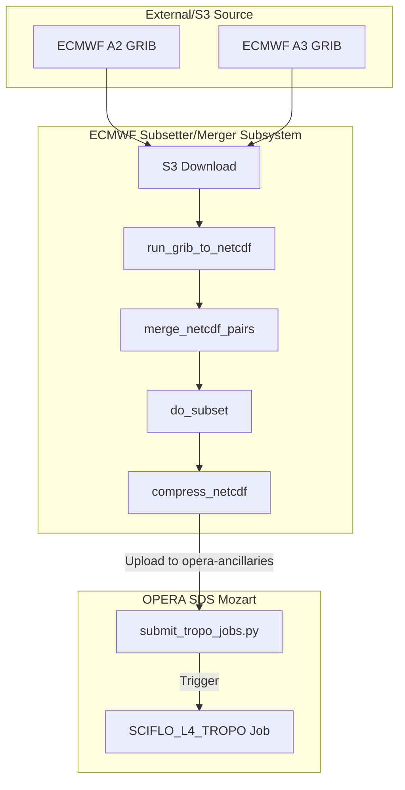
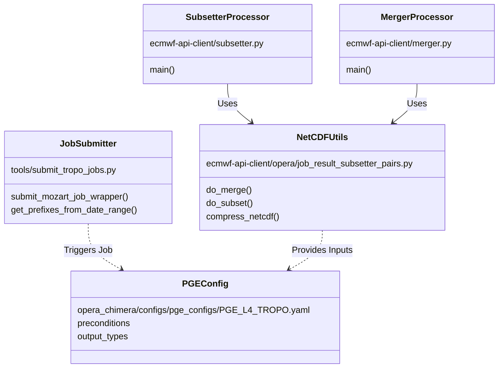

# Page: ECMWF Tropospheric Data Pipeline (L4 TROPO)

# ECMWF Tropospheric Data Pipeline (L4 TROPO)

<details>
<summary>Relevant source files</summary>

The following files were used as context for generating this wiki page:

- [airflow/.gitignore](airflow/.gitignore)
- [airflow/IngressError.md](airflow/IngressError.md)
- [airflow/dags/config/airflow_local_settings.py](airflow/dags/config/airflow_local_settings.py)
- [airflow/dags/tropoDagLocal.py](airflow/dags/tropoDagLocal.py)
- [airflow/terraform/cloud/airflow/airflow-values.yaml](airflow/terraform/cloud/airflow/airflow-values.yaml)
- [airflow/terraform/cloud/karpenter/karpenter-values.yaml](airflow/terraform/cloud/karpenter/karpenter-values.yaml)
- [airflow/terraform/cloud/karpenter/main.tf](airflow/terraform/cloud/karpenter/main.tf)
- [airflow/terraform/cloud/karpenter/outputs.tf](airflow/terraform/cloud/karpenter/outputs.tf)
- [airflow/terraform/cloud/karpenter/variables.tf](airflow/terraform/cloud/karpenter/variables.tf)
- [airflow/terraform/cloud/main.tf](airflow/terraform/cloud/main.tf)
- [airflow/terraform/cloud/variables.tf](airflow/terraform/cloud/variables.tf)
- [airflow/terraform/local/disable_pod_cleanup.sh](airflow/terraform/local/disable_pod_cleanup.sh)
- [conf/RunConfig.yaml.L4_TROPO.jinja2.tmpl](conf/RunConfig.yaml.L4_TROPO.jinja2.tmpl)
- [conf/schema/RunConfig_schema.L4_TROPO.yaml](conf/schema/RunConfig_schema.L4_TROPO.yaml)
- [conf/sds/files/factotum/cron/hysdsops](conf/sds/files/factotum/cron/hysdsops)
- [conf/sds/files/factotum/cron/submit_job.py](conf/sds/files/factotum/cron/submit_job.py)
- [conf/sds/files/mozart/cron/hysdsops](conf/sds/files/mozart/cron/hysdsops)
- [docker/hysds-io.json.SCIFLO_L4_TROPO](docker/hysds-io.json.SCIFLO_L4_TROPO)
- [docker/hysds-io.json.merger](docker/hysds-io.json.merger)
- [docker/job-spec.json.SCIFLO_L4_TROPO](docker/job-spec.json.SCIFLO_L4_TROPO)
- [docker/job-spec.json.merger](docker/job-spec.json.merger)
- [ecmwf-api-client/entrypoint_merger.py](ecmwf-api-client/entrypoint_merger.py)
- [ecmwf-api-client/merger.py](ecmwf-api-client/merger.py)
- [ecmwf-api-client/opera/grib_to_netcdf_runner.py](ecmwf-api-client/opera/grib_to_netcdf_runner.py)
- [ecmwf-api-client/opera/job_result_subsetter_pairs.py](ecmwf-api-client/opera/job_result_subsetter_pairs.py)
- [ecmwf-api-client/opera/merge.py](ecmwf-api-client/opera/merge.py)
- [ecmwf-api-client/opera/subset.py](ecmwf-api-client/opera/subset.py)
- [ecmwf-api-client/run_ecmwf_merger_daily.sh](ecmwf-api-client/run_ecmwf_merger_daily.sh)
- [ecmwf-api-client/run_merger.sh](ecmwf-api-client/run_merger.sh)
- [ecmwf-api-client/run_merger_by_range_linux.sh](ecmwf-api-client/run_merger_by_range_linux.sh)
- [ecmwf-api-client/run_merger_by_range_macos.sh](ecmwf-api-client/run_merger_by_range_macos.sh)
- [ecmwf-api-client/run_subsetter.sh](ecmwf-api-client/run_subsetter.sh)
- [ecmwf-api-client/run_subsetter_by_range_linux.sh](ecmwf-api-client/run_subsetter_by_range_linux.sh)
- [ecmwf-api-client/run_subsetter_by_range_macos.sh](ecmwf-api-client/run_subsetter_by_range_macos.sh)
- [ecmwf-api-client/scripts/get_aws_stats.sh](ecmwf-api-client/scripts/get_aws_stats.sh)
- [ecmwf-api-client/subsetter.py](ecmwf-api-client/subsetter.py)
- [ecmwf-api-client/temp.py](ecmwf-api-client/temp.py)
- [opera_chimera/configs/pge_configs/PGE_L4_TROPO.yaml](opera_chimera/configs/pge_configs/PGE_L4_TROPO.yaml)
- [opera_chimera/wf_xml/L4_TROPO.sf.xml](opera_chimera/wf_xml/L4_TROPO.sf.xml)
- [tools/ops/disp_s1_status/disp_s1_hist_status.py](tools/ops/disp_s1_status/disp_s1_hist_status.py)
- [tools/ops/disp_s1_status/disp_s1_hist_status.sh](tools/ops/disp_s1_status/disp_s1_hist_status.sh)
- [tools/ops/disp_s1_status/disp_s1_hist_status_render.py](tools/ops/disp_s1_status/disp_s1_hist_status_render.py)
- [tools/submit_tropo_jobs.py](tools/submit_tropo_jobs.py)
- [tools/testing/validate_cslc_downloads.py](tools/testing/validate_cslc_downloads.py)

</details>


The ECMWF Tropospheric Data Pipeline is responsible for acquiring High-Resolution (HRES) GRIB data from the European Centre for Medium-Range Weather Forecasts (ECMWF) and processing it into Level 4 Tropospheric Zenith Delay products. This system supports both a standalone subsetting/merging utility and a full Science Data System (SDS) PGE workflow (`SCIFLO_L4_TROPO`).

## System Overview and Data Flow

The pipeline operates in two primary phases: 
1. **Acquisition and Pre-processing**: Raw ECMWF GRIB files (A2 and A3 types) are downloaded, converted to NetCDF4, merged, and optionally subsetted to a specific geographic region.
2. **PGE Execution**: The processed NetCDF files serve as primary inputs to the `L4_TROPO` PGE, which generates the final Tropospheric Zenith Delay products.

### Data Flow Diagram: GRIB to L4 Product

The following diagram illustrates the transition from raw ECMWF data to the final SDS product.


**Sources:** [ecmwf-api-client/subsetter.py:20-85](), [ecmwf-api-client/merger.py:20-96](), [tools/submit_tropo_jobs.py:69-151]()

## ECMWF API Client Subsystem

The `ecmwf-api-client` directory contains the logic for handling raw meteorological data. It primarily deals with two types of GRIB files: `A2` (Analysis) and `A3` (Forecast) data.

### Subsetter and Merger Implementation
The system provides two main entry points for processing raw GRIB data:
*   **`merger.py`**: Downloads A2 and A3 pairs, converts them using `run_grib_to_netcdf`, and merges them into a single global NetCDF file [ecmwf-api-client/merger.py:54-78]().
*   **`subsetter.py`**: Extends the merger logic by applying a geographic subsetting operation (`do_subset`) after the merge [ecmwf-api-client/subsetter.py:70-71]().

Key processing classes and functions:
*   `JobResultSubsetterPairs`: A utility class that manages the lifecycle of NetCDF operations, including merging, subsetting, and S3 uploads [ecmwf-api-client/opera/job_result_subsetter_pairs.py:23-139]().
*   `run_grib_to_netcdf`: A wrapper that invokes the GRIB-to-NetCDF conversion engine [ecmwf-api-client/merger.py:10]().
*   `compress_netcdf`: Uses `nccopy` to compress the resulting NetCDF files with a specific deflation level (default 5) [ecmwf-api-client/opera/job_result_subsetter_pairs.py:62-79]().

### Automated Submission Scripts
Operational processing is triggered via shell scripts that iterate over date ranges and submit jobs to Mozart:
*   `run_subsetter_by_range_linux.sh`: Submits `job-subsetter` tasks to the `opera-job_worker-ecmwf-subsetter` queue [ecmwf-api-client/run_subsetter_by_range_linux.sh:81-83]().
*   `run_merger_by_range_linux.sh`: Similar to the subsetter but targets the merger job type.

**Sources:** [ecmwf-api-client/subsetter.py:1-85](), [ecmwf-api-client/merger.py:1-96](), [ecmwf-api-client/opera/job_result_subsetter_pairs.py:23-80]()

## L4_TROPO PGE Orchestration

Once the ECMWF data is pre-processed and staged in the `opera-ancillaries` bucket, it can be processed by the `SCIFLO_L4_TROPO` workflow.

### Job Submission
The `tools/submit_tropo_jobs.py` script is used to manually or programmatically trigger L4 TROPO jobs. It filters S3 objects by prefix or date and submits them to the Mozart API [tools/submit_tropo_jobs.py:49-67]().

```python
# Example Mozart Job Submission
job_id = try_submit_mozart_job(
    product=product,
    job_queue='opera-job_worker-sciflo-l4_tropo',
    rule_name=f"trigger-{job_type}",
    params=params,
    job_spec=f"{job_type}:{release}",
    job_name=f"job-WF-SCIFLO_L4_TROPO-for-{prod_timestamp}",
)
```
**Sources:** [tools/submit_tropo_jobs.py:139-146]()

### PGE Configuration (RunConfig)
The PGE execution is driven by a Jinja2-templated `RunConfig.yaml`. Key parameters include:
*   **`InputFilePaths`**: Path to the pre-processed ECMWF NetCDF file [conf/RunConfig.yaml.L4_TROPO.jinja2.tmpl:8-11]().
*   **`worker_settings`**: Dask-specific configurations for parallel processing, including `n_workers` and `max_memory` [conf/RunConfig.yaml.L4_TROPO.jinja2.tmpl:45-49]().
*   **`output_heights`**: A predefined list of vertical levels (from -500m to 80,301m) for which tropospheric delay is calculated [opera_chimera/configs/pge_configs/PGE_L4_TROPO.yaml:26-171]().

### Chimera Preconditions
The `PGE_L4_TROPO.yaml` defines the necessary steps before the Docker container runs:
*   `get_tropo_input_filepaths`: Locates the specific ECMWF NetCDF file for the acquisition timestamp [opera_chimera/configs/pge_configs/PGE_L4_TROPO.yaml:186]().
*   `get_product_version`: Retrieves the current version string for the TROPO product [opera_chimera/configs/pge_configs/PGE_L4_TROPO.yaml:192-193]().

**Sources:** [conf/RunConfig.yaml.L4_TROPO.jinja2.tmpl:1-69](), [opera_chimera/configs/pge_configs/PGE_L4_TROPO.yaml:1-238]()

## Orchestration Alternatives

While the primary production path uses HySDS (Mozart/SciFlo), the codebase contains infrastructure for Airflow-based orchestration as a modern alternative.

### Airflow DAGs
The `airflow/dags/tropoDagLocal.py` (referenced in file list) provides a DAG-based approach to the TROPO pipeline. This is supported by a Terraform-deployed Airflow cluster on AWS EKS using Karpenter for auto-scaling [airflow/terraform/cloud/karpenter/main.tf]().

### Cron-based Scheduling
On the `factotum` and `mozart` nodes, crontabs are used to automate the pipeline:
*   `submit_tropo_jobs.py`: Scheduled on `factotum` to run daily and process ECMWF data with a specific forward-mode age [conf/sds/files/factotum/cron/hysdsops:11]().
*   `run_ecmwf_merger_daily.sh`: Scheduled on `mozart` to ensure daily merger tasks are submitted [conf/sds/files/mozart/cron/hysdsops:5]().

**Sources:** [conf/sds/files/factotum/cron/hysdsops:1-21](), [conf/sds/files/mozart/cron/hysdsops:1-6]()

## Code Entity Map

The following diagram maps the logical pipeline steps to specific classes and files within the `ecmwf-api-client` and `opera_chimera` subsystems.


**Sources:** [tools/submit_tropo_jobs.py:69](), [ecmwf-api-client/subsetter.py:20](), [ecmwf-api-client/merger.py:20](), [ecmwf-api-client/opera/job_result_subsetter_pairs.py:23](), [opera_chimera/configs/pge_configs/PGE_L4_TROPO.yaml:182]()
