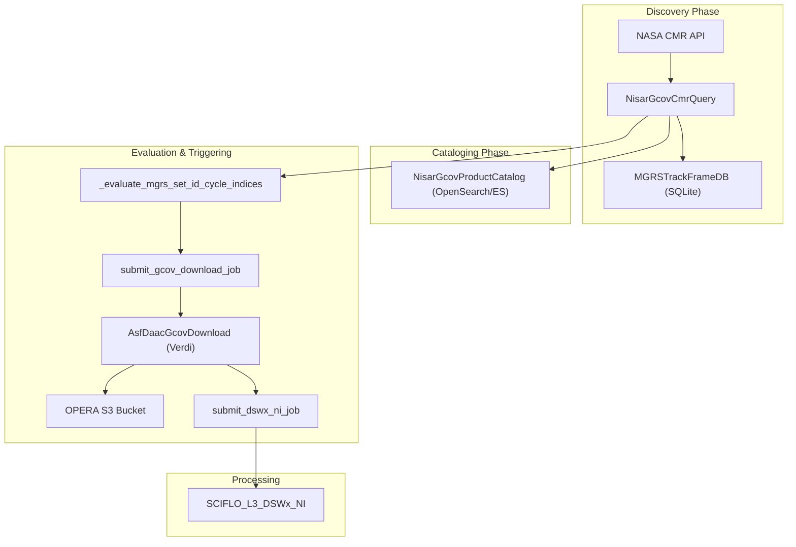
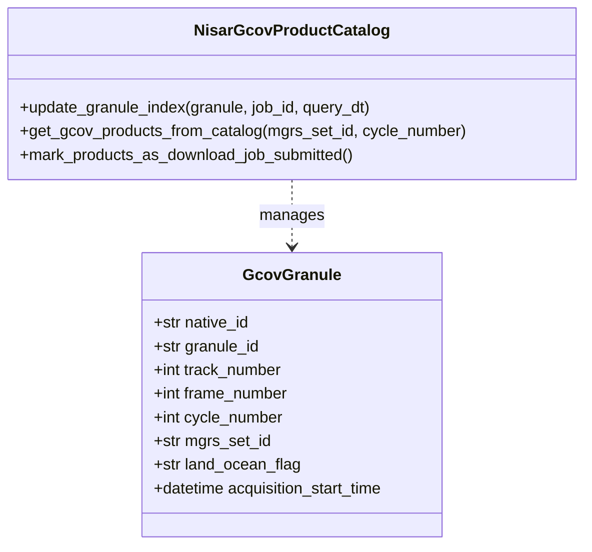

# Page: GCOV and NISAR Data Subscribers

# GCOV and NISAR Data Subscribers

Relevant source files

The following files were used as context for generating this wiki page:

- [data_subscriber/gcov/__init__.py](data_subscriber/gcov/__init__.py)
- [data_subscriber/gcov/asf_gcov_download.py](data_subscriber/gcov/asf_gcov_download.py)
- [data_subscriber/gcov/gcov_catalog.py](data_subscriber/gcov/gcov_catalog.py)
- [data_subscriber/gcov/gcov_query.py](data_subscriber/gcov/gcov_query.py)
- [data_subscriber/gcov/mgrs_track_collections_db.py](data_subscriber/gcov/mgrs_track_collections_db.py)
- [data_subscriber/gcov_utils.py](data_subscriber/gcov_utils.py)
- [tests/unit/conftest.py](tests/unit/conftest.py)
- [tests/unit/data_subscriber/rtc/test_evaluator.py](tests/unit/data_subscriber/rtc/test_evaluator.py)
- [tests/unit/data_subscriber/test_catalog.py](tests/unit/data_subscriber/test_catalog.py)
- [tests/unit/data_subscriber/test_gcov_query.py](tests/unit/data_subscriber/test_gcov_query.py)

The GCOV (Geocoded Covariance) data subscriber is responsible for discovering, cataloging, and downloading NISAR L2 GCOV products from the NASA CMR (Common Metadata Repository) and ASF (Alaska Satellite Facility) DAAC. This subsystem identifies relevant granules based on track, cycle, and frame IDs, evaluates them against MGRS (Military Grid Reference System) tile collections, and triggers downstream **DSWx-NI** (Dynamic Surface Water Extent - NISAR) processing workflows.

## 1. System Architecture and Data Flow

The GCOV pipeline follows a discovery-to-trigger pattern. It queries CMR for new granules, maps them to MGRS sets using a specialized SQLite database, and evaluates if enough frames are present to trigger a DSWx-NI SciFlo job.

### Data Flow Diagram: Discovery to Trigger
The following diagram illustrates the flow from CMR discovery to the submission of SciFlo jobs.

**Sources:** [data_subscriber/gcov/gcov_query.py:21-46](), [data_subscriber/gcov/asf_gcov_download.py:16-24](), [data_subscriber/gcov_utils.py:74-117]()

## 2. GCOV Query and MGRS Mapping

The `NisarGcovCmrQuery` class extends `BaseQuery` to handle NISAR-specific metadata extraction. A critical component of this process is the mapping of NISAR granules (defined by track and frame) to MGRS sets used for DSWx-NI products.

### Key Classes and Logic
- **`NisarGcovCmrQuery`**: Orchestrates the CMR query and initial processing of results [data_subscriber/gcov/gcov_query.py:21-30]().
- **`MGRSTrackFrameDB`**: A wrapper around a SQLite database (e.g., `MGRS_collection_db_DSWx-NI_v0.1.sqlite`) that provides spatial lookups between NISAR frame numbers and MGRS set IDs [data_subscriber/gcov/mgrs_track_collections_db.py:5-13]().
- **Granule Extraction**: The system extracts `track_number`, `frame_number`, and `cycle_number` from the NISAR granule ID using regex patterns [data_subscriber/gcov/gcov_query.py:130-135]().

### MGRS Set Evaluation
The `_evaluate_mgrs_set_id_cycle_indices` function determines if a collection of frames for a specific MGRS set and cycle is ready for processing [data_subscriber/gcov/gcov_query.py:48-75]().

| Parameter | Source | Description |
| :--- | :--- | :--- |
| `coverage_target` | Settings/Args | Percentage of expected frames that must be present (0-100) [data_subscriber/gcov/gcov_query.py:54-56](). |
| `min_num_frames` | Settings/Args | Minimum absolute number of frames required to trigger [data_subscriber/gcov/gcov_query.py:51-53](). |
| `grace_mins` | Settings/Args | Minutes to wait after the last frame arrival before triggering a partial set [data_subscriber/gcov/gcov_query.py:57-59](). |

**Sources:** [data_subscriber/gcov/gcov_query.py:48-127](), [data_subscriber/gcov/mgrs_track_collections_db.py:41-61](), [data_subscriber/gcov_utils.py:21-48]()

## 3. Product Cataloging

The `NisarGcovProductCatalog` manages the state of discovered GCOV granules in Elasticsearch or OpenSearch. It uses a specialized index pattern `nisar_gcov_catalog*` [data_subscriber/gcov/gcov_catalog.py:38-39]().

### Catalog Entity Mapping
The catalog stores `GcovGranule` dataclass instances, which include both CMR metadata and SDS-specific tracking fields.

**Sources:** [data_subscriber/gcov/gcov_catalog.py:20-36](), [data_subscriber/gcov/gcov_catalog.py:44-67]()

## 4. Download and Triggering Implementation

The `AsfDaacGcovDownload` class handles the retrieval of `.h5` files from ASF. It supports both HTTPS localization and direct S3-to-S3 transfers if the DAAC provides S3 URIs [data_subscriber/gcov/asf_gcov_download.py:16-24]().

### Download Execution Flow
1. **Localization**: If using HTTPS, it utilizes a `ThreadPoolExecutor` to download products to the local worker disk [data_subscriber/gcov/asf_gcov_download.py:53-61]().
2. **S3 Staging**: Downloaded files are uploaded to the OPERA `DATASET_BUCKET` under the `tmp/dswx_ni/{batch_id}` prefix [data_subscriber/gcov/asf_gcov_download.py:69-73]().
3. **Job Submission**: Once files are staged, it calls `trigger_dswx_ni_jobs` to submit SciFlo workflows to the `opera-job_worker-sciflo-l3_dswx_ni` queue [data_subscriber/gcov/asf_gcov_download.py:147-156]().

### DSWx-NI Job Parameters
The `create_dswx_ni_job_params` function constructs the `product_metadata` object required by the SciFlo PGE [data_subscriber/gcov/asf_gcov_download.py:103-145]().

| Parameter Name | Type | Value Source |
| :--- | :--- | :--- |
| `mgrs_set_id` | text | Extracted from `DswxNiProductsToProcess` [data_subscriber/gcov/asf_gcov_download.py:125-128](). |
| `cycle_number` | text | Extracted from `DswxNiProductsToProcess` [data_subscriber/gcov/asf_gcov_download.py:130-133](). |
| `gcov_input_product_urls` | object | List of staged S3 paths [data_subscriber/gcov/asf_gcov_download.py:135-138](). |

**Sources:** [data_subscriber/gcov/asf_gcov_download.py:33-88](), [data_subscriber/gcov_utils.py:119-139]()
