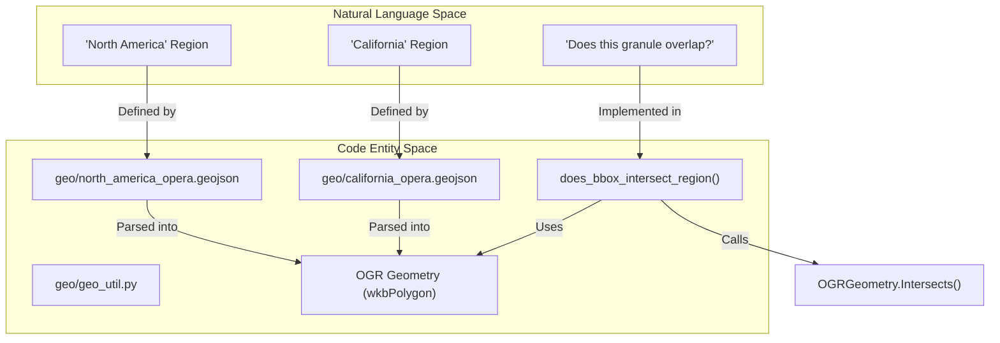
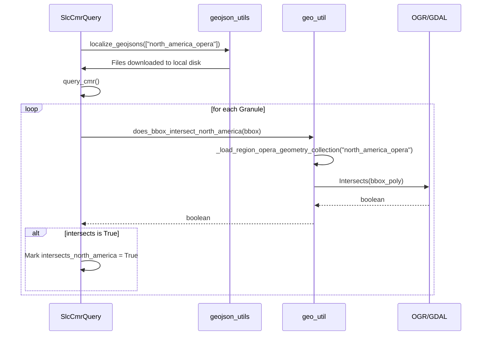

# Page: Geospatial Utilities and AOI GeoJSON Data

# Geospatial Utilities and AOI GeoJSON Data

Relevant source files

The following files were used as context for generating this wiki page:

- [data_subscriber/cslc/cslc_static_query.py](data_subscriber/cslc/cslc_static_query.py)
- [data_subscriber/geojson_utils.py](data_subscriber/geojson_utils.py)
- [data_subscriber/hls/hls_query.py](data_subscriber/hls/hls_query.py)
- [data_subscriber/slc/slc_query.py](data_subscriber/slc/slc_query.py)
- [docker/hysds-io.json.disp_static_query](docker/hysds-io.json.disp_static_query)
- [docker/job-spec.json.disp_static_query](docker/job-spec.json.disp_static_query)
- [geo/__init__.py](geo/__init__.py)
- [geo/california_opera.geojson](geo/california_opera.geojson)
- [geo/data/10TFP.geojson](geo/data/10TFP.geojson)
- [geo/data/42QYM.geojson](geo/data/42QYM.geojson)
- [geo/data/california_opera.geojson](geo/data/california_opera.geojson)
- [geo/data/calval_test_frame_only.geojson](geo/data/calval_test_frame_only.geojson)
- [geo/data/cslc-s1_priority_framebased.geojson](geo/data/cslc-s1_priority_framebased.geojson)
- [geo/data/dissolved_cslc-s1_priority_framebased.geojson](geo/data/dissolved_cslc-s1_priority_framebased.geojson)
- [geo/data/nevada_opera.geojson](geo/data/nevada_opera.geojson)
- [geo/data/north_america_opera.geojson](geo/data/north_america_opera.geojson)
- [geo/data/north_america_opera_2023-09-14.geojson](geo/data/north_america_opera_2023-09-14.geojson)
- [geo/data/north_america_opera_dissolved_with_sub_zone.geojson](geo/data/north_america_opera_dissolved_with_sub_zone.geojson)
- [geo/data/opera_NA_expanded.geojson](geo/data/opera_NA_expanded.geojson)
- [geo/data/opera_NA_expanded_difference.geojson](geo/data/opera_NA_expanded_difference.geojson)
- [geo/geo_util.py](geo/geo_util.py)
- [geo/north_america_opera.geojson](geo/north_america_opera.geojson)
- [tests/unit/opera_chimera/test_precondition_functions.py](tests/unit/opera_chimera/test_precondition_functions.py)
- [tools/dist_s1_input_tool.py](tools/dist_s1_input_tool.py)
- [tools/ops/cmr_audit/README.md](tools/ops/cmr_audit/README.md)
- [tools/ops/cmr_audit/cmr_audit_dist_s1.py](tools/ops/cmr_audit/cmr_audit_dist_s1.py)
- [tools/stage_ancillary_map.py](tools/stage_ancillary_map.py)
- [tools/stage_dem.py](tools/stage_dem.py)
- [tools/stage_worldcover.py](tools/stage_worldcover.py)
- [util/geo_util.py](util/geo_util.py)

The `geo/` module and associated GeoJSON data provide the spatial filtering logic and region definitions required for OPERA data discovery and processing. These utilities are primarily used by the `data_subscriber` to determine if discovered granules fall within the OPERA project's Areas of Interest (AOI), such as North America or California, and by ancillary staging tools to calculate bounding boxes for DEM and land cover maps.

## Geo-Utility Implementation

The core spatial intersection logic is implemented in `geo/geo_util.py` using the `osgeo` (GDAL/OGR) library.

### Key Functions

*   **`does_bbox_intersect_region(bbox, region)`**: The base function for spatial filtering. It converts a bounding box (list of coordinate dictionaries) into an OGR `wkbLinearRing` and `wkbPolygon`, then checks for intersection against a cached OGR `GeometryCollection` loaded from a GeoJSON file [geo/geo_util.py:44-66]().
*   **`does_bbox_intersect_north_america(bbox)`**: A convenience wrapper that checks intersection against the `north_america_opera` region [geo/geo_util.py:19-30]().
*   **`does_bbox_intersect_california(bbox)`**: A convenience wrapper for the `california_opera` region [geo/geo_util.py:32-42]().
*   **`_load_region_opera_geometry_collection(region)`**: Loads a GeoJSON file and converts its features into a single `wkbGeometryCollection`. This function is decorated with `@cache` to minimize I/O and parsing overhead during high-volume queries [geo/geo_util.py:69-79]().

### Data Flow: Natural Language to Code Entity Space

The following diagram illustrates how high-level region requirements are translated into code entities and geometric operations.

**Region Intersection Logic Flow**

Sources: [geo/geo_util.py:11-80](), [geo/north_america_opera.geojson:1-10]()

---

## AOI GeoJSON Data

The repository contains several GeoJSON files defining processing regions. These files are typically stored in the `geo/` directory or a dedicated S3 bucket configured via `GEOJSON_BUCKET` [data_subscriber/geojson_utils.py:23-24]().

| File | Purpose |
| :--- | :--- |
| `north_america_opera.geojson` | Defines the primary OPERA AOI including the US, Canada border, Mexico, and Central America [geo/geo_util.py:23-24](). |
| `california_opera.geojson` | Defines the State of California for specific product sub-selections [geo/california_opera.geojson:1-3](). |
| `cslc-s1_priority_framebased.geojson` | Used for CSLC-S1 processing to prioritize specific Sentinel-1 frames. |

### GeoJSON Localization
The `data_subscriber/geojson_utils.py` utility provides logic to "localize" these files. Before a query begins, the system attempts to download the required GeoJSON from S3 to the local working directory [data_subscriber/geojson_utils.py:21-40]().

Sources: [geo/geo_util.py:11-12](), [data_subscriber/geojson_utils.py:21-40](), [geo/california_opera.geojson:1-3]()

---

## Usage in Data Subscriber

The `data_subscriber` uses these utilities to filter granules discovered via CMR.

### SLC Query Filtering
The `SlcCmrQuery` class utilizes `does_bbox_intersect_north_america` to tag granules. If a granule intersects North America, an additional field `intersects_north_america` is set to `True` in the metadata catalog [data_subscriber/slc/slc_query.py:23-28]().

### Dynamic Region Filtering
Subscribers support `--include-regions` and `--exclude-regions` CLI arguments. The `filter_granules_by_regions` function iterates through discovered granules and uses `does_bbox_intersect_region` to include or discard them based on the provided GeoJSON region names [data_subscriber/geojson_utils.py:50-80]().

**Subscriber Spatial Filtering Flow**

Sources: [data_subscriber/slc/slc_query.py:11-28](), [data_subscriber/geojson_utils.py:50-80](), [geo/geo_util.py:19-30]()

---

## Ancillary Data Bounding Box Utilities

While the `geo/` module handles AOI intersections, `util/geo_util.py` provides lower-level geometric calculations for staging ancillary data like DEMs and WorldCover maps.

### Bounding Box Extraction
*   **`bounding_box_from_slc_granule(safe_file_path)`**: Extracts the footprint from a Sentinel-1 SAFE archive's `manifest.safe` file. It handles antimeridian crossings by "unwrapping" coordinates if the longitude span exceeds 180 degrees [util/geo_util.py:34-72]().
*   **`bounding_box_from_mgrs_tile(mgrs_tile_code, margin_in_km)`**: Converts an MGRS tile code into a geographic bounding box (WSEN). This involves transforming coordinates from the tile's UTM zone to EPSG:4326 [util/geo_util.py:117-181]().

### Staging Tools
The staging scripts (`stage_dem.py`, `stage_worldcover.py`) use these utilities to define the `projWin` for `gdal.Translate`.
*   **`determine_polygon`**: In both `stage_dem.py` and `stage_worldcover.py`, this function resolves the target area from either a direct bounding box or an MGRS tile code, applying a user-defined margin in kilometers [tools/stage_dem.py:63-96](), [tools/stage_worldcover.py:69-102]().

Sources: [util/geo_util.py:34-181](), [tools/stage_dem.py:100-177](), [tools/stage_worldcover.py:133-169]()
