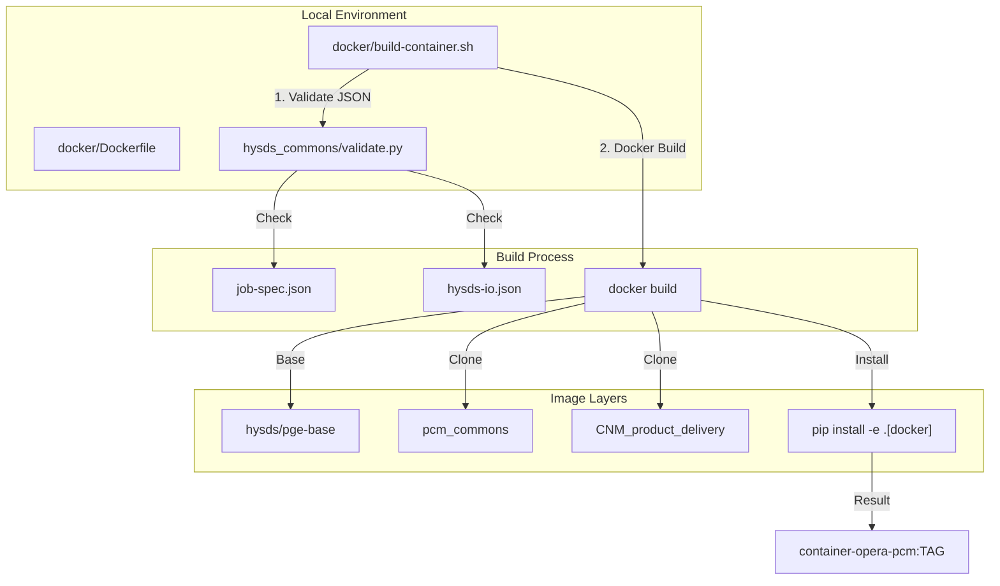

# Page: Getting Started and Development Setup

# Getting Started and Development Setup

<details>
<summary>Relevant source files</summary>

The following files were used as context for generating this wiki page:

- [.gitignore](.gitignore)
- [.python-version](.python-version)
- [cluster_provisioning/ebs-snapshot/override.tf](cluster_provisioning/ebs-snapshot/override.tf)
- [cluster_provisioning/run_opera_smoke_tests.sh](cluster_provisioning/run_opera_smoke_tests.sh)
- [conf/sds/files/opensearch_dashboards.yml](conf/sds/files/opensearch_dashboards.yml)
- [conf/sds/files/opensearch_dashboards_import/import_dashboard.sh.tmpl](conf/sds/files/opensearch_dashboards_import/import_dashboard.sh.tmpl)
- [conf/sds/files/opensearch_dashboards_import/sdswatch-dashboards-old.json](conf/sds/files/opensearch_dashboards_import/sdswatch-dashboards-old.json)
- [docker/Dockerfile](docker/Dockerfile)
- [docker/build-container.sh](docker/build-container.sh)
- [pip.conf](pip.conf)
- [pytest.ini](pytest.ini)
- [setup.py](setup.py)
- [tools/__init__.py](tools/__init__.py)

</details>


This page provides technical instructions for setting up the `opera-sds-pcm` repository for local development, building the core Docker images used in the Process Control Mirror (PCM), and executing the multi-tiered test suite.

## Python Environment and Dependencies

The project officially targets Python **3.9.21** as specified in the [ .python-version:1-1](). 

### Package Installation (setup.py)

The `opera-pcm` package uses `setuptools` with several `extras_require` categories to manage dependencies for different operational contexts. This allows developers to install only what is necessary for their specific task.

| Extra Name | Purpose | Key Dependencies |
| :--- | :--- | :--- |
| `test` | Local unit testing and full module execution | `hysds`, `chimera`, `pytest`, `shapely`, `numpy` |
| `subscriber` | Standalone Data Subscriber execution | `elasticsearch`, `boto3`, `geopandas`, `fastparquet` |
| `integration` | Running end-to-end integration tests | `python-dotenv`, `pytest-xdist`, `opensearch-py` |
| `docker` | Dependencies included in the production PGE image | `yamale`, `ruamel.yaml`, `mgrs`, `rioxarray` |
| `cmr_audit` | Tools for reconciling SDS state with NASA CMR | `aiohttp`, `compact-json`, `mypy-boto3-s3` |

To install the package for local development and testing, use:
```bash
pip install -e '.[test]'
```
For integration testing, include the additional extras:
```bash
pip install -e '.[test,integration,subscriber]'
```

**Sources:** [setup.py:5-189](), [ .python-version:1-1]()

---

## Docker Image Build Process

The PCM relies on Docker containers to encapsulate the Process Generation Environment (PGE). The build process is orchestrated via `docker/build-container.sh` and defined in `docker/Dockerfile`.

### Build Workflow Data Flow

The following diagram illustrates how the build script interacts with the environment and the Docker daemon to produce the `opera-pcm` image.

**PCM Docker Build Pipeline**


### Key Build Implementation Details
1.  **Validation**: Before building, the script calls `validate.py` from `hysds_commons` to ensure all HySDS configuration files (`job-spec.json`, `hysds-io.json`) are schema-valid [docker/build-container.sh:57-62]().
2.  **Base Image**: The Dockerfile builds upon `hysds/pge-base` [docker/Dockerfile:1-2]().
3.  **Internal Dependencies**: It clones and installs private JPL repositories: `pcm_commons` and `CNM_product_delivery` using a `GIT_OAUTH_TOKEN` [docker/Dockerfile:38-54]().
4.  **Entrypoint**: The container uses `/entrypoint-pge-with-stats.sh` to manage PGE execution and resource tracking [docker/Dockerfile:71-71]().

**Sources:** [docker/build-container.sh:1-143](), [docker/Dockerfile:1-75]()

---

## Local Test Execution

The repository uses `pytest` as its primary testing framework, configured via `pytest.ini`.

### Unit Tests
Unit tests are located in `tests/unit`. They are designed to run without a full SDS cluster, often utilizing `elasticmock` or `mockito` to simulate external services [setup.py:21-32]().
```bash
pytest tests/unit
```

### Integration and Smoke Tests
Integration tests verify the interaction between the Data Subscriber, the Product Catalog (Elasticsearch/OpenSearch), and the triggering logic.

#### .env Configuration
Integration tests require a `.env` file or exported environment variables to point to a running HySDS cluster (Mozart/GRQ). The `cluster_provisioning/run_opera_smoke_tests.sh` script automates the export of these variables:

| Variable | Description |
| :--- | :--- |
| `ES_HOST` | IP/Hostname of the Mozart/Elasticsearch instance [cluster_provisioning/run_opera_smoke_tests.sh:124-124]() |
| `GRQ_BASE_URL` | API endpoint for the Geo-Region Query service [cluster_provisioning/run_opera_smoke_tests.sh:127-127]() |
| `CNMR_TOPIC` | SNS Topic ARN for Cloud Notification Mechanism [cluster_provisioning/run_opera_smoke_tests.sh:128-128]() |
| `RS_BUCKET` | S3 bucket for Result Storage [cluster_provisioning/run_opera_smoke_tests.sh:130-130]() |

#### Running Smoke Tests
The smoke test suite is executed using the following pattern:
```bash
# From cluster_provisioning/run_opera_smoke_tests.sh
pytest --maxfail=2 --numprocesses=auto \
  tests/integration/test_integration.py::test_subscriber_slc \
  tests/integration/test_integration.py::test_subscriber_l30 \
  tests/integration/test_integration.py::test_subscriber_s30
```

**Sources:** [pytest.ini:1-35](), [cluster_provisioning/run_opera_smoke_tests.sh:124-161](), [setup.py:123-138]()

---

## Development Utilities

### Package Registry
JPL developers should configure `pip` to use the internal Artifactory for resolving dependencies. A template `pip.conf` is provided to point to the `pypi-release-virtual` index [pip.conf:9-12]().

### Dashboard Management
For developers working on the Metrics subsystem, `conf/sds/files/opensearch_dashboards_import/import_dashboard.sh.tmpl` provides a template for importing OpenSearch Dashboards (Kibana) saved objects, such as index patterns for `logstash-*` and `sdswatch-*` [conf/sds/files/opensearch_dashboards_import/import_dashboard.sh.tmpl:8-17]().

**Sources:** [pip.conf:1-12](), [conf/sds/files/opensearch_dashboards_import/import_dashboard.sh.tmpl:1-18]()
