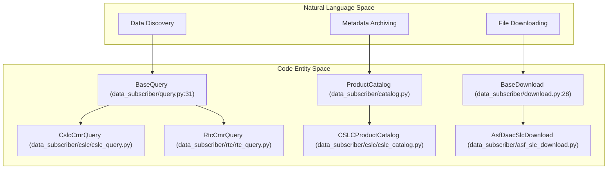
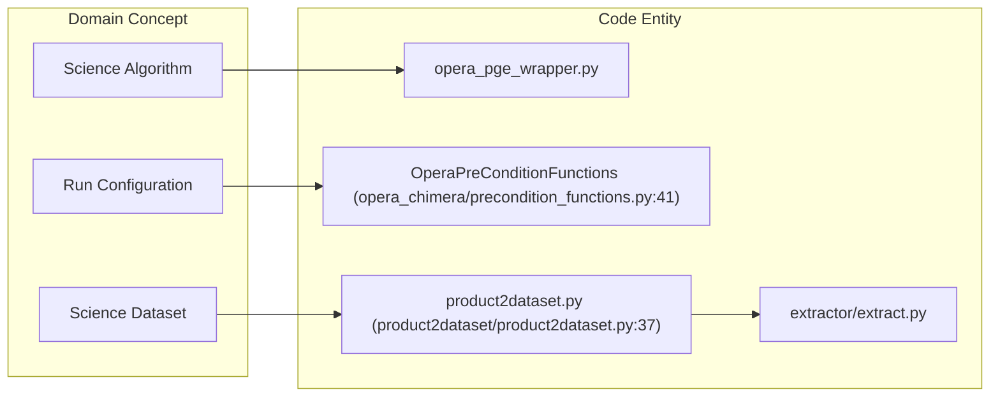

# Page: Glossary

# Glossary

Relevant source files

The following files were used as context for generating this wiki page:

- [.gitignore](.gitignore)
- [cluster_provisioning/dev-e2e/variables.tf](cluster_provisioning/dev-e2e/variables.tf)
- [cluster_provisioning/dev-int/override.tf](cluster_provisioning/dev-int/override.tf)
- [cluster_provisioning/dev-releaser/variables.tf](cluster_provisioning/dev-releaser/variables.tf)
- [cluster_provisioning/dev/variables.tf](cluster_provisioning/dev/variables.tf)
- [cluster_provisioning/ebs-snapshot/variables.tf](cluster_provisioning/ebs-snapshot/variables.tf)
- [cluster_provisioning/int/variables.tf](cluster_provisioning/int/variables.tf)
- [cluster_provisioning/modules/common/variables.tf](cluster_provisioning/modules/common/variables.tf)
- [conf/pge_outputs.yaml](conf/pge_outputs.yaml)
- [conf/sds/files/datasets.json](conf/sds/files/datasets.json)
- [conf/sds/files/datasets.json.tmpl.asg](conf/sds/files/datasets.json.tmpl.asg)
- [conf/sds/rules/user_rules-cnm.json.tmpl](conf/sds/rules/user_rules-cnm.json.tmpl)
- [conf/settings.yaml](conf/settings.yaml)
- [data_subscriber/asf_cslc_download.py](data_subscriber/asf_cslc_download.py)
- [data_subscriber/asf_rtc_download.py](data_subscriber/asf_rtc_download.py)
- [data_subscriber/asf_rtc_for_dist_download.py](data_subscriber/asf_rtc_for_dist_download.py)
- [data_subscriber/asf_slc_download.py](data_subscriber/asf_slc_download.py)
- [data_subscriber/cmr.py](data_subscriber/cmr.py)
- [data_subscriber/cslc/cslc_catalog.py](data_subscriber/cslc/cslc_catalog.py)
- [data_subscriber/cslc/cslc_download.sh](data_subscriber/cslc/cslc_download.sh)
- [data_subscriber/cslc/cslc_query.py](data_subscriber/cslc/cslc_query.py)
- [data_subscriber/cslc_utils.py](data_subscriber/cslc_utils.py)
- [data_subscriber/daac_data_subscriber.py](data_subscriber/daac_data_subscriber.py)
- [data_subscriber/dist_s1_utils.py](data_subscriber/dist_s1_utils.py)
- [data_subscriber/download.py](data_subscriber/download.py)
- [data_subscriber/lpdaac_download.py](data_subscriber/lpdaac_download.py)
- [data_subscriber/parser.py](data_subscriber/parser.py)
- [data_subscriber/query.py](data_subscriber/query.py)
- [data_subscriber/rtc/evaluator.py](data_subscriber/rtc/evaluator.py)
- [data_subscriber/rtc/mgrs_bursts_collection_db_client.py](data_subscriber/rtc/mgrs_bursts_collection_db_client.py)
- [data_subscriber/rtc/rtc_catalog.py](data_subscriber/rtc/rtc_catalog.py)
- [data_subscriber/rtc/rtc_query.py](data_subscriber/rtc/rtc_query.py)
- [data_subscriber/rtc_for_dist/dist_dependency.py](data_subscriber/rtc_for_dist/dist_dependency.py)
- [data_subscriber/rtc_for_dist/rtc_for_dist_catalog.py](data_subscriber/rtc_for_dist/rtc_for_dist_catalog.py)
- [data_subscriber/rtc_for_dist/rtc_for_dist_query.py](data_subscriber/rtc_for_dist/rtc_for_dist_query.py)
- [data_subscriber/submit_pending_jobs.py](data_subscriber/submit_pending_jobs.py)
- [data_subscriber/survey.py](data_subscriber/survey.py)
- [data_subscriber/url.py](data_subscriber/url.py)
- [docker/Dockerfile](docker/Dockerfile)
- [extractor/extract.py](extractor/extract.py)
- [opera_chimera/accountability.py](opera_chimera/accountability.py)
- [opera_chimera/configs/pge_configs/PGE_L3_DISP_S1.yaml](opera_chimera/configs/pge_configs/PGE_L3_DISP_S1.yaml)
- [opera_chimera/configs/pge_configs/PGE_L3_DSWx_NI.yaml](opera_chimera/configs/pge_configs/PGE_L3_DSWx_NI.yaml)
- [opera_chimera/configs/pge_configs/PGE_L3_DSWx_S1.yaml](opera_chimera/configs/pge_configs/PGE_L3_DSWx_S1.yaml)
- [opera_chimera/constants/opera_chimera_const.py](opera_chimera/constants/opera_chimera_const.py)
- [opera_chimera/opera_pge_job_submitter.py](opera_chimera/opera_pge_job_submitter.py)
- [opera_chimera/postprocess_functions.py](opera_chimera/postprocess_functions.py)
- [opera_chimera/precondition_functions.py](opera_chimera/precondition_functions.py)
- [opera_chimera/wf_xml/L3_DSWx_NI.sf.xml](opera_chimera/wf_xml/L3_DSWx_NI.sf.xml)
- [opera_chimera/wf_xml/L3_DSWx_S1.sf.xml](opera_chimera/wf_xml/L3_DSWx_S1.sf.xml)
- [opera_commons/logger.py](opera_commons/logger.py)
- [product2dataset/iso_xml_reader.py](product2dataset/iso_xml_reader.py)
- [product2dataset/product2dataset.py](product2dataset/product2dataset.py)
- [rtc_utils.py](rtc_utils.py)
- [setup.py](setup.py)
- [tests/data_subscriber/empty_disp_s1_blackout.json](tests/data_subscriber/empty_disp_s1_blackout.json)
- [tests/data_subscriber/sample_disp_s1_blackout.json](tests/data_subscriber/sample_disp_s1_blackout.json)
- [tests/data_subscriber/test_cslc_query.py](tests/data_subscriber/test_cslc_query.py)
- [tests/data_subscriber/test_cslc_util.py](tests/data_subscriber/test_cslc_util.py)
- [tests/data_subscriber/test_daac_data_subscriber.py](tests/data_subscriber/test_daac_data_subscriber.py)
- [tests/data_subscriber/test_dist_s1_utils.py](tests/data_subscriber/test_dist_s1_utils.py)
- [tests/data_subscriber/test_rtc_for_dist_query.py](tests/data_subscriber/test_rtc_for_dist_query.py)
- [tests/product2dataset/test_product2dataset.py](tests/product2dataset/test_product2dataset.py)
- [tests/tools/test_run_disp_s1_historical_processing.py](tests/tools/test_run_disp_s1_historical_processing.py)
- [tests/unit/util/test_pge_util.py](tests/unit/util/test_pge_util.py)
- [tools/__init__.py](tools/__init__.py)
- [tools/disp_s1_burst_db_tool.py](tools/disp_s1_burst_db_tool.py)
- [tools/dist_s1_burst_db_tool.py](tools/dist_s1_burst_db_tool.py)
- [tools/populate_cmr_rtc_cache.py](tools/populate_cmr_rtc_cache.py)
- [tools/run_disp_s1_historical_processing.py](tools/run_disp_s1_historical_processing.py)
- [tools/truncate_disp_s1_burst_db.py](tools/truncate_disp_s1_burst_db.py)
- [tools/view_pending_jobs.py](tools/view_pending_jobs.py)
- [util/job_json_util.py](util/job_json_util.py)
- [util/pge_util.py](util/pge_util.py)
- [wrapper/opera_pge_wrapper.py](wrapper/opera_pge_wrapper.py)
- [wrapper/pge_functions.py](wrapper/pge_functions.py)

This page provides definitions for codebase-specific terms, acronyms, and domain concepts used within the OPERA SDS PCM.

## Core System Concepts

### HySDS (Hybrid Cloud Science Data System)
The underlying framework used to orchestrate data processing. It consists of several specialized nodes:
*   **Mozart**: The job management and orchestration node [cluster_provisioning/dev-e2e/variables.tf:160-169]().
*   **GRQ (Global Resource Query)**: The metadata catalog and discovery node [cluster_provisioning/modules/common/variables.tf:111-120]().
*   **Verdi**: The worker nodes that execute PGE jobs [cluster_provisioning/modules/common/variables.tf:258-321]().
*   **Factotum**: The workflow management node [cluster_provisioning/dev-e2e/variables.tf:196-208]().

### PGE (Product Generation Executive)
A containerized scientific algorithm that transforms input data into science products. PCM manages the lifecycle of these PGEs through the `opera_chimera` and `opera_pge_wrapper` layers [opera_chimera/precondition_functions.py:41-45](), [product2dataset/product2dataset.py:37-46]().

### Venue
A deployment environment identifier (e.g., `dev`, `int`, `ops`, `pst`) used to isolate infrastructure and configuration [cluster_provisioning/modules/common/variables.tf:46-47](), [conf/settings.yaml:1]().

---

## Data Subscriber Terms

### CMR (Common Metadata Repository)
The NASA system queried by the SDS to discover new science granules for processing [data_subscriber/cmr.py:1](), [data_subscriber/daac_data_subscriber.py:65]().

### Collection
A grouping of products in CMR (e.g., `OPERA_L2_RTC-S1_V1`). PCM maps these collections to internal `ProductType` enums [data_subscriber/daac_data_subscriber.py:88](), [conf/settings.yaml:14-49]().

### Grace Period
A configurable delay (in minutes) before the system forces processing of incomplete data sets (like RTC burst sets) to account for data delivery latency [conf/settings.yaml:76, 85, 114]().

### K-Satiety / K-Multiple
A parameter (often `k`) defining the number of acquisition cycles required before a frame is considered "full" or "satiated" for displacement processing [data_subscriber/rtc_for_dist/rtc_for_dist_query.py:22](), [conf/settings.yaml:90]().

### MGRS (Military Grid Reference System)
A grid-based system used to organize RTC and DSWx products into spatial "tiles" or "sets" [conf/settings.yaml:77, 116](), [data_subscriber/rtc_for_dist/rtc_for_dist_query.py:40]().

---

## Code Entity Mapping

The following diagram bridges natural language domain concepts to specific Python classes and Terraform entities within the codebase.

### Subscriber Logic Mapping
"This diagram maps the high-level data discovery concepts to the specific implementation classes in the data_subscriber module."

**Sources:** [data_subscriber/query.py:31](), [data_subscriber/daac_data_subscriber.py:11-36](), [data_subscriber/download.py:28]().

### PGE Execution Mapping
"This diagram shows how scientific algorithm requirements (PGEs) are translated into HySDS job entities and dataset outputs."

**Sources:** [opera_chimera/precondition_functions.py:41](), [product2dataset/product2dataset.py:37](), [wrapper/pge_functions.py:10]().

---

## Technical Acronyms

| Acronym | Definition | Code Context |
| :--- | :--- | :--- |
| **ASG** | Auto Scaling Group | AWS EC2 scaling for Verdi workers [cluster_provisioning/modules/common/variables.tf:205-215]() |
| **CNM** | Cloud Notification Mechanism | Delivery protocol for DAAC ingestion [conf/sds/rules/user_rules-cnm.json.tmpl]() |
| **CSLC** | Co-registered Single Look Complex | L2 product type [conf/settings.yaml:18]() |
| **DAAC** | Distributed Active Archive Center | External data providers (ASF, LPDAAC) [data_subscriber/download.py:18]() |
| **DSWx** | Dynamic Surface Water Extent | L3 product type (HLS or S1 based) [conf/settings.yaml:14, 28]() |
| **EDL** | Earthdata Login | Authentication for NASA data [data_subscriber/daac_data_subscriber.py:65]() |
| **PST** | Project Support Team | Venue for CalVal validation [conf/settings.yaml:9]() |
| **RTC** | Radiometric Terrain Corrected | L2 product type [conf/settings.yaml:19]() |

---

## Infrastructure Implementation

The PCM infrastructure is defined via Terraform, mapping HySDS roles to specific AWS resource configurations.

### Node Queue Configuration
PCM defines specific worker queues for different PGE types, mapping them to AWS instance types and storage requirements.

| Queue Name | Instance Types | Data Disk Size | Source |
| :--- | :--- | :--- | :--- |
| `opera-job_worker-sciflo-l2_cslc_s1` | c7i.2xlarge, c6a.2xlarge | 300 GB | [cluster_provisioning/modules/common/variables.tf:260-270]() |
| `opera-job_worker-sciflo-l2_rtc_s1` | c7i.2xlarge, c6a.4xlarge | 100 GB | [cluster_provisioning/modules/common/variables.tf:282-292]() |
| `opera-job_worker-sciflo-l3_dswx_hls` | c7a.large, c6a.large | 100 GB | [cluster_provisioning/modules/common/variables.tf:304-315]() |

**Sources:** [cluster_provisioning/modules/common/variables.tf:258-321](), [cluster_provisioning/dev-e2e/variables.tf:160-245]().