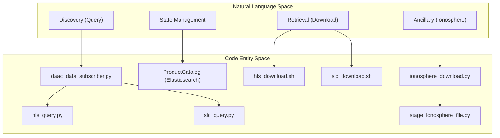
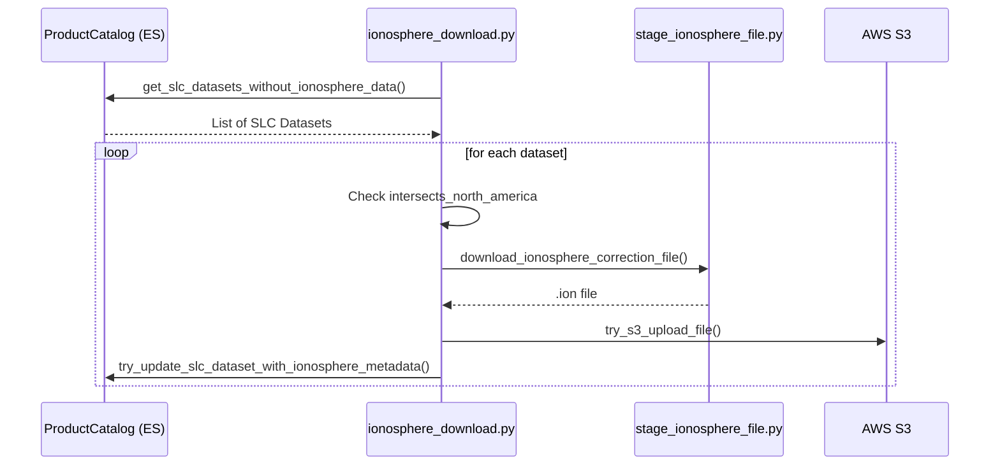

# Page: HLS and SLC Data Subscribers

# HLS and SLC Data Subscribers

Relevant source files

The following files were used as context for generating this wiki page:

- [data_subscriber/aws_token.py](data_subscriber/aws_token.py)
- [data_subscriber/cslc/cslc_static_query.py](data_subscriber/cslc/cslc_static_query.py)
- [data_subscriber/dataspace_download.py](data_subscriber/dataspace_download.py)
- [data_subscriber/esa_dataspace.py](data_subscriber/esa_dataspace.py)
- [data_subscriber/geojson_utils.py](data_subscriber/geojson_utils.py)
- [data_subscriber/hls/hls_download.sh](data_subscriber/hls/hls_download.sh)
- [data_subscriber/hls/hls_query.py](data_subscriber/hls/hls_query.py)
- [data_subscriber/hls/hlsl30_query.sh](data_subscriber/hls/hlsl30_query.sh)
- [data_subscriber/hls/hlss30_query.sh](data_subscriber/hls/hlss30_query.sh)
- [data_subscriber/ionosphere_download.py](data_subscriber/ionosphere_download.py)
- [data_subscriber/slc/slc_download.sh](data_subscriber/slc/slc_download.sh)
- [data_subscriber/slc/slc_query.py](data_subscriber/slc/slc_query.py)
- [data_subscriber/slc/slcs1a_query.sh](data_subscriber/slc/slcs1a_query.sh)
- [data_subscriber/slc/slcs1b_query.sh](data_subscriber/slc/slcs1b_query.sh)
- [docker/hysds-io.json.hls_download](docker/hysds-io.json.hls_download)
- [docker/hysds-io.json.hlsl30_query](docker/hysds-io.json.hlsl30_query)
- [docker/hysds-io.json.hlsl30_query_minutes](docker/hysds-io.json.hlsl30_query_minutes)
- [docker/hysds-io.json.hlsl30_query_native_id](docker/hysds-io.json.hlsl30_query_native_id)
- [docker/hysds-io.json.hlss30_query](docker/hysds-io.json.hlss30_query)
- [docker/hysds-io.json.hlss30_query_minutes](docker/hysds-io.json.hlss30_query_minutes)
- [docker/hysds-io.json.hlss30_query_native_id](docker/hysds-io.json.hlss30_query_native_id)
- [docker/hysds-io.json.slc_download](docker/hysds-io.json.slc_download)
- [docker/hysds-io.json.slc_download_ionosphere](docker/hysds-io.json.slc_download_ionosphere)
- [docker/hysds-io.json.slcs1a_query](docker/hysds-io.json.slcs1a_query)
- [docker/hysds-io.json.slcs1a_query_minutes](docker/hysds-io.json.slcs1a_query_minutes)
- [docker/hysds-io.json.slcs1a_query_native_id](docker/hysds-io.json.slcs1a_query_native_id)
- [docker/hysds-io.json.slcs1b_query](docker/hysds-io.json.slcs1b_query)
- [docker/hysds-io.json.slcs1b_query_minutes](docker/hysds-io.json.slcs1b_query_minutes)
- [docker/hysds-io.json.slcs1b_query_native_id](docker/hysds-io.json.slcs1b_query_native_id)
- [docker/job-spec.json.hls_download](docker/job-spec.json.hls_download)
- [docker/job-spec.json.hlsl30_query](docker/job-spec.json.hlsl30_query)
- [docker/job-spec.json.hlsl30_query_minutes](docker/job-spec.json.hlsl30_query_minutes)
- [docker/job-spec.json.hlsl30_query_native_id](docker/job-spec.json.hlsl30_query_native_id)
- [docker/job-spec.json.hlss30_query](docker/job-spec.json.hlss30_query)
- [docker/job-spec.json.hlss30_query_minutes](docker/job-spec.json.hlss30_query_minutes)
- [docker/job-spec.json.hlss30_query_native_id](docker/job-spec.json.hlss30_query_native_id)
- [docker/job-spec.json.slc_download](docker/job-spec.json.slc_download)
- [docker/job-spec.json.slc_download_ionosphere](docker/job-spec.json.slc_download_ionosphere)
- [docker/job-spec.json.slcs1a_query](docker/job-spec.json.slcs1a_query)
- [docker/job-spec.json.slcs1a_query_minutes](docker/job-spec.json.slcs1a_query_minutes)
- [docker/job-spec.json.slcs1a_query_native_id](docker/job-spec.json.slcs1a_query_native_id)
- [docker/job-spec.json.slcs1b_query](docker/job-spec.json.slcs1b_query)
- [docker/job-spec.json.slcs1b_query_minutes](docker/job-spec.json.slcs1b_query_minutes)
- [docker/job-spec.json.slcs1b_query_native_id](docker/job-spec.json.slcs1b_query_native_id)
- [tools/ops/granule_revisions/detect_multiple_revisions.py](tools/ops/granule_revisions/detect_multiple_revisions.py)
- [tools/ops/pcm_audit/hls_audit.py](tools/ops/pcm_audit/hls_audit.py)
- [tools/ops/pcm_audit/slc_audit.py](tools/ops/pcm_audit/slc_audit.py)
- [tools/slc_latency_survey.py](tools/slc_latency_survey.py)
- [util/exec_util.py](util/exec_util.py)
- [util/grq_client.py](util/grq_client.py)
- [util/sds_itertools.py](util/sds_itertools.py)

This section provides a technical deep dive into the data subscriber implementations for **Harmonized Landsat Sentinel-2 (HLS)** and **Single Look Complex (SLC)** Sentinel-1 products. These subscribers are responsible for discovering new granules via NASA CMR (Common Metadata Repository), managing their state in the SDS Product Catalog, and orchestrating downloads from LPDAAC and ASF (Alaska Satellite Facility).

## Overview of HLS and SLC Pipelines

The HLS and SLC pipelines follow the standard subscriber pattern: a **Query** phase that identifies new data and a **Download** phase that retrieves the files. For SLC data, an additional **Ionosphere** retrieval step is required to support downstream CSLC (Co-registered SLC) processing.

### Data Flow and Implementation

The following diagram illustrates the transition from the high-level operational concepts to the specific code entities that implement the HLS and SLC logic.

**HLS/SLC Subscriber Architecture**

Sources: [data_subscriber/daac_data_subscriber.py:1-50](), [data_subscriber/hls/hls_query.py:1-20](), [data_subscriber/slc/slc_query.py:1-20](), [data_subscriber/ionosphere_download.py:1-30]()

---

## HLS Data Subscriber

The HLS subscriber handles two primary collections from LPDAAC: **HLSL30** (Landsat 8) and **HLSS30** (Sentinel-2).

### Query Implementation
The HLS query is initiated via `daac_data_subscriber.py` using the `query` command and the specific collection name [data_subscriber/hls/hlss30_query.sh:23-24]().
*   **Temporal Logic**: Supports both datetime range queries and "minutes elapsed" queries for forward processing [docker/hysds-io.json.hlsl30_query_minutes:15-20]().
*   **Spatial Filtering**: Uses bounding boxes provided during job submission to restrict the search area [docker/hysds-io.json.hlsl30_query:24-28]().
*   **Revision Management**: Tracks granule revisions (up to a default `max_revision` of 1000) to ensure the latest version of a product is always processed [docker/hysds-io.json.hlsl30_query:54-62]().

### Download Implementation
HLS downloads are executed via `hls_download.sh`, which wraps the core subscriber download logic [docker/job-spec.json.hls_download:2-5]().
*   **Batching**: Downloads are typically batched by `batch_ids` to optimize worker utilization [docker/hysds-io.json.hls_download:14-18]().
*   **Transfer Protocols**: Supports `auto` protocol selection, allowing the system to choose between HTTPS and S3 (if running within the same AWS region as the DAAC) [docker/hysds-io.json.hls_download:50-56]().

Sources: [data_subscriber/hls/hlss30_query.sh:1-35](), [docker/hysds-io.json.hlsl30_query:1-96](), [docker/job-spec.json.hls_download:1-47]()

---

## SLC Data Subscriber and Ionosphere Retrieval

The SLC subscriber manages Sentinel-1 Single Look Complex data from ASF. Unlike HLS, SLC processing for OPERA requires precise ionospheric correction files.

### Ionosphere Download Pipeline
The `ionosphere_download.py` script is a specialized worker that identifies SLC datasets lacking ionospheric metadata and retrieves the necessary correction files [data_subscriber/ionosphere_download.py:152-159]().

**SLC-Ionosphere Processing Flow**

Sources: [data_subscriber/ionosphere_download.py:45-102](), [util/grq_client.py:25-25]()

**Key Components:**
1.  **Spatial Filter**: Only datasets covering North America (`intersects_north_america`) are processed for ionosphere retrieval [data_subscriber/ionosphere_download.py:61-63]().
2.  **Metadata Generation**: The system generates metadata including the S3 URL of the downloaded `.ion` file, the source URL, and file size [data_subscriber/ionosphere_download.py:125-139]().
3.  **Job Triggering**: Upon successful ionosphere retrieval, the subscriber can optionally submit CSLC jobs for the associated SLC products [data_subscriber/ionosphere_download.py:87-95]().

### SLC Query and Download
*   **Query**: Similar to HLS, but targets ASF collections (Sentinel-1A/1B) [data_subscriber/slc/slcs1a_query.sh:1-30]().
*   **Download**: Uses `slc_download.sh` to retrieve large SLC granules. It utilizes the `dataspace_download.py` implementation for high-throughput retrieval from the ESA Data Space [data_subscriber/esa_dataspace.py:1-50]().

Sources: [data_subscriber/ionosphere_download.py:1-122](), [data_subscriber/slc/slcs1a_query.sh:1-20](), [data_subscriber/slc/slc_download.sh:1-20]()

---

## HySDS Job Specifications

The HLS and SLC subscribers are deployed as HySDS jobs. The configurations are defined in `job-spec.json` (defining the runtime environment) and `hysds-io.json` (defining the UI/API parameters).

| Job Type | Recommended Queue | Time Limit | Command |
| :--- | :--- | :--- | :--- |
| `hlsl30_query` | `opera-job_worker-hls_data_query` | 660s | `hlsl30_query.sh` |
| `hlss30_query` | `opera-job_worker-hls_data_query` | 660s | `hlss30_query.sh` |
| `hls_download` | `opera-job_worker-hls_data_download` | 3660s | `hls_download.sh` |
| `slc_download_ionosphere` | `opera-job_worker-slc_data_download` | 3600s | `ionosphere_download.py` |

### Configuration Mapping
*   **Disk Usage**: Most query and download jobs are configured for `1GB` of disk usage [docker/job-spec.json.hlss30_query:3-3]().
*   **Worker Files**: Jobs import critical configuration such as `.netrc` for DAAC authentication and `settings.yaml` for SDS-specific parameters [docker/job-spec.json.hlss30_query:6-10]().

Sources: [docker/job-spec.json.hlss30_query:1-71](), [docker/job-spec.json.hlsl30_query:1-71](), [docker/job-spec.json.hls_download:1-47](), [docker/hysds-io.json.hlsl30_query:1-96]()
