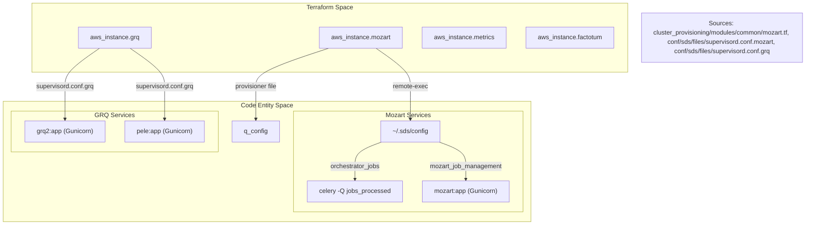
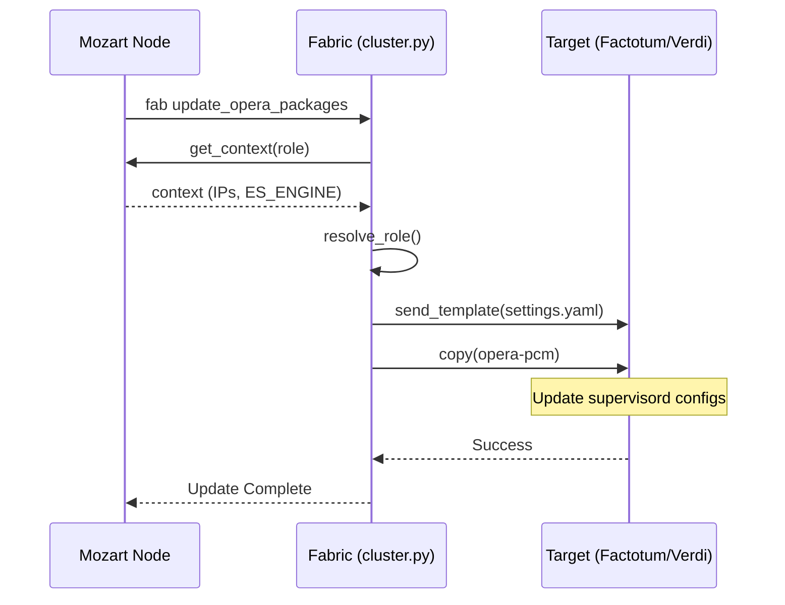

# Page: HySDS Node Provisioning: Mozart, GRQ, Metrics, Factotum

# HySDS Node Provisioning: Mozart, GRQ, Metrics, Factotum

Relevant source files

The following files were used as context for generating this wiki page:

- [cluster_provisioning/dev/outputs.tf](cluster_provisioning/dev/outputs.tf)
- [cluster_provisioning/int/int-fwd/override.tf](cluster_provisioning/int/int-fwd/override.tf)
- [cluster_provisioning/int/int-pop1/override.tf](cluster_provisioning/int/int-pop1/override.tf)
- [cluster_provisioning/modules/common/bash_profile.grq.tmpl](cluster_provisioning/modules/common/bash_profile.grq.tmpl)
- [cluster_provisioning/modules/common/bash_profile.metrics.tmpl](cluster_provisioning/modules/common/bash_profile.metrics.tmpl)
- [cluster_provisioning/modules/common/bash_profile.mozart.tmpl](cluster_provisioning/modules/common/bash_profile.mozart.tmpl)
- [cluster_provisioning/modules/common/bash_profile.verdi.tmpl](cluster_provisioning/modules/common/bash_profile.verdi.tmpl)
- [cluster_provisioning/modules/common/grq_factotum_metrics.tf](cluster_provisioning/modules/common/grq_factotum_metrics.tf)
- [cluster_provisioning/modules/common/mozart.tf](cluster_provisioning/modules/common/mozart.tf)
- [cluster_provisioning/modules/common/outputs.tf](cluster_provisioning/modules/common/outputs.tf)
- [cluster_provisioning/ops/ops-fwd/override.tf](cluster_provisioning/ops/ops-fwd/override.tf)
- [cluster_provisioning/ops/ops-pop1/override.tf](cluster_provisioning/ops/ops-pop1/override.tf)
- [cluster_provisioning/ops/ops_override.tf](cluster_provisioning/ops/ops_override.tf)
- [conf/sds/cluster.py](conf/sds/cluster.py)
- [conf/sds/files/elasticsearch/es_ilm_policy_grq.json](conf/sds/files/elasticsearch/es_ilm_policy_grq.json)
- [conf/sds/files/elasticsearch/es_ilm_policy_metrics.json](conf/sds/files/elasticsearch/es_ilm_policy_metrics.json)
- [conf/sds/files/elasticsearch/es_template_metrics-logstash.json](conf/sds/files/elasticsearch/es_template_metrics-logstash.json)
- [conf/sds/files/elasticsearch/es_template_metrics.json](conf/sds/files/elasticsearch/es_template_metrics.json)
- [conf/sds/files/event_status.template](conf/sds/files/event_status.template)
- [conf/sds/files/install.sh](conf/sds/files/install.sh)
- [conf/sds/files/job_status.template](conf/sds/files/job_status.template)
- [conf/sds/files/metrics/cron/cron_for_duplicate](conf/sds/files/metrics/cron/cron_for_duplicate)
- [conf/sds/files/metrics/cron/cron_without_duplicate](conf/sds/files/metrics/cron/cron_without_duplicate)
- [conf/sds/files/metrics/cron/install_cmr_audit.sh](conf/sds/files/metrics/cron/install_cmr_audit.sh)
- [conf/sds/files/metrics/cron/install_duplicates_audit.sh](conf/sds/files/metrics/cron/install_duplicates_audit.sh)
- [conf/sds/files/metrics/cron/run_cmr_audit.sh](conf/sds/files/metrics/cron/run_cmr_audit.sh)
- [conf/sds/files/metrics/cron/run_duplicates_audit.sh](conf/sds/files/metrics/cron/run_duplicates_audit.sh)
- [conf/sds/files/opensearch/os_ism_policy_mozart.json](conf/sds/files/opensearch/os_ism_policy_mozart.json)
- [conf/sds/files/os_template.json](conf/sds/files/os_template.json)
- [conf/sds/files/run_sdswatch_client.sh](conf/sds/files/run_sdswatch_client.sh)
- [conf/sds/files/run_sdswatch_client_opensearch.sh](conf/sds/files/run_sdswatch_client_opensearch.sh)
- [conf/sds/files/supervisord.conf.grq](conf/sds/files/supervisord.conf.grq)
- [conf/sds/files/supervisord.conf.grq.aws_es](conf/sds/files/supervisord.conf.grq.aws_es)
- [conf/sds/files/supervisord.conf.metrics](conf/sds/files/supervisord.conf.metrics)
- [conf/sds/files/supervisord.conf.mozart](conf/sds/files/supervisord.conf.mozart)
- [conf/sds/files/supervisord.conf.tmpl](conf/sds/files/supervisord.conf.tmpl)
- [conf/sds/files/task_status.template](conf/sds/files/task_status.template)
- [conf/sds/files/test/purge_rs.sh](conf/sds/files/test/purge_rs.sh)
- [conf/sds/files/worker_status.template](conf/sds/files/worker_status.template)
- [tools/pcm_batch.py](tools/pcm_batch.py)

This page details the infrastructure-as-code and configuration management for the core HySDS management nodes within the OPERA SDS. It covers the EC2 provisioning via Terraform, the initial software bootstrapping, and the operational lifecycle management using Fabric and Supervisord.

## Node Provisioning Overview

The OPERA SDS cluster consists of four primary management node types, each defined as an `aws_instance` in Terraform. These nodes are provisioned into a specific VPC and Subnet, sharing a common IAM instance profile `pcm_cluster_role` [cluster_provisioning/modules/common/mozart.tf:18-24]().

| Node Type | Role | Implementation File |
| :--- | :--- | :--- |
| **Mozart** | Job orchestration, RabbitMQ, Redis, and main API. | [cluster_provisioning/modules/common/mozart.tf]() |
| **GRQ** | Global Resource Query; metadata catalog and search API. | [cluster_provisioning/modules/common/grq_factotum_metrics.tf]() |
| **Metrics** | System monitoring, log aggregation, and accountability reporting. | [cluster_provisioning/modules/common/grq_factotum_metrics.tf]() |
| **Factotum** | High-level workflow management and Sciflo execution. | [cluster_provisioning/modules/common/grq_factotum_metrics.tf]() |

### Instance Configuration Overrides
Resource specifications (instance type, storage, private IPs) are managed via environment-specific `override.tf` files. For example, in the production (`ops-fwd`) environment:
*   **Mozart**: `r6i.4xlarge`, 200GB Root [cluster_provisioning/ops/ops-fwd/override.tf:74-83]().
*   **Factotum**: `r6i.8xlarge`, 500GB Root + 300GB Data volume [cluster_provisioning/ops/ops-fwd/override.tf:110-122]().

### Code-to-Infrastructure Mapping
The following diagram illustrates how Terraform resource definitions map to the actual HySDS node software entities.

**HySDS Infrastructure Mapping**

## Configuration Generation (`~/.sds/config`)

During provisioning, a `remote-exec` provisioner on the Mozart node generates the master `~/.sds/config` file. This file acts as the single source of truth for node communication within the cluster [cluster_provisioning/modules/common/mozart.tf:169-190]().

The provisioning script performs the following steps:
1.  **Credential Retrieval**: Scopes credentials (RabbitMQ/Redis passwords) from `~/.creds` [cluster_provisioning/modules/common/mozart.tf:158-168]().
2.  **IP Mapping**: Writes the private IPs of all nodes (Mozart, GRQ, Metrics, Factotum) into the config [cluster_provisioning/modules/common/mozart.tf:172-188]().
3.  **Engine Selection**: Detects if the environment is using `elasticsearch` or `opensearch` to set the appropriate `ES_ENGINE` variables [cluster_provisioning/modules/common/mozart.tf:191-200]().

## Day-2 Operations with Fabric (`cluster.py`)

OPERA SDS uses Fabric (via `cluster.py`) to manage the cluster after initial provisioning. These commands are typically executed from the Mozart node to synchronize code or update configurations across the cluster nodes [conf/sds/cluster.py:1-26]().

### Key Fabric Operations
*   **`copy_opera_pcm`**: Synchronizes the `opera-pcm` repository and `settings.yaml` from Mozart to Factotum and Verdi nodes [conf/sds/cluster.py:84-104]().
*   **`update_opera_packages`**: Performs specialized updates based on node roles, such as deploying CNM user rules to Mozart or configuring Logstash on Metrics [conf/sds/cluster.py:112-178]().
*   **`ensure_ssl`**: Generates self-signed certificates for the HySDS UI and APIs if they do not exist [conf/sds/cluster.py:35-71]().

**Data Flow: Configuration Synchronization**

*Sources: [conf/sds/cluster.py:112-178](), [conf/sds/cluster.py:208-219]()*

## Supervisord Configurations

HySDS nodes use `supervisord` to manage long-running Python processes, Celery workers, and API servers.

### Mozart Services
Mozart runs the core orchestration engine. Key programs defined in `supervisord.conf.mozart` include:
*   **`orchestrator_datasets`**: Celery workers (8 processes) monitoring the `dataset_processed` queue [conf/sds/files/supervisord.conf.mozart:123-136]().
*   **`orchestrator_jobs`**: Celery workers (8 processes) monitoring the `jobs_processed` queue [conf/sds/files/supervisord.conf.mozart:138-151]().
*   **`mozart_job_management`**: The Gunicorn-backed Mozart API [conf/sds/files/supervisord.conf.mozart:180-194]().

### GRQ Services
GRQ manages the metadata catalog:
*   **`grq2`**: The primary metadata search API [conf/sds/files/supervisord.conf.grq:25-38]().
*   **`pele`**: The REST API for data discovery and download [conf/sds/files/supervisord.conf.grq:96-110]().

## Cron-based Audit and Maintenance

The Metrics node hosts several cron jobs for system health and data integrity.

### CMR Audit Jobs
The `run_cmr_audit.sh` script reconciles the SDS internal state with the NASA CMR (Common Metadata Repository). It supports different cadences and lookback windows based on product type [conf/sds/files/metrics/cron/run_cmr_audit.sh:1-34]().
*   **HLS/SLC**: Weekly cadence, looking back 2 weeks to 1 week ago [conf/sds/files/metrics/cron/run_cmr_audit.sh:107-111]().
*   **DIST-S1**: Runs every 6 hours, looking back 12 hours [conf/sds/files/metrics/cron/run_cmr_audit.sh:101-105]().

### Batch Processing Audit
The `pcm_batch.py` tool provides a CLI for monitoring and managing historical batch processing, specifically for CSLC query history. It queries the `batch_proc` index in Elasticsearch to calculate `frame_completion_percentages` [tools/pcm_batch.py:25-113]().

## Elasticsearch/OpenSearch Management

The system manages data retention and indexing performance through ILM (Index Lifecycle Management) or ISM (Index State Management) policies.

### Policy Management
*   **Templates**: JSON templates define the mappings for `job_status`, `worker_status`, and `metrics` indices [conf/sds/files/job_status.template](), [conf/sds/files/elasticsearch/es_template_metrics.json]().
*   **Policies**:
    *   `es_ilm_policy_grq.json`: Defines rollover and deletion phases for GRQ indices [conf/sds/files/elasticsearch/es_ilm_policy_grq.json]().
    *   `os_ism_policy_mozart.json`: OpenSearch equivalent for Mozart job tracking [conf/sds/files/opensearch/os_ism_policy_mozart.json]().

### Snapshot and Restore
Operational scripts facilitate data backup:
*   `snapshot_es_data.py`: Tool for taking snapshots of the Elasticsearch state [conf/sds/cluster.py:137-140]().
*   `restore_snapshot.sh`: Script deployed to the node's `bin/` directory to facilitate disaster recovery [conf/sds/cluster.py:142-145]().

*Sources: [cluster_provisioning/modules/common/mozart.tf](), [cluster_provisioning/modules/common/grq_factotum_metrics.tf](), [conf/sds/cluster.py](), [conf/sds/files/supervisord.conf.mozart](), [conf/sds/files/metrics/cron/run_cmr_audit.sh](), [tools/pcm_batch.py]()*
