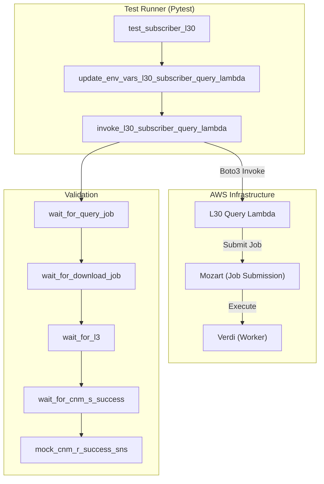
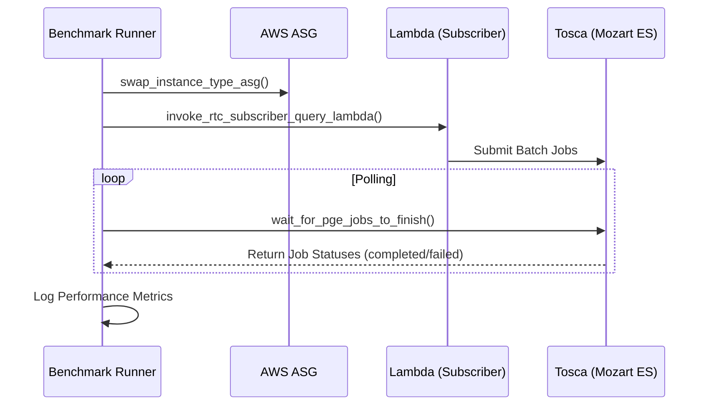

# Page: Integration and Regression Tests

# Integration and Regression Tests

Relevant source files

The following files were used as context for generating this wiki page:

- [cluster_provisioning/run_opera_smoke_tests.sh](cluster_provisioning/run_opera_smoke_tests.sh)
- [data_subscriber/rtc/evaluator_core.py](data_subscriber/rtc/evaluator_core.py)
- [pytest.ini](pytest.ini)
- [tests/__init__.py](tests/__init__.py)
- [tests/benchmark/README.md](tests/benchmark/README.md)
- [tests/benchmark/__init__.py](tests/benchmark/__init__.py)
- [tests/benchmark/benchmark_test_util.py](tests/benchmark/benchmark_test_util.py)
- [tests/benchmark/conftest.py](tests/benchmark/conftest.py)
- [tests/benchmark/test_benchmark.py](tests/benchmark/test_benchmark.py)
- [tests/benchmark/tosca.py](tests/benchmark/tosca.py)
- [tests/integration/README.md](tests/integration/README.md)
- [tests/integration/int_test_util.py](tests/integration/int_test_util.py)
- [tests/integration/subscriber_util.py](tests/integration/subscriber_util.py)
- [tests/integration/test_integration.py](tests/integration/test_integration.py)
- [tests/regression/test_dswx_s1_edge_cases.py](tests/regression/test_dswx_s1_edge_cases.py)

The OPERA SDS PCM testing infrastructure includes a comprehensive suite of integration, regression, and benchmark tests designed to validate the end-to-end data lifecycle—from CMR discovery to DAAC delivery—and ensure performance stability across different infrastructure configurations.

## Integration Test Suite

The integration tests located in `tests/integration/` validate the orchestration of the PCM components within a live HySDS cluster. These tests simulate the full pipeline: triggering a data subscriber, verifying download jobs, confirming PGE execution (L2/L3 product generation), and validating CNM (Cloud Notification Mechanism) status updates.

### Prerequisites and Configuration
Integration tests require a running cluster and a `.env` file containing cluster-specific endpoints and credentials.
*   **ES_HOST/GRQ_HOST**: Private IP or hostname of the Mozart/GRQ nodes [cluster_provisioning/run_opera_smoke_tests.sh:124-127]().
*   **SMOKE_RUN Mode**: Tests typically enable `SMOKE_RUN=true` via Lambda environment updates to process a limited, known set of test data [tests/integration/subscriber_util.py:111-111]().
*   **PGE Simulation**: While the suite can run real PGEs, it often uses simulated modes to verify orchestration logic without the high compute cost of full science processing.

### Data Flow and Test Execution
The integration suite uses `pytest` to execute scenarios for specific product lines (L30, S30, SLC, RTC).

#### Integration Test Lifecycle
Title: Integration Test Workflow

Sources: [tests/integration/test_integration.py:36-90](), [tests/integration/subscriber_util.py:27-34]()

### Key Helper Utilities
The `subscriber_util.py` and `int_test_util.py` modules provide the abstraction layer for interacting with the SDS:
*   **Lambda Invocation**: Functions like `invoke_slc_subscriber_query_lambda` trigger the entry point for data discovery [tests/integration/subscriber_util.py:47-54]().
*   **Polling (Backoff)**: Uses the `backoff` library to wait for asynchronous events in Elasticsearch/OpenSearch, such as the appearance of a generated product [tests/integration/int_test_util.py:100-101]().
*   **CNM Mocking**: `mock_cnm_r_success_sns` simulates the DAAC's response to a product delivery, allowing the PCM to complete the accountability loop [tests/integration/int_test_util.py:135-158]().

## Regression Tests

Regression tests target specific edge cases and historical bugs to prevent re-introduction. A primary focus is the `DSWx-S1` triggering logic, which involves complex spatial and temporal evaluation of RTC (Radiometric Terrain Corrected) input sets.

### DSWx-S1 Trigger Logic
The `test_dswx_s1_edge_cases.py` file validates that the `evaluator.py` correctly groups RTC granules into MGRS sets and calculates coverage based on sensor type (S1A/S1B).

| Function | Purpose | Key Verification |
| :--- | :--- | :--- |
| `test_subscriber_rtc_trigger_logic` | Validates MGRS set coverage calculation | Asserts `coverage_actual` against expected values for specific MGRS tiles [tests/regression/test_dswx_s1_edge_cases.py:15-101]() |
| `test_subscriber_rtc_trigger_logic_b` | Validates RTC native ID inclusion | Ensures specific granules are associated with the correct MGRS set [tests/regression/test_dswx_s1_edge_cases.py:104-173]() |

Sources: [tests/regression/test_dswx_s1_edge_cases.py:1-173]()

## Benchmark Test Framework

The benchmark framework (`tests/benchmark/`) evaluates system performance across different AWS EC2 instance types and worker queue configurations. It leverages **Tosca** (the HySDS user interface/API) to monitor job completion rates.

### Implementation Details
*   **Instance Swapping**: The framework can programmatically update Auto Scaling Groups (ASG) or worker queues to test PGE performance on various hardware (e.g., `c6i.2xlarge` vs `m6a.2xlarge`) [tests/benchmark/test_benchmark.py:151-165]().
*   **Tosca Integration**: The `tosca.py` module queries the Mozart Elasticsearch `job_status` index to determine when batches of jobs have finished [tests/benchmark/tosca.py:105-117]().
*   **Parallel Execution**: Supports `pytest-xdist` for running multiple benchmark scenarios concurrently [tests/benchmark/README.md:7-11]().

### Benchmark Execution Flow
Title: Benchmark System Interaction

Sources: [tests/benchmark/test_benchmark.py:116-165](), [tests/benchmark/tosca.py:88-117]()

## Smoke Test Execution
The `run_opera_smoke_tests.sh` script acts as the entry point for CI/CD pipelines to execute a subset of integration tests. It handles environment setup, virtual environment creation, and dependency installation before running `pytest` [cluster_provisioning/run_opera_smoke_tests.sh:148-160]().

Sources: [cluster_provisioning/run_opera_smoke_tests.sh:1-165]()
