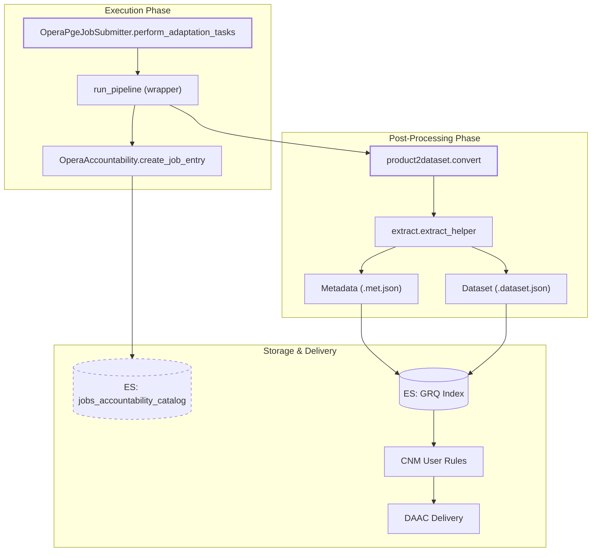
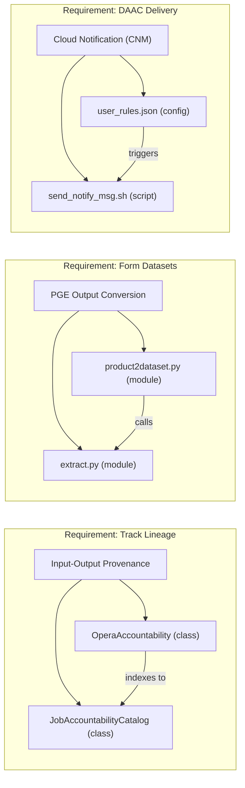

# Page: Job Accountability, Post-Processing, and CNM Delivery

# Job Accountability, Post-Processing, and CNM Delivery

Relevant source files

The following files were used as context for generating this wiki page:

- [cluster_provisioning/clear_grq_aws_es.py](cluster_provisioning/clear_grq_aws_es.py)
- [conf/sds/files/config-branch.xml](conf/sds/files/config-branch.xml)
- [conf/sds/files/config.xml](conf/sds/files/config.xml)
- [conf/sds/files/elasticsearch/grq_es_templates/es_template_cmr_rtc_cache_catalog.json](conf/sds/files/elasticsearch/grq_es_templates/es_template_cmr_rtc_cache_catalog.json)
- [conf/sds/files/elasticsearch/grq_es_templates/es_template_rtc_for_dist_catalog.json](conf/sds/files/elasticsearch/grq_es_templates/es_template_rtc_for_dist_catalog.json)
- [conf/sds/files/es_template.json](conf/sds/files/es_template.json)
- [conf/sds/files/test/import_product_delivery_rules.sh](conf/sds/files/test/import_product_delivery_rules.sh)
- [conf/sds/files/test/import_rules.sh](conf/sds/files/test/import_rules.sh)
- [conf/sds/rules/user_rules.json](conf/sds/rules/user_rules.json)
- [data_subscriber/es_conn_util.py](data_subscriber/es_conn_util.py)
- [docker/hysds-io.json.process_cnm_response](docker/hysds-io.json.process_cnm_response)
- [docker/hysds-io.json.send_notify_msg](docker/hysds-io.json.send_notify_msg)
- [docker/job-spec.json.process_cnm_response](docker/job-spec.json.process_cnm_response)
- [docker/job-spec.json.send_notify_msg](docker/job-spec.json.send_notify_msg)
- [docker/job-spec.json.slc_download_hist](docker/job-spec.json.slc_download_hist)
- [docker/job-spec.json.slcs1a_query_hist](docker/job-spec.json.slcs1a_query_hist)
- [docker/job-spec.json.slcs1b_query_hist](docker/job-spec.json.slcs1b_query_hist)
- [extractor/extract.py](extractor/extract.py)
- [job_accountability/catalog.py](job_accountability/catalog.py)
- [opera_chimera/accountability.py](opera_chimera/accountability.py)
- [opera_chimera/opera_pge_job_submitter.py](opera_chimera/opera_pge_job_submitter.py)
- [opera_chimera/postprocess_functions.py](opera_chimera/postprocess_functions.py)
- [opera_commons/es_connection.py](opera_commons/es_connection.py)
- [opera_commons/logger.py](opera_commons/logger.py)
- [product2dataset/iso_xml_reader.py](product2dataset/iso_xml_reader.py)
- [product2dataset/product2dataset.py](product2dataset/product2dataset.py)
- [tests/data_subscriber/test_query.py](tests/data_subscriber/test_query.py)
- [tests/product2dataset/test_product2dataset.py](tests/product2dataset/test_product2dataset.py)
- [tools/send_notify_msg.sh](tools/send_notify_msg.sh)
- [tools/truncate_disp_s1_burst_db.py](tools/truncate_disp_s1_burst_db.py)
- [util/job_json_util.py](util/job_json_util.py)
- [wrapper/opera_pge_wrapper.py](wrapper/opera_pge_wrapper.py)
- [wrapper/pge_functions.py](wrapper/pge_functions.py)

This section describes the mechanisms for tracking data provenance, converting PGE outputs into HySDS datasets, and the final delivery of products to the DAAC via the Cloud Notification Mechanism (CNM).

## OperaAccountability System

The `OperaAccountability` class, extending the base `Accountability` class, is responsible for tracking the lineage of every job. It records which input granules were used to produce which output products, maintaining a chain of custody within the SDS.

### Key Responsibilities
*   **Job Entry Creation**: Upon job execution, it creates an entry in the `jobs_accountability_catalog` containing the `job_id`, `input_data_type`, and the specific `inputs` (filenames) used `[opera_chimera/accountability.py:119-131]()`.
*   **Lineage Merging**: It flattens and merges accountability metadata from input products to ensure that the final product metadata contains a complete history of all upstream ancestors `[opera_chimera/accountability.py:145-172]()`.
*   **Metadata Extraction**: It extracts product-specific metadata (e.g., `input_granule_id`, `orbit_file`) based on the PGE type (HLS, SLC, RTC, etc.) to support searchability and reporting `[opera_chimera/accountability.py:94-114]()`.

### Job Accountability Catalog
The `JobAccountabilityCatalog` class interfaces with Elasticsearch to store these records.
*   **Index Naming**: Indices are time-partitioned using the pattern `jobs_accountability_catalog-YYYY.MM` `[job_accountability/catalog.py:11-12]()`.
*   **Storage**: Records include a header and the actual lineage document, indexed by a unique reference ID `[job_accountability/catalog.py:30-60]()`.

**Sources:** `[opera_chimera/accountability.py:63-172]()`, `[job_accountability/catalog.py:11-60]()`

---

## PGE Post-Processing and Dataset Conversion

After a PGE (Product Generation Executive) completes its execution, the system must transform the raw output files into a HySDS-compliant dataset. This is handled by the `product2dataset` module.

### Conversion Logic (`product2dataset.py`)
The `convert` function performs the following steps:
1.  **Validation**: Checks if all expected outputs defined in `pge_output.yaml` were generated `[product2dataset/product2dataset.py:59-68]()`.
2.  **Extraction**: Calls `extractor.extract` to harvest metadata from the product files and create the `.met.json` and `.dataset.json` files `[product2dataset/product2dataset.py:83-88]()`.
3.  **Checksumming**: Generates checksums (default `sha256`) for products if configured `[product2dataset/product2dataset.py:90-95]()`.
4.  **Metadata Merging**: Merges individual file metadata into a single dataset-level metadata object and calculates the total `FileSize` `[product2dataset/product2dataset.py:103-132]()`.
5.  **S3 Path Generation**: Constructs the final S3 URLs and paths where the products will be published based on the `datasets.json` configuration `[product2dataset/product2dataset.py:149-164]()`.

### Metadata Extraction (`extractor/extract.py`)
The `extract` function creates the directory structure for the dataset and populates it with the product and its sidecar metadata files.
*   **Dataset ID**: Generated based on regex patterns in `settings.yaml` `[extractor/extract.py:110-112]()`.
*   **Index Suffix**: Appends a date-based suffix (e.g., `-2023.11`) to the Elasticsearch index name for ILM/ISM management `[extractor/extract.py:165-173]()`.

### Lineage Metadata Functions
Specific functions in `wrapper/pge_functions.py` define which files constitute the "lineage" for different PGE types. For example:
*   `slc_s1_lineage_metadata`: Captures S1 SLC inputs, DEMs, and Ionosphere files `[wrapper/pge_functions.py:10-45]()`.
*   `dswx_hls_lineage_metadata`: Captures L2 HLS inputs, Landcover, and WorldCover files `[wrapper/pge_functions.py:48-74]()`.

**Sources:** `[product2dataset/product2dataset.py:37-164]()`, `[extractor/extract.py:65-184]()`, `[wrapper/pge_functions.py:10-106]()`

---

## System Flow: Code Entity Mapping

The following diagram maps the high-level accountability and delivery concepts to the specific Python classes and functions that implement them.

**Title: Accountability and Post-Processing Data Flow**

**Sources:** `[opera_chimera/opera_pge_job_submitter.py:82-182]()`, `[opera_chimera/accountability.py:119-131]()`, `[product2dataset/product2dataset.py:37-164]()`, `[extractor/extract.py:89-184]()`

---

## CNM Delivery and User Rules

The Cloud Notification Mechanism (CNM) is used to notify external entities (like the DAAC) that a new product is available for ingestion.

### Triggering via User Rules
The SDS uses HySDS "User Rules" to trigger delivery jobs. These rules are defined in `conf/sds/rules/user_rules.json`.
*   **Query String**: Rules use Elasticsearch queries to identify products ready for delivery (e.g., filtering by `dataset_type` and `processing_mode`) `[conf/sds/rules/user_rules.json:10, 24, 66]()`.
*   **Job Types**: When a match is found, a specific delivery job (e.g., `hysds-io-SCIFLO_L2_CSLC_S1`) is triggered `[conf/sds/rules/user_rules.json:5, 19, 61]()`.

### Notification Mechanism
The `send_notify_msg.sh` script and associated `job-spec` files manage the actual transmission of the CNM message.
*   **Job Spec**: Defines the parameters for the notification job `[docker/job-spec.json.send_notify_msg:1-20]()`.
*   **CNM Response**: A separate job type, `process_cnm_response`, handles the asynchronous acknowledgment from the DAAC `[docker/job-spec.json.process_cnm_response:1-15]()`.

**Sources:** `[conf/sds/rules/user_rules.json:1-117]()`, `[docker/job-spec.json.send_notify_msg:1-20]()`

---

## Component Relationship Diagram

This diagram bridges the "Natural Language" requirements of accountability and delivery to the specific "Code Entities" that handle them.

**Title: Natural Language to Code Entity Mapping**

**Sources:** `[opera_chimera/accountability.py:63]()`, `[job_accountability/catalog.py:15]()`, `[product2dataset/product2dataset.py:37]()`, `[extractor/extract.py:65]()`, `[conf/sds/rules/user_rules.json:1]()`
