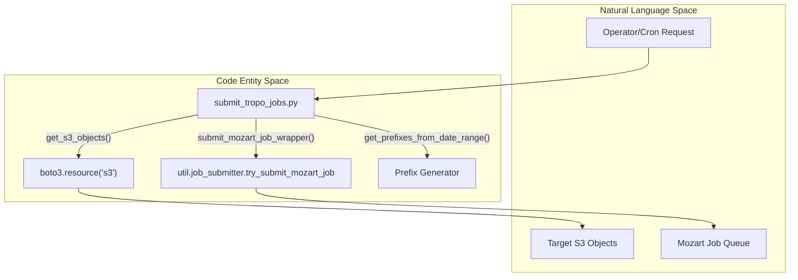
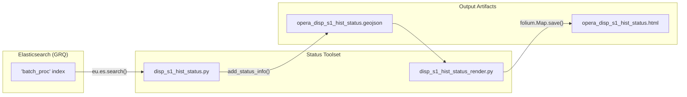

# Page: Maintenance Utilities: CCSLC Deletion, ISL Purge, and Pending Jobs

# Maintenance Utilities: CCSLC Deletion, ISL Purge, and Pending Jobs

Relevant source files

The following files were used as context for generating this wiki page:

- [conf/sds/config](conf/sds/config)
- [conf/sds/files/factotum/cron/hysdsops](conf/sds/files/factotum/cron/hysdsops)
- [conf/sds/files/factotum/cron/submit_job.py](conf/sds/files/factotum/cron/submit_job.py)
- [conf/sds/files/mozart/cron/hysdsops](conf/sds/files/mozart/cron/hysdsops)
- [data_subscriber/dswx_s1_utils.py](data_subscriber/dswx_s1_utils.py)
- [docker/hysds-io.json.SCIFLO_L4_TROPO](docker/hysds-io.json.SCIFLO_L4_TROPO)
- [docker/job-spec.json.SCIFLO_L4_TROPO](docker/job-spec.json.SCIFLO_L4_TROPO)
- [ecmwf-api-client/run_ecmwf_merger_daily.sh](ecmwf-api-client/run_ecmwf_merger_daily.sh)
- [tests/unit/test_ccslc_deletion_utility.py](tests/unit/test_ccslc_deletion_utility.py)
- [tests/unit/test_rtc_utils.py](tests/unit/test_rtc_utils.py)
- [tools/CCSLC_DELETION_UTILITY_README.md](tools/CCSLC_DELETION_UTILITY_README.md)
- [tools/README.md](tools/README.md)
- [tools/analyze_cslc_dates_from_disp_s1_runconfig.py](tools/analyze_cslc_dates_from_disp_s1_runconfig.py)
- [tools/analyze_disp_s1_forward_processing_timeline.py](tools/analyze_disp_s1_forward_processing_timeline.py)
- [tools/ccslc_deletion_utility.py](tools/ccslc_deletion_utility.py)
- [tools/ops/data_subscriber/__init__.py](tools/ops/data_subscriber/__init__.py)
- [tools/ops/data_subscriber/data_subscriber_client.py](tools/ops/data_subscriber/data_subscriber_client.py)
- [tools/ops/disp_s1_status/disp_s1_hist_status.py](tools/ops/disp_s1_status/disp_s1_hist_status.py)
- [tools/ops/disp_s1_status/disp_s1_hist_status.sh](tools/ops/disp_s1_status/disp_s1_hist_status.sh)
- [tools/ops/disp_s1_status/disp_s1_hist_status_render.py](tools/ops/disp_s1_status/disp_s1_hist_status_render.py)
- [tools/submit_tropo_jobs.py](tools/submit_tropo_jobs.py)
- [tools/testing/validate_cslc_downloads.py](tools/testing/validate_cslc_downloads.py)

This section documents the operational maintenance tools used to manage the OPERA SDS Process Control Mirror (PCM). These utilities facilitate the cleanup of intermediate data, the management of job backlogs, and the visualization of processing status for long-running historical campaigns.

## 1. CCSLC Deletion Utility

The `ccslc_deletion_utility.py` is a specialized tool designed for the selective removal of Compact Copied SLC (CCSLC) data [tools/ccslc_deletion_utility.py:1-19](). This is primarily used to enable the reprocessing of specific DISP-S1 frames by clearing out existing compressed dependencies.

### Key Features
*   **Dual Cleanup**: Simultaneously deletes S3 objects and corresponding OpenSearch metadata documents [tools/ccslc_deletion_utility.py:17-17]().
*   **Flexible Targeting**: Supports deletion by Frame IDs, Date Ranges, Burst IDs, or specific Granule IDs [tools/ccslc_deletion_utility.py:5-10]().
*   **Safety Mechanisms**: Includes a mandatory dry-run mode and explicit confirmation prompts before execution [tools/ccslc_deletion_utility.py:13-16]().

### Implementation Details
The utility initializes an `OpenSearch` client and an AWS `s3_resource` to perform cross-system cleanup [tools/ccslc_deletion_utility.py:75-80](). It utilizes the DISP-S1 burst database to validate input IDs via `localize_disp_frame_burst_hist()` [tools/ccslc_deletion_utility.py:83-85]().

| Function | Purpose |
| :--- | :--- |
| `_initialize_opensearch_client` | Connects to GRQ using settings from `~/.sds/config` [tools/ccslc_deletion_utility.py:108-162](). |
| `validate_frame_id` | Checks if a frame exists in the DISP-S1 burst map [tools/ccslc_deletion_utility.py:173-183](). |
| `get_ccslc_objects_by_frame` | Uses S3 paginators to find all objects under the frame's prefix [tools/ccslc_deletion_utility.py:273-288](). |
| `delete_opensearch_docs` | Removes metadata from `grq_1_l2_cslc_s1_compressed*` indices [tools/ccslc_deletion_utility.py:164-171](). |

**Sources:** [tools/ccslc_deletion_utility.py:1-200](), [tools/CCSLC_DELETION_UTILITY_README.md:1-110]()

---

## 2. Ingest Staging Layer (ISL) Purge and Pending Jobs

Maintenance of the Ingest Staging Layer and job queues is handled via automated cron jobs and manual scripts.

### Pending Job Submission
The `submit_pending_jobs.py` script (invoked via Factotum cron) re-evaluates blocked or failed download jobs [conf/sds/files/factotum/cron/hysdsops:10-10](). This ensures that temporary network glitches or DAAC availability issues do not permanently stall the pipeline.

### L4_TROPO Job Submission
For the ECMWF Tropospheric pipeline, `submit_tropo_jobs.py` provides a mechanism to manually or automatically trigger processing for specific time ranges [tools/submit_tropo_jobs.py:3-18](). It wraps `try_submit_mozart_job` to interface with the Mozart API [tools/submit_tropo_jobs.py:139-146]().

### Data Flow: Maintenance Job Submission
This diagram illustrates how maintenance scripts bridge the gap between S3 storage state and Mozart job orchestration.

**Maintenance Job Submission Logic**

**Sources:** [tools/submit_tropo_jobs.py:42-88](), [conf/sds/files/factotum/cron/hysdsops:10-11]()

---

## 3. DISP-S1 Status Visualization

To monitor large-scale historical processing, the system provides a suite of tools to visualize frame completion percentages.

### Status Aggregation
The script `disp_s1_hist_status.py` queries the `batch_proc` index in Elasticsearch to calculate completion percentages for each DISP-S1 frame [tools/ops/disp_s1_status/disp_s1_hist_status.py:17-45](). It compares the number of triggered sensing datetimes against the total possible datetimes for a given `k` (k-satiety) [tools/ops/disp_s1_status/disp_s1_hist_status.py:50-55]().

### Map Rendering
`disp_s1_hist_status_render.py` transforms the aggregated JSON data into an interactive Leaflet map using `folium` [tools/ops/disp_s1_status/disp_s1_hist_status_render.py:6-27](). Frames are color-coded based on their status:
*   **Green**: >99% Complete [tools/ops/disp_s1_status/disp_s1_hist_status_render.py:40-42]()
*   **Yellow**: In-progress [tools/ops/disp_s1_status/disp_s1_hist_status_render.py:46-48]()
*   **Gray**: Unprocessed/Empty [tools/ops/disp_s1_status/disp_s1_hist_status_render.py:43-45]()

### Operational Status Pipeline
The following diagram maps the status visualization components to the underlying data sources.

**Status Visualization Data Flow**

**Sources:** [tools/ops/disp_s1_status/disp_s1_hist_status.py:41-70](), [tools/ops/disp_s1_status/disp_s1_hist_status_render.py:28-101](), [conf/sds/files/mozart/cron/hysdsops:2-2]()

---

## 4. Summary of Maintenance Utilities

| Utility | File Path | Primary Purpose |
| :--- | :--- | :--- |
| **CCSLC Deletion** | `tools/ccslc_deletion_utility.py` | Removes CCSLC files and ES docs for reprocessing [tools/ccslc_deletion_utility.py:1-19](). |
| **Pending Jobs** | `submit_job.py` | Re-submits jobs that failed due to transient issues [conf/sds/files/factotum/cron/hysdsops:10-10](). |
| **Tropo Submitter** | `tools/submit_tropo_jobs.py` | Triggers L4_TROPO PGE jobs for specific S3 prefixes [tools/submit_tropo_jobs.py:1-30](). |
| **Historical Status** | `disp_s1_hist_status.py` | Aggregates DISP-S1 progress from Elasticsearch [tools/ops/disp_s1_status/disp_s1_hist_status.py:1-25](). |
| **Timeline Analysis**| `analyze_disp_s1_forward_processing_timeline.py` | Generates swimlane diagrams of job progression [tools/analyze_disp_s1_forward_processing_timeline.py:1-20](). |

**Sources:** [tools/README.md:29-150](), [conf/sds/files/factotum/cron/hysdsops:1-21]()
