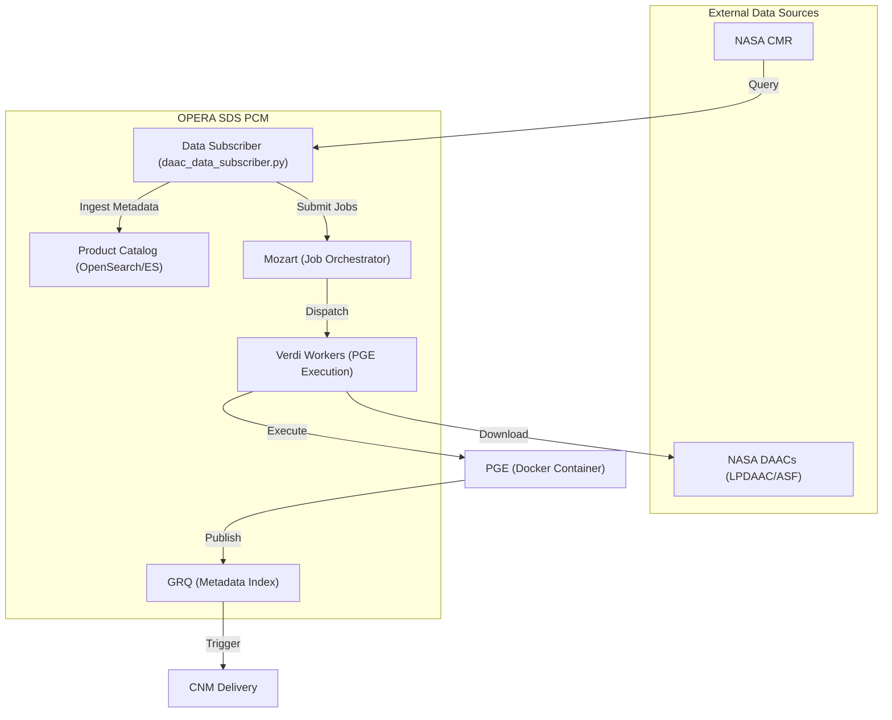
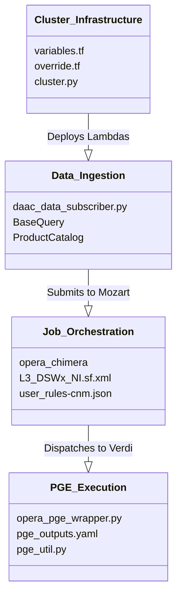

# Page: OPERA SDS PCM — Project Overview

# OPERA SDS PCM — Project Overview

Relevant source files

The following files were used as context for generating this wiki page:

- [.gitignore](.gitignore)
- [cluster_provisioning/dev-e2e/variables.tf](cluster_provisioning/dev-e2e/variables.tf)
- [cluster_provisioning/dev-int/override.tf](cluster_provisioning/dev-int/override.tf)
- [cluster_provisioning/dev-releaser/variables.tf](cluster_provisioning/dev-releaser/variables.tf)
- [cluster_provisioning/dev/variables.tf](cluster_provisioning/dev/variables.tf)
- [cluster_provisioning/ebs-snapshot/variables.tf](cluster_provisioning/ebs-snapshot/variables.tf)
- [cluster_provisioning/int/variables.tf](cluster_provisioning/int/variables.tf)
- [cluster_provisioning/modules/common/variables.tf](cluster_provisioning/modules/common/variables.tf)
- [conf/pge_outputs.yaml](conf/pge_outputs.yaml)
- [conf/sds/files/datasets.json](conf/sds/files/datasets.json)
- [conf/sds/files/datasets.json.tmpl.asg](conf/sds/files/datasets.json.tmpl.asg)
- [conf/sds/rules/user_rules-cnm.json.tmpl](conf/sds/rules/user_rules-cnm.json.tmpl)
- [conf/settings.yaml](conf/settings.yaml)
- [docker/Dockerfile](docker/Dockerfile)
- [opera_chimera/configs/pge_configs/PGE_L3_DSWx_NI.yaml](opera_chimera/configs/pge_configs/PGE_L3_DSWx_NI.yaml)
- [opera_chimera/wf_xml/L3_DSWx_NI.sf.xml](opera_chimera/wf_xml/L3_DSWx_NI.sf.xml)
- [setup.py](setup.py)
- [tests/unit/util/test_pge_util.py](tests/unit/util/test_pge_util.py)
- [tools/__init__.py](tools/__init__.py)
- [util/pge_util.py](util/pge_util.py)

The OPERA Science Data System (SDS) Process Control Mirror (PCM) is the orchestration and control layer for the OPERA (Observational Products for End-Users from Remote Sensing Analysis) project. It manages the end-to-end lifecycle of science data processing, from discovering input data at NASA DAACs to executing Science Application Software (SAS) within Product Generation Executables (PGEs) and delivering final products back to the DAACs.

The PCM is built upon the **HySDS** (Hybrid Cloud Science Data System) framework, extending it with OPERA-specific logic for data subscription, complex spatial/temporal triggering, and accountability.

## System Purpose and Scope

The primary role of the PCM is to provide a scalable, automated pipeline for generating several high-level science products:
*   **DSWx**: Dynamic Surface Water Extent (HLS, S1, and NI sensors) [conf/settings.yaml:14-41]()
*   **CSLC**: Co-registered Single Look Complex [conf/settings.yaml:18-22]()
*   **RTC**: Radiometric Terrain Corrected backscatter [conf/settings.yaml:19-23]()
*   **DISP**: Displacement (S1 and NI sensors) [conf/settings.yaml:30-47]()
*   **DIST**: Disturbance Alert [conf/settings.yaml:44-45]()

### High-Level System Flow

The following diagram illustrates how the major components of the PCM interact to move data through the system.

**OPERA PCM Functional Flow**

**Sources:** [data_subscriber/daac_data_subscriber.py](), [conf/sds/files/datasets.json:1-122](), [conf/sds/rules/user_rules-cnm.json.tmpl:1-90]()

---

## Key Subsystems

### 1. Architecture and Framework
The PCM leverages the HySDS cluster architecture, which consists of specialized nodes:
*   **Mozart**: The job management interface and RabbitMQ-based task orchestrator.
*   **GRQ (Global Resource Query)**: An Elasticsearch/OpenSearch instance that catalogs all generated datasets and their metadata [conf/settings.yaml:7]().
*   **Verdi**: Auto-scaling worker nodes that execute the actual processing tasks in Docker containers [cluster_provisioning/modules/common/variables.tf:258-320]().
*   **Factotum**: Handles cluster-wide administrative tasks and specialized workflows.

For a deep dive into the node types and core terminology, see [Architecture and Key Concepts](#1.1).

### 2. Data Subscriber
The `data_subscriber` module is responsible for monitoring NASA's Common Metadata Repository (CMR) for new granules. It handles:
*   **Querying**: Filtering granules based on spatial Area of Interest (AOI) and temporal windows.
*   **Downloading**: Managing the retrieval of large datasets (HLS, SLC, RTC) from DAACs using S3-native or HTTPS protocols [conf/settings.yaml:51-61]().
*   **Triggering**: Evaluating complex logic (e.g., "Do we have 99% coverage for this MGRS tile?") before launching a PGE job [conf/settings.yaml:81]().

### 3. PGE Orchestration (Chimera)
OPERA uses the **Chimera** pipeline pattern to wrap Science Application Software. This layer manages:
*   **Pre-conditions**: Staging ancillary data like DEMs or Orbit files [util/pge_util.py:177-195]().
*   **RunConfig Generation**: Creating the YAML inputs required by the SAS.
*   **Post-processing**: Harvesting metadata from output files and converting them into HySDS datasets [conf/pge_outputs.yaml:1-115]().

For details on PGE wrappers and workflow XMLs, see [PGE Orchestration: Chimera Pipeline](#4).

### 4. Infrastructure and Provisioning
The system is deployed using **Terraform**, allowing for consistent environments across different "venues" (e.g., `dev`, `int`, `ops`).
*   **Venues**: Environment-specific configurations [cluster_provisioning/dev/variables.tf:63]().
*   **Auto-Scaling**: Verdi workers scale based on queue depth in RabbitMQ [cluster_provisioning/modules/common/variables.tf:149-151]().

For setup instructions, see [Getting Started and Development Setup](#1.2).

---

## Code Entity Map

This diagram bridges the conceptual subsystems to the specific code entities and configuration files that define them.

**System Component to Code Entity Mapping**

**Sources:** [cluster_provisioning/modules/common/variables.tf](), [conf/pge_outputs.yaml](), [util/pge_util.py](), [setup.py]()

---

## Child Pages
*   [Architecture and Key Concepts](#1.1): Detailed explanation of HySDS, Mozart, GRQ, and the SciFlo workflow engine.
*   [Getting Started and Development Setup](#1.2): Guide for local installation, Docker builds, and running the test suite.
