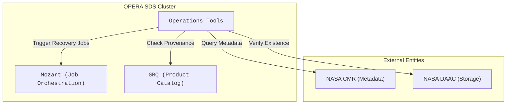
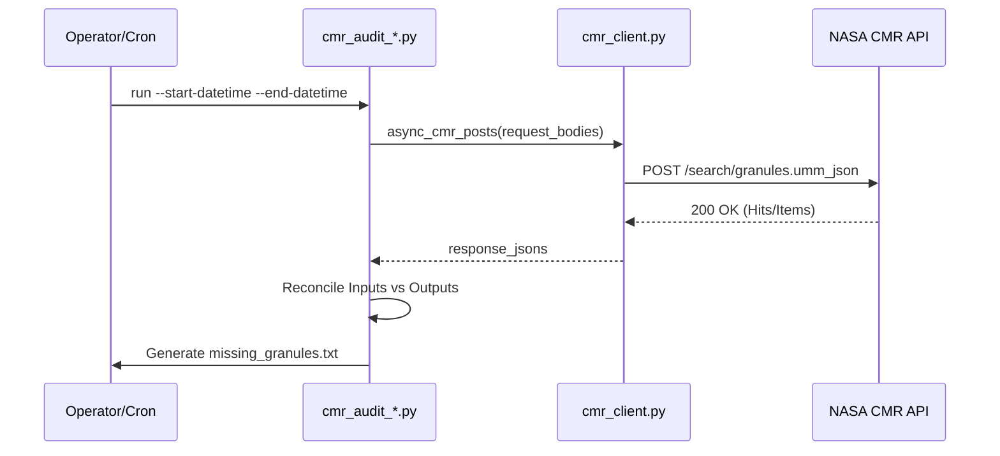
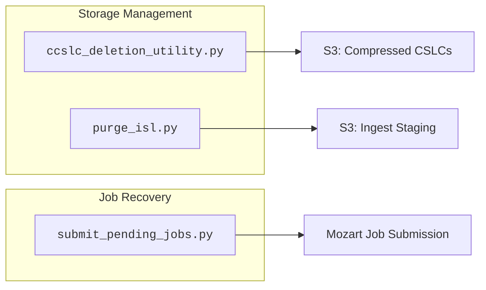

# Page: Operations Tools and Auditing

# Operations Tools and Auditing

Relevant source files

The following files were used as context for generating this wiki page:

- [tools/ops/README.md](tools/ops/README.md)
- [tools/ops/cmr_audit/cmr_audit_batch.py](tools/ops/cmr_audit/cmr_audit_batch.py)
- [tools/ops/cmr_audit/cmr_audit_disp_s1.py](tools/ops/cmr_audit/cmr_audit_disp_s1.py)
- [tools/ops/cmr_audit/cmr_audit_disp_s1_static.py](tools/ops/cmr_audit/cmr_audit_disp_s1_static.py)
- [tools/ops/cmr_audit/cmr_audit_dswx_s1.py](tools/ops/cmr_audit/cmr_audit_dswx_s1.py)
- [tools/ops/cmr_audit/cmr_audit_hls.py](tools/ops/cmr_audit/cmr_audit_hls.py)
- [tools/ops/cmr_audit/cmr_audit_slc.py](tools/ops/cmr_audit/cmr_audit_slc.py)
- [tools/ops/cmr_audit/cmr_audit_utils.py](tools/ops/cmr_audit/cmr_audit_utils.py)
- [tools/ops/cmr_audit/cmr_client.py](tools/ops/cmr_audit/cmr_client.py)

The OPERA SDS PCM includes a suite of operational tools designed for monitoring system health, auditing data integrity against external catalogs, and performing routine maintenance. These tools ensure that the internal state of the SDS (stored in Elasticsearch/OpenSearch) remains synchronized with the NASA Common Metadata Repository (CMR) and that produced data meets quality standards.

### System Overview Diagram

The following diagram illustrates the relationship between the operational tools, the internal SDS components (Mozart/GRQ), and external entities like NASA CMR.

**Operational Tooling Context**

Sources: [tools/ops/README.md:1-20](), [tools/ops/cmr_audit/cmr_audit_disp_s1.py:16-18]()

---

## 7.1 CMR Audit Tools

The CMR Audit subsystem is a collection of utilities located in `tools/ops/cmr_audit/` used to reconcile the SDS internal state with the NASA CMR. These tools detect missing or duplicate products by comparing what *should* have been produced (based on input availability in CMR) with what *actually* exists in the SDS and CMR.

### Core Audit Components
*   **`cmr_client.py`**: Provides asynchronous HTTP clients using `aiohttp` and `backoff` for robust interaction with CMR's UMM-JSON search API [tools/ops/cmr_audit/cmr_client.py:18-30]().
*   **`cmr_audit_utils.py`**: Contains shared logic for partitioning CMR queries by temporal ranges and mapping collection short names to specific request bodies [tools/ops/cmr_audit/cmr_audit_utils.py:21-64]().
*   **Product-Specific Auditors**:
    *   **SLC/RTC**: `cmr_audit_slc.py` handles Sentinel-1 SLC accountability and optionally triggers RTC/CSLC audits [tools/ops/cmr_audit/cmr_audit_slc.py:85-107]().
    *   **HLS**: `cmr_audit_hls.py` reconciles HLS L30/S30 inputs with DSWx-HLS outputs [tools/ops/cmr_audit/cmr_audit_hls.py:76-90]().
    *   **DISP-S1**: `cmr_audit_disp_s1.py` performs complex frame-based reconciliation, requiring access to the GRQ for provenance data [tools/ops/cmr_audit/cmr_audit_disp_s1.py:42-64]().

**CMR Audit Execution Flow**

Sources: [tools/ops/cmr_audit/cmr_client.py:40-87](), [tools/ops/cmr_audit/cmr_audit_utils.py:73-87]()

For details, see [CMR Audit Tools](#7.1).

---

## 7.2 Product Validation and Reporting

Product validation tools ensure that generated science products meet specific format and metadata requirements before or after delivery to the DAAC.

*   **OPERA Validator**: The `validate_disp_s1` function in `report/opera_validator/opv_disp_s1.py` is the core engine for checking DISP-S1 product integrity [tools/ops/cmr_audit/cmr_audit_disp_s1.py:19-21]().
*   **Accountability Reporting**: Tools that generate data-driven reports on processing success rates, latency, and coverage.
*   **Retroactive Updates**: The `product_update/disp_s1_r4_bperp` utility is used to update DISP-S1 products with baseline perpendicular data that may only become available after initial processing.

Sources: [tools/ops/cmr_audit/cmr_audit_disp_s1.py:59-64](), [tools/ops/README.md:11-19]()

For details, see [Product Validation and Reporting](#7.2).

---

## 7.3 Maintenance Utilities

The SDS requires periodic maintenance to manage storage costs and recover from transient failures.

### Key Maintenance Tools
| Tool | Purpose | File Reference |
| :--- | :--- | :--- |
| **CSLC Deletion** | Removes compressed CSLC products to free up space after they have been consumed by downstream PGEs. | `ccslc_deletion_utility.py` |
| **ISL Purge** | Cleans the Ingest Staging Layer (ISL) of temporary files and downloaded granules that are no longer needed. | `purge_isl.py` |
| **Pending Job Resubmission** | Re-evaluates and submits download jobs that were blocked or remained in a pending state due to satiety requirements. | `submit_pending_jobs.py` |
| **DISP Status Visualization** | Provides operational dashboards or CLI views of DISP-S1 processing progress across different frames. | `disp_s1_status` tools |

**Maintenance Logic Association**

Sources: [tools/ops/README.md:32-48](), [tools/ops/cmr_audit/cmr_audit_batch.py:15-17]()

For details, see [Maintenance Utilities: CCSLC Deletion, ISL Purge, and Pending Jobs](#7.3).
