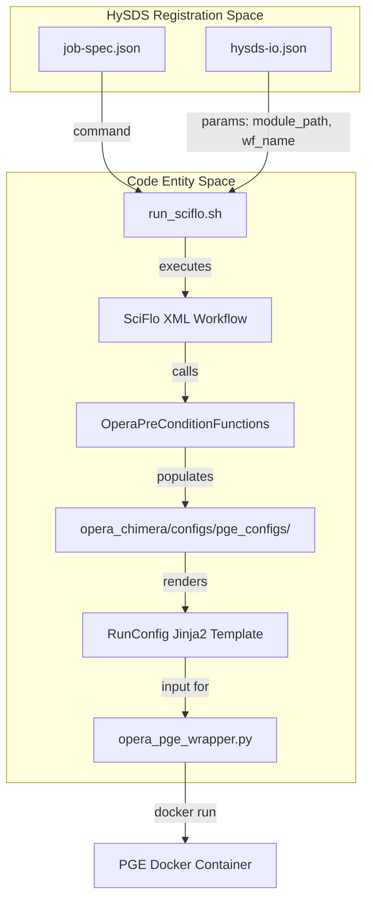
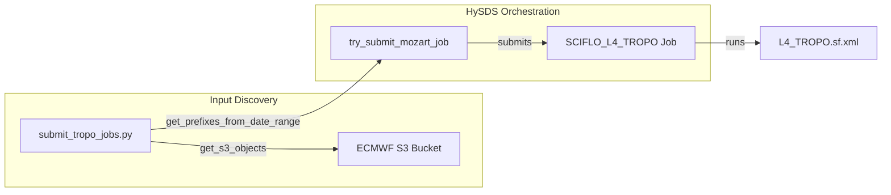

# Page: PGE Configurations and SciFlo Workflows by Product Type

# PGE Configurations and SciFlo Workflows by Product Type

Relevant source files

The following files were used as context for generating this wiki page:

- [conf/RunConfig.yaml.L3_DSWx_HLS.jinja2.tmpl](conf/RunConfig.yaml.L3_DSWx_HLS.jinja2.tmpl)
- [conf/RunConfig.yaml.L4_TROPO.jinja2.tmpl](conf/RunConfig.yaml.L4_TROPO.jinja2.tmpl)
- [conf/schema/RunConfig_schema.L3_DSWx_HLS.yaml](conf/schema/RunConfig_schema.L3_DSWx_HLS.yaml)
- [conf/schema/RunConfig_schema.L4_TROPO.yaml](conf/schema/RunConfig_schema.L4_TROPO.yaml)
- [conf/sds/files/factotum/cron/hysdsops](conf/sds/files/factotum/cron/hysdsops)
- [conf/sds/files/factotum/cron/submit_job.py](conf/sds/files/factotum/cron/submit_job.py)
- [conf/sds/files/mozart/cron/hysdsops](conf/sds/files/mozart/cron/hysdsops)
- [docker/hysds-io.json.SCIFLO_L2_CSLC_S1](docker/hysds-io.json.SCIFLO_L2_CSLC_S1)
- [docker/hysds-io.json.SCIFLO_L2_RTC_S1](docker/hysds-io.json.SCIFLO_L2_RTC_S1)
- [docker/hysds-io.json.SCIFLO_L3_DISP_S1_STATIC](docker/hysds-io.json.SCIFLO_L3_DISP_S1_STATIC)
- [docker/hysds-io.json.SCIFLO_L3_DIST_S1](docker/hysds-io.json.SCIFLO_L3_DIST_S1)
- [docker/hysds-io.json.SCIFLO_L3_DSWx_HLS](docker/hysds-io.json.SCIFLO_L3_DSWx_HLS)
- [docker/hysds-io.json.SCIFLO_L3_DSWx_NI](docker/hysds-io.json.SCIFLO_L3_DSWx_NI)
- [docker/hysds-io.json.SCIFLO_L3_DSWx_S1](docker/hysds-io.json.SCIFLO_L3_DSWx_S1)
- [docker/hysds-io.json.SCIFLO_L4_TROPO](docker/hysds-io.json.SCIFLO_L4_TROPO)
- [docker/hysds-io.json.pge_smoke_test](docker/hysds-io.json.pge_smoke_test)
- [docker/job-spec.json.SCIFLO_L2_CSLC_S1](docker/job-spec.json.SCIFLO_L2_CSLC_S1)
- [docker/job-spec.json.SCIFLO_L2_CSLC_S1_STATIC](docker/job-spec.json.SCIFLO_L2_CSLC_S1_STATIC)
- [docker/job-spec.json.SCIFLO_L2_CSLC_S1_STATIC_hist](docker/job-spec.json.SCIFLO_L2_CSLC_S1_STATIC_hist)
- [docker/job-spec.json.SCIFLO_L2_CSLC_S1_hist](docker/job-spec.json.SCIFLO_L2_CSLC_S1_hist)
- [docker/job-spec.json.SCIFLO_L2_RTC_S1](docker/job-spec.json.SCIFLO_L2_RTC_S1)
- [docker/job-spec.json.SCIFLO_L2_RTC_S1_STATIC](docker/job-spec.json.SCIFLO_L2_RTC_S1_STATIC)
- [docker/job-spec.json.SCIFLO_L3_DISP_S1](docker/job-spec.json.SCIFLO_L3_DISP_S1)
- [docker/job-spec.json.SCIFLO_L3_DISP_S1_STATIC](docker/job-spec.json.SCIFLO_L3_DISP_S1_STATIC)
- [docker/job-spec.json.SCIFLO_L3_DISP_S1_hist](docker/job-spec.json.SCIFLO_L3_DISP_S1_hist)
- [docker/job-spec.json.SCIFLO_L3_DIST_S1](docker/job-spec.json.SCIFLO_L3_DIST_S1)
- [docker/job-spec.json.SCIFLO_L3_DSWx_HLS](docker/job-spec.json.SCIFLO_L3_DSWx_HLS)
- [docker/job-spec.json.SCIFLO_L3_DSWx_NI](docker/job-spec.json.SCIFLO_L3_DSWx_NI)
- [docker/job-spec.json.SCIFLO_L3_DSWx_S1](docker/job-spec.json.SCIFLO_L3_DSWx_S1)
- [docker/job-spec.json.SCIFLO_L4_TROPO](docker/job-spec.json.SCIFLO_L4_TROPO)
- [docker/job-spec.json.pge_smoke_test](docker/job-spec.json.pge_smoke_test)
- [ecmwf-api-client/run_ecmwf_merger_daily.sh](ecmwf-api-client/run_ecmwf_merger_daily.sh)
- [opera_chimera/configs/pge_configs/PGE_L3_DSWx_HLS.yaml](opera_chimera/configs/pge_configs/PGE_L3_DSWx_HLS.yaml)
- [opera_chimera/configs/pge_configs/PGE_L4_TROPO.yaml](opera_chimera/configs/pge_configs/PGE_L4_TROPO.yaml)
- [opera_chimera/wf_xml/L3_DSWx_HLS.sf.xml](opera_chimera/wf_xml/L3_DSWx_HLS.sf.xml)
- [opera_chimera/wf_xml/L4_TROPO.sf.xml](opera_chimera/wf_xml/L4_TROPO.sf.xml)
- [pge_smoke_test/run_pge_smoke_test.sh](pge_smoke_test/run_pge_smoke_test.sh)
- [tools/ops/disp_s1_status/disp_s1_hist_status.py](tools/ops/disp_s1_status/disp_s1_hist_status.py)
- [tools/ops/disp_s1_status/disp_s1_hist_status.sh](tools/ops/disp_s1_status/disp_s1_hist_status.sh)
- [tools/ops/disp_s1_status/disp_s1_hist_status_render.py](tools/ops/disp_s1_status/disp_s1_hist_status_render.py)
- [tools/submit_tropo_jobs.py](tools/submit_tropo_jobs.py)
- [tools/testing/validate_cslc_downloads.py](tools/testing/validate_cslc_downloads.py)

This page serves as a technical reference for the Science Data System (SDS) Product Generation Executable (PGE) configurations and their associated SciFlo workflows. Each product type in the OPERA mission (DSWx, DISP, DIST, CSLC, RTC, and L4-TROPO) is governed by a set of HySDS registration files (`job-spec.json`, `hysds-io.json`), a Chimera PGE configuration (`.yaml`), and a SciFlo XML workflow definition.

## System Integration Overview

The OPERA SDS uses HySDS to manage job lifecycles. Jobs are registered via `job-spec.json` (defining resource requirements and container images) and `hysds-io.json` (defining input parameters and UI labels). The execution is orchestrated by SciFlo, which invokes the `opera_chimera` framework to handle data localization, RunConfig generation, and PGE execution.

### From Job Submission to PGE Execution

The following diagram bridges the HySDS job definitions to the actual code entities that handle PGE execution.

**Figure 1: HySDS to Code Entity Mapping**

**Sources:** [docker/job-spec.json.SCIFLO_L3_DSWx_HLS:1-32](), [docker/hysds-io.json.SCIFLO_L3_DSWx_HLS:1-88](), [opera_chimera/configs/pge_configs/PGE_L3_DSWx_HLS.yaml:1-15](), [conf/RunConfig.yaml.L3_DSWx_HLS.jinja2.tmpl:1-40]()

---

## PGE Configuration Specifications

Each PGE is configured via a YAML file in `opera_chimera/configs/pge_configs/`. These files define the `runconfig` structure, required `preconditions`, and `postprocess` steps.

### 1. DSWx-HLS (Dynamic Surface Water Extent from HLS)
*   **Job Type:** `SCIFLO_L3_DSWx_HLS`
*   **Primary Input:** `L2_HLS_L30` or `L2_HLS_S30`
*   **Ancillary Dependencies:** DEM (Copernicus GLO-30), Land Cover (CGLS), WorldCover (ESA), Shoreline Shapefiles (NOAA GSHHS).

The configuration uses `__CHIMERA_VAL__` placeholders which are resolved by `OperaPreConditionFunctions` during the localization phase.

| Component | File Path |
| :--- | :--- |
| PGE Config | `opera_chimera/configs/pge_configs/PGE_L3_DSWx_HLS.yaml` |
| RunConfig Template | `conf/RunConfig.yaml.L3_DSWx_HLS.jinja2.tmpl` |
| Job Spec | `docker/job-spec.json.SCIFLO_L3_DSWx_HLS` |
| HySDS-IO | `docker/hysds-io.json.SCIFLO_L3_DSWx_HLS` |

**Sources:** [opera_chimera/configs/pge_configs/PGE_L3_DSWx_HLS.yaml:15-132](), [conf/RunConfig.yaml.L3_DSWx_HLS.jinja2.tmpl:1-95]()

### 2. DSWx-S1 / DSWx-NI
These PGEs handle Sentinel-1 and NISAR radar-based water extent.
*   **DSWx-S1 Image:** `opera_pge/dswx_s1:3.0.4` [docker/job-spec.json.pge_smoke_test:21-22]()
*   **DSWx-NI Image:** `opera_pge/dswx_ni:4.0.0-er.4.0` [docker/job-spec.json.pge_smoke_test:37-38]()
*   **Workflow:** Similar to HLS but localized with RTC (Radiometric Terrain Corrected) or GCOV inputs.

### 3. DISP-S1 (Displacement from Sentinel-1)
*   **Job Type:** `SCIFLO_L3_DISP_S1`
*   **Processing Mode:** Supports both forward and historical (`_hist`) processing.
*   **Disk Usage:** Requires significant scratch space (400GB) [docker/job-spec.json.SCIFLO_L3_DISP_S1:3]().
*   **Time Limit:** High latency job (up to 129,600s / 36 hours) [docker/job-spec.json.SCIFLO_L3_DISP_S1:4]().

**Sources:** [docker/job-spec.json.SCIFLO_L3_DISP_S1:1-96](), [docker/job-spec.json.SCIFLO_L3_DISP_S1_hist:1-96]()

### 4. L4-TROPO (Tropospheric Zenith Delay)
Unlike other PGEs triggered by data subscribers, L4-TROPO can be submitted manually for specific time ranges using `submit_tropo_jobs.py`.

**L4-TROPO Data Flow**

**Sources:** [tools/submit_tropo_jobs.py:49-67](), [tools/submit_tropo_jobs.py:139-148](), [tools/submit_tropo_jobs.py:169-208]()

---

## Job Specification & Resource Allocation

HySDS `job-spec.json` files define the runtime environment for each PGE. Key parameters include `disk_usage`, `soft_time_limit`, and `dependency_images`.

### Resource Requirements by Product Type

| Product Type | Disk Usage | Time Limit (s) | Container Image |
| :--- | :--- | :--- | :--- |
| DSWx-HLS | 100GB | 6060 | `opera_pge/dswx_hls:1.0.4` |
| CSLC-S1 | 300GB | 40060 | `opera_pge/cslc_s1:2.1.3` |
| RTC-S1 | 100GB | 30060 | `opera_pge/rtc_s1:2.1.3` |
| DISP-S1 | 400GB | 129660 | `opera_pge/disp_s1:3.0.9` |
| DIST-S1 | 100GB | 86460 | `opera_pge/dist_s1:6.0.0` |

**Sources:** [docker/job-spec.json.SCIFLO_L3_DSWx_HLS:3-5](), [docker/job-spec.json.SCIFLO_L2_CSLC_S1:3-5](), [docker/job-spec.json.SCIFLO_L2_RTC_S1:3-5](), [docker/job-spec.json.SCIFLO_L3_DISP_S1:3-5](), [docker/job-spec.json.SCIFLO_L3_DIST_S1:3-5]()

### HySDS Parameter Mapping (`hysds-io.json`)

The `hysds-io.json` maps HySDS dataset metadata into SciFlo workflow parameters. For example, in `SCIFLO_L3_DSWx_HLS`:
*   `dataset_type`: Extracted from `_source.dataset` via JSONPath [docker/hysds-io.json.SCIFLO_L3_DSWx_HLS:25-28]().
*   `input_dataset_id`: Extracted from `_id` [docker/hysds-io.json.SCIFLO_L3_DSWx_HLS:30-33]().
*   `product_metadata`: Filtered via a lambda to include only the `metadata` key [docker/hysds-io.json.SCIFLO_L3_DSWx_HLS:35-38]().

---

## PGE Smoke Testing

The `pge_smoke_test` job type is a specialized utility used to validate all PGE containers within a single environment. It includes all PGE images as `dependency_images` and executes `run_pge_smoke_test.sh`.

**Smoke Test Job Configuration:**
*   **Command:** `/home/ops/verdi/ops/opera-pcm/pge_smoke_test/run_pge_smoke_test.sh` [docker/job-spec.json.pge_smoke_test:2]()
*   **Worker Files:** Imports `.netrc` and `.aws` credentials for data access [docker/job-spec.json.pge_smoke_test:6-10]().
*   **Queues:** Targets `opera-job_worker-pge_smoke_test_amd` or `_intel` [docker/job-spec.json.pge_smoke_test:77]().

**Sources:** [docker/job-spec.json.pge_smoke_test:1-98]()
