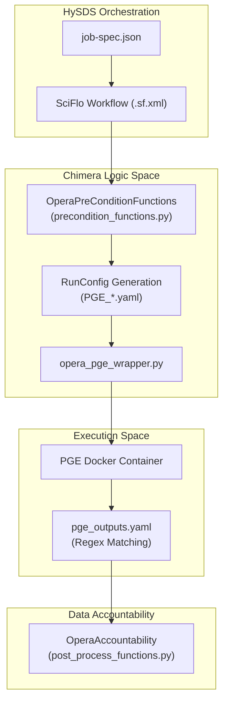
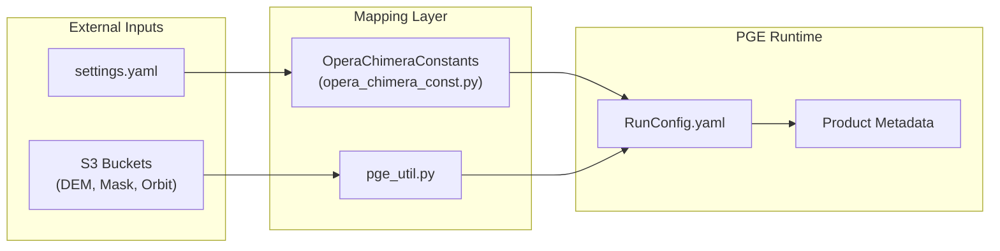

# Page: PGE Orchestration: Chimera Pipeline

# PGE Orchestration: Chimera Pipeline

Relevant source files

The following files were used as context for generating this wiki page:

- [conf/pge_outputs.yaml](conf/pge_outputs.yaml)
- [conf/sds/files/datasets.json](conf/sds/files/datasets.json)
- [conf/sds/files/datasets.json.tmpl.asg](conf/sds/files/datasets.json.tmpl.asg)
- [conf/sds/rules/user_rules-cnm.json.tmpl](conf/sds/rules/user_rules-cnm.json.tmpl)
- [conf/settings.yaml](conf/settings.yaml)
- [opera_chimera/configs/pge_configs/PGE_L3_DISP_S1.yaml](opera_chimera/configs/pge_configs/PGE_L3_DISP_S1.yaml)
- [opera_chimera/configs/pge_configs/PGE_L3_DSWx_NI.yaml](opera_chimera/configs/pge_configs/PGE_L3_DSWx_NI.yaml)
- [opera_chimera/configs/pge_configs/PGE_L3_DSWx_S1.yaml](opera_chimera/configs/pge_configs/PGE_L3_DSWx_S1.yaml)
- [opera_chimera/constants/opera_chimera_const.py](opera_chimera/constants/opera_chimera_const.py)
- [opera_chimera/precondition_functions.py](opera_chimera/precondition_functions.py)
- [opera_chimera/wf_xml/L3_DSWx_NI.sf.xml](opera_chimera/wf_xml/L3_DSWx_NI.sf.xml)
- [opera_chimera/wf_xml/L3_DSWx_S1.sf.xml](opera_chimera/wf_xml/L3_DSWx_S1.sf.xml)
- [tests/unit/util/test_pge_util.py](tests/unit/util/test_pge_util.py)
- [util/pge_util.py](util/pge_util.py)

The `opera_chimera` layer serves as the bridge between the **HySDS (Hybrid Cloud Science Data System)** job orchestration framework and the **Docker-based PGE (Product Generation Executable)** execution. It manages the full lifecycle of a science job, from staging ancillary data and generating RunConfigs to executing the PGE container and post-processing science products into HySDS datasets.

### Lifecycle Overview

The Chimera pipeline follows a standardized four-phase lifecycle for every science product type (e.g., DSWx-HLS, CSLC-S1, DISP-S1). This lifecycle is defined by the interaction between `OperaPreConditionFunctions`, the SciFlo workflow engine, and the `opera_pge_wrapper`.

#### 1. Precondition and Localization
Before a PGE runs, the system evaluates a list of preconditions defined in the PGE's YAML configuration (e.g., [opera_chimera/configs/pge_configs/PGE_L3_DISP_S1.yaml:46-63]()).
- **Ancillary Staging:** Downloads DEMs, water masks, and orbit files from S3 [opera_chimera/precondition_functions.py:185-187]().
- **RunConfig Generation:** Populates YAML templates by replacing `__CHIMERA_VAL__` placeholders with resolved paths and metadata [opera_chimera/configs/pge_configs/PGE_L3_DSWx_S1.yaml:6-18]().

#### 2. PGE Execution
The job is handed off to a Docker container. The `opera_pge_wrapper.py` handles the setup of the working environment (input, output, and scratch directories) and invokes the science algorithm.

#### 3. Product Conversion and Extraction
Once the PGE exits, the wrapper identifies generated files based on regex patterns in `pge_outputs.yaml` [conf/pge_outputs.yaml:23-29](). It then:
- Converts raw files into HySDS **Datasets**.
- Triggers the **Extractor** to harvest metadata into `.met.json` files for OpenSearch indexing.

#### 4. Post-Processing and Accountability
The final phase ensures the job's provenance is recorded in the `job_accountability` catalog and triggers downstream delivery mechanisms like the Cloud Notification Mechanism (CNM) [opera_chimera/configs/pge_configs/PGE_L3_DISP_S1.yaml:66-67]().

---

### System Entity Mapping

The following diagrams illustrate how high-level orchestration concepts map to specific classes and configuration files within the `opera-sds-pcm` repository.

#### Orchestration Flow: Logic to Code
This diagram shows how a HySDS Job triggers the specific Python entities within `opera_chimera`.

**Sources:** [opera_chimera/precondition_functions.py:41-45](), [opera_chimera/configs/pge_configs/PGE_L3_DISP_S1.yaml:15-43](), [conf/pge_outputs.yaml:1-21]()

#### Data Flow: Ancillary and Product Mapping
This diagram shows how external data and settings are mapped into the PGE environment via the Chimera constants and utility layers.

**Sources:** [opera_chimera/constants/opera_chimera_const.py:3-170](), [util/pge_util.py:177-194](), [conf/settings.yaml:1-50]()

---

### Child Pages

For detailed technical implementation of each phase, refer to the following sub-pages:

*   **[Precondition Functions and RunConfig Generation](#4.1)**
    Details on `OperaPreConditionFunctions`, ancillary data staging (DEM, WorldCover, Ionosphere), and how Jinja2 templates are used to create the final PGE `RunConfig`.
*   **[PGE Wrapper: Docker Execution and Product Conversion](#4.2)**
    Deep dive into the `opera_pge_wrapper.py` lifecycle, directory management, and the `product2dataset` system that uses `pge_outputs.yaml` to package science products.
*   **[PGE Configurations and SciFlo Workflows by Product Type](#4.3)**
    A reference guide for the specific YAML and XML configurations for each OPERA product (DSWx, DISP, DIST, RTC, CSLC).
*   **[Job Accountability, Post-Processing, and CNM Delivery](#4.4)**
    Overview of the accountability catalog, the `OperaPostProcessFunctions`, and the rules for delivering products to the DAAC via CNM.

---

### Key Configuration Files

| File | Purpose |
| :--- | :--- |
| `conf/settings.yaml` | Global system settings, collection names, and product versions [conf/settings.yaml:1-49](). |
| `conf/pge_outputs.yaml` | Regex definitions for identifying and validating PGE output files [conf/pge_outputs.yaml:23-110](). |
| `opera_chimera/configs/pge_configs/` | PGE-specific RunConfig templates and precondition lists [opera_chimera/configs/pge_configs/PGE_L3_DISP_S1.yaml:1-128](). |
| `opera_chimera/constants/opera_chimera_const.py` | Centralized string constants used for dictionary keys and environment variables [opera_chimera/constants/opera_chimera_const.py:7-170](). |

**Sources:** [conf/settings.yaml:1-49](), [conf/pge_outputs.yaml:1-110](), [opera_chimera/configs/pge_configs/PGE_L3_DISP_S1.yaml:1-128](), [opera_chimera/constants/opera_chimera_const.py:1-170]()
