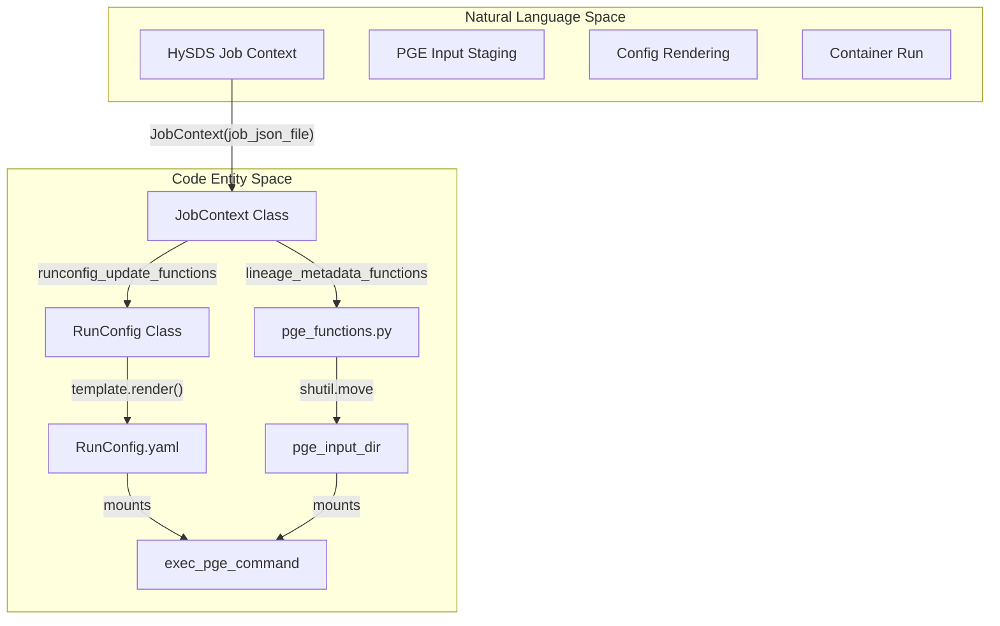
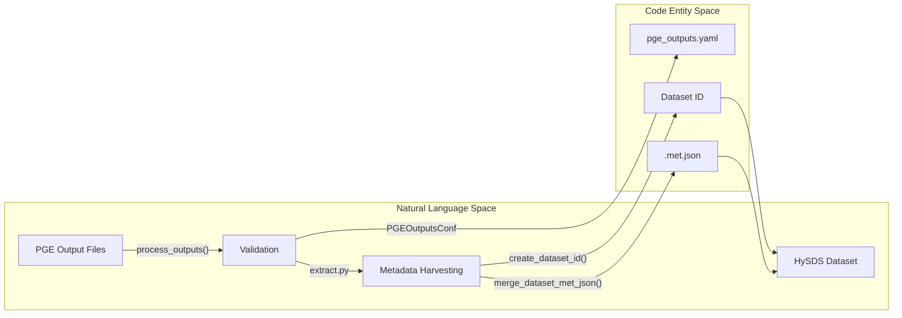

# Page: PGE Wrapper: Docker Execution and Product Conversion

# PGE Wrapper: Docker Execution and Product Conversion

Relevant source files

The following files were used as context for generating this wiki page:

- [cluster_provisioning/open_urls.sh](cluster_provisioning/open_urls.sh)
- [extractor/FilenameRegexMetExtractor.py](extractor/FilenameRegexMetExtractor.py)
- [extractor/extract.py](extractor/extract.py)
- [opera_chimera/accountability.py](opera_chimera/accountability.py)
- [opera_chimera/opera_pge_job_submitter.py](opera_chimera/opera_pge_job_submitter.py)
- [opera_chimera/postprocess_functions.py](opera_chimera/postprocess_functions.py)
- [opera_commons/logger.py](opera_commons/logger.py)
- [product2dataset/iso_xml_reader.py](product2dataset/iso_xml_reader.py)
- [product2dataset/product2dataset.py](product2dataset/product2dataset.py)
- [tests/product2dataset/test_product2dataset.py](tests/product2dataset/test_product2dataset.py)
- [tests/unit/tools/test_stage_ionosphere_file.py](tests/unit/tools/test_stage_ionosphere_file.py)
- [tests/unit/tools/test_stage_orbit_file.py](tests/unit/tools/test_stage_orbit_file.py)
- [tools/dataspace_s1_download.py](tools/dataspace_s1_download.py)
- [tools/stage_ionosphere_file.py](tools/stage_ionosphere_file.py)
- [tools/stage_orbit_file.py](tools/stage_orbit_file.py)
- [tools/truncate_disp_s1_burst_db.py](tools/truncate_disp_s1_burst_db.py)
- [util/aws_util.py](util/aws_util.py)
- [util/backoff_util.py](util/backoff_util.py)
- [util/conf_util.py](util/conf_util.py)
- [util/ctx_util.py](util/ctx_util.py)
- [util/dataspace_util.py](util/dataspace_util.py)
- [util/edl_util.py](util/edl_util.py)
- [util/job_json_util.py](util/job_json_util.py)
- [util/os_util.py](util/os_util.py)
- [util/type_util.py](util/type_util.py)
- [wrapper/opera_pge_wrapper.py](wrapper/opera_pge_wrapper.py)
- [wrapper/pge_functions.py](wrapper/pge_functions.py)

The OPERA PGE Wrapper provides the execution lifecycle for Science Data System (SDS) Product Generation Executables (PGEs). It manages the transition from a HySDS job environment to a containerized PGE execution, followed by the conversion of raw PGE outputs into standardized HySDS datasets with harvested metadata.

## PGE Wrapper Execution Lifecycle

The primary entry point for PGE execution is `wrapper/opera_pge_wrapper.py`. This script orchestrates the setup of the execution environment, transforms the HySDS job context into PGE-specific configurations, and manages the Docker-based run.

### 1. Directory Setup and Lineage Collection
The wrapper initializes a standardized directory structure for the PGE: `pge_input_dir`, `pge_output_dir`, `pge_scratch_dir`, and `pge_runconfig_dir` [wrapper/opera_pge_wrapper.py:111](). 

Before execution, the system gathers "lineage metadata"—a list of all input files and staged ancillaries required by the PGE. This is handled by PGE-specific functions defined in `wrapper/pge_functions.py` [wrapper/opera_pge_wrapper.py:42-56](). For example, `slc_s1_lineage_metadata` identifies S3-localized SLC files, DEMs, and ionosphere files [wrapper/pge_functions.py:10-45](). These files are then moved or symlinked into the `pge_input_dir` [wrapper/opera_pge_wrapper.py:124-142]().

### 2. RunConfig Transformation
The wrapper performs last-minute updates to the `RunConfig` dictionary using specialized functions (e.g., `update_dswx_hls_runconfig`) [wrapper/opera_pge_wrapper.py:59-73](). The final dictionary is passed to the `RunConfig` class [util/conf_util.py:94](), which uses Jinja2 templates to render the `RunConfig.yaml` file required by the PGE [util/conf_util.py:116-119]().

### 3. Docker Execution
The `exec_pge_command` function constructs the `docker run` command [wrapper/opera_pge_wrapper.py:173](). It mounts the local work directories into the container and executes the PGE entry point as defined in the job configuration.

### Data Flow: Context to Execution
The following diagram illustrates how the HySDS `_context.json` is transformed into the PGE execution environment.

**Title: PGE Wrapper Execution Flow**

**Sources:** [wrapper/opera_pge_wrapper.py:78-176](), [wrapper/pge_functions.py:10-106](), [util/conf_util.py:94-119]().

---

## Product to Dataset Conversion

Once the PGE completes, the raw output files must be converted into HySDS datasets. This is performed by `product2dataset/product2dataset.py`.

### Conversion Logic
The `convert()` function [product2dataset/product2dataset.py:37]() performs the following steps:
1.  **Validation:** It uses `PGEOutputsConf` to verify that all "Primary" outputs expected for the specific PGE were generated [product2dataset/product2dataset.py:61-68]().
2.  **Extraction:** It calls the `extractor/extract.py` system to create a dataset directory and harvest metadata [product2dataset/product2dataset.py:83-88]().
3.  **Lineage & Metadata Merging:** Individual `.met.json` files generated for output granules are merged into a single comprehensive metadata file [product2dataset/product2dataset.py:104]().
4.  **S3 Pathing:** The system calculates the final S3 destination paths based on the `datasets.json` configuration and PGE shortnames [product2dataset/product2dataset.py:149-164]().

### Metadata Harvesting (Extractor)
The `extractor/extract.py` module is responsible for the actual "harvesting" of metadata from PGE products.
*   **`extract_helper`**: Creates the dataset directory, copies the product, and triggers metadata extraction [extractor/extract.py:89-105]().
*   **`create_dataset_id`**: Determines the unique HySDS ID for the dataset based on regex patterns in `settings.yaml` [extractor/extract.py:110]().
*   **`extract_metadata`**: Uses specialized extractors (like `FilenameRegexMetExtractor`) to pull spatial and temporal metadata from filenames or internal file headers [extractor/extract.py:133-137]().

**Title: Product Conversion and Metadata Extraction**

**Sources:** [product2dataset/product2dataset.py:37-164](), [extractor/extract.py:65-184](), [util/conf_util.py:162-174]().

---

## Key Functions and Classes

| Component | Entity | Responsibility |
| :--- | :--- | :--- |
| **Wrapper** | `run_pipeline` | Coordinates directory creation, lineage, config updates, and execution [wrapper/opera_pge_wrapper.py:97](). |
| **Wrapper** | `lineage_metadata_functions` | Map of PGE names to functions that identify input files [wrapper/opera_pge_wrapper.py:42](). |
| **Conversion** | `product2dataset.convert` | Main entry point for transforming PGE output folders into HySDS datasets [product2dataset/product2dataset.py:37](). |
| **Extractor** | `extract.extract` | Creates dataset directory and generates `.met.json` and `.dataset.json` [extractor/extract.py:65](). |
| **Config** | `RunConfig` | Renders YAML configuration files from Jinja2 templates [util/conf_util.py:94](). |
| **Config** | `PGEOutputsConf` | Validates PGE output existence against `pge_outputs.yaml` [util/conf_util.py:162](). |

### Special Metadata Handling
For specific products like **Compressed CSLC (CCSLS)**, the system performs additional decoration, such as calculating the `ccslc_m_index` using the burst ID and acquisition cycle [product2dataset/product2dataset.py:24](), [tests/product2dataset/test_product2dataset.py:19-25]().

**Sources:** [wrapper/opera_pge_wrapper.py:42-97](), [product2dataset/product2dataset.py:24-174](), [extractor/extract.py:65-184](), [util/conf_util.py:94-174]().
