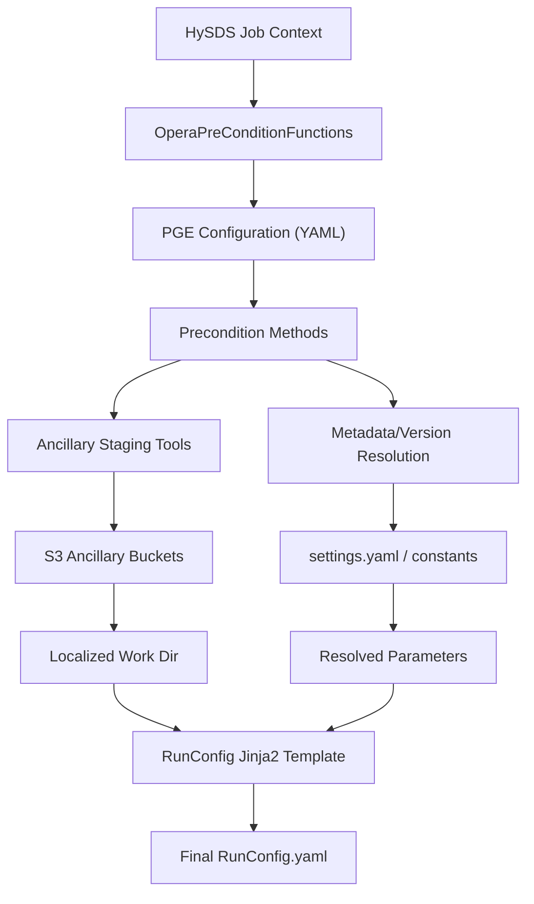
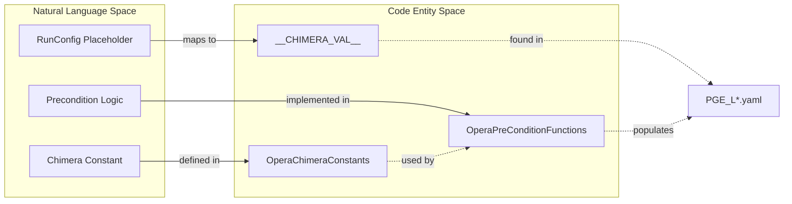

# Page: Precondition Functions and RunConfig Generation

# Precondition Functions and RunConfig Generation

<details>
<summary>Relevant source files</summary>

The following files were used as context for generating this wiki page:

- [cluster_provisioning/dev-e2e/template.tfvars](cluster_provisioning/dev-e2e/template.tfvars)
- [conf/AlgoParams.yaml.L3_DISP_S1.jinja2.tmpl](conf/AlgoParams.yaml.L3_DISP_S1.jinja2.tmpl)
- [conf/AlgoParams.yaml.L3_DIST_S1.jinja2.tmpl](conf/AlgoParams.yaml.L3_DIST_S1.jinja2.tmpl)
- [conf/AlgoParams.yaml.L3_DSWx_S1.jinja2.tmpl](conf/AlgoParams.yaml.L3_DSWx_S1.jinja2.tmpl)
- [conf/RunConfig.yaml.L2_CSLC_S1.jinja2.tmpl](conf/RunConfig.yaml.L2_CSLC_S1.jinja2.tmpl)
- [conf/RunConfig.yaml.L2_CSLC_S1_STATIC.jinja2.tmpl](conf/RunConfig.yaml.L2_CSLC_S1_STATIC.jinja2.tmpl)
- [conf/RunConfig.yaml.L2_RTC_S1.jinja2.tmpl](conf/RunConfig.yaml.L2_RTC_S1.jinja2.tmpl)
- [conf/RunConfig.yaml.L2_RTC_S1_STATIC.jinja2.tmpl](conf/RunConfig.yaml.L2_RTC_S1_STATIC.jinja2.tmpl)
- [conf/RunConfig.yaml.L3_DISP_S1.jinja2.tmpl](conf/RunConfig.yaml.L3_DISP_S1.jinja2.tmpl)
- [conf/RunConfig.yaml.L3_DISP_S1_STATIC.jinja2.tmpl](conf/RunConfig.yaml.L3_DISP_S1_STATIC.jinja2.tmpl)
- [conf/RunConfig.yaml.L3_DIST_S1.jinja2.tmpl](conf/RunConfig.yaml.L3_DIST_S1.jinja2.tmpl)
- [conf/RunConfig.yaml.L3_DSWx_NI.jinja2.tmpl](conf/RunConfig.yaml.L3_DSWx_NI.jinja2.tmpl)
- [conf/RunConfig.yaml.L3_DSWx_S1.jinja2.tmpl](conf/RunConfig.yaml.L3_DSWx_S1.jinja2.tmpl)
- [conf/schema/AlgoParams_schema.L3_DISP_S1.yaml](conf/schema/AlgoParams_schema.L3_DISP_S1.yaml)
- [conf/schema/AlgoParams_schema.L3_DIST_S1.yaml](conf/schema/AlgoParams_schema.L3_DIST_S1.yaml)
- [conf/schema/AlgoParams_schema.L3_DSWx_S1.yaml](conf/schema/AlgoParams_schema.L3_DSWx_S1.yaml)
- [conf/schema/RunConfig_schema.L2_CSLC_S1.yaml](conf/schema/RunConfig_schema.L2_CSLC_S1.yaml)
- [conf/schema/RunConfig_schema.L2_RTC_S1.yaml](conf/schema/RunConfig_schema.L2_RTC_S1.yaml)
- [conf/schema/RunConfig_schema.L3_DISP_S1.yaml](conf/schema/RunConfig_schema.L3_DISP_S1.yaml)
- [conf/schema/RunConfig_schema.L3_DISP_S1_STATIC.yaml](conf/schema/RunConfig_schema.L3_DISP_S1_STATIC.yaml)
- [conf/schema/RunConfig_schema.L3_DIST_S1.yaml](conf/schema/RunConfig_schema.L3_DIST_S1.yaml)
- [conf/schema/RunConfig_schema.L3_DSWx_NI.yaml](conf/schema/RunConfig_schema.L3_DSWx_NI.yaml)
- [conf/schema/RunConfig_schema.L3_DSWx_S1.yaml](conf/schema/RunConfig_schema.L3_DSWx_S1.yaml)
- [conf/sds/files/opensearch/grq_os_templates/os_template_rtc_for_dist_catalog.json](conf/sds/files/opensearch/grq_os_templates/os_template_rtc_for_dist_catalog.json)
- [opera_chimera/configs/pge_configs/PGE_L2_CSLC_S1.yaml](opera_chimera/configs/pge_configs/PGE_L2_CSLC_S1.yaml)
- [opera_chimera/configs/pge_configs/PGE_L2_CSLC_S1_STATIC.yaml](opera_chimera/configs/pge_configs/PGE_L2_CSLC_S1_STATIC.yaml)
- [opera_chimera/configs/pge_configs/PGE_L2_RTC_S1.yaml](opera_chimera/configs/pge_configs/PGE_L2_RTC_S1.yaml)
- [opera_chimera/configs/pge_configs/PGE_L2_RTC_S1_STATIC.yaml](opera_chimera/configs/pge_configs/PGE_L2_RTC_S1_STATIC.yaml)
- [opera_chimera/configs/pge_configs/PGE_L3_DISP_S1.yaml](opera_chimera/configs/pge_configs/PGE_L3_DISP_S1.yaml)
- [opera_chimera/configs/pge_configs/PGE_L3_DIST_S1.yaml](opera_chimera/configs/pge_configs/PGE_L3_DIST_S1.yaml)
- [opera_chimera/configs/pge_configs/PGE_L3_DSWx_S1.yaml](opera_chimera/configs/pge_configs/PGE_L3_DSWx_S1.yaml)
- [opera_chimera/constants/opera_chimera_const.py](opera_chimera/constants/opera_chimera_const.py)
- [opera_chimera/precondition_functions.py](opera_chimera/precondition_functions.py)
- [opera_chimera/wf_xml/L2_RTC_S1.sf.xml](opera_chimera/wf_xml/L2_RTC_S1.sf.xml)
- [opera_chimera/wf_xml/L3_DSWx_S1.sf.xml](opera_chimera/wf_xml/L3_DSWx_S1.sf.xml)

</details>


This page provides a deep dive into the **Precondition** phase of the OPERA SDS Chimera pipeline. Precondition functions are responsible for staging ancillary data, calculating resource requirements, and resolving the dynamic values needed to populate PGE RunConfigs.

## Overview

The precondition system bridges the gap between a triggered HySDS job and the execution of a Dockerized PGE. It ensures all dependencies (DEMs, Orbit files, etc.) are localized from S3 and that the `RunConfig.yaml` is correctly instantiated from Jinja2 templates using resolved parameters.

### Data Flow and Lifecycle

1.  **Job Trigger**: A SciFlo workflow or manual submission starts a job.
2.  **Precondition Evaluation**: The `OperaPreConditionFunctions` class executes a sequence of methods defined in the PGE's YAML configuration.
3.  **Ancillary Staging**: External tools (e.g., `stage_dem.py`) are called to fetch geospatial data based on the input granule's bounding box.
4.  **Value Resolution**: Placeholders marked as `__CHIMERA_VAL__` in the PGE config are replaced with actual paths or values.
5.  **RunConfig Generation**: A Jinja2 template is rendered into the final `RunConfig.yaml` used by the PGE.


**Sources:** [opera_chimera/precondition_functions.py:1-45](), [opera_chimera/configs/pge_configs/PGE_L3_DISP_S1.yaml:45-64]()

---

## OperaPreConditionFunctions Class

The `OperaPreConditionFunctions` class, defined in `opera_chimera/precondition_functions.py`, inherits from the base Chimera `PreConditionFunctions`. It contains the logic for every `preconditions` entry listed in the PGE configuration files.

### Key Functional Categories

| Category | Key Functions | Description |
| :--- | :--- | :--- |
| **Ancillary Staging** | `get_slc_s1_dem`, `get_worldcover`, `get_slc_s1_tec_file` | Uses bounding boxes to download and VRT-process DEMs, LandCover, and Ionosphere files. |
| **Resource Logic** | `get_disp_s1_num_workers`, `get_dswx_s1_num_workers` | Calculates parallelization threads based on system resources or settings. |
| **Metadata** | `get_product_version`, `get_cnm_version` | Retrieves software and delivery versions from `settings.yaml`. |
| **Product Specific** | `get_disp_s1_algorithm_parameters` | Resolves S3 paths for YAML parameter files based on processing mode (Forward vs. Historical). |

**Sources:** [opera_chimera/precondition_functions.py:41-45](), [opera_chimera/precondition_functions.py:138-187](), [opera_chimera/precondition_functions.py:516-550]()

---

## Ancillary Data Staging

OPERA PGEs require various ancillary datasets. These are staged from S3 buckets (e.g., `opera-dem`, `opera-world-cover`) into the job's working directory.

### DEM and Map Staging Logic
Functions like `get_slc_s1_dem` perform the following:
1.  Determine the bounding box of the input SLC/HLS granule using `util.geo_util`.
2.  Call the specialized staging tools (e.g., `stage_dem.main`).
3.  The staging tools download the relevant tiles and create a Virtual Raster (VRT) to provide a seamless interface for the PGE.

```python
# Example logic for staging a DEM for CSLC/RTC processing
def get_slc_s1_dem(self):
    # 1. Get bbox from SLC granule
    bbox = bounding_box_from_slc_granule(self._context['input_metadata'])
    # 2. Call staging utility
    stage_dem(s3_bucket="opera-dem", s3_key="v1.1", bbox=bbox, output_dir=get_working_dir())
```
**Sources:** [opera_chimera/precondition_functions.py:516-550](), [opera_chimera/precondition_functions.py:34-38]()

---

## RunConfig Generation Pattern

The SDS uses a two-step template system to generate the `RunConfig.yaml` required by the Science Application Software (SAS).

### 1. PGE Configuration (YAML)
Each PGE has a configuration file (e.g., `PGE_L3_DISP_S1.yaml`) containing a `runconfig` section. This section uses `__CHIMERA_VAL__` placeholders for any value that must be determined at runtime.

**Example Snippet:**
```yaml
runconfig:
  input_file_group:
    input_file_paths: __CHIMERA_VAL__
  dynamic_ancillary_file_group:
    dem_file: __CHIMERA_VAL__
  cnm_version: "__CHIMERA_VAL__"
```
**Sources:** [opera_chimera/configs/pge_configs/PGE_L3_DISP_S1.yaml:15-43]()

### 2. Jinja2 Templates
The resolved `runconfig` dictionary from the PGE config is passed as a data object to a Jinja2 template (e.g., `RunConfig.yaml.L2_CSLC_S1.jinja2.tmpl`). This allows for complex logic, such as looping over input file lists or conditional blocks.

**Sources:** [conf/RunConfig.yaml.L2_CSLC_S1.jinja2.tmpl:1-24]()

### System Entity Mapping

The following diagram maps the logical names used in documentation to the specific code entities and configuration keys.


**Sources:** [opera_chimera/constants/opera_chimera_const.py:3-20](), [opera_chimera/precondition_functions.py:25-27](), [opera_chimera/configs/pge_configs/PGE_L3_DISP_S1.yaml:5-10]()

---

## Mapping Layer: OperaChimeraConstants

To avoid hardcoded strings across the precondition functions and PGE wrappers, the `OperaChimeraConstants` class provides a centralized mapping. This class extends the base `ChimeraConstants`.

| Constant Name | Value | Purpose |
| :--- | :--- | :--- |
| `DEM_FILE` | `"dem_file"` | Key for DEM path in RunConfig |
| `CNM_VERSION` | `"CNM_VERSION"` | Key for looking up CNM version in settings |
| `L3_DISP_S1` | `"L3_DISP_S1"` | PGE Shortname identifier |
| `PROCESSING_MODE_FORWARD` | `"forward"` | Processing mode discriminator |

**Sources:** [opera_chimera/constants/opera_chimera_const.py:25-31](), [opera_chimera/constants/opera_chimera_const.py:103-121]()

---

## Resource Allocation Logic

Precondition functions also calculate the `num_workers` or `threads_per_worker` values passed to the PGE. This is often based on the number of CPUs available on the Verdi worker node.

For example, in `get_disp_s1_num_workers`, the system:
1.  Checks `settings.yaml` for a default worker count.
2.  If set to `auto`, it detects the available CPU count on the instance.
3.  Updates the `runconfig.processing.threads_per_worker` value.

**Sources:** [opera_chimera/precondition_functions.py:388-420](), [opera_chimera/configs/pge_configs/PGE_L3_DISP_S1.yaml:40-41]()
