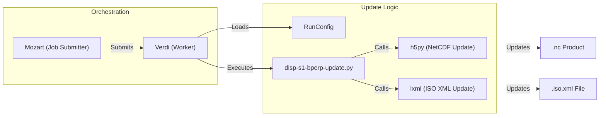

# Page: Product Validation and Reporting

# Product Validation and Reporting

<details>
<summary>Relevant source files</summary>

The following files were used as context for generating this wiki page:

- [docker/hysds-io.json.SCIFLO_Product_Update](docker/hysds-io.json.SCIFLO_Product_Update)
- [docker/job-spec.json.SCIFLO_Product_Update](docker/job-spec.json.SCIFLO_Product_Update)
- [opera_chimera/configs/pge_configs/PGE_Product_Update.yaml](opera_chimera/configs/pge_configs/PGE_Product_Update.yaml)
- [opera_chimera/wf_xml/Product_Update.sf.xml](opera_chimera/wf_xml/Product_Update.sf.xml)
- [product_update/disp_s1_r4_bperp/docker/Dockerfile](product_update/disp_s1_r4_bperp/docker/Dockerfile)
- [product_update/disp_s1_r4_bperp/docker/disp-s1-bperp-update.py](product_update/disp_s1_r4_bperp/docker/disp-s1-bperp-update.py)
- [product_update/disp_s1_r4_bperp/docker/entrypoint.sh](product_update/disp_s1_r4_bperp/docker/entrypoint.sh)
- [product_update/disp_s1_r4_bperp/docker/update_runconfig_schema.yaml](product_update/disp_s1_r4_bperp/docker/update_runconfig_schema.yaml)
- [product_update/disp_s1_r4_bperp/update.py](product_update/disp_s1_r4_bperp/update.py)
- [report/opera_validator/data.pkl](report/opera_validator/data.pkl)
- [report/opera_validator/data_wrong.pkl](report/opera_validator/data_wrong.pkl)
- [report/opera_validator/opera_validator.py](report/opera_validator/opera_validator.py)
- [report/opera_validator/opv_disp_s1.py](report/opera_validator/opv_disp_s1.py)
- [report/opera_validator/opv_util.py](report/opera_validator/opv_util.py)
- [report/opera_validator/should_trigger.pkl](report/opera_validator/should_trigger.pkl)
- [report/opera_validator/test_opera_validator.py](report/opera_validator/test_opera_validator.py)
- [tools/download_from_daac.py](tools/download_from_daac.py)

</details>


This section describes the operational tools and automated scripts used for validating OPERA SDS products, generating accountability reports, and performing retroactive product updates. These tools ensure that the SDS state remains consistent with the NASA Common Metadata Repository (CMR) and that products meet scientific requirements.

## 1. Product Validation Framework

The `report/opera_validator/` directory contains tools to verify that the Process Control Mirror (PCM) has correctly identified and processed all available input granules into their respective output products.

### 1.1 OPERA Validator (`opera_validator.py`)
The primary entry point for validation is `opera_validator.py` [report/opera_validator/opera_validator.py:1-12](). It supports cross-checking PCM's internal state against CMR to identify missing or unprocessed products.

Key functions include:
*   `get_burst_ids_and_sensing_times_from_query`: Queries CMR for specific product shortnames (e.g., `OPERA_L2_RTC-S1_V1`) and extracts burst IDs and sensing times [report/opera_validator/opera_validator.py:37-73]().
*   `validate_dswx_s1`: Specifically validates DSWx-S1 products by mapping MGRS tiles to input RTC bursts and identifying discrepancies [report/opera_validator/opera_validator.py:77-168]().

### 1.2 DISP-S1 Validation (`opv_disp_s1.py`)
Validation for the DISP-S1 product is more complex due to its frame-based and multi-temporal nature.

*   **Logic**: It maps frame IDs to acquisition day indices and ensures that the set of available CSLC granules matches the requirements in the burst database [report/opera_validator/opv_disp_s1.py:16-49]().
*   **Trigger Filtering**: `filter_for_trigger_frame` modifies the frame-to-day-index map in-place to remove indices that do not meet the criteria for triggering a DISP-S1 job [report/opera_validator/opv_disp_s1.py:51-91]().
*   **K-Completeness**: In historical processing mode, it calculates "k-sets" to ensure that validation only occurs for complete groups of $K$ acquisitions [report/opera_validator/opv_disp_s1.py:112-127]().

### Validation Data Flow
The following diagram illustrates how the validator reconciles CMR data with expected processing triggers.

**Validator Logic and Entity Mapping**
```mermaid
graph TD
    subgraph "Natural Language Space"
        A["Scientific Requirement"]
        B["Missing Product Detection"]
    end

    subgraph "Code Entity Space"
        C["opera_validator.py"]
        D["opv_disp_s1.py"]
        E["retrieve_r3_products()"]
        F["parse_cslc_native_id()"]
        G["filter_for_trigger_frame()"]
    end

    A -->|Implemented in| D
    B -->|Executed by| C
    C -->|Queries CMR via| E
    D -->|Parses CSLC metadata| F
    F -->|Feeds into| G
    G -->|Determines| H["Trigger Status"]
end
```
*Sources: [report/opera_validator/opera_validator.py:14-15](), [report/opera_validator/opv_disp_s1.py:31-32](), [report/opera_validator/opv_disp_s1.py:51-60]()*

---

## 2. Retroactive Product Updates (DISP-S1)

The system provides a mechanism to update existing products without full reprocessing. A specific tool exists for updating DISP-S1 products with baseline perpendicular data.

### 2.1 Update Tooling (`product_update/disp_s1_r4_bperp/`)
This tool updates the `.nc` (NetCDF) product and its associated `.iso.xml` metadata file.

*   **CLI Interface**: `update.py` provides a CLI to specify frames, date ranges, and CMR endpoints (PROD/UAT) for updates [product_update/disp_s1_r4_bperp/update.py:44-161]().
*   **Job Submission**: It can submit `SCIFLO_Product_Update` jobs to the Mozart orchestrator [product_update/disp_s1_r4_bperp/update.py:18-25]().
*   **Metadata Modification**: The `_update_iso_xml` function in `disp-s1-bperp-update.py` uses XPath to surgically update processing timestamps, product versions, and IDs within the ISO XML file [product_update/disp_s1_r4_bperp/docker/disp-s1-bperp-update.py:83-184]().

### 2.2 Product Update Workflow
The update is orchestrated as a standard HySDS job using a specialized PGE configuration.

| Component | File / Identifier | Description |
| :--- | :--- | :--- |
| **PGE Config** | `PGE_Product_Update.yaml` | Defines preconditions like `get_update_config_from_metadata` [opera_chimera/configs/pge_configs/PGE_Product_Update.yaml:28-31]() |
| **Job Spec** | `job-spec.json.SCIFLO_Product_Update` | Configures the runtime environment and dependency images [docker/job-spec.json.SCIFLO_Product_Update:1-20]() |
| **Container** | `disp-s1-bperp-update:latest` | Docker image containing the update scripts and environment [product_update/disp_s1_r4_bperp/docker/Dockerfile:1-13]() |

**Product Update Data Flow**

*Sources: [product_update/disp_s1_r4_bperp/update.py:18-25](), [product_update/disp_s1_r4_bperp/docker/disp-s1-bperp-update.py:11-14](), [opera_chimera/configs/pge_configs/PGE_Product_Update.yaml:16-25]()*

---

## 3. Reporting and Utility Tools

### 3.1 DAAC Download Utility
The `tools/download_from_daac.py` script allows operators to retrieve products from NASA DAACs and stage them into internal S3 buckets [tools/download_from_daac.py:13-16]().

*   **Filtering**: Supports filtering by frame list and product version [tools/download_from_daac.py:18-26]().
*   **Mechanism**: Uses `boto3` to copy objects directly between buckets after identifying S3 URLs in the CMR metadata [tools/download_from_daac.py:81-109]().

### 3.2 Accountability Reporting
Accountability is managed through the `OperaAccountability` class, which is integrated into the post-processing phase of PGE jobs.

*   **Integration**: The `PGE_Product_Update.yaml` specifies `update_product_accountability` as a post-process step [opera_chimera/configs/pge_configs/PGE_Product_Update.yaml:33-35]().
*   **Mapping**: The `hysds-io.json` maps the accountability class for the SciFlo workflow [docker/hysds-io.json.SCIFLO_Product_Update:70-74]().

| Tool / Script | Purpose | Key Dependency |
| :--- | :--- | :--- |
| `download_from_daac.py` | Migration of products from DAAC to SDS | `boto3`, `opv_util.retrieve_r3_products` |
| `update.py` | Bulk update of DISP-S1 baseline metadata | `requests`, `util.job_submitter` |
| `test_opera_validator.py` | Unit testing for validation logic | `pytest`, `opv_disp_s1` |

*Sources: [tools/download_from_daac.py:9-11](), [product_update/disp_s1_r4_bperp/update.py:17-18](), [report/opera_validator/test_opera_validator.py:1-10]()*
