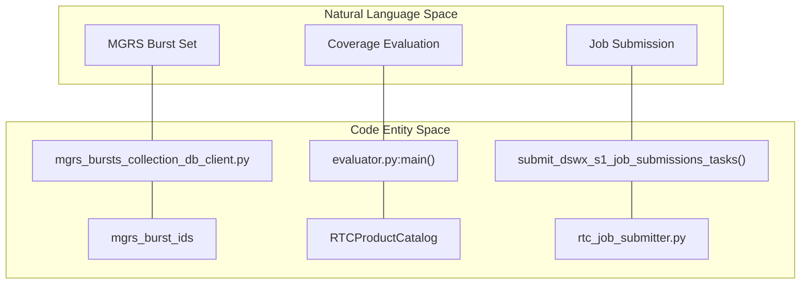
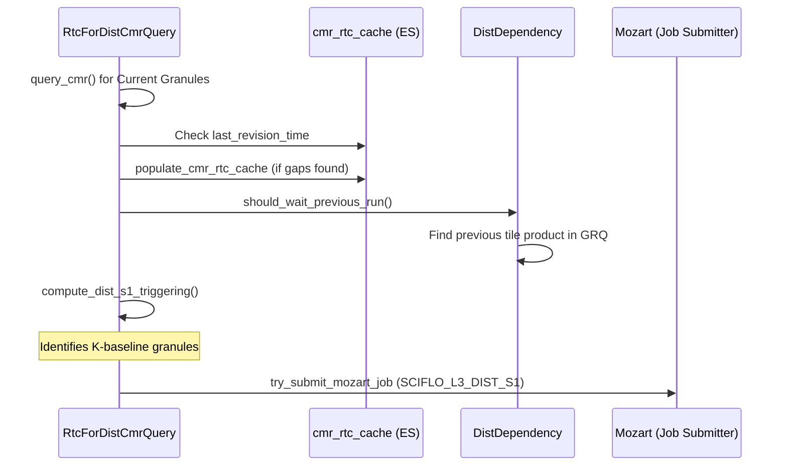

# Page: RTC Data Subscriber and DSWx-S1 Triggering

# RTC Data Subscriber and DSWx-S1 Triggering

Relevant source files

The following files were used as context for generating this wiki page:

- [data_subscriber/asf_rtc_download.py](data_subscriber/asf_rtc_download.py)
- [data_subscriber/asf_rtc_for_dist_download.py](data_subscriber/asf_rtc_for_dist_download.py)
- [data_subscriber/asf_slc_download.py](data_subscriber/asf_slc_download.py)
- [data_subscriber/cslc/cslc_download.sh](data_subscriber/cslc/cslc_download.sh)
- [data_subscriber/dist_s1_utils.py](data_subscriber/dist_s1_utils.py)
- [data_subscriber/lpdaac_download.py](data_subscriber/lpdaac_download.py)
- [data_subscriber/rtc/evaluator.py](data_subscriber/rtc/evaluator.py)
- [data_subscriber/rtc/evaluator_core.py](data_subscriber/rtc/evaluator_core.py)
- [data_subscriber/rtc/mgrs_bursts_collection_db_client.py](data_subscriber/rtc/mgrs_bursts_collection_db_client.py)
- [data_subscriber/rtc/rtc_catalog.py](data_subscriber/rtc/rtc_catalog.py)
- [data_subscriber/rtc/rtc_download_job_submitter.py](data_subscriber/rtc/rtc_download_job_submitter.py)
- [data_subscriber/rtc/rtc_job_submitter.py](data_subscriber/rtc/rtc_job_submitter.py)
- [data_subscriber/rtc/rtc_query.py](data_subscriber/rtc/rtc_query.py)
- [data_subscriber/rtc_for_dist/dist_dependency.py](data_subscriber/rtc_for_dist/dist_dependency.py)
- [data_subscriber/rtc_for_dist/rtc_for_dist_catalog.py](data_subscriber/rtc_for_dist/rtc_for_dist_catalog.py)
- [data_subscriber/rtc_for_dist/rtc_for_dist_query.py](data_subscriber/rtc_for_dist/rtc_for_dist_query.py)
- [data_subscriber/submit_pending_jobs.py](data_subscriber/submit_pending_jobs.py)
- [data_subscriber/url.py](data_subscriber/url.py)
- [docker/hysds-io.json.rtc_download](docker/hysds-io.json.rtc_download)
- [docker/job-spec.json.rtc_download](docker/job-spec.json.rtc_download)
- [rtc_utils.py](rtc_utils.py)
- [tests/benchmark/test_benchmark.py](tests/benchmark/test_benchmark.py)
- [tests/data_subscriber/test_dist_s1_utils.py](tests/data_subscriber/test_dist_s1_utils.py)
- [tests/data_subscriber/test_rtc_for_dist_query.py](tests/data_subscriber/test_rtc_for_dist_query.py)
- [tests/integration/test_integration.py](tests/integration/test_integration.py)
- [tests/regression/test_dswx_s1_edge_cases.py](tests/regression/test_dswx_s1_edge_cases.py)
- [tests/unit/test_dist_s1.py](tests/unit/test_dist_s1.py)
- [tools/dist_s1_burst_db_tool.py](tools/dist_s1_burst_db_tool.py)
- [tools/populate_cmr_rtc_cache.py](tools/populate_cmr_rtc_cache.py)
- [tools/view_pending_jobs.py](tools/view_pending_jobs.py)
- [util/job_submitter.py](util/job_submitter.py)

This page details the Radiometric Terrain Corrected (RTC) data subscription pipeline. It covers two primary workflows: the **RTC-to-DSWx-S1** pipeline, which evaluates MGRS burst sets for coverage, and the **RTC-for-DIST** pipeline, which manages complex temporal dependencies and K-minus baseline retrieval for the DIST-S1 (Disturbance) PGE.

## 1. RTC-to-DSWx-S1 Triggering Pipeline

The RTC subscriber monitors NASA CMR for `OPERA_L2_RTC-S1` products. Unlike SLC data which is processed per-granule, RTC products are grouped into **MGRS Burst Sets** to trigger the `SCIFLO_L3_DSWx_S1` PGE.

### 1.1 Data Flow and Evaluation
1.  **Query**: `RtcCmrQuery` performs an asynchronous CMR search [data_subscriber/rtc/rtc_query.py:43-52]().
2.  **MGRS Mapping**: Each RTC granule is mapped to one or more MGRS set IDs using the `mgrs_bursts_collection_db_client` [data_subscriber/rtc/rtc_query.py:94-95]().
3.  **Cataloging**: Granules are indexed in the `rtc_catalog` (Elasticsearch) with metadata including `mgrs_set_id_acquisition_ts_cycle_index` [data_subscriber/rtc/rtc_query.py:108-114]().
4.  **Evaluation**: The `evaluator.py` component analyzes the catalog to determine if a burst set has reached the required coverage threshold to trigger processing [data_subscriber/rtc/evaluator.py:33-46]().

### 1.2 Coverage and Grace Periods
The system supports flexible triggering logic based on:
*   **Coverage Target**: Percentage of expected bursts present in the set (e.g., 100%) [data_subscriber/rtc/evaluator.py:102-138]().
*   **Minimum Bursts**: A hard floor for the number of bursts required [data_subscriber/rtc/evaluator.py:30-38]().
*   **Grace Period**: If a set is incomplete, the system waits for `grace_mins` before triggering a partial processing job to ensure no more granules are arriving from the DAAC [data_subscriber/rtc/rtc_query.py:140-142]().

### 1.3 Code Entity Map: RTC Triggering
The following diagram maps high-level triggering concepts to specific code implementations.

**Title: RTC Triggering Implementation Map**

Sources: [data_subscriber/rtc/rtc_query.py:17-18](), [data_subscriber/rtc/evaluator.py:17-19](), [data_subscriber/rtc/rtc_job_submitter.py:28-30]()

---

## 2. RTC-for-DIST Pipeline

The `RTC-for-DIST` pipeline is a specialized subscriber for the DIST-S1 PGE. It requires not just the current RTC granules, but also a historical baseline (K-minus) and a reference to the previous product's state.

### 2.1 Temporal Dependency Management
The `DistDependency` class manages the complex requirements for DIST-S1:
*   **Previous Run Check**: It queries the `grq_v0.1_l3_dist_s1` index to see if a previous product exists for the tile [data_subscriber/rtc_for_dist/dist_dependency.py:39-53]().
*   **Wait Logic**: If a previous job is still running (queued/offline), the current subscriber will block to maintain temporal consistency [data_subscriber/rtc_for_dist/dist_dependency.py:76-83]().

### 2.2 K-Minus Baseline Retrieval
DIST-S1 requires $K$ historical granules as baselines. 
1.  **K-Parameters**: Defined as offsets and counts (e.g., `[(365, 4), (730, 3)]`) [data_subscriber/dist_s1_utils.py:19]().
2.  **CMR RTC Cache**: To avoid repeated expensive CMR queries, the system maintains a `cmr_rtc_cache` index [data_subscriber/rtc_for_dist/dist_dependency.py:12]().
3.  **Gap Filling**: During forward processing, the subscriber automatically fills gaps in the `cmr_rtc_cache` if they are within `MAX_CMR_RTC_CACHE_GAP_DAYS` [data_subscriber/rtc_for_dist/rtc_for_dist_query.py:89-115]().

### 2.3 RTC-for-DIST Data Flow
The following diagram illustrates the retrieval of current vs. baseline granules.

**Title: RTC-for-DIST Data Flow**

Sources: [data_subscriber/rtc_for_dist/rtc_for_dist_query.py:83-125](), [data_subscriber/rtc_for_dist/dist_dependency.py:39-53](), [data_subscriber/dist_s1_utils.py:19-25]()

---

## 3. Key Classes and Implementation Details

### 3.1 RTCProductCatalog
Extends `ProductCatalog` to handle RTC-specific metadata like MGRS set IDs and coverage statistics.
*   `mark_products_as_job_submitted`: Updates Elasticsearch documents with the ID of the triggered DSWx-S1 job and calculates the final coverage percentage [data_subscriber/rtc/rtc_catalog.py:149-160]().
*   `filter_catalog_by_sets`: Retrieves all granules associated with specific MGRS sets [data_subscriber/rtc/rtc_catalog.py:60-69]().

### 3.2 AsfDaacRtcDownload
Handles the physical retrieval of RTC data.
*   **Batching**: Groups downloads by MGRS set ID [data_subscriber/asf_rtc_download.py:43-49]().
*   **S3 Upload**: Downloads files to a local buffer and then performs a concurrent upload to the SDS `DATASET_BUCKET` under a `tmp/dswx_s1/{batch_id}` prefix [data_subscriber/asf_rtc_download.py:98-105]().
*   **Job Triggering**: Once uploads are complete, it calls `submit_dswx_s1_job_submissions_tasks` to start the SciFlo workflow [data_subscriber/asf_rtc_download.py:124-126]().

### 3.3 RTC-for-DIST Utils
Found in `dist_s1_utils.py`, these functions handle the geospatial mapping of RTC bursts to DIST-S1 tiles.
*   `localize_dist_burst_db`: Downloads and caches the `mgrs_burst_lookup_table.parquet` which defines the relationship between JPL burst IDs and MGRS tiles [data_subscriber/dist_s1_utils.py:47-73]().
*   `process_dist_burst_db`: Parses the parquet file into dictionaries for fast lookup of `bursts_to_products` and `product_to_bursts` [data_subscriber/dist_s1_utils.py:76-109]().

Sources: [data_subscriber/rtc/rtc_catalog.py:19-22](), [data_subscriber/asf_rtc_download.py:26-30](), [data_subscriber/dist_s1_utils.py:1-20]()
