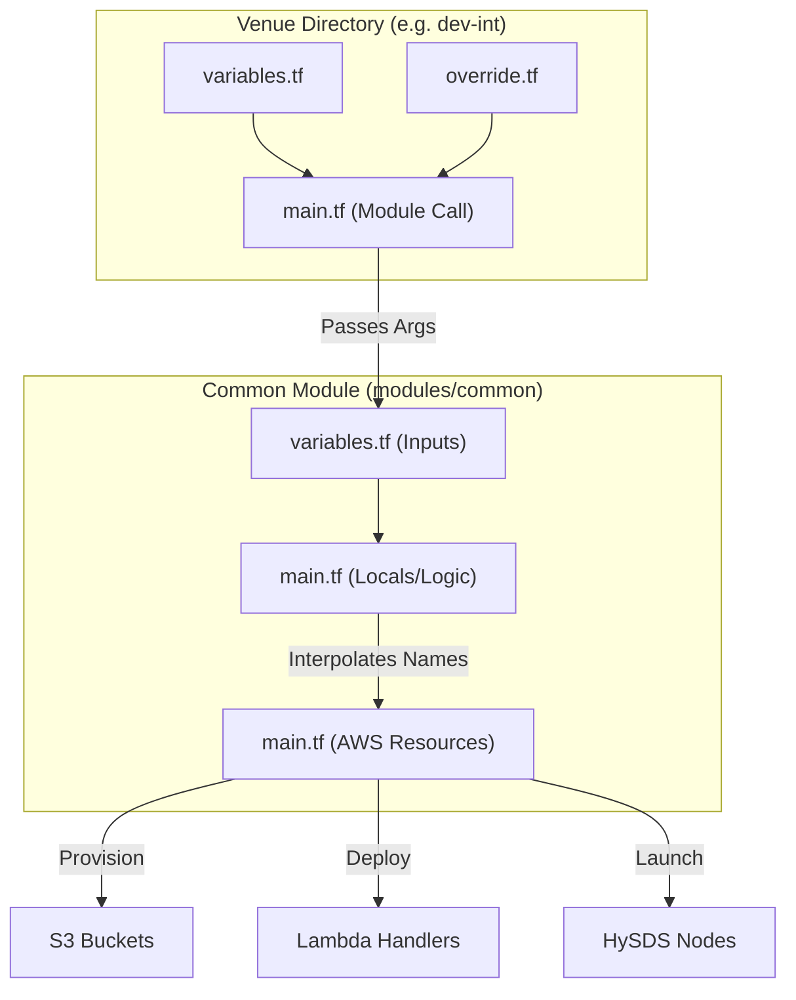
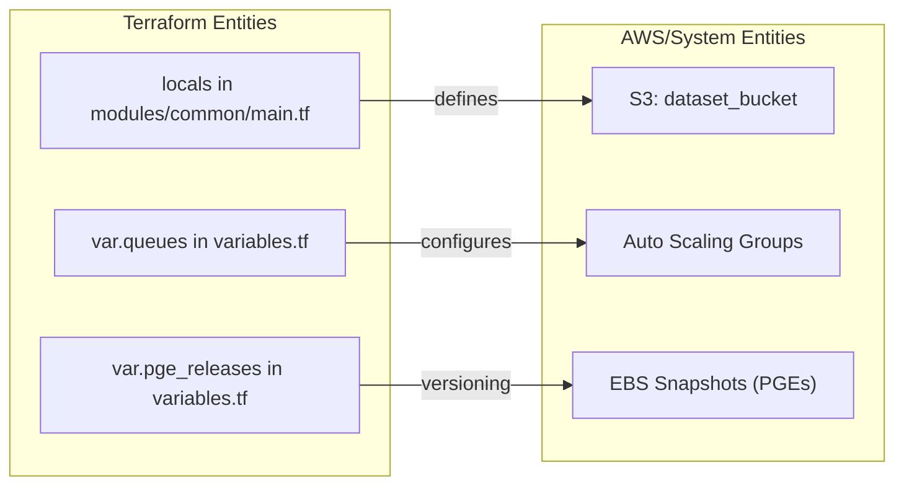

# Page: Terraform Common Module and Venue Configurations

# Terraform Common Module and Venue Configurations

Relevant source files

The following files were used as context for generating this wiki page:

- [cluster_provisioning/dev-common/main.tf](cluster_provisioning/dev-common/main.tf)
- [cluster_provisioning/dev-common/override.tf](cluster_provisioning/dev-common/override.tf)
- [cluster_provisioning/dev-common/variables.tf](cluster_provisioning/dev-common/variables.tf)
- [cluster_provisioning/dev-e2e/main.tf](cluster_provisioning/dev-e2e/main.tf)
- [cluster_provisioning/dev-e2e/variables.tf](cluster_provisioning/dev-e2e/variables.tf)
- [cluster_provisioning/dev-int/main.tf](cluster_provisioning/dev-int/main.tf)
- [cluster_provisioning/dev-int/override.tf](cluster_provisioning/dev-int/override.tf)
- [cluster_provisioning/dev-releaser/main.tf](cluster_provisioning/dev-releaser/main.tf)
- [cluster_provisioning/dev-releaser/variables.tf](cluster_provisioning/dev-releaser/variables.tf)
- [cluster_provisioning/dev/.terraform.lock.hcl](cluster_provisioning/dev/.terraform.lock.hcl)
- [cluster_provisioning/dev/main.tf](cluster_provisioning/dev/main.tf)
- [cluster_provisioning/dev/variables.tf](cluster_provisioning/dev/variables.tf)
- [cluster_provisioning/ebs-snapshot/variables.tf](cluster_provisioning/ebs-snapshot/variables.tf)
- [cluster_provisioning/int/int-fwd/main.tf](cluster_provisioning/int/int-fwd/main.tf)
- [cluster_provisioning/int/int_override.tf](cluster_provisioning/int/int_override.tf)
- [cluster_provisioning/int/main.tf](cluster_provisioning/int/main.tf)
- [cluster_provisioning/int/variables.tf](cluster_provisioning/int/variables.tf)
- [cluster_provisioning/modules/common/main.tf](cluster_provisioning/modules/common/main.tf)
- [cluster_provisioning/modules/common/variables.tf](cluster_provisioning/modules/common/variables.tf)
- [cluster_provisioning/modules/common/versions.tf](cluster_provisioning/modules/common/versions.tf)
- [cluster_provisioning/ops/main.tf](cluster_provisioning/ops/main.tf)
- [cluster_provisioning/ops/ops-fwd/main.tf](cluster_provisioning/ops/ops-fwd/main.tf)
- [cluster_provisioning/ops/variables.tf](cluster_provisioning/ops/variables.tf)
- [cluster_provisioning/ops/versions.tf](cluster_provisioning/ops/versions.tf)
- [cluster_provisioning/pst/main.tf](cluster_provisioning/pst/main.tf)
- [cluster_provisioning/pst/override.tf](cluster_provisioning/pst/override.tf)
- [cluster_provisioning/pst/variables.tf](cluster_provisioning/pst/variables.tf)
- [cluster_provisioning/pst/versions.tf](cluster_provisioning/pst/versions.tf)

The OPERA SDS PCM infrastructure is managed via Terraform, centered around a reusable "common" module. This module encapsulates the core HySDS components, Lambda-based event handlers, and networking requirements. Environment-specific configurations (venues) like `dev`, `int`, `ops`, and `pst` consume this module, applying overrides to tailor the infrastructure for different stages of the software development lifecycle.

## The Common Module (`modules/common`)

The `cluster_provisioning/modules/common` directory is the foundational infrastructure-as-code unit for the PCM. It defines the standard deployment pattern for Mozart, GRQ, Metrics, and Factotum nodes, as well as the supporting AWS serverless components [cluster_provisioning/modules/common/main.tf:1-125]().

### S3 Bucket Naming Convention
The module implements a standardized naming convention for S3 buckets to ensure consistency across venues. Buckets are typically named using the pattern: `{project}-{environment}-{type}-{direction}-{venue}` [cluster_provisioning/modules/common/main.tf:3-12]().

| Local Variable | Default Pattern | Purpose |
| :--- | :--- | :--- |
| `dataset_bucket` | `opera-{env}-rs-fwd-{venue}` | Storage for generated data products (Repository Server) |
| `code_bucket` | `opera-{env}-cc-fwd-{venue}` | Storage for job specs, containers, and code (Code Cluster) |
| `osl_bucket` | `opera-{env}-osl-fwd-{venue}` | Output Staging Layer for DAAC delivery |
| `triage_bucket` | `opera-{env}-triage-fwd-{venue}` | Storage for failed job artifacts for debugging |
| `lts_bucket` | `opera-{env}-lts-fwd-{venue}` | Long Term Storage |

Sources: [cluster_provisioning/modules/common/main.tf:1-15]()

### Lambda Deployments and Handlers
The common module manages several Lambda functions critical for system automation and DAAC integration. These are packaged as ZIP files and retrieved from Artifactory during the provisioning process [cluster_provisioning/modules/common/main.tf:92-112]().

Key Handlers include:
*   **CNM Response Handler (`lambda-cnm-r-handler`)**: Processes Cloud Notification Mechanism (CNM) responses from DAACs (PO.DAAC and ASF) to update job accountability state [cluster_provisioning/modules/common/variables.tf:223-225]().
*   **Harikiri Handler (`lambda-harikiri-handler`)**: Manages the self-termination of worker instances or cleanup of resources based on inactivity or specific triggers [cluster_provisioning/modules/common/variables.tf:227-229]().
*   **Data Subscriber Handlers**: Specific Lambdas for `query` and `download` tasks, enabling serverless triggering of data discovery [cluster_provisioning/modules/common/variables.tf:231-241]().
*   **Event Misfire Handler**: Monitors and alerts on scheduled events (like timers) that fail to execute [cluster_provisioning/modules/common/variables.tf:247-249]().

Sources: [cluster_provisioning/modules/common/variables.tf:223-255](), [cluster_provisioning/modules/common/main.tf:92-115]()

### AMI Resolution and SSM
The module resolves Amazon Machine Images (AMIs) using AWS Systems Manager (SSM) parameters. This allows for centralized management of "golden images" for HySDS nodes. If `use_cluster_verdi_ssm` is enabled, the module creates a cluster-specific SSM parameter to lock the Verdi (worker) AMI version for that specific deployment [cluster_provisioning/modules/common/main.tf:72-88]().

Sources: [cluster_provisioning/modules/common/main.tf:72-90]()

## Venue Configurations and Overrides

Venues are top-level directories (e.g., `dev`, `dev-int`, `ops`) that call the common module. They manage environment-specific state and provide the variable values that customize the deployment.

### Configuration Hierarchy
1.  **`variables.tf`**: Defines the available variables and their default values for the specific venue (e.g., `pcm_branch` defaults to `develop` in `dev`) [cluster_provisioning/dev/variables.tf:27-29]().
2.  **`main.tf`**: Instantiates the `common` module and passes venue-specific variables into it [cluster_provisioning/dev/main.tf:7-113]().
3.  **`override.tf`**: Used in environments like `dev-int` to hard-code specific values that must deviate from the standard defaults without modifying the shared `variables.tf` [cluster_provisioning/dev-int/override.tf:9-46]().

### Venue Comparison

| Feature | `dev` / `dev-e2e` | `dev-int` (Integration) | `ops` (Production) |
| :--- | :--- | :--- | :--- |
| **PCM Branch** | `develop` [cluster_provisioning/dev/variables.tf:28]() | Specific RC (e.g., `3.2.0-rc.2.0`) [cluster_provisioning/dev-int/override.tf:146]() | Release tags |
| **Artifactory Repo** | `general-develop` [cluster_provisioning/dev/variables.tf:12]() | `general-develop` [cluster_provisioning/dev-int/override.tf:102]() | `general` |
| **Instance Sizes** | Smaller (e.g., `r6i.xlarge` for GRQ) [cluster_provisioning/dev/variables.tf:188]() | Larger (e.g., `r5.4xlarge` for GRQ) [cluster_provisioning/dev-int/override.tf:218]() | Production Grade |
| **Cluster Type** | `forward` | `forward` or `reprocessing` [cluster_provisioning/dev-int/override.tf:43-46]() | `forward` |

Sources: [cluster_provisioning/dev/variables.tf:7-210](), [cluster_provisioning/dev-int/override.tf:1-240](), [cluster_provisioning/dev-e2e/variables.tf:7-210]()

## Data Flow: Infrastructure Provisioning

The following diagram illustrates how configuration flows from venue-specific files through the common module to AWS resources.

### Infrastructure Configuration Flow

Sources: [cluster_provisioning/modules/common/main.tf:1-80](), [cluster_provisioning/dev-int/main.tf:1-109](), [cluster_provisioning/dev-int/override.tf:1-100]()

### Code Entity Mapping: Common Module to AWS
This diagram maps specific Terraform code entities to the AWS infrastructure they manage.

Sources: [cluster_provisioning/modules/common/main.tf:3-12](), [cluster_provisioning/modules/common/variables.tf:258-325](), [cluster_provisioning/dev-e2e/variables.tf:372-385]()

## Worker Queue Configurations
The common module defines a complex `queues` variable that maps HySDS job types to AWS EC2 instance types and scaling behaviors. Each entry in the map defines the `instance_type` (supporting spot instances via lists), `root_dev_size`, and `max_size` for the resulting Auto Scaling Group [cluster_provisioning/modules/common/variables.tf:258-325]().

Example queue configuration for CSLC processing:
*   **Job Type**: `opera-job_worker-sciflo-l2_cslc_s1`
*   **Instance Types**: `c7i.2xlarge`, `c6a.2xlarge`, `c6i.2xlarge`
*   **Storage**: 50GB Root, 300GB Data [cluster_provisioning/modules/common/variables.tf:260-270]().

Sources: [cluster_provisioning/modules/common/variables.tf:258-325]()
