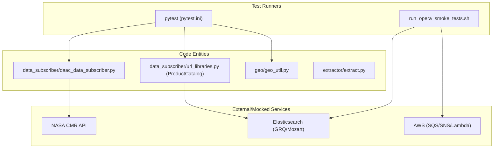

# Page: Testing Infrastructure

# Testing Infrastructure

Relevant source files

The following files were used as context for generating this wiki page:

- [cluster_provisioning/run_opera_smoke_tests.sh](cluster_provisioning/run_opera_smoke_tests.sh)
- [pytest.ini](pytest.ini)

The OPERA SDS PCM employs a multi-layered testing strategy designed to ensure the reliability of data subscription, PGE orchestration, and infrastructure provisioning. The test suite ranges from localized unit tests to end-to-end integration tests that simulate full HySDS cluster operations.

### Testing Strategy Overview

The testing infrastructure is organized into several distinct layers, managed primarily via `pytest` and specialized shell wrappers for CI/CD environments.

| Test Category | Location | Purpose |
| :--- | :--- | :--- |
| **Unit Tests** | `tests/unit/` | Validates individual components like `ProductCatalog`, `CMR` clients, and geospatial utilities in isolation. |
| **Scenario Tests** | `tests/scenarios/` | JSON-driven tests for complex logic, such as CSLC query modes (Forward, Historical, Reprocessing). |
| **Integration Tests** | `tests/integration/` | Validates end-to-end workflows including Lambda triggers, SQS/SNS messaging, and Elasticsearch interactions. |
| **Smoke Tests** | `cluster_provisioning/` | High-level validation of a newly provisioned cluster to ensure all nodes (Mozart, GRQ) are responsive. |
| **Benchmarks** | `tests/integration/` | Performance testing using the Tosca framework to measure processing throughput. |

### Test Execution Flow

The following diagram illustrates how different test entities interact with the PCM codebase and external infrastructure components like CMR and Elasticsearch.

**PCM Testing Architecture**

**Sources:** [pytest.ini:1-35](), [cluster_provisioning/run_opera_smoke_tests.sh:1-165]()

---

### Unit and Scenario Tests
The unit test suite focuses on the core logic of the `data_subscriber` and `opera_chimera` modules. This includes validating that the `ProductCatalog` correctly indexes granules and that geospatial filters in `geo_util.py` correctly identify intersections with North American AOIs.

Scenario tests are a specialized subset of tests that use JSON configuration files to simulate complex state-based behaviors. For example, the CSLC query pipeline uses scenario files to test "k-satiety" logic across different processing modes without requiring a full live cluster.

For details, see [Unit and Scenario Tests](#8.1).

**Sources:** [pytest.ini:14-17](), [cluster_provisioning/run_opera_smoke_tests.sh:140-146]()

---

### Integration and Regression Tests
Integration tests validate the PCM's ability to operate within the HySDS framework. These tests typically require environment variables pointing to active Mozart and GRQ instances. The `run_opera_smoke_tests.sh` script automates the setup of these environments, installing the PCM with specific extras:
* `pip install -e '.[integration]'`
* `pip install -e '.[test]'`
* `pip install -e '.[subscriber]'`

The integration suite covers product-specific triggers, such as `test_subscriber_rtc_trigger_logic`, which ensures that MGRS burst sets are correctly evaluated before triggering a DSWx-S1 PGE job. Regression tests are also maintained here to prevent the re-emergence of known edge cases in HLS and SLC processing.

For details, see [Integration and Regression Tests](#8.2).

**Sources:** [cluster_provisioning/run_opera_smoke_tests.sh:148-160]()

---

### CI/CD and Smoke Testing
The PCM uses `run_opera_smoke_tests.sh` as a primary entry point for validating deployments in `dev-e2e` environments. This script exports critical environment variables for the test session, linking the Python test suite to the AWS infrastructure.

**Smoke Test Configuration Mapping**
| Variable | Code/Infra Association |
| :--- | :--- |
| `ES_HOST` | Mozart Private IP for Elasticsearch [cluster_provisioning/run_opera_smoke_tests.sh:124]() |
| `GRQ_BASE_URL` | GRQ API endpoint [cluster_provisioning/run_opera_smoke_tests.sh:127]() |
| `L30_DATA_SUBSCRIBER_QUERY_LAMBDA` | AWS Lambda for HLS L30 Query [cluster_provisioning/run_opera_smoke_tests.sh:131]() |
| `CNMR_TOPIC` | SNS Topic for Cloud Notification Mechanism [cluster_provisioning/run_opera_smoke_tests.sh:128]() |

The results are captured in JUnit XML format (`target/reports/junit/junit.xml`) for integration with CI/CD reporting tools.

**Sources:** [cluster_provisioning/run_opera_smoke_tests.sh:124-135](), [pytest.ini:5-9]()
