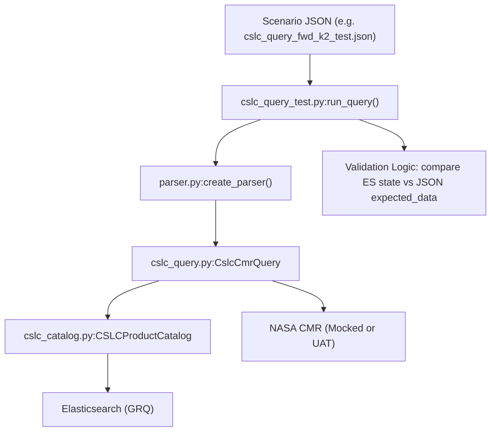
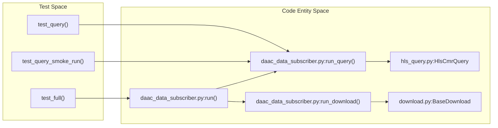

# Page: Unit and Scenario Tests

# Unit and Scenario Tests

<details>
<summary>Relevant source files</summary>

The following files were used as context for generating this wiki page:

- [COPYING](COPYING)
- [cluster_provisioning/open_urls.sh](cluster_provisioning/open_urls.sh)
- [data_subscriber/cmr.py](data_subscriber/cmr.py)
- [data_subscriber/daac_data_subscriber.py](data_subscriber/daac_data_subscriber.py)
- [data_subscriber/download.py](data_subscriber/download.py)
- [data_subscriber/gcov/__init__.py](data_subscriber/gcov/__init__.py)
- [data_subscriber/gcov/asf_gcov_download.py](data_subscriber/gcov/asf_gcov_download.py)
- [data_subscriber/gcov/gcov_catalog.py](data_subscriber/gcov/gcov_catalog.py)
- [data_subscriber/gcov/gcov_query.py](data_subscriber/gcov/gcov_query.py)
- [data_subscriber/gcov/mgrs_track_collections_db.py](data_subscriber/gcov/mgrs_track_collections_db.py)
- [data_subscriber/gcov_utils.py](data_subscriber/gcov_utils.py)
- [data_subscriber/parser.py](data_subscriber/parser.py)
- [data_subscriber/survey.py](data_subscriber/survey.py)
- [docker/hysds-io.json.cslc_download](docker/hysds-io.json.cslc_download)
- [docker/hysds-io.json.cslc_query](docker/hysds-io.json.cslc_query)
- [docker/hysds-io.json.cslc_query_frame_range](docker/hysds-io.json.cslc_query_frame_range)
- [docker/hysds-io.json.cslc_query_hist](docker/hysds-io.json.cslc_query_hist)
- [docker/hysds-io.json.rtc_query](docker/hysds-io.json.rtc_query)
- [docker/job-spec.json.cslc_download](docker/job-spec.json.cslc_download)
- [docker/job-spec.json.cslc_download_hist](docker/job-spec.json.cslc_download_hist)
- [docker/job-spec.json.cslc_query](docker/job-spec.json.cslc_query)
- [docker/job-spec.json.cslc_query_frame_range](docker/job-spec.json.cslc_query_frame_range)
- [docker/job-spec.json.cslc_query_hist](docker/job-spec.json.cslc_query_hist)
- [docker/job-spec.json.rtc_query](docker/job-spec.json.rtc_query)
- [extractor/FilenameRegexMetExtractor.py](extractor/FilenameRegexMetExtractor.py)
- [tests/data_subscriber/test_daac_data_subscriber.py](tests/data_subscriber/test_daac_data_subscriber.py)
- [tests/scenarios/cslc_query_fwd_blackout_empty_test.json](tests/scenarios/cslc_query_fwd_blackout_empty_test.json)
- [tests/scenarios/cslc_query_fwd_blackout_test.json](tests/scenarios/cslc_query_fwd_blackout_test.json)
- [tests/scenarios/cslc_query_fwd_k2_test.json](tests/scenarios/cslc_query_fwd_k2_test.json)
- [tests/scenarios/cslc_query_fwd_load_test.json](tests/scenarios/cslc_query_fwd_load_test.json)
- [tests/scenarios/cslc_query_hist_k2_test.json](tests/scenarios/cslc_query_hist_k2_test.json)
- [tests/scenarios/cslc_query_reproc_dates_frameid_k4_test.json](tests/scenarios/cslc_query_reproc_dates_frameid_k4_test.json)
- [tests/scenarios/cslc_query_reproc_dates_k2_test.json](tests/scenarios/cslc_query_reproc_dates_k2_test.json)
- [tests/scenarios/cslc_query_reproc_k4_test.json](tests/scenarios/cslc_query_reproc_k4_test.json)
- [tests/scenarios/cslc_query_retrigger.json](tests/scenarios/cslc_query_retrigger.json)
- [tests/scenarios/cslc_query_test.py](tests/scenarios/cslc_query_test.py)
- [tests/scenarios/sample_disp_s1_blackout_fwd.json](tests/scenarios/sample_disp_s1_blackout_fwd.json)
- [tests/unit/conftest.py](tests/unit/conftest.py)
- [tests/unit/data_subscriber/rtc/test_evaluator.py](tests/unit/data_subscriber/rtc/test_evaluator.py)
- [tests/unit/data_subscriber/test_catalog.py](tests/unit/data_subscriber/test_catalog.py)
- [tests/unit/data_subscriber/test_gcov_query.py](tests/unit/data_subscriber/test_gcov_query.py)
- [util/conf_util.py](util/conf_util.py)
- [util/ctx_util.py](util/ctx_util.py)
- [util/os_util.py](util/os_util.py)
- [util/type_util.py](util/type_util.py)

</details>


The OPERA SDS PCM testing infrastructure includes a comprehensive suite of unit and scenario-based tests designed to validate the data discovery, cataloging, and triggering logic. While unit tests focus on individual components like the `ProductCatalog` or geospatial utilities, scenario tests provide a JSON-driven framework to simulate complex data arrival patterns for forward, historical, and reprocessing modes.

## Unit Testing Framework

Unit tests are located in `tests/unit/` and leverage `pytest` along with `unittest.mock` to isolate components from external dependencies like NASA CMR or live Elasticsearch clusters.

### Data Subscriber Unit Tests
These tests validate the logic used to determine when a set of granules is "complete" and ready for processing.

*   **RTC Evaluator Tests**: Located in `tests/unit/data_subscriber/test_evaluator.py`, these tests verify the grace period and coverage threshold logic for RTC products [tests/unit/data_subscriber/rtc/test_evaluator.py:34-67](). They simulate scenarios where bursts are within or outside the grace period window to ensure correct triggering of downstream PGE jobs [tests/unit/data_subscriber/rtc/test_evaluator.py:74-106]().
*   **Catalog Tests**: Validate the interaction between the `ProductCatalog` and Elasticsearch/OpenSearch. They ensure that documents are correctly upserted and that query results are processed into the expected internal formats [data_subscriber/gcov/gcov_catalog.py:44-67]().
*   **GCOV Query Tests**: Specifically target the `NisarGcovCmrQuery` class to verify the evaluation of MGRS set ID cycle indices and frame coverage targets [data_subscriber/gcov/gcov_query.py:48-127]().

### Metadata Extractor and Geo Utility Tests
*   **Extractor Tests**: Validate the harvesting of metadata from product files using the `extractor/extract.py` logic, ensuring that `.met.json` files are correctly generated for the HySDS Ingest Staging Layer [data_subscriber/download.py:107-125]().
*   **Geo Utility Tests**: Verify spatial intersection logic, such as bounding box checks against North America or specific AOIs defined in GeoJSON.

**Sources:** [tests/unit/data_subscriber/rtc/test_evaluator.py:1-190](), [data_subscriber/gcov/gcov_catalog.py:36-92](), [data_subscriber/gcov/gcov_query.py:21-127]()

---

## Scenario Testing Framework

Scenario tests, found in `tests/scenarios/`, are high-level integration tests that use JSON files to define expected system behavior over a simulated timeline. These are particularly critical for the CSLC (Co-registered SLC) pipeline, which uses complex "k-satiety" logic.

### JSON-Driven Validation
The `cslc_query_test.py` script [tests/scenarios/cslc_query_test.py:1-30]() reads a validation JSON (e.g., `cslc_query_fwd_k2_test.json`) and executes the `CslcCmrQuery` in succession.

| Component | Entity in Code | Role |
| :--- | :--- | :--- |
| **Test Runner** | `cslc_query_test.py` | Orchestrates the query iterations and validates results [tests/scenarios/cslc_query_test.py:83-152](). |
| **Scenario Config** | `*.json` | Defines `k` (satiety), `m` (lookback), and `validation_data` (expected counts) [tests/scenarios/cslc_query_fwd_k2_test.json:1-10](). |
| **Mock Registry** | `monkeypatch` | Used in unit tests to redirect CMR calls to local mock data [tests/data_subscriber/test_daac_data_subscriber.py:50-108](). |

### Processing Modes Tested
1.  **Forward Processing**: Validates that as new granules arrive in CMR, the system correctly identifies when a frame reaches satiety (`k`) and triggers a download [tests/scenarios/cslc_query_test.py:112-152]().
2.  **Historical Processing**: Simulates backfilling data for a specific time range [tests/scenarios/cslc_query_test.py:48-49]().
3.  **Reprocessing**: Tests the logic for re-evaluating existing frames, often driven by `native_id` or specific date ranges [tests/scenarios/cslc_query_test.py:153-155]().

### Scenario Test Data Flow
The following diagram illustrates how a scenario test bridges the gap between a JSON definition and the execution of the `daac_data_subscriber`.

**Title: CSLC Scenario Test Execution Flow**

**Sources:** [tests/scenarios/cslc_query_test.py:31-152](), [tests/scenarios/cslc_query_fwd_k2_test.json:1-72]()

---

## Technical Implementation of `test_daac_data_subscriber.py`

The primary unit test for the subscriber entry point is `tests/data_subscriber/test_daac_data_subscriber.py`. It uses heavy monkeypatching to simulate the HySDS environment.

### Key Mocking Strategies
*   **Job Context**: Creates a dummy `_job.json` to mimic the environment provided by the HySDS `Factotum` [tests/data_subscriber/test_daac_data_subscriber.py:23-40]().
*   **Boto3/S3**: Mocks `boto3` sessions and S3 transfer managers to prevent actual AWS calls during unit tests [tests/data_subscriber/test_daac_data_subscriber.py:56-57]().
*   **Download Logic**: Overrides `BaseDownload.download_product_using_s3` and `DaacDownloadLpdaac.download_product_using_https` to return local `Path` objects instead of performing network I/O [tests/data_subscriber/test_daac_data_subscriber.py:58-82]().

### Code Entity Mapping
The following diagram maps the high-level "Subscriber Test" actions to the specific functions and classes they exercise.

**Title: Subscriber Test to Code Entity Mapping**


**Sources:** [tests/data_subscriber/test_daac_data_subscriber.py:50-180](), [data_subscriber/daac_data_subscriber.py:48-109](), [data_subscriber/download.py:28-65]()

## Execution Instructions

### Running Unit Tests
Unit tests can be run from the root of the repository:
```bash
pytest tests/unit/
```

### Running Scenario Tests
Scenario tests require a connection to a running Elasticsearch (GRQ) instance, typically within a Mozart node:
```bash
python3 tests/scenarios/cslc_query_test.py --validation_json tests/scenarios/cslc_query_fwd_k2_test.json
```
*Note: The scenario runner checks the RabbitMQ `jobs_processed` queue to verify that the expected number of download jobs were submitted [tests/scenarios/cslc_query_test.py:61-82]().*

**Sources:** [tests/scenarios/cslc_query_test.py:26-30](), [tests/scenarios/cslc_query_test.py:61-82]()
