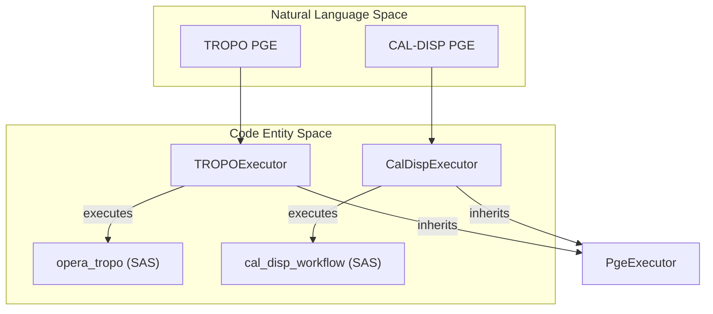
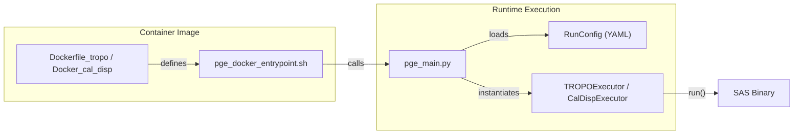

# Page: Ancillary and Calibration PGEs

# Ancillary and Calibration PGEs

Relevant source files

The following files were used as context for generating this wiki page:

- [.ci/docker/Dockerfile_cal_disp](.ci/docker/Dockerfile_cal_disp)
- [.ci/docker/Dockerfile_tropo](.ci/docker/Dockerfile_tropo)
- [.ci/scripts/cal_disp/test_cal_disp.sh](.ci/scripts/cal_disp/test_cal_disp.sh)
- [.ci/scripts/tropo/build_tropo.sh](.ci/scripts/tropo/build_tropo.sh)
- [.ci/scripts/tropo/opera_pge_tropo_1.0_final_runconfig.yaml](.ci/scripts/tropo/opera_pge_tropo_1.0_final_runconfig.yaml)
- [.ci/scripts/tropo/test_int_tropo.sh](.ci/scripts/tropo/test_int_tropo.sh)
- [.ci/scripts/tropo/test_tropo.sh](.ci/scripts/tropo/test_tropo.sh)
- [examples/tropo_sample_runconfig-v3.0.0-rc.1.0.yaml](examples/tropo_sample_runconfig-v3.0.0-rc.1.0.yaml)
- [src/opera/pge/cal_disp/cal_disp_pge.py](src/opera/pge/cal_disp/cal_disp_pge.py)
- [src/opera/pge/cal_disp/schema/cal_disp_sas_schema.yaml](src/opera/pge/cal_disp/schema/cal_disp_sas_schema.yaml)
- [src/opera/pge/cal_disp/templates/OPERA_ISO_metadata_L4_CAL_DISP_template.xml.jinja2](src/opera/pge/cal_disp/templates/OPERA_ISO_metadata_L4_CAL_DISP_template.xml.jinja2)
- [src/opera/pge/cal_disp/templates/cal_disp_measured_parameters.yaml](src/opera/pge/cal_disp/templates/cal_disp_measured_parameters.yaml)
- [src/opera/pge/tropo/schema/tropo_sas_schema.yaml](src/opera/pge/tropo/schema/tropo_sas_schema.yaml)
- [src/opera/pge/tropo/tropo_pge.py](src/opera/pge/tropo/tropo_pge.py)
- [src/opera/test/data/test_cal_disp_config.yaml](src/opera/test/data/test_cal_disp_config.yaml)
- [src/opera/test/data/test_tropo_config.yaml](src/opera/test/data/test_tropo_config.yaml)
- [src/opera/test/pge/cal_disp/test_cal_disp_pge.py](src/opera/test/pge/cal_disp/test_cal_disp_pge.py)

The Ancillary and Calibration Product Generation Executables (PGEs) produce Level 4 (L4) products that support the core OPERA displacement and surface change workflows. These PGEs process high-resolution atmospheric model data and geodetic station observations to provide corrections and validation for displacement products.

The two primary PGEs in this category are:
*   **TROPO PGE**: Generates Zenith Total Delay (ZTD) products from High-Resolution (HRES) atmospheric models.
*   **CAL-DISP PGE**: Produces calibration products for surface displacement by comparing SAR-derived displacement with GNSS station data.

### High-Level Architecture

Both PGEs inherit from the `PgeExecutor` base class and utilize specific mixins to handle pre-processing (input validation) and post-processing (output validation, metadata generation, and product naming).

#### Component Relationship
The following diagram illustrates how the Ancillary PGEs bridge the SAS (Science Algorithm Software) layer with the SDS (Science Data System) framework.

**PGE to SAS Mapping**

Sources: [src/opera/pge/tropo/tropo_pge.py:25-220](), [src/opera/pge/cal_disp/cal_disp_pge.py:23-200]()

---

### TROPO PGE
The TROPO PGE is responsible for processing ECMWF HRES NetCDF files to produce OPERA L4 TROPO-ZENITH products. It utilizes Dask-based parallelization within the SAS to handle large atmospheric grids efficiently.

*   **Input Validation**: Ensures input NetCDF files exist and have non-zero size [src/opera/pge/tropo/tropo_pge.py:52-59]().
*   **Temporal Calculation**: Computes the product end time by parsing `temporal_resolution` (e.g., "6h") and adding it to the `reference_time` [src/opera/pge/tropo/tropo_pge.py:160-205]().
*   **Output Patterns**: Validates that outputs match the `OPERA_L4_TROPO-ZENITH_[Start]_[End]_HRES_[Version]` convention [src/opera/pge/tropo/tropo_pge.py:84-86]().

For detailed implementation details, see **[TROPO PGE](#5.1)**.

---

### CAL-DISP PGE
The CAL-DISP PGE provides calibration for surface displacement products by integrating OPERA DISP-S1/NI products with geodetic data from the University of Nevada, Reno (UNR).

*   **Input Diversity**: Validates a complex set of inputs including DISP NetCDF files, Static DEM/LOS layers, and UNR `.tenv8` geodetic time-series files [src/opera/test/pge/cal_disp/test_cal_disp_pge.py:65-72]().
*   **Algorithm Parameters**: Validates SAS-specific algorithm parameters against a Yamale schema [src/opera/pge/cal_disp/cal_disp_pge.py:52-55]().
*   **Metadata Integration**: Extracts geodetic station lists and bounding polygons from input NetCDF attributes to populate L4 ISO metadata [src/opera/pge/cal_disp/cal_disp_pge.py:113-114]().

For detailed implementation details, see **[CAL-DISP PGE](#5.2)**.

---

### Execution Environment

Both PGEs are deployed as Docker containers, inheriting from specialized SAS images. They use `micromamba` or `conda` environments to manage dependencies like `hdf5`, `gdal`, and `dask`.

**Docker and Entrypoint Flow**

Sources: [.ci/docker/Dockerfile_tropo:63-64](), [.ci/docker/Dockerfile_cal_disp:63-64](), [src/opera/test/pge/cal_disp/test_cal_disp_pge.py:112-124]()

### Summary Table

| PGE Name | Class Name | Primary Input | Primary Output | Schema Path |
| :--- | :--- | :--- | :--- | :--- |
| **TROPO** | `TROPOExecutor` | ECMWF HRES (.nc) | TROPO-ZENITH (.nc) | `pge/tropo/schema/tropo_sas_schema.yaml` |
| **CAL-DISP** | `CalDispExecutor` | DISP-S1/NI (.nc) | CAL-DISP-S1/NI (.nc) | `pge/cal_disp/schema/cal_disp_sas_schema.yaml` |

Sources: [src/opera/pge/tropo/tropo_pge.py:220-230](), [src/opera/pge/cal_disp/cal_disp_pge.py:210-220](), [src/opera/test/data/test_cal_disp_config.yaml:42-43](), [src/opera/test/data/test_tropo_config.yaml:25-26]()
